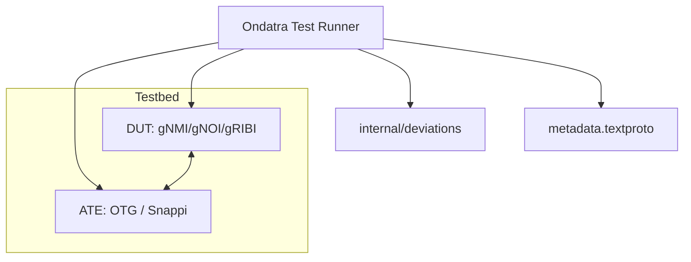

# OpenConfig Feature Profiles Test Framework Review

This document provides a deep dive into the `openconfig/featureprofiles` test
framework. It explains the architecture, key components, test structure, and
patterns used to write and maintain network feature tests.

--------------------------------------------------------------------------------

## 1. Overview & Architecture

The `featureprofiles` repository is a joint effort to build automated,
vendor-neutral tests for OpenConfig-compliant network devices. The framework
ensures that devices from different vendors conform to OpenConfig models and
behavioral expectations.

### Key Concepts

*   **DUT (Device Under Test)**: The network switch or router being tested.
    Configured and monitored via OpenConfig APIs (mostly gNMI).
*   **ATE (Automated Test Equipment)**: The traffic generator used to inject
    traffic, simulate peers (BGP, ISIS), and measure performance.
*   **Ondatra**: The orchestration framework that abstracts DUT and ATE
    interactions. It handles testbed reservation, device access, and provides
    fluent Go APIs for gNMI, gNOI, gRIBI, and P4RT.
*   **OTG (Open Traffic Generator)**: The standardized API used to control the
    ATE. Implemented via the `snappi` (Go: `gosnappi`) library.



--------------------------------------------------------------------------------

## 2. Anatomy of a Test

A typical test resides in a directory like
`feature/[feature_name]/tests/[test_name]/` and consists of: 1.
`metadata.textproto`: Defines test metadata and the required topology. 2.
`[test_name]_test.go`: The actual Go test code. 3. `README.md`: Description of
the test plan and verification steps.

### 2.1. Metadata (`metadata.textproto`)

This file defines the test identity and, crucially, the **testbed topology**
required.

```protobuf
uuid:  "7e63e9af-44d2-40a9-a77d-ab7b11c080a7"
plan_id:  "example-0.1"
description:  "Topology Test"
testbed:  TESTBED_DUT_ATE_4LINKS
```

The `testbed` field (e.g., `TESTBED_DUT_ATE_4LINKS`) is mapped by the `fptest`
runner to a specific topology file (e.g., `topologies/atedut_4.testbed`) which
defines the required ports and connections.

### 2.2. The Go Test Structure

Using
[topology_test.go](file:///var/tmp/featureprofiles/feature/example/tests/topology_test/topology_test.go)
as a reference, here is the standard structure:

```go
package topology_test

import (
    "testing"
    "github.com/openconfig/featureprofiles/internal/fptest"
    "github.com/openconfig/ondatra"
    "github.com/openconfig/ondatra/gnmi"
)

// 1. Entry Point: Handled by fptest to initialize Ondatra and bind the topology.
func TestMain(m *testing.M) {
    fptest.RunTests(m)
}

// 2. Actual Test Case
func TestTopology(t *testing.T) {
    // Retrieve DUT and ATE handles defined in the testbed
    dut := ondatra.DUT(t, "dut")
    ate := ondatra.ATE(t, "ate")

    // 3. Configure DUT (gNMI)
    configureDUT(t, dut)

    // 4. Configure ATE (OTG/Snappi)
    configureATE(t, ate)

    // 5. Run Subtests & Verify Telemetry
    t.Run("Telemetry", func(t *testing.T) {
        // Query operational state using fluent gNMI path APIs
        got := gnmi.Get(t, dut, gnmi.OC().Interface("port1").OperStatus().State())
        if got != oc.Interface_OperStatus_UP {
            t.Errorf("Expected port1 to be UP, got %v", got)
        }
    })
}
```

--------------------------------------------------------------------------------

## 3. Key Framework Components

### 3.1. `internal/fptest` (Test Runner & Commons)

The [fptest](file:///var/tmp/featureprofiles/internal/fptest/runtests.go)
package is the backbone of all tests. * **`RunTests(m)`**: Called in `TestMain`.
It initializes metadata, sets up `ygnmi` datapoint validation (ensuring valid
timestamps and UTF-8 strings), and starts Ondatra. * **Helper Functions**:
Provides common configuration helpers like `SetPortSpeed` and
`ConfigureDefaultNetworkInstance`.

### 3.2. `internal/deviations` (Vendor Exception Handling)

Devices from different vendors (or even different OS versions) may not fully
support all OpenConfig features or may require specific workarounds. The
[deviations](file:///var/tmp/featureprofiles/internal/deviations/deviations.go)
package handles this cleanly.

Instead of hardcoding vendor checks (e.g., `if vendor == Cisco`), tests use
functional deviation flags:

```go
if deviations.InterfaceEnabled(dut) {
    i.Enabled = ygot.Bool(true)
}
```

Deviations are defined in `metadata.textproto` under `platform_exceptions` and
are resolved at runtime by matching the DUT's vendor, model, and version.

### 3.3. `internal/attrs` (Legacy Attribute Bundling)

The [attrs](file:///var/tmp/featureprofiles/internal/attrs/attrs.go) package was
historically used to bundle IP/MAC configurations.

> [!WARNING] **The use of `internal/attrs` in new tests is discouraged.** Modern
> tests prefer using `ygot` directly for DUT configuration and `gosnappi`
> directly for ATE configuration (or local, test-specific helpers) to ensure
> maximum flexibility and avoid bloated helper classes.

--------------------------------------------------------------------------------

## 4. Advanced Patterns

### 4.1. Table-Driven Testing with gRIBI

Complex tests, like those in
[ipv4_entry_test.go](file:///var/tmp/featureprofiles/feature/gribi/otg_tests/ipv4_entry_test/ipv4_entry_test.go),
heavily use table-driven tests to verify various routing scenarios (single NH,
ECMP, MAC override, failover).

Key patterns observed: * **Fluent gRIBI Client**: Uses
`github.com/openconfig/gribigo/fluent` for programmatic route programming. *
**Orderly Cleanup**: Uses `defer` to delete gRIBI entries in reverse order
(Route -> NHG -> NH) to prevent dangling references.

```go
c.Modify().AddEntry(t, tc.entries...)
defer c.Modify().DeleteEntry(t, reverse(tc.entries)...)
```

### 4.2. Traffic Verification (ATE/OTG)

Traffic verification is performed by: 1. Defining flows in `gosnappi` (Source,
Destination IP range, MACs). 2. Pushing the config and starting protocols. 3.
Starting traffic, sleeping (typically 15s), and stopping traffic. 4. Querying
OTG flow telemetry to assert packet loss.

```go
ate.OTG().StartTraffic(t)
time.Sleep(15 * time.Second)
ate.OTG().StopTraffic(t)

// Verify 0% loss for good flows, 100% loss for bad flows
recvMetric := gnmi.Get(t, ate.OTG(), gnmi.OTG().Flow(flow).State())
tx := recvMetric.GetCounters().GetOutPkts()
rx := recvMetric.GetCounters().GetInPkts()
lossPct := (tx - rx) * 100 / tx
```

### 4.3. Simulating Network Events

Tests simulate link failures or daemon restarts to test resilience: * **DUT
Interface Shutdown**: Done via gNMI by setting `Enabled = false` on the
interface config. * **ATE Link Shutdown**: Done via OTG Control State (if
supported by the ATE):

```go
portStateAction := gosnappi.NewControlState()
portStateAction.Port().Link().SetPortNames([]string{port.ID()}).SetState(gosnappi.StatePortLinkState.DOWN)
ate.OTG().SetControlState(t, portStateAction)
```

--------------------------------------------------------------------------------

## 5. How to Write a New Test

Follow these steps to implement a new test for a specified service (e.g., BGP,
gRIBI):

### Step 1: Create the Directory Structure

Create a new directory under the relevant feature:
`feature/[service]/tests/[your_test_name]/`

### Step 2: Create `metadata.textproto`

Define the UUID, Plan ID, Description, and required testbed (e.g.,
`TESTBED_DUT_ATE_2LINKS`).

### Step 3: Write the Test Plan (`README.md`)

Describe the objective, the topology, and the exact configuration and
verification steps.

### Step 4: Implement the Go Test

1.  **Boilerplate**: Set up `TestMain` calling `fptest.RunTests(m)`.
2.  **Base Configuration**:
    *   Identify DUT and ATE ports.
    *   Configure DUT interfaces (use `ygot` structures, respect `deviations`).
    *   Configure ATE interfaces (use `gosnappi`).
3.  **Service Configuration**:
    *   For BGP/ISIS: Configure BGP/ISIS on DUT (via gNMI/ygot) and ATE (via
        OTG/gosnappi).
    *   For gRIBI/P4RT: Initialize the client and program entries.
4.  **Verification**:
    *   Use `gnmi.Watch` to wait for sessions to become `ESTABLISHED` or
        interfaces `UP`.
    *   Generate traffic using OTG.
    *   Assert traffic metrics (loss, throughput).
5.  **Cleanup**: Ensure all configurations, gRIBI entries, and BGP sessions are
    cleared at the end of the test (use `defer` and helper cleanup functions).

--------------------------------------------------------------------------------

## 6. Best Practices & Conventions

*   **Use Telemetry, Not Sleep**: Avoid arbitrary `time.Sleep` where possible.
    Use `gnmi.Watch` or `gnmi.Await` to wait for states to reach their target.
*   **Respect Deviations**: Never hardcode vendor-specific logic. If a vendor
    behaves differently, add a deviation flag to `internal/deviations` and
    document it.
*   **Clean Up After Yourself**: Every test must leave the DUT and ATE in a
    clean state. Use `defer` for cleanup to ensure it runs even if the test
    fails.
*   **Table-Driven Tests**: For verifying multiple similar scenarios, use
    table-driven tests to reduce code duplication.
*   **Keep Local Helpers Local**: Do not bloat global helper packages. If a
    helper is only used in one test, keep it in that test file.
