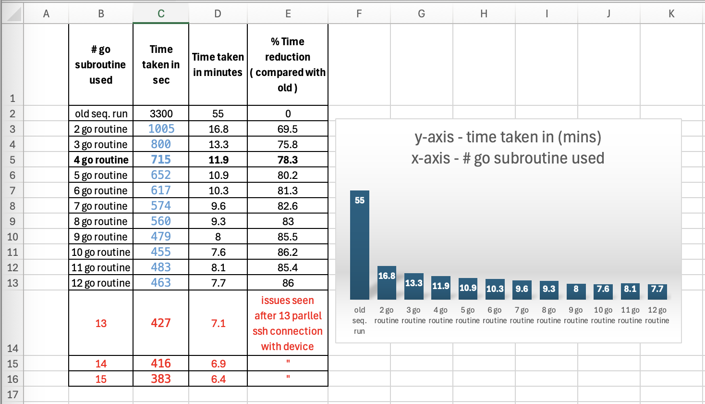
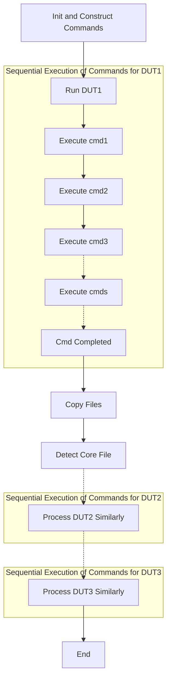
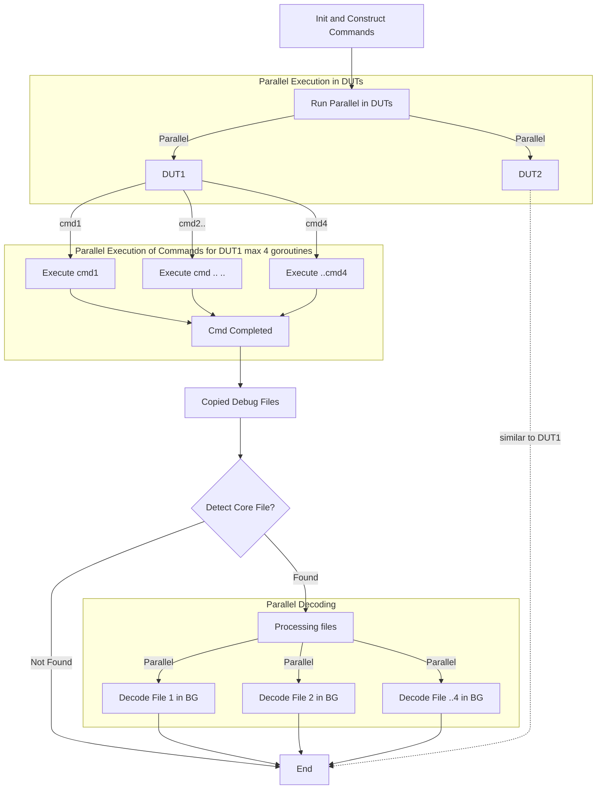

# Collect Debug Files

This document captures the changes made through [PR #1257](https://wwwin-github.cisco.com/B4Test/featureprofiles/pull/1257
)

## Improvements made

- Quicker Debug Log Collection:

    The old implementation takes approximately 55 minutes to collect logs, causing Firex to time out after 30 minutes. Consequently, debug file collections are incomplete. The new implementation overcomes this by processing debug collection in parallel using goroutines.

- Core File Decode:

    With the new implementation, core files are decoded automatically, and the results are placed in the Firex debug folder. This will help save manual time in triaging issues.

## Bechmark Data

Bechmark Data for command execution in parllel go routines

## Major Design changes

- Process DUTs Simultaneously:

    Instead of sequentially collecting debug files, the new design collects them in parallel.

- Execute Commands Simultaneously in Each DUT:

    Based on benchmark data, run 4 commands simultaneously in each device. Four is a safe number that does not affect the DUT ssh performance.

- Decode the Core Files in the Background:

    This will not take additional time as it runs in a background shell process on the Firex worker machine. A file with the extension `*.in_progress` is placed in the debug folder, indicating that the process is running in the background. Once the decode is completed, this `*.in_progress` file will be removed, and a `*.decoded.txt` file will have the decoded output.

## Old Design (Sequential)

## New Design (Parllel)

