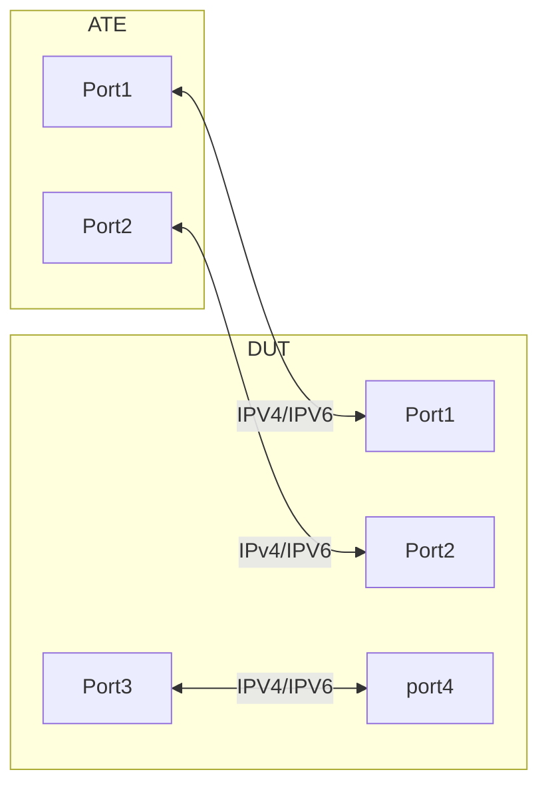

# Interface based ARP policer

## Summary

This test ensures that NOS is able to match the packets using egress ACL and to port mirror or Redirect the packets.

## Procedure

### Topology
Create the following connections:


### Test environment setup and configuration

 - DUT should have an ingress DUT-Port1, an egress DUT-Port2 and 2*ports DUT-Port3 & DUT-Port4 which are physically looped.
 - ATE & DUT ports & loopback interface should support dual stack i.e. both IPV4 & IPV6 addresses.
 - There should be a default IPV4 & IPV6 route on the DUT towards ATE-Port1 and on ATE-Port1 towards DUT, this way even the loopbacks will be reachable from each other.
 - DUT should have a loopback IP address which is a GUE decap IPV4 (D1) and UDP port(U1) , and should be able to decap packets which are destined to said GUE decap & UDP dst port.
 - DUT should be configured with a static MPLS lsp with a static label(M1) pointing towards DUT-Port2
 - ATE Port1 generates IPV4 & IPV6 packets (Source address is ATE Port1 Physical IPV4/IPV6(S1) and Destination address is a ATE's loopback IPV4/IPV6(D2) on the ATE port1) with MPLSoverGUE header, where MPLS label is (M1) and GUE source is ATE port1 physical IPV4 (S1) and destination is DUT (D1). UDP source port can be random but destination port should be (U1) 
 - DUT Port1 should be able to decap GUE packet
 - DUT ingress ASIC should perform MPLS label POP and forward the native IPV4 & IPV6 packets to the DUT-Port2, DUT-Port2 should have an egress ACL matching the source IPV4 & IPV6 address to perform port mirroring or to redirect towards ATE-Port3
 - As DUT-Port3 and DUT-Port4 are physically looped , DUT-Port4 should do the native IPV4 & IPV6 lookup and forward the packet towards ATE-Port1 

       
### DP-1.18 : Flow matching using ACL and portmirror/redirect 

DUT should receive IPV4 & IPV6 packets wit hMPLSoverGUE header , where the GUE decap is done and mpls label pop is done on the DUT , the native IPV4 and IPV6 packets are sent to the egress port which matches a ACL , this ACL performs port mirroring or redirect to an interface which is physically looped, as the destination IPV4 and IPV6 addresses belong to the sender ATE , the packets are routed towards the sender ATE. Need to send line rate packets from IXIA.

#### Steps 
- Step-1: ATE-Port1 sends IPV4 probes over MPLSoverGUE.
- Step-2: Juniper ingress ASIC decaps the GUE and performs MPLS POP to forward to the native IPV4/IPV6 traffic towards egress interface.
- Step-3: On the egress interface there is an ACL which matches the IPV4/IPV6 source address and performs port mirroring or packet redirect to a physically looped interface.
- Step-4: Once packet recirculates via the physically looped interface there should be a lookup based on the destination IP address and the IPV4/IPV6 packets should be forwarded back towards ATE-Port1.

#### Verification:

 - ATE-Port1 should send MPLSoverGUE with inner IPV4/IPV6 packets.
 - DUT-Port1 should receive the MPLSover GUE packet matching the packets sent by ATE-Port1.
 - DUT should GUE decap and should pop the MPLS label and forward the packets to DUT-Port2 , the number of packets should match the packets sent by ATE-Port1.
 - As packets will be port mirrored or redirected from DUT-Port2 to DUT-Port3 and eventually to DUT-Port4 and then sent towards ATE-Port1, the IPV4/IPV6 packets on these ports should match the ingress stats of the ATE-Port1.
 - Make sure there is no packet loss and make sure the port mirroring or redirect action is done by the ACL configured on DUT-Port2.


#### OpenConfig Path and RPC Coverage

```yaml
rpcs:
  gnmi:
    gNMI.Set: /acl/config
      union_replace: true
      replace: true
    gNMI.Get: /acl/state
    gNMI.Subscribe:
      on_change: true
```
Footer
© 2024 GitHub, Inc.
Footer navigation
Terms
Privacy
Security
Status
