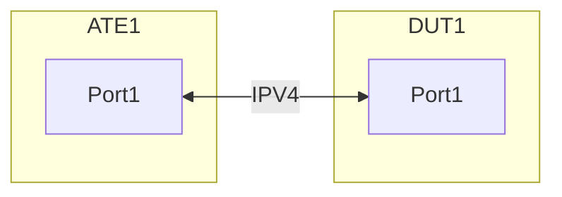

# Test-ID - CPT-1.1: Interface based ARP policer

## Summary

This test ensures that DUT is able to police the ARP traffic on an interface.

## Testbed type
Test environment setup

Create the following connections:


### Configuration

ATE1:Port1 has IPV4 subnet towards DUT:Port1
- Configure First usable IP of IPv4Prefix/24 on ATE1:Port1
- Configure Last usable IP of IPv4Prefix/24 on DUT:Port1
- Configure ARP policer on the DUT:Port1 to police the ARP requests with ethertype 0x0806 at a rate of 5kbps with burst size of 10kbytes.

       
### Flows

From ATE1:Port1 to DUT:Port1
	
 - Send 10kbps ARP requests from ATE1:Port1 to all usable IPs of IPv4Prefix/24

## Procedure

From ATE1:Port1 to DUT:Port1, send 10kbps Send ARP traffic i.e. ARP requests from ATE1:Port1 to all usable IPs of IPv4Prefix/24

- Expectations:
	- DUT should permit only 5kbps of ARP requests and discard the rest.


#### OpenConfig Path and RPC Coverage

```yaml
paths:
  # interface configuration to apply ACL as ingress
  /interfaces/interface/config/description:
  /interfaces/interface/config/enabled:

 # ACL configuration and state
  /acl/config
  /acl/state
  /acl/interfaces
  /acl/acl-sets/acl-set/acl-entries/acl-entry/input-interface
  /acl/acl-sets
  /acl/acl-sets/acl-set/acl-entries/acl-entry/ipv4/config
  /acl/acl-sets/acl-set/acl-entries/acl-entry/l2/config
  /acl/acl-sets/acl-set/acl-entries/acl-entry/l2/config/destination-mac
  /acl/acl-sets/acl-set/acl-entries/acl-entry/l2/config/ethertype
  /acl/acl-sets/acl-set/acl-entries/acl-entry/actions
  /acl/acl-sets/acl-set/acl-entries/acl-entry/actions/config
  /acl/acl-sets/acl-set/acl-entries/acl-entry/actions/config/policer-action
  /acl/acl-sets/acl-set/acl-entries/acl-entry/actions/config/policer-action/police-rate
  /acl/acl-sets/acl-set/acl-entries/acl-entry/actions/config/policer-action/burst-size

  /acl/acl-sets/acl-set/acl-entries/acl-entry/l2/state/ethertype
  /acl/acl-sets/acl-set/acl-entries/acl-entry/l2/state/policer-action

rpcs:
  gnmi:
    gNMI.Set:
      union_replace: true
    gNMI.Subscribe:
      on_change: true
```
