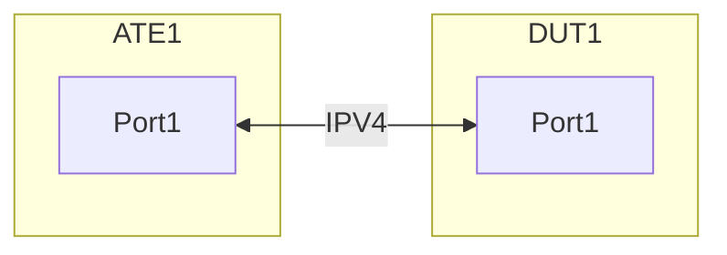

# Interface based ARP policer

## Summary

This test ensures that NOS is able to police the ARP traffic on an interface.

## Procedure
Test environment setup

### Topology
Create the following connections:


### Configuration

ATE1:Port1 has IPV4 subnet towards DUT:Port1
- Configure First usable IP of IPv4Prefix/24 on ATE1:Port1
- Configure Last usable IP of IPv4Prefix/24 on DUT:Port1
- Configure ARP policer on the DUT:Port1 to police the ARP requests with ethertype 0x0806 at a rate of 5kbps with burst size of 10kbytes.

       
### Flows

From ATE1:Port1 to DUT:Port1
	
 - Send 10kbps ARP requests from ATE1:Port1 to all usable IPs of IPv4Prefix/24

### DP-1.17 

From ATE1:Port1 to DUT:Port1, send 10kbps Send ARP traffic i.e. ARP requests from ATE1:Port1 to all usable IPs of IPv4Prefix/24

- Expectations:
	- DUT should permit only 5kbps of ARP requests and discard the rest.


#### OpenConfig Path and RPC Coverage

```yaml
rpcs:
  gnmi:
    gNMI.Set: /acl/config
      union_replace: true
      replace: true
    gNMI.Get: /acl/state
    gNMI.Subscribe:
      on_change: true
```
