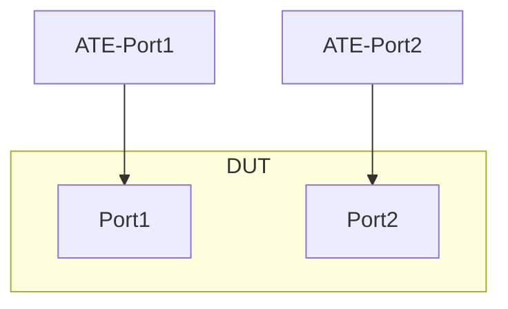

# ACL-1.1: ACL match based on L3/L4 fields and DSCP value

## Summary

Use an ACL to match packets based on a combination of:

*   L3 src/dst IPv4 address and DSCP value
*   L3 src/dst IPv6 address and DSCP value
*   L3 src/dst IPv4 address, L4 src/dst port and DSCP value
*   L3 src/dst IPv6 address, L4 src/dst port and DSCP value

## Testbed type

* [`featureprofiles/topologies/atedut_2.testbed`](https://github.com/openconfig/featureprofiles/blob/main/topologies/atedut_2.testbed)

## Topology:



## Procedure

### Initial setup

*   Connect DUT port-1, 2 to ATE port-1, 2 respectively

*   Configure IPv4 and IPv6 addresses on DUT and ATE ports as shown below
    *   DUT port-1 IPv4 address ```dp1-v4 = 192.168.1.1/30```
    *   ATE port-1 IPv4 address ```ap1-v4 = 192.168.1.2/30```

    *   DUT port-2 IPv4 address ```dp2-v4 = 192.168.1.5/30```
    *   ATE port-2 IPv4 address ```ap2-v4 = 192.168.1.6/30```

    *   DUT port-1 IPv6 address ```dp1-v6 = 2001:DB8::1/126```
    *   ATE port-1 IPv6 address ```ap1-v6 = 2001:DB8::2/126```

    *   DUT port-2 IPv6 address ```dp2-v6 = 2001:DB8::5/126```
    *   ATE port-2 IPv6 address ```ap2-v6 = 2001:DB8::6/126```


### ACL-1.1.1 - IPv4 Address and DSCP

*   Configure an ACL type `ACL_IPV4` matching:
    *   ACL entry-1 action `accept`
        *   Src of ```ap1-v4 = 192.168.1.2/30```
        *   Dest of ```ap2-v4 = 192.168.1.6/30```
        *   DSCP value of ```AF11```
*   Apply the ingress ACL to DUT port-1
*   Generate traffic from ATE port-1 source ```ap1-v4 = 192.168.1.2/30``` and destined to ATE port-2 ```ap2-v4 = 192.168.1.6/30``` with DSCP value set to ```AF11```
*   Validate that the traffic is received at ATE port-2
*   Generate traffic from ATE port-1 source ```ap1-v4 = 192.168.1.2/30``` and destined to ATE port-2 ```ap2-v4 = 192.168.1.6/30``` with DSCP value set to ```AF21```
*   Validate that the traffic is not received at ATE port-2

### ACL-1.1.2 - IPv4 Address, TCP src/dst ports and DSCP

*   Configure an ACL type `ACL_IPV4` matching
    *   ACL entry-1 action `accept`
        *   Src of ```ap1-v4 = 192.168.1.2/30```
        *   Dest of ```ap2-v4 = 192.168.1.6/30```
        *   Src port of ```49256```
        *   Dst port of ```49512```
        *   DSCP value of ```AF21```
*   Apply the ingress ACL to DUT port-1
*   Generate traffic from ATE port-1 source ```ap1-v4 = 192.168.1.2/30, port: 49256``` and destined to ATE port-2 ```ap2-v4 = 192.168.1.6/30, port: 49512``` with DSCP value set to ```AF21```
*   Validate that the traffic is received at ATE port-2
*   Generate traffic from ATE port-1 source ```ap1-v4 = 192.168.1.2/30, port: 49256``` and destined to ATE port-2 ```ap2-v4 = 192.168.1.6/30, port: 49512``` with DSCP value set to ```AF31```
*   Validate that the traffic is not received at ATE port-2

### ACL-1.1.3 - IPv6 Address and DSCP

*   Configure an ACL type `ACL_IPV6` matching:
    *   ACL entry-1 action `accept`
        *   Src of ```ap1-v6 = 2001:DB8::2/126```
        *   Dest of ```ap2-v6 = 2001:DB8::6/126```
        *   DSCP value of ```AF31```
*   Apply the ingress ACL to DUT port-1
*   Generate traffic from ATE port-1 source ```ap1-v6 = 2001:DB8::2/126``` and destined to ATE port-2 ```ap2-v6 = 2001:DB8::6/126``` with DSCP value set to ```AF31```
*   Validate that the traffic is received at ATE port-2
*   Generate traffic from ATE port-1 source ```ap1-v6 = 2001:DB8::2/126``` and destined to ATE port-2 ```ap2-v6 = 2001:DB8::6/126``` with DSCP value set to ```AF21```
*   Validate that the traffic is not received at ATE port-2

### ACL-1.1.4 - IPv6 Address, TCP src/dst ports and DSCP

*   Configure an ACL type `ACL_IPV6` matching
    *   ACL entry-1 action `accept`
        *   Src of ```ap1-v6 = 2001:DB8::2/126```
        *   Dest of ```ap2-v6 = 2001:DB8::6/126```
        *   Src port of ```49256```
        *   Dst port of ```49512```
        *   DSCP value of ```AF41```
*   Apply the ingress ACL to DUT port-1
*   Generate traffic from ATE port-1 source ```ap1-v6 = 2001:DB8::2/126, port: 49256``` and destined to ATE port-2 ```ap2-v6 = 2001:DB8::6/126, port: 49512``` with DSCP value set to ```AF41```
*   Validate that the traffic is received at ATE port-2
*   Generate traffic from ATE port-1 source ```ap1-v6 = 2001:DB8::2/126, port: 49256``` and destined to ATE port-2 ```ap2-v6 = 2001:DB8::6/126, port: 49512``` with DSCP value set to ```AF11```
*   Validate that the traffic is not received at ATE port-2

## OpenConfig Path and RPC Coverage

```yaml
paths:
  # base acl paths
  /acl/acl-sets/acl-set/config/name:
  /acl/acl-sets/acl-set/config/type:
  /acl/acl-sets/acl-set/acl-entries/acl-entry/config/sequence-id:
  /acl/acl-sets/acl-set/acl-entries/acl-entry/config/description:
  
  # ipv4/v6 address match
  /acl/acl-sets/acl-set/acl-entries/acl-entry/ipv4/config/source-address:
  /acl/acl-sets/acl-set/acl-entries/acl-entry/ipv4/config/destination-address:
  /acl/acl-sets/acl-set/acl-entries/acl-entry/ipv6/config/source-address:
  /acl/acl-sets/acl-set/acl-entries/acl-entry/ipv6/config/destination-address:

  # paths for DSCP matching
  /acl/acl-sets/acl-set/acl-entries/acl-entry/ipv4/config/dscp:
  /acl/acl-sets/acl-set/acl-entries/acl-entry/ipv6/config/dscp:

  # paths for L4 ports
  /acl/acl-sets/acl-set/acl-entries/acl-entry/transport/config/source-port:
  /acl/acl-sets/acl-set/acl-entries/acl-entry/transport/config/destination-port:

  # paths for ACL action
  /acl/acl-sets/acl-set/acl-entries/acl-entry/actions/config/forwarding-action:

rpcs:
  gnmi:
    gNMI.Set:
      replace: true

```

## Minimum DUT platform requirement

FFF
