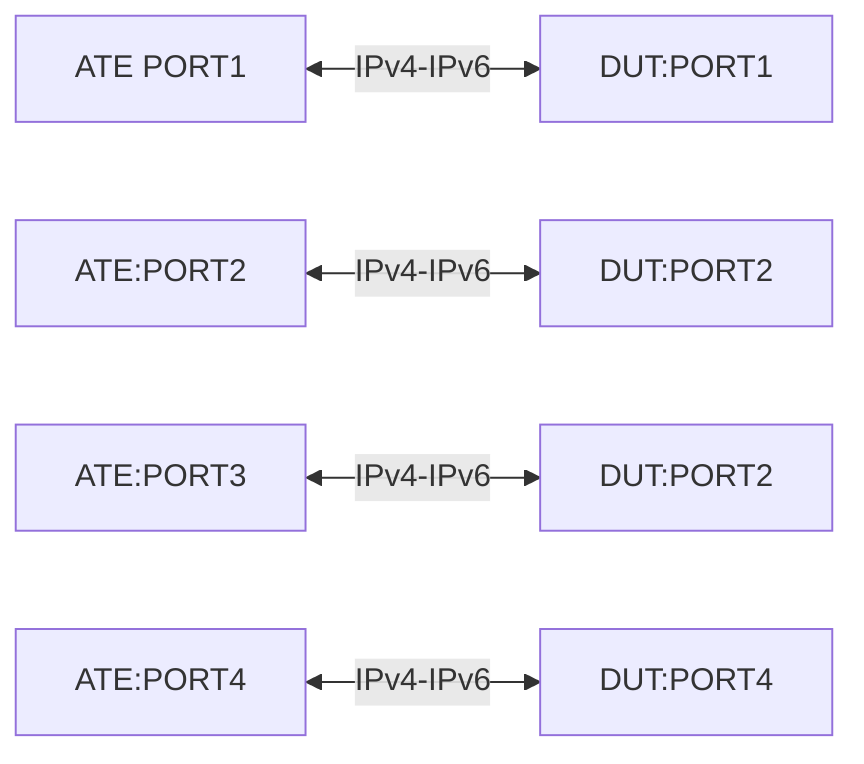

# ACL-1.3: Large Scale ACL with TCAM profile

## Summary

Use an ACL to match packets based on a combination of:

*   L3 src/dst IPv4 address and DSCP value
*   L3 src/dst IPv6 address and DSCP value
*   L3 src/dst IPv4 address, L4 src/dst port and DSCP value
*   L3 src/dst IPv6 address, L4 src/dst port and DSCP value

## Testbed type

* [`featureprofiles/topologies/atedut_4.testbed`](https://github.com/openconfig/featureprofiles/blob/main/topologies/atedut_4.testbed)

## Topology:



## Procedure

### Initial setup

*   Connect DUT port-1, 2, 3, 4 to ATE port-1, 2, 3, 4 respectively

*   Configure IPv4 and IPv6 addresses on DUT and ATE ports as shown below
    *   DUT port-1 IPv4 address ```dp1-v4 = 192.168.1.1/30```
    *   ATE port-1 IPv4 address ```ap1-v4 = 192.168.1.2/30```
    *   DUT port-1 IPv6 address ```dp1-v6 = 2001:DB8::1/126```
    *   ATE port-1 IPv6 address ```ap1-v6 = 2001:DB8::2/126```

    *   DUT port-2 IPv4 address ```dp2-v4 = 192.168.1.5/30```
    *   ATE port-2 IPv4 address ```ap2-v4 = 192.168.1.6/30```
    *   DUT port-2 IPv6 address ```dp2-v6 = 2001:DB8::5/126```
    *   ATE port-2 IPv6 address ```ap2-v6 = 2001:DB8::6/126```

    *   DUT port-3 IPv4 address ```dp3-v4 = 192.168.1.9/30```
    *   ATE port-3 IPv4 address ```ap3-v4 = 192.168.1.10/30```
    *   DUT port-3 IPv6 address ```dp3-v6 = 2001:DB8::9/126```
    *   ATE port-3 IPv6 address ```ap3-v6 = 2001:DB8::a/126```

    *   DUT port-4 IPv4 address ```dp4-v4 = 192.168.1.13/30```
    *   ATE port-4 IPv4 address ```ap4-v4 = 192.168.1.14/30```
    *   DUT port-4 IPv6 address ```dp4-v6 = 2001:DB8::c/126```
    *   ATE port-4 IPv6 address ```ap4-v6 = 2001:DB8::d/126```

*   Configure 100k unique prefixes of multiple prefix lengths for IPv4 and IPv6
    *IPv4
      - Mask lengths of /22, /24, /29, /30, /32
      - Distribution is /22 - 5%, /24 - 35%, /30 - 30%, /32 - 30%
      - Prefixes blocks to be configured are
          - 100.1.0.0 block for /22 - pfxv4-1
          - 50.1.0.0 block for /24 - pfxv4-2
          - 200.1.0.0 block for /30 - pfxv4-3
          - 210.1.0.0 block for /32 - pfxv4-4
    *IPv6
      - Mask lengths of /48, /96, /126, / 128
      - Distribution is /48 - 20%, /96 - 20%, /126 - 30%, /128 - 30%
      - Prefixes blocks to be configured are
          - 1000:1::0 block for /48 - pfxv6-1
          - 5000:1::0 block for /96 - pfxv6-2
          - 1500:1::0 block for /126 - pfxv6-3
          - 2000:1::0 block for /128 - pfxv6-4
*   Configure the traffic in a full mesh way for IPv4 and IPv6 such that
    *IPv4
      - Each prefix length traffic is sent to every other prefix length
      - /22 -> /24, /30, /32 and similarly other prefix length too
      - Add TCP protocol to the header while create the traffic with port ranges
        from 100 - 65000
    *IPv6
      - Each prefix length traffic is sent to every other prefix length
      - /48 -> /96, /126, /128 and similarly for other prefix lengths too
      - Add TCP protocol to the header while create the traffic with port ranges
       from 100 - 65000

### ACL-1.1.1 - ACL IPv4 Address scale

*   Configure an ACL type `ACL_IPV4_Match_length_22_tcp_range` matching:
    *   ACL entry-1 action `accept`
        *   Src of ```ap1-v4 = pfxv4-1```
        *   Dest of ```ap2-v4 = pfxv4-2, pfxv4-3, pfxv4-4```
        *   Src TCP ```TCP ports = 900, 80, 30, 40, 150, 1600, 2700, 21000-45000, 30000-50000```
        *   Dst TCP ```TCP ports = 100-20000, 800, 900```

*   Configure an ACL type `ACL_IPV4_Match_length_24_tcp_range` matching:
    *   ACL entry-1 action `accept`
        *   Src of ```ap1-v4 = pfxv4-4```
        *   Dest of ```ap2-v4 = pfxv4-1, pfxv4-2, pfxv4-4```
        *   Src TCP ```TCP ports = 100, 200, 300, 400, 500, 600, 700, 2000-4000, 20000-40000```
        *   Dst TCP ```TCP ports = 100-20000```

*   Configure an ACL type `ACL_IPV4_Match_high_scale_statements` matching:
    *   Create 200 statements under this ACL of type IPv4
    *   For statements 1-100 to be configured by action `accept` only
    *   For statements 126-150 to be configured by actions `accept` & `log`
    *   For statements 151-175 to be configured by action `accept` & `count`
    *   For statements 176-200 to be configured by action `accept` only

*   Apply the ACLs on to the DUT port in the below way
    ACL Name                                     Port          Direction
    --------------------------------------------------------------------
    `ACL_IPV4_Match_length_22_tcp_range`        DUT-port1      Ingress
    `ACL_IPV4_Match_length_24_tcp_range`        DUT port2      Ingress
    `ACL_IPV4_Match_high_scale_statements`      DUT port3      Ingress
    `ACL_IPV4_Match_high_scale_statements`      DUT port4      Egress

*   Push the configuration on the DUT and the traffic configurations profile 
    to the ATE. Start the protocols and traffic.

*   Verification telemetry
    * Verify that all ACL's are applied to the DUT ports successfully in the
      appropriate direction ingress & egress
    * Verify that there is no traffic loss for any of the traffic profiles
    * Verify that the ACL `ACL_IPV4_Match_high_scale_statements` has logs and 
      counters populated for the relevant statements.
    * Verify the resource utilization of the device in terms of memory consumption
      for the ACL's attached to the DUT ports.

### ACL-1.1.2 - ACL IPv6 Address scale

*   Configure an ACL type `ACL_IPV6_Match_length_48_tcp_range` matching:
    *   ACL entry-1 action `accept`
        *   Src : ```ap1-v6 = pfxv6-1```
        *   Dest : ```ap2-v6 = pfxv6-2, pfxv6-3, pfxv6-4```
        *   Src TCP : ```TCP ports = 900, 80, 30, 40, 150, 1600, 2700, 21000-45000, 30000-50000```
        *   Dst TCP : ```TCP ports = 100-20000, 800, 900```
        *   Action  : ```accept```

*   Configure an ACL type `ACL_IPV6_Match_length_96_tcp_range` matching:
        *   Src : ```ap1-v4 = pfxv4-4```
        *   Dest : ```ap2-v4 = pfxv4-1, pfxv4-2, pfxv4-4```
        *   Src TCP : ```TCP ports = 100, 200, 300, 400, 500, 600, 700, 2000-4000, 20000-40000```
        *   Dst TCP : ```TCP ports = 100-20000```
        *   Action  : ```accept```

*   Configure an ACL type `ACL_IPV6_Match_high_scale_statements` matching:
    *   Create 200 permit/deny statements under this ACL of type IPv6
    *   For statements 1-125 to be configured by action `accept` only
    *   For statements 126-150 to be configured by actions `accept` & `log`
    *   For statements 151-175 to be configured by action `accept` & `count`
    *   For statements 176-200 to be configured by action `accept` only

*   Apply the ACLs on to the DUT port in the below way
    ACL Name                                     Port          Direction
    --------------------------------------------------------------------
    `ACL_IPV6_Match_length_48_tcp_range`        DUT-port1      Ingress
    `ACL_IPV6_Match_length_96_tcp_range`        DUT port2      Ingress
    `ACL_IPV6_Match_high_scale_statements`      DUT port3      Ingress
    `ACL_IPV6_Match_high_scale_statements`      DUT port4      Egress

*   Push the configuration on the DUT and the traffic configurations profile 
    to the ATE. Start the protocols and traffic.

*   Verification telemetry
    * Verify that all ACL's are applied to the DUT ports successfully in the
      appropriate direction ingress & egress
    * Verify that there is no traffic loss for any of the traffic profiles
    * Verify that the ACL `ACL_IPV6_Match_high_scale_statements` has logs and
      counters populated for the relevant statements.
    * Verify the resource utilization of the device in terms of memory 
      consumption for the ACL's attached to the DUT ports.

### ACL-1.2.1 - ACL IPv4 Address scale using prefix-list

*   Create 16 ipv4 prefix-list as source prefix list to match 250 prefixes with
    wide range of prefixes of length /24, /28, /28, /30 from block 60.1.0.0,
    70.1.0.0, 80.1.0.0 and 90.1.0.0 respectively using a naming convention of
    `prefix-list-src-xx.xx.xx.xx-block` where xx represents the prefixes from 
    respective prefix block.
*   Create 4 ipv4 prefix-list as destination prefix list `prefix-list-dst-pfxv4-1`,
    `prefix-list-dst-pfxv4-2`, `prefix-list-dst-pfxv4-3`, 
    `prefix-list-dst-pfxv4-4`
*   Configure an ACL type `ACL_IPV4_Match_using_prefix_list_prfxv4-1` with 16
    statements with combination of the following
      - SrcIP - any of the 16 prefix lists `prefix-list-xx.xx.xx.xx-block`
      - DstIP - `prefix-list-dst-pfxv4-1`
      - SrcTCP port - Any random port TCP port from 100-65500
      - DstTCP port - Any random port TCP port from 100-65500
      - Action - `ACCEPT` + `LOG`
*   Configure an ACL type `ACL_IPV4_Match_using_prefix_list_prfxv4-2` with 16
    statements with combination of the following
      - SrcIP - any of the 16 prefix lists `prefix-list-xx.xx.xx.xx-block`
      - DstIP - `prefix-list-dst-pfxv4-2`
      - SrcTCP port - TCP ports 115, 215, 980, 1090, 8000
      - DstTCP port - TCP port ranges 30000-45000
      - Action - `ACCEPT` + `COUNT`
*   Configure an ACL type `ACL_IPV4_Match_using_prefix_list_prfxv4-3` with 16
    statements with combination of the following
      - SrcIP - any of the 16 prefix lists `prefix-list-xx.xx.xx.xx-block`
      - DstIP - `prefix-list-dst-pfxv4-3`
      - SrcTCP port - TCP port 280, 700, 1150, 5110, 1899
      - DstTCP port - TCP port range 5000-10999
      - Action - `ACCEPT` + `LOG`
*   Configure an ACL type `ACL_IPV4_Match_using_prefix_list_prfxv4-4` with 16
    statements with combination of the following
      - SrcIP - any of the 16 prefix lists `prefix-list-xx.xx.xx.xx-block`
      - DstIP - `prefix-list-dst-pfxv4-4`
      - SrcTCP port - TCP port ranges 50-100, 200-5000, 800-6550
      - DstTCP port - TCP port 80
      - Action - `ACCEPT ONLY`
*   Apply the ACL in the following way
    ACL Name                                     Port          Direction
    --------------------------------------------------------------------
    `ACL_IPV4_Match_using_prefix_list_prfxv4-1`  DUT port1     Ingress
    `ACL_IPV4_Match_using_prefix_list_prfxv4-2`  DUT port2     Ingress
    `ACL_IPV4_Match_using_prefix_list_prfxv4-3`  DUT port3     Ingress
    `ACL_IPV4_Match_using_prefix_list_prfxv4-4`  DUT port4     Ingress

*   Push the configuration on the DUT and the traffic configurations profile
    to the ATE. Start the protocols and traffic.

*   Verification telemetry
    * Verify that all ACL's are applied to the DUT ports successfully in the
      appropriate direction ingress & egress
    * Verify that there is no traffic loss for any of the traffic profiles
    * Verify that the ACL  has logs and counters populated for the relevant 
      statements.
    * Verify the resource utilization of the device in terms of memory 
      consumption for the ACL's attached to the DUT ports.

### ACL-1.2.2 - ACL IPv6 Address scale using prefix-list

*   Create 16 ipv6 prefix-list as source prefix list to match 250 prefixes with
    wide range of prefixes of length /48, /96, /126, /128 from block 1000:1::,
    2000:1::, 3000:1:: and 4000:1:: respectively using a naming convention of
    `prefix-list-xx.xx.xx.xx-block` where xx represents the prefixes from 
    respective prefix block.
*   Create 4 ipv6 prefix-list as destination prefix list `prefix-list-dst-pfxv6-1`,
    `prefix-list-dst-pfxv6-2`, `prefix-list-dst-pfxv6-3`, 
    `prefix-list-dst-pfxv6-4`
*   Configure an ACL type `ACL_IPV6_Match_using_prefix_list_prfxv6-1` with 16
    statements with combination of the following
      - SrcIP - any of the 16 prefix lists `prefix-list-xx.xx.xx.xx-block`
      - DstIP - `prefix-list-dst-pfxv6-1`
      - SrcTCP port - Any random port TCP port from 100-65500
      - DstTCP port - Any random port TCP port from 100-65500
      - Action - `ACCEPT` + `LOG`
*   Configure an ACL type `ACL_IPV6_Match_using_prefix_list_prfxv6-2` with 16
    statements with combination of the following
      - SrcIP - any of the 16 prefix lists `prefix-list-xx.xx.xx.xx-block`
      - DstIP - `prefix-list-dst-pfxv6-2`
      - SrcTCP port - TCP ports 115, 215, 980, 1090, 8000
      - DstTCP port - TCP port ranges 30000-45000
      - Action - `ACCEPT` + `COUNT`
*   Configure an ACL type `ACL_IPV6_Match_using_prefix_list_prfxv6-3` with 16
    statements with combination of the following
      - SrcIP - any of the 16 prefix lists `prefix-list-xx.xx.xx.xx-block`
      - DstIP - `prefix-list-dst-pfxv6-3`
      - SrcTCP port - TCP port 280, 700, 1150, 5110, 1899
      - DstTCP port - TCP port range 5000-10999
      - Action - `ACCEPT` + `LOG`
*   Configure an ACL type `ACL_IPV6_Match_using_prefix_list_prfxv6-4` with 16
    statements with combination of the following
      - SrcIP - any of the 16 prefix lists `prefix-list-xx.xx.xx.xx-block`
      - DstIP - `prefix-list-dst-pfxv6-4`
      - SrcTCP port - TCP port ranges 50-100, 200-5000, 800-6550
      - DstTCP port - TCP port 80
      - Action - `ACCEPT ONLY`
*   Apply the ACL in the following way
    ACL Name                                     Port          Direction
    --------------------------------------------------------------------
    `ACL_IPV6_Match_using_prefix_list_prfxv6-1`  DUT port1     Ingress
    `ACL_IPV6_Match_using_prefix_list_prfxv6-2`  DUT port2     Ingress
    `ACL_IPV6_Match_using_prefix_list_prfxv6-3`  DUT port3     Ingress
    `ACL_IPV6_Match_using_prefix_list_prfxv6-4`  DUT port4     Ingress

*   Push the configuration on the DUT and the traffic configurations profile
    to the ATE. Start the protocols and traffic.

*   Verification telemetry
    * Verify that all ACL's are applied to the DUT ports successfully in the
      appropriate direction ingress & egress
    * Verify that there is no traffic loss for any of the traffic profiles
    * Verify that the ACL  has logs and counters populated for the relevant
      statements.
    * Verify the resource utilization of the device in terms of memory
      consumption for the ACL's attached to the DUT ports.

## Canonical OC Configuration

### IPv4 ACL

```json
{
 "data": {
  "Cisco-IOS-XR-ipv4-acl-cfg:ipv4-acl-and-prefix-list": {
   "accesses": {
    "access": [
     {
      "access-list-name": "ACL_IPV4_Match_length_22",
      "access-list-entries": {
       "access-list-entry": [
        {
         "sequence-number": 10,
         "grant": "permit",
         "protocol": "tcp",
         "source-network": {
          "source-address": "100.1.1.1",
          "source-prefix-length": 22
         },
         "destination-network": {
          "destination-address": "50.1.1.1",
          "destination-prefix-length": 24
         },
         "destination-port": {
          "destination-operator": "equal",
          "first-destination-port": 900
         },
         "sequence-str": "10"
        }
       ]
      }
     }
    ]
   }
  },
  "Cisco-IOS-XR-um-ipv4-access-list-cfg:ipv4": {
   "access-lists": {
    "access-list": [
     {
      "access-list-name": "ACL_IPV4_Match_length_22",
      "sequences": {
       "sequence": [
        {
         "sequence-number": 10,
         "permit": {
          "protocol": "tcp",
          "source": {
           "address": "100.1.1.1",
           "prefix-length": 22
          },
          "destination": {
           "address": "50.1.1.1",
           "prefix-length": 24,
           "port": {
            "eq": 900
           }
          }
         }
        }
       ]
      }
     }
    ]
   }
  }
 }
}

{
 "data": {
  "Cisco-IOS-XR-ipv4-acl-cfg:ipv4-acl-and-prefix-list": {
   "accesses": {
    "access": [
     {
      "access-list-name": "ACL_IPV4_Match_length_24_tcp_range",
      "access-list-entries": {
       "access-list-entry": [
        {
         "sequence-number": 10,
         "grant": "permit",
         "protocol": "tcp",
         "source-network": {
          "source-address": "210.1.1.1"
         },
         "destination-network": {
          "destination-address": "100.1.1.1",
          "destination-prefix-length": 22
         },
         "destination-port": {
          "destination-operator": "equal",
          "first-destination-port": 100
         },
         "sequence-str": "10"
        }
       ]
      }
     }
    ]
   }
  },
  "Cisco-IOS-XR-um-ipv4-access-list-cfg:ipv4": {
   "access-lists": {
    "access-list": [
     {
      "access-list-name": "ACL_IPV4_Match_length_24_tcp_range",
      "sequences": {
       "sequence": [
        {
         "sequence-number": 10,
         "permit": {
          "protocol": "tcp",
          "source": {
           "host": "210.1.1.1"
          },
          "destination": {
           "address": "100.1.1.1",
           "prefix-length": 22,
           "port": {
            "eq": 100
           }
          }
         }
        }
       ]
      }
     }
    ]
   }
  }
 }
}
```

### IPv6 ACL

```json
{
 "data": {
  "Cisco-IOS-XR-ipv6-acl-cfg:ipv6-acl-and-prefix-list": {
   "accesses": {
    "access": [
     {
      "name": "ACL_IPV6_Match_length_48_tcp_range",
      "access-list-entries": {
       "access-list-entry": [
        {
         "sequence-number": 10,
         "grant": "permit",
         "protocol": "tcp",
         "source-network": {
          "source-address": "1000:1::1",
          "source-wild-card-bits": 48
         },
         "destination-network": {
          "destination-address": "5000:1::1",
          "destination-wild-card-bits": 96
         },
         "source-port": {
          "source-operator": "equal",
          "first-source-port": "www"
         },
         "destination-port": {
          "destination-operator": "equal",
          "first-destination-port": 800
         },
         "sequence-str": "10"
        }
       ]
      }
     },
     {
      "name": "ACL_IPV6_Match_length_96_tcp_range",
      "access-list-entries": {
       "access-list-entry": [
        {
         "sequence-number": 10,
         "grant": "permit",
         "protocol": "tcp",
         "source-network": {
          "source-address": "2000:1::1",
          "source-wild-card-bits": 128
         },
         "destination-network": {
          "destination-address": "1500:1::1",
          "destination-wild-card-bits": 126
         },
         "source-port": {
          "source-operator": "equal",
          "first-source-port": 8000
         },
         "sequence-str": "10"
        },
        {
         "sequence-number": 20,
         "grant": "permit",
         "protocol": "tcp",
         "source-network": {
          "source-address": "2000:1::1",
          "source-wild-card-bits": 128
         },
         "destination-network": {
          "destination-address": "1500:1::1",
          "destination-wild-card-bits": 126
         },
         "source-port": {
          "source-operator": "equal",
          "first-source-port": 8000
         },
         "sequence-str": "20"
        }
       ]
      }
     }
    ]
   }
  },
  "Cisco-IOS-XR-um-ipv6-access-list-cfg:ipv6": {
   "access-lists": {
    "access-list": [
     {
      "access-list-name": "ACL_IPV6_Match_length_48_tcp_range",
      "sequences": {
       "sequence": [
        {
         "sequence-number": 10,
         "permit": {
          "protocol": "tcp",
          "source": {
           "address": "1000:1::1",
           "prefix-length": 48,
           "port": {
            "eq": "WWW"
           }
          },
          "destination": {
           "address": "5000:1::1",
           "prefix-length": 96,
           "port": {
            "eq": 800
           }
          }
         }
        }
       ]
      }
     },
     {
      "access-list-name": "ACL_IPV6_Match_length_96_tcp_range",
      "sequences": {
       "sequence": [
        {
         "sequence-number": 10,
         "permit": {
          "protocol": "tcp",
          "source": {
           "host": "2000:1::1",
           "port": {
            "eq": 8000
           }
          },
          "destination": {
           "address": "1500:1::1",
           "prefix-length": 126
          }
         }
        },
        {
         "sequence-number": 20,
         "permit": {
          "protocol": "tcp",
          "source": {
           "host": "2000:1::1",
           "port": {
            "eq": 8000
           }
          },
          "destination": {
           "address": "1500:1::1",
           "prefix-length": 126
          }
         }
        }
       ]
      }
     }
    ]
   }
  }
 }
}
```

## OpenConfig Path and RPC Coverage

```yaml
paths:
  # base acl paths
  /acl/acl-sets/acl-set/config/name:
  /acl/acl-sets/acl-set/config/type:
  /acl/acl-sets/acl-set/acl-entries/acl-entry/config/sequence-id:
  /acl/acl-sets/acl-set/acl-entries/acl-entry/config/description:
  
  # ipv4/v6 address match
  /acl/acl-sets/acl-set/acl-entries/acl-entry/ipv4/config/source-address:
  /acl/acl-sets/acl-set/acl-entries/acl-entry/ipv4/config/destination-address:
  /acl/acl-sets/acl-set/acl-entries/acl-entry/ipv6/config/source-address:
  /acl/acl-sets/acl-set/acl-entries/acl-entry/ipv6/config/destination-address:

  # paths for DSCP matching
  /acl/acl-sets/acl-set/acl-entries/acl-entry/ipv4/config/dscp:
  /acl/acl-sets/acl-set/acl-entries/acl-entry/ipv6/config/dscp:

  # paths for L4 ports
  /acl/acl-sets/acl-set/acl-entries/acl-entry/transport/config/source-port:
  /acl/acl-sets/acl-set/acl-entries/acl-entry/transport/config/destination-port:

  # paths for ACL action
  /acl/acl-sets/acl-set/acl-entries/acl-entry/actions/config/forwarding-action:

  #prefix-set config ipv4, ipv6
  /defined-sets/ipv4-prefix-sets/ipv4-prefix-set:
  /defined-sets/ipv4-prefix-sets/ipv4-prefix-set/config/name:
  /defined-sets/ipv4-prefix-sets/ipv4-prefix-set/config/description:
  /defined-sets/ipv4-prefix-sets/ipv4-prefix-set/config/prefix:
  /defined-sets/ipv4-prefix-sets/ipv6-prefix-set/config/name:
  /defined-sets/ipv4-prefix-sets/ipv6-prefix-set/config/description:
  /defined-sets/ipv4-prefix-sets/ipv6-prefix-set/config/prefix:

  #prefix-set state ipv4, ipv6
  /defined-sets/ipv4-prefix-sets/ipv6-prefix-set:
  /defined-sets/ipv4-prefix-sets/ipv6-prefix-set/state/name:
  /defined-sets/ipv4-prefix-sets/ipv6-prefix-set/state/description:
  /defined-sets/ipv4-prefix-sets/ipv6-prefix-set/state/prefix:
  /defined-sets/ipv4-prefix-sets/ipv4-prefix-set/state/name:
  /defined-sets/ipv4-prefix-sets/ipv4-prefix-set/state/description:
  /defined-sets/ipv4-prefix-sets/ipv4-prefix-set/state/prefix:

rpcs:
  gnmi:
    gNMI.Set:
      replace: true

```

## Minimum DUT platform requirement

FFF

