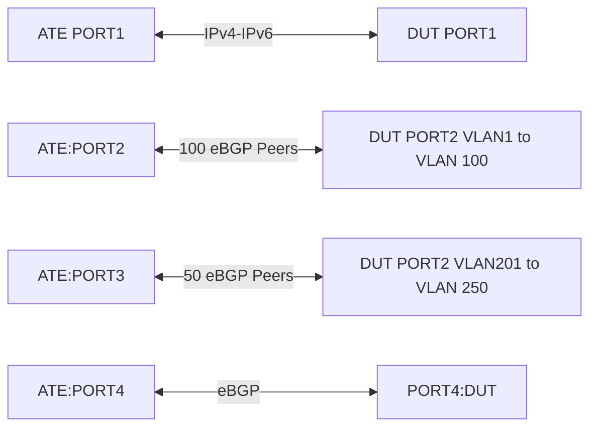

# RT-1.16: BGP ADDPATH SCALE with POLICY

## Summary

BGP ADDPATH TEST WITH SCALE and POLICY Defined

## Testbed type

  *  [`featureprofiles/topologies/atedut_4.testbed`](https://github.com/openconfig/featureprofiles/blob/main/topologies/atedut_4.testbed)
  * ATE port1 - Used for traffic source
  * ATE port2, port3 - Used to advertise routes to the DUT
  * ATE port4 - Used for verification of Add-path send or receive capabilities.

## Topology



## Procedure

### Source port for sending traffic

* DUT Port1  --- IP Connectivity --- ATE Port1
* Use this port to configure traffic with following source and destination 
  prefixes
  - source (IPv4/IPv6) - 200.0.0.0/24 and 1000::200.0.0.0/126 respectively.
  - destination (IPv4/IPv6) - All prefixes of ATE port2, port3

Establish eBGP sessions ipv4 and ipv6 for ATE/DUT port2,3:
### 100 v4EBGP peers
ATE port2 <---> DUT port2

* Create 100 vlans on DUT and ATE port2 and configure IP addresses as below and 
  advertise 1.48M ipv4 routes from the ATE.
  * Configure each of the vlan subinterface using these IPv4 address
    50.1.1.0/24 (vlan1), 50.1.2.0/24 (vlan2), 50.1.3.0/24 (vlan3),
    50.1.4.0/24 (vlan4) ...... 50.1.100.0/24 (vlan101)
  * Configure eBGP peers on each of the interfaces and advertise 135k routes
    from each of this ATE eBGP neighbor such that the routes are from 
    172.20.0.0 block from each of this eBGP peers which would be used as
    addpath routes such that the routes are distributed across /22, /24, /30 
    prefix lengths.

### 50 v6EBGP peers
ATE port3 <---> DUT port3

* Create 50 vlans on DUT and ATE port2 and configure IP addresses as below and
  advertise 120k ipv6 routes from ATE
  * Configure each of the vlan subinterface using these IPv6 address
    1000::50.1.1.0/64 (vlan201), 1000::50.1.2.0/64 (vlan202),
    1000::50.1.3.0/64 (vlan203), 1000::50.1.4.0/64 (vlan204) ....
    1000::50.1.50.0/64 (vlan250) - A total of 50 subinterfaces and ipv6 address
  * Configure eBGP peers on each of the interfaces and advertise 135k routes
    from each of this ATE eBGP neighbor such that the routes are from 
    2002:a00:: block from each of this eBGP peers which would be used as
    addpath routes such that the routes are distributed across /48 , /64, /128
    prefix lengths

### 1 v4EBGP and 1 v6EBGP peers
ATE port4 (AS 65401) <---> DUT port4 (AS 65001)

* Configure the DUT and ATE port with ipv4 and ipv6 address 200.0.0.0/24 and 
  1000::200.0.0.0/126 respectively
* This eBGP neighbor is used to verify the routes advertised by the DUT and then
  making sure if addpath send and send-max is enabled.

### Prefix definition
ipv4-prefix1 = prefixes of length /22
ipv4-prefix2 = prefixes of length /24
ipv4-prefix3 = prefixes of length /30
ipv4-prefix4 = prefixes of length /28

ipv6-prefix1 = prefixes of length /48
ipv6-prefix2 = prefixes of length /64
ipv6-prefix3 = prefixes of length /126
ipv6-prefix4 = prefixes of length /96

##### Configure a route-policy to set accept and reject routes
Create below policy for the each of the BGP neighbors and attach the policy
  * Create policy EBGP-IMPORT-IPV4 that only accepts ipv4-prefix1, ipv4-prefix2
    ipv4-prefix3 and then terminates
  * Create policy EBGP-IMPORT-IPV6 that only accepts ipv6-prefix1, ipv6-prefix2 
    ipv6-prefix3 and then terminates
  * Create policy EBGP-EXPORT-IPV4 that only allows ipv4-prefix4 and terminates
  * Create policy EBGP-EXPORT-IPV6 that only allows ipv6-prefix4 and terminates
  * Ensure ACCEPT-ALL default-policy is applied to both ipv4-unicast and
    ipv6-unicast AFI-SAFI of both all the EBGP peers

Following test expectations. If expectations not met, the test should fail.
    * DUT:port2,port3 should accept import of ipv4-prefix1, ipv4-prefix2, ipv4-prefix3
    ipv6-prefix1, ipv6-prefix2, ipv6-prefix3
    * DUT:port2,port3 should not accept import of ipv4-prefix4, ipv6-prefix4

##### Configure a route-policy to set MED

*   Configure an route-policy definition with the name ```med-policy```
*   For routing-policy ```med-policy``` configure a statement with the name
    ```match-statement-1```
*   For routing-policy ```med-policy``` statement ```match-statement-1```
    set policy-result as ```ACCEPT_ROUTE```
*   For routing-policy ```med-policy``` statement ```match-statement-1```
    set MED as ```50```
*   Add `policy-definition["med-policy"]` to import-policy and export-policy 
    leaf-lists.

##### Configure a route-policy to set Local Preference

*   Configure an route-policy definition with the name ```lp-policy```
*   For routing-policy ```lp-policy``` configure a statement with the name
    ```match-statement-1```
*   For routing-policy ```lp-policy``` statement ```match-statement-1```
    set policy-result as ```ACCEPT_ROUTE```
*   For routing-policy ```lp-policy``` statement ```match-statement-1```
    set Local Preference as ```200```
*   Add `policy-definition["lp-policy"]` to import-policy and export-policy 
    leaf-lists.
### RT-1.16.1: Add-Path (Initial State with add-path send & receive disabled):

*   Verification (Telemetry):
    *   Verify that all 1.48M and 120k routes advertised from ATE ports are 
        learnt by DUT and only the best route is installed in the RIB which
        would mean there is only one best path out of 100 paths for ipv4 and 50
        paths for ipv6
    *   Verify that the DUT's telemetry output reflects the enabled Add-Path
        capabilities with send and receive in disabled state
  /network-instances/network-instance/protocols/protocol/bgp/global/afi-safis/
  afi-safi/add-paths/state/receive
  /network-instances/network-instance/protocols/protocol/bgp/global/afi-safis/
  afi-safi/add-paths/state/send
  /network-instances/network-instance/protocols/protocol/bgp/global/afi-safis/
  afi-safi/add-paths/state/send-max

### RT-1.16.2: Add-Path (With add-path receive only enabled on DUT):

*   Enable Add-Path receive only for all the IPv4 & IPv6 eBGP neighbors and 
    advertise all the 1.48M ipv4 and 120k ipv6 routes from the ATE.
  /network-instances/network-instance/protocols/protocol/bgp/global/afi-safis/
  afi-safi/add-paths/state/receive:

*   Verification (Telemetry):
    *   Verify that all 1.48M and 120k routes advertised from ATE ports are 
        learnt by DUT and the RIB should show up all the 100 paths for ipv4 and 
        50 paths for ipv6 routes. However the FIB would have only the best 
        route installed
    *   Verify that the DUT's telemetry output reflects the enabled Add-Path
        capabilities with send in disabled state and receive in enabled state
  /network-instances/network-instance/protocols/protocol/bgp/global/afi-safis/
  afi-safi/add-paths/state/receive
  /network-instances/network-instance/protocols/protocol/bgp/global/afi-safis/
  afi-safi/add-paths/state/send
    *   Verify that ATE port-4 receives the routes advertised from DUT and
        only add-path receive capabilities enabled and there is just one path
    *   Verify that the DUT forwards traffic only on the best path with 100%
        which is on vlan1 for ipv4 traffic and vlan201 for ipv6 traffic
        so other vlans should see 100% loss.
    *   Verify that the routes learnt on the DUT has med and local preferences
        defined as per above.

### RT-1.16.3: Add-Path (With add-path send, receive, send-max enabled on DUT):

*   Enable Add-Path send and receive only for all the IPv4 & IPv6 eBGP neighbors
    and advertise all the 1.48M ipv4 and 120k ipv6 routes from the ATE.
  /network-instances/network-instance/protocols/protocol/bgp/global/afi-safis/
  afi-safi/add-paths/config/receive:
  /network-instances/network-instance/protocols/protocol/bgp/global/afi-safis/
  afi-safi/add-paths/config/send:
  /network-instances/network-instance/protocols/protocol/bgp/global/afi-safis/
  afi-safi/add-paths/config/send-max:

*   Verification (Telemetry):
    *   Verify that all 1.48M and 120k routes advertised from ATE ports are 
        learnt by DUT and the RIB should show up all the 100 paths for ipv4 and 
        50 paths for ipv6 routes. However the FIB would have only the best 
        route installed.
    *   Verify that the DUT's telemetry output reflects the enabled Add-Path
        capabilities with send in disabled state and receive in enabled state
  /network-instances/network-instance/protocols/protocol/bgp/global/afi-safis/
  afi-safi/add-paths/state/receive
  /network-instances/network-instance/protocols/protocol/bgp/global/afi-safis/
  afi-safi/add-paths/state/send
  /network-instances/network-instance/protocols/protocol/bgp/global/afi-safis/
  afi-safi/add-paths/state/send-max:
    *   Verify that ATE port-4 receives the routes advertised from DUT and
        both add-path send & receive capabilities are enabled with multiple
        paths for ipv4, ipv6 routes.
    *   Verify that the DUT forwards traffic only on the best path with 100%
        which is on vlan1 for ipv4 traffic and vlan201 for ipv6 traffic
        so other vlans should see 100% loss.
    *   Verify that the routes learnt on the DUT has med and local preferences
        defined as per above.

### RT-1.16.4: Route churn and verify Add-path telemetry

*   Do BGP route flap from the ATE ports a few times like maybe 120 seconds and
    wait for sometime for the route churn to settle down.
*   Verification: Telemetry
    *   Repeat verification steps in RT-1.16.3

## OpenConfig Path and RPC Coverage

The below yaml defines the OC paths intended to be covered by this test.

```yaml
paths:
  ## Config paths
  /network-instances/network-instance/protocols/protocol/bgp/global/afi-safis/afi-safi/add-paths/config/receive:
  /network-instances/network-instance/protocols/protocol/bgp/global/afi-safis/afi-safi/add-paths/config/send:
  /network-instances/network-instance/protocols/protocol/bgp/global/afi-safis/afi-safi/add-paths/config/send-max:
  /network-instances/network-instance/protocols/protocol/bgp/global/afi-safis/afi-safi/ipv4-unicast/config/extended-next-hop-encoding:
  /network-instances/network-instance/protocols/protocol/bgp/peer-groups/peer-group/afi-safis/afi-safi/add-paths/config/receive:
  /network-instances/network-instance/protocols/protocol/bgp/peer-groups/peer-group/afi-safis/afi-safi/add-paths/config/send:
  /network-instances/network-instance/protocols/protocol/bgp/peer-groups/peer-group/afi-safis/afi-safi/add-paths/config/send-max:
  /network-instances/network-instance/protocols/protocol/bgp/peer-groups/peer-group/timers/config/minimum-advertisement-interval:
  /network-instances/network-instance/protocols/protocol/bgp/peer-groups/peer-group/afi-safis/afi-safi/ipv4-unicast/config/extended-next-hop-encoding:
  /network-instances/network-instance/protocols/protocol/bgp/neighbors/neighbor/afi-safis/afi-safi/add-paths/config/receive:
  /network-instances/network-instance/protocols/protocol/bgp/neighbors/neighbor/afi-safis/afi-safi/add-paths/config/send:
  /network-instances/network-instance/protocols/protocol/bgp/neighbors/neighbor/afi-safis/afi-safi/add-paths/config/send-max:
  /network-instances/network-instance/protocols/protocol/bgp/neighbors/neighbor/timers/config/minimum-advertisement-interval:
  /network-instances/network-instance/protocols/protocol/bgp/neighbors/neighbor/afi-safis/afi-safi/ipv4-unicast/config/extended-next-hop-encoding:
  /routing-policy/policy-definitions/policy-definition/config/name:
  /routing-policy/policy-definitions/policy-definition/statements/statement/config/name:
  /routing-policy/policy-definitions/policy-definition/statements/statement/actions/config/policy-result:
  /routing-policy/policy-definitions/policy-definition/statements/statement/actions/bgp-actions/config/set-med:
  /routing-policy/policy-definitions/policy-definition/statements/statement/actions/bgp-actions/config/set-local-pref:
  /network-instances/network-instance/protocols/protocol/bgp/neighbors/neighbor/afi-safis/afi-safi/apply-policy/config/default-import-policy:
  /network-instances/network-instance/protocols/protocol/bgp/neighbors/neighbor/afi-safis/afi-safi/apply-policy/config/default-export-policy:

  ## State paths
  /network-instances/network-instance/protocols/protocol/bgp/global/afi-safis/afi-safi/add-paths/state/receive:
  /network-instances/network-instance/protocols/protocol/bgp/global/afi-safis/afi-safi/add-paths/state/send:
  /network-instances/network-instance/protocols/protocol/bgp/global/afi-safis/afi-safi/add-paths/state/send-max:
  /network-instances/network-instance/protocols/protocol/bgp/global/afi-safis/afi-safi/ipv4-unicast/state/extended-next-hop-encoding:
  /network-instances/network-instance/protocols/protocol/bgp/peer-groups/peer-group/afi-safis/afi-safi/add-paths/state/receive:
  /network-instances/network-instance/protocols/protocol/bgp/peer-groups/peer-group/afi-safis/afi-safi/add-paths/state/send:
  /network-instances/network-instance/protocols/protocol/bgp/peer-groups/peer-group/afi-safis/afi-safi/add-paths/state/send-max:
  /network-instances/network-instance/protocols/protocol/bgp/peer-groups/peer-group/timers/state/minimum-advertisement-interval:
  /network-instances/network-instance/protocols/protocol/bgp/peer-groups/peer-group/afi-safis/afi-safi/ipv4-unicast/state/extended-next-hop-encoding:
  /network-instances/network-instance/protocols/protocol/bgp/neighbors/neighbor/afi-safis/afi-safi/add-paths/state/receive:
  /network-instances/network-instance/protocols/protocol/bgp/neighbors/neighbor/afi-safis/afi-safi/add-paths/state/send:
  /network-instances/network-instance/protocols/protocol/bgp/neighbors/neighbor/afi-safis/afi-safi/add-paths/state/send-max:
  /network-instances/network-instance/protocols/protocol/bgp/neighbors/neighbor/timers/state/minimum-advertisement-interval:
  /network-instances/network-instance/protocols/protocol/bgp/neighbors/neighbor/afi-safis/afi-safi/ipv4-unicast/state/extended-next-hop-encoding:
  /network-instances/network-instance/protocols/protocol/bgp/neighbors/neighbor/state/supported-capabilities:
  /network-instances/network-instance/protocols/protocol/bgp/neighbors/neighbor/afi-safis/afi-safi/apply-policy/state/import-policy:
  /network-instances/network-instance/protocols/protocol/bgp/neighbors/neighbor/afi-safis/afi-safi/apply-policy/state/export-policy:


rpcs:
  gnmi:
    gNMI.Subscribe:
    gNMI.Set:
      union_replace: true
```

## Minimum DUT platform requirement

* FFF

