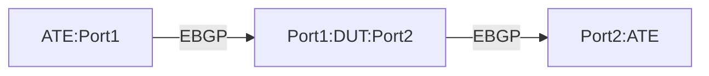

# BMP-1.1: BMP Session Establishment and Telemetry Test

## Summary

Validate BGP Monitoring Protocol (BMP) session establishment and telemetry functionality with specific configuration parameters.

## Testbed type

*  [`featureprofiles/topologies/atedut_2.testbed`](https://github.com/openconfig/featureprofiles/blob/main/topologies/atedut_2.testbed)

## Procedure 

### Configuration

1)  Create the topology below:





2) Connect DUT port 1 to ATE port 1
3) Connect DUT port 2 to ATE port 2 (simulating BMP station)
4) Configure IPv4 addresses on the interfaces
5) Establish eBGP session between ATE port-1 and DUT port-1
6) Configure BMP on the DUT with the following parameters:

    • statistics-timeout: 60 seconds

    • connection-mode: active

    • local-address: 172.16.1.1

    • station-address: 10.23.15.58

    • station-port: 7039

    • route-monitoring: post-policy

    • exclude-noneligible: true

### Tests

### BMP-1.1.1: Verify BMP session establishment

1)  Configure BMP station on ATE port-2 with address 10.23.15.58 and port 7039
2)  Verify that the DUT initiates a BMP session to the station (connection-mode: active)
3)  Confirm the connection is established using the configured local-address (172.16.1.1), following this path:
    *  /network-instances/network-instance/protocols/protocol/bgp/monitoring/bmp/state/local-address
4)  Validate that the DUT connects to the correct station-address (10.23.15.58) and port (7039), following those paths:
    * /network-instances/network-instance/protocols/protocol/bgp/monitoring/bmp/stations/station/state/address
    * /network-instances/network-instance/protocols/protocol/bgp/monitoring/bmp/stations/station/state/port
5)  Check the session-state telemetry path to confirm the session is established
    * /network-instances/network-instance/protocols/protocol/bgp/monitoring/bmp/stations/station/state/session-state


### BMP-1.1.2: Verify statistics reporting

1)  Verify that the DUT sends statistics reports at the configured interval (60 seconds), using path:
    *   /network-instances/network-instance/protocols/protocol/bgp/monitoring/bmp/state/statistics-timeout
2)  Confirm that multiple consecutive reports are sent at the expected intervals, using path:
    *   /network-instances/network-instance/protocols/protocol/bgp/monitoring/bmp/stations/station/state/statistics-messages-sent

### BMP-1.1.3: Verify route monitoring with post-policy and exclude-noneligible

1)  Configure an import policy on the DUT to reject prefixes matching 172.16.0.0/16
2)  Have ATE port-1 advertise prefixes 192.0.2.0/24 and 172.16.0.0/16 to the DUT
3)  Verify that the BMP station receives route monitoring messages for 192.0.2.0/24, using those paths:
    *   /network-instances/network-instance/protocols/protocol/bgp/rib/afi-safis/afi-safi/ipv4-unicast/neighbors/neighbor/adj-rib-in-post/routes/route/prefix
    *   /network-instances/network-instance/protocols/protocol/bgp/monitoring/bmp/stations/station/state/route-monitoring-message
s-sent
4)  Verify that the BMP station does not receive route monitoring messages for 172.16.0.0/16 (excluded by policy)

## OpenConfig Path and RPC Coverage

```yaml
paths:
  ## Config paths
  #/network-instances/network-instance/protocols/protocol/bgp/monitoring/bmp/config/statistics-timeout: # TODO: new OC leaf to be added
  #/network-instances/network-instance/protocols/protocol/bgp/monitoring/bmp/config/connection-mode: # TODO: new OC leaf to be added
  #/network-instances/network-instance/protocols/protocol/bgp/monitoring/bmp/config/local-address: # TODO: new OC leaf to be added
  #/network-instances/network-instance/protocols/protocol/bgp/monitoring/bmp/stations/station/config/address: # TODO: new OC leaf to be added
  #/network-instances/network-instance/protocols/protocol/bgp/monitoring/bmp/stations/station/config/port: # TODO: new OC leaf to be added
  #/network-instances/network-instance/protocols/protocol/bgp/monitoring/bmp/stations/station/config/route-monitoring-policy: # TODO: new OC leaf to be added
  #/network-instances/network-instance/protocols/protocol/bgp/monitoring/bmp/stations/station/config/exclude-noneligible: # TODO: new OC leaf to be added

  ## state paths
  /network-instances/network-instance/protocols/protocol/bgp/rib/afi-safis/afi-safi/ipv4-unicast/neighbors/neighbor/adj-rib-in-post/routes/route/prefix:
  #/network-instances/network-instance/protocols/protocol/bgp/monitoring/bmp/state/statistics-timeout: # TODO: new OC leaf to be added
  #/network-instances/network-instance/protocols/protocol/bgp/monitoring/bmp/state/connection-mode: # TODO: new OC leaf to be added
  #/network-instances/network-instance/protocols/protocol/bgp/monitoring/bmp/state/local-address: # TODO: new OC leaf to be added
  #/network-instances/network-instance/protocols/protocol/bgp/monitoring/bmp/stations/station/state/address: # TODO: new OC leaf to be added
  #/network-instances/network-instance/protocols/protocol/bgp/monitoring/bmp/stations/station/state/port: # TODO: new OC leaf to be added
  #/network-instances/network-instance/protocols/protocol/bgp/monitoring/bmp/stations/station/state/route-monitoring-policy: # TODO: new OC leaf to be added
  #/network-instances/network-instance/protocols/protocol/bgp/monitoring/bmp/stations/station/state/exclude-noneligible: # TODO: new OC leaf to be added
  #/network-instances/network-instance/protocols/protocol/bgp/monitoring/bmp/stations/station/state/session-state: # TODO: new OC leaf to be added
  #/network-instances/network-instance/protocols/protocol/bgp/monitoring/bmp/stations/station/state/messages-sent: # TODO: new OC leaf to be added
  #/network-instances/network-instance/protocols/protocol/bgp/monitoring/bmp/stations/station/state/statistics-messages-sent: # TODO: new OC leaf to be added
  #/network-instances/network-instance/protocols/protocol/bgp/monitoring/bmp/stations/station/state/statistics-messages-sent:  # TODO: new OC leaf to be added
  #/network-instances/network-instance/protocols/protocol/bgp/monitoring/bmp/stations/station/state/route-monitoring-messages-sent:  # TODO: new OC leaf to be added

rpcs:
  gnmi:
    gNMI.Set:
      union_replace: true
      replace: true
    gNMI.Subscribe:
```

## Minimum DUT platform requirement

*   FFF - Fixed Form Factor