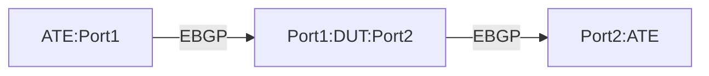

# BMP-1.1: BMP Session Establishment and Telemetry Test

## Summary

Validate BGP Monitoring Protocol (BMP) session establishment and telemetry functionality with specific configuration parameters.
This BMP test is for post policy routes.

## Testbed type

*  [`featureprofiles/topologies/atedut_2.testbed`](https://github.com/openconfig/featureprofiles/blob/main/topologies/atedut_2.testbed)

## Procedure 

### Configuration

1)  Create the topology below:





2)   Establish Topology: Set up the physical connections as described in the topology diagram.

*   Connect ATE Port 1 to DUT Port 1.
*   Connect ATE Port 2 to DUT Port 2 (simulating the BMP monitoring station).
*   Connected interface IPv4/IPv6 addresses

3) Interface Configuration: Configure IPv4 and IPV6 addresses on all involved interfaces on both the ATE and the DUT.

4) Establish eBGP Session: Configure and establish an external BGP (eBGP) peering session between the IP addresses of ATE Port 1 and DUT Port 1. Configure AS 64520 on the DUT and ATE port2 i.e. BMP station, configure AS 64530 on the ATE port1.
5) Establish eBGP session between ATE port-1 (AS 64530) and DUT port-1 (AS 64520)
6) Configure BMP on the DUT with the following parameters:

    • statistics-timeout: 60 seconds
    • connection-mode: active
    • local-address: 172.16.1.1
    • station-address: 10.23.15.58
    • station-port: 7039
    • route-monitoring: post-policy
    • exclude-noneligible: true

7) Advertise 10000 * IPV4 routes from the IP address range of 192.168.0.0 and 10.200.0.0
8) Should be RFC7854 compliant


### Tests

### BMP-1.1.1: Verify BMP session establishment

1)  Configure BMP station on ATE port-2 with address 10.23.15.58 and port 7039
2)  Verify that the DUT initiates a BMP session to the station (connection-mode: active), following this path:
3)  Confirm the connection is established using the configured local-address (172.16.1.1), following this path:
4)  Validate that the DUT connects to the correct station-address (10.23.15.58) and port (7039), following those paths:
5)  Check the session-state telemetry path to confirm the session is established


### BMP-1.1.2: Verify statistics reporting

1)  Verify that the DUT sends statistics reports at the configured interval (60 seconds), using path:
2)  Confirm that multiple consecutive reports are sent at the expected intervals, using path:

### BMP-1.1.3: Verify route monitoring with post-policy and exclude-noneligible

1)  Configure an import policy on the DUT to reject prefixes matching 172.16.0.0/16 and 2001:DB8::/32
2)  Have ATE port-1 advertise prefixes 192.0.2.0/24 and 172.16.0.0/16 for IPv4 and 2001:DB8:1::/48 and 2001:DB8::/32 for IPv6 to the DUT
3)  Verify that the BMP station receives route monitoring messages for 192.0.2.0/24  2001:DB8:1::/48, using those paths:
4)  Verify that the BMP station does not receive route monitoring messages for 172.16.0.0/16 and 2001:DB8::/32 (excluded by policy)

## OpenConfig Path and RPC Coverage

```yaml
## OC paths in json format:

##TODO

#{
#  "network-instances": {
#    "network-instance": {
#      "protocols": {
#        "protocol": {
#          "bgp": {
#            "global": {
#              "bmp": {
#                "config": {
#                  "enabled": <value>,
#                  "connection-mode": <value>,
#                  "local-address": <value>,
#                  "statistics-timeout": <value>
#                },
#                "stations": {
#                  "station": {
#                    "config": {
#                      "name": <value>,
#                      "address": <value>,
#                      "port": <value>,
#                      "policy-type": <value>,
#                      "exclude-non-eligible": <value>
#                    }
#                  }
#                }
#              }
#            }
#          }
#        }
#      }
#    }
#  }
#}

The below yaml defines the OC paths intended to be covered by this test.


#TODO paths in flat format:
  ## Config paths
# /network-instances/network-instance/protocols/protocol/bgp/global/bmp/config/enabled:
# /network-instances/network-instance/protocols/protocol/bgp/global/bmp/config/connection-mode:
# /network-instances/network-instance/protocols/protocol/bgp/global/bmp/config/local-address:
# /network-instances/network-instance/protocols/protocol/bgp/global/bmp/config/statistics-timeout:
# /network-instances/network-instance/protocols/protocol/bgp/global/bmp/stations/station/config/name:
# /network-instances/network-instance/protocols/protocol/bgp/global/bmp/stations/station/config/address:
# /network-instances/network-instance/protocols/protocol/bgp/global/bmp/stations/station/config/port:
# /network-instances/network-instance/protocols/protocol/bgp/global/bmp/stations/station/config/policy-type:
# /network-instances/network-instance/protocols/protocol/bgp/global/bmp/stations/station/config/exclude-non-eligible:


  ## state paths
 # /network-instances/network-instance/protocols/protocol/bgp/global/bmp/state/enabled:
 # /network-instances/network-instance/protocols/protocol/bgp/global/bmp/state/connection-mode:
 # /network-instances/network-instance/protocols/protocol/bgp/global/bmp/state/local-address:
 # /network-instances/network-instance/protocols/protocol/bgp/global/bmp/state/statistics-timeout:
 # /network-instances/network-instance/protocols/protocol/bgp/global/bmp/state/idle-time:
 # /network-instances/network-instance/protocols/protocol/bgp/global/bmp/state/probe-count:
 # /network-instances/network-instance/protocols/protocol/bgp/global/bmp/state/probe-interval:
 # /network-instances/network-instance/protocols/protocol/bgp/global/bmp/stations/station/state/address:
 # /network-instances/network-instance/protocols/protocol/bgp/global/bmp/stations/station/state/port:
 # /network-instances/network-instance/protocols/protocol/bgp/global/bmp/stations/station/state/connection-status:
 # /network-instances/network-instance/protocols/protocol/bgp/global/bmp/stations/station/state/uptime:
 # /network-instances/network-instance/protocols/protocol/bgp/global/bmp/stations/station/state/flap-count:
 # /network-instances/network-instance/protocols/protocol/bgp/global/bmp/stations/station/state/policy-type:
 # /network-instances/network-instance/protocols/protocol/bgp/global/bmp/stations/station/state/exclude-non-eligible:
 # /network-instances/network-instance/protocols/protocol/bgp/global/bmp/stations/station/state/message-counters/total:
 # /network-instances/network-instance/protocols/protocol/bgp/global/bmp/stations/station/state/message-counters/statistics:

rpcs:
  gnmi:
    gNMI.Set:
      union_replace: true
      replace: true
    gNMI.Subscribe:
```

## Minimum DUT platform requirement

*   FFF - Fixed Form Factor
*   MFF - Modular Form Factor
