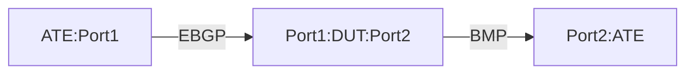

# BMP-2.8: BMP Post Policy Test

## Summary

Validate BGP Monitoring Protocol (BMP) for post policy routes

## Testbed type

*  [`featureprofiles/topologies/atedut_2.testbed`](https://github.com/openconfig/featureprofiles/blob/main/topologies/atedut_2.testbed)

## Procedure 

### Configuration

1)  Create the topology below:





2)   Establish Topology: Set up the physical connections as described in the topology diagram.

*   Connect ATE Port 1 to DUT Port 1.
*   Connect ATE Port 2 to DUT Port 2 (simulating the BMP monitoring station).
*   Connected interface should support dual address family IPv4 & IPv6 addresses

3) Interface Configuration: Configure IPv4 and IPV6 addresses on all involved interfaces on both the ATE and the DUT.

4) Establish BMP Session: Configure and establish BMP session between the DUT and ATE port2 i.e. BMP station.
   
5) Establish eBGP session between ATE port-1 (AS 64530) and DUT port-1 (AS 64520)
   
6) Configure BMP on the DUT with the following parameters:

    • statistics-timeout: 60 seconds

    • connection-mode: active

    • local-address: 172.16.1.1

    • station-address: 10.23.15.58

    • station-port: 7039

    • route-monitoring: post-policy

    • exclude-noneligible: true

8) Advertise 15mil * IPV4 routes and 5mil * IPV6 routes
   
9) Should be RFC7854 compliant

### Test Setup Verification

### Verify BMP session establishment

1)  Configure BMP station on ATE port-2 with address 10.23.15.58 and port 7039
2)  Verify that the DUT initiates a BMP session to the station (connection-mode: active)
3)  Using OTG, verify the ATE has an active BMP session with the DUT.
4)  Validate that the DUT connects to the correct station-address (10.23.15.58) and port (7039) with pre-policy route monitoring.
5)  Using gNMI, verify the DUT returns syntactically valid paths and values for all the below paths are present

 ```
  /network-instances/network-instance/protocols/protocol/bgp/global/bmp/state/local-address:
  /network-instances/network-instance/protocols/protocol/bgp/global/bmp/stations/station/state/address:
  /network-instances/network-instance/protocols/protocol/bgp/global/bmp/stations/station/state/port:
  /network-instances/network-instance/protocols/protocol/bgp/global/bmp/stations/station/state/connection-status:
  /network-instances/network-instance/protocols/protocol/bgp/global/bmp/stations/station/state/uptime:
  /network-instances/network-instance/protocols/protocol/bgp/global/bmp/stations/station/state/policy-type:
 ```
7)  Check the session-state telemetry path to confirm the session is established

 ```
  /network-instances/network-instance/protocols/protocol/bgp/global/bmp/stations/station/state/connection-status:
 ```

### Tests


### BMP-1.3.1: Verify route monitoring with post-policy and exclude-noneligible

1)  On the DUT, configure `/routing-policy` to reject prefixes matching 172.16.0.0/16 and 2001:DB8::/32 and apply it as an import-policy on the BGP neighbor for ATE port-1
2)  Have ATE port-1 advertise prefixes 15mil IPv4(the routes should include prefixes in range 172.16.0.0/16 ) and 5mil IPv6 (the routes should include prefixes in range 2001:DB8::/32) to the DUT
3)  Verify that the BMP station doesnt receive route monitoring messages for routes excluded by the import policy and receives remaining routes at BMP station, i.e. BMP station should receive all routes except for the routes in range 172.16.0.0/16 and 2001:DB8::/32 . 


## Canonical OC

TODO: Update the JSON pending the outcome of the addition of the BMP model
to OpenConfig.  ref: https://github.com/openconfig/public/pull/1343

```json
{
}
```

In the current state of the proposed BMP model, the configuration would look
like:
```json
{
  "network-instances": {
    "network-instance": {
      "protocols": {
        "protocol": {
          "bgp": {
            "global": {
              "bmp": {
                "config": {
                  "enabled": true,
                  "connection-mode": ACTIVE,
                  "local-address": 172.16.1.1,
                  "statistics-timeout": 30
                },
                "stations": {
                  "station": {
                    "config": {
                      "name": BMP-STATION,
                      "address": 10.23.15.58,
                      "port": 7039,
                      "policy-type": POST_POLICY,
                      "exclude-non-eligible": TRUE
                    }
                  }
                }
              }
            }
          }
        }
      }
    }
  }
}

```


## OpenConfig Path and RPC Coverage

TODO: Update the OC paths pending the outcome of the addition of the BMP model
to OpenConfig.  ref: https://github.com/openconfig/public/pull/1343

```yaml
  ## Config paths
  #/network-instances/network-instance/protocols/protocol/bgp/global/bmp/config/enabled:
  #/network-instances/network-instance/protocols/protocol/bgp/global/bmp/config/connection-mode:
  #/network-instances/network-instance/protocols/protocol/bgp/global/bmp/config/local-address:
  #/network-instances/network-instance/protocols/protocol/bgp/global/bmp/config/statistics-timeout:
  #/network-instances/network-instance/protocols/protocol/bgp/global/bmp/stations/station/config/name:
  #/network-instances/network-instance/protocols/protocol/bgp/global/bmp/stations/station/config/address:
  #/network-instances/network-instance/protocols/protocol/bgp/global/bmp/stations/station/config/port:
  #/network-instances/network-instance/protocols/protocol/bgp/global/bmp/stations/station/config/policy-type:
  #/network-instances/network-instance/protocols/protocol/bgp/global/bmp/stations/station/config/exclude-non-eligible:

  ## state paths
  #/network-instances/network-instance/protocols/protocol/bgp/global/bmp/state/enabled:
  #/network-instances/network-instance/protocols/protocol/bgp/global/bmp/state/connection-mode:
  #/network-instances/network-instance/protocols/protocol/bgp/global/bmp/state/local-address:
  #/network-instances/network-instance/protocols/protocol/bgp/global/bmp/state/statistics-timeout:
  #/network-instances/network-instance/protocols/protocol/bgp/global/bmp/state/idle-time:
  #/network-instances/network-instance/protocols/protocol/bgp/global/bmp/state/probe-count:
  #/network-instances/network-instance/protocols/protocol/bgp/global/bmp/state/probe-interval:
  #/network-instances/network-instance/protocols/protocol/bgp/global/bmp/stations/station/state/address:
  #/network-instances/network-instance/protocols/protocol/bgp/global/bmp/stations/station/state/port:
  #/network-instances/network-instance/protocols/protocol/bgp/global/bmp/stations/station/state/connection-status:
  #/network-instances/network-instance/protocols/protocol/bgp/global/bmp/stations/station/state/uptime:
  #/network-instances/network-instance/protocols/protocol/bgp/global/bmp/stations/station/state/flap-count:
  #/network-instances/network-instance/protocols/protocol/bgp/global/bmp/stations/station/state/policy-type:
  #/network-instances/network-instance/protocols/protocol/bgp/global/bmp/stations/station/state/exclude-non-eligible:
  #/network-instances/network-instance/protocols/protocol/bgp/global/bmp/stations/station/state/message-counters/total:
  #/network-instances/network-instance/protocols/protocol/bgp/global/bmp/stations/station/state/message-counters/statistics:

  rpcs:
   gnmi:
     gNMI.Set:
       union_replace: true
       replace: true
     gNMI.Subscribe:
```
## Required DUT platform
  * vRX - virtual router device
