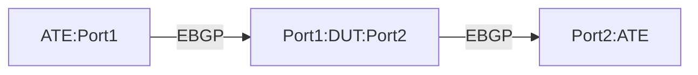

# BMP-1.2: BMP Route Monitoring with Routing Changes Test

## Summary

Validate BGP Monitoring Protocol (BMP) correctly reports BGP route advertisements, withdrawals, and attribute changes in real-time. 

## Testbed type

*  [`featureprofiles/topologies/atedut_2.testbed`](https://github.com/openconfig/featureprofiles/blob/main/topologies/atedut_2.testbed)

## Procedure 

### Configuration

1) Create the topology below:



2)   Establish Topology: Set up the physical connections as described in the topology diagram.

*   Connect ATE Port 1 to DUT Port 1.
*   Connect ATE Port 2 to DUT Port 2 (simulating the BMP monitoring station).

3) Interface Configuration: Configure IPv4 and IPv6 addresses on all involved interfaces on both the ATE and the DUT.

4) Establish eBGP Session: Configure and establish two external BGP (eBGP) peering sessions between the IP addresses of ATE Port 1 and DUT Port 1: one for IPv4 and one for IPv6.

5) Configure Global BMP on DUT: Configure the global BMP parameters on the DUT:
*   Enable BMP:

        /network-instances/network-instance/protocols/protocol/bgp/global/bmp/config/enabled

     *  Set to true.

*   Connection Mode (Active):

        /network-instances/network-instance/protocols/protocol/bgp/global/bmp/config/connection-mode
        
     *  Set to active.

*    Local Address:

                /network-instances/network-instance/protocols/protocol/bgp/global/bmp/config/local-address

      * Set to 172.16.1.1.

*    Statistics Timeout:

                /network-instances/network-instance/protocols/protocol/bgp/global/bmp/config/statistics-timeout

        Set to 60.

6)   Configure BMP Station on DUT: Configure the BMP monitoring station parameters on the DUT:

*    Station Name (e.g., bmp-station-1):

                /network-instances/network-instance/protocols/protocol/bgp/global/bmp/stations/station[name=bmp-station-1]/config/name
        * Set to bmp-station-1.
*    Station Address:

                /network-instances/network-instance/protocols/protocol/bgp/global/bmp/stations/station[name=bmp-station-1]/config/address

        * Set to 10.23.15.58.
*    Station Port:

                /network-instances/network-instance/protocols/protocol/bgp/global/bmp/stations/station[name=bmp-station-1]/config/port
        * Set to 7039.
*   Policy Type (Post-Policy Route Monitoring):

                /network-instances/network-instance/protocols/protocol/bgp/global/bmp/stations/station[name=bmp-station-1]/config/policy-type

       *  Set to POST_POLICY.

*   Exclude Non-Eligible Routes:

                /network-instances/network-instance/protocols/protocol/bgp/global/bmp/stations/station[name=bmp-station-1]/config/exclude-non-eligible

      *  Set to true.


### Tests

### BMP-1.2.1:Verify route advertisement monitoring

1)  Configure the ATE port-1 advertise a new prefix 203.0.113.0/24 to the DUT over IPv4 BGP session and 2001:db8:1::/48 to the DUT over the IPv6 BGP session.
2)  Confirm that the route monitoring messages contain the correct attributes for IPv4:
        • NLRI: 203.0.113.0/24 
        • Next-hop: The IPv4 address of ATE Port 1
        • AS path: ATE AS number 
        • Origin: IGP 
        • Verify the BMP message type indicates route advertisement
        • Validate that the post-policy attributes are reported
3)  Confirm that the route monitoring messages contain the correct attributes for IPv6:
        • NLRI: 2001:db8:1::/48
        • Next-hop: The IPv6 address of ATE Port 1
        • AS path: ATE AS number 
        • Origin: IGP 
        • Verify the BMP message type indicates route advertisement
        • Validate that the post-policy attributes are reported 

### BMP-1.2.2: Verify route withdrawal monitoring

1)  Withdraw Prefix: Configure ATE Port 1 to withdraw the prefix 203.0.113.0/24 and 2001:db8:1::/48.
2)  Validate BMP Withdrawal Message: On the BMP monitoring station, confirm receipt of a BMP Route Monitoring message with:

        * NLRI: 203.0.113.0/24
        * Message Type: Indicates a route withdrawal.

and

        * NLRI: 2001:db8:1::/48
        * Message Type: Indicates a route withdrawal.


### BMP-1.2.3: Verify route attribute change monitoring 

1)  Advertise with Initial Attributes: Configure ATE Port 1 to advertise the prefix 198.51.100.0/24 over IPV4 BGP session and 2001:db8:2::/48 over IPv6 BGP session with the following attributes:

        • MED: 100 
        • Community: 65000:100 
        • Local preference: 100
2)  Validate Initial BMP Message: Verify that the received BMP Route Monitoring message contains the correct NLRI (198.51.100.0/24 and 2001:db8:2::/48) and all the initially configured attributes.
3)  Re-advertise with Modified Attributes: Configure ATE Port 1 to re-advertise the same prefix (198.51.100.0/24 and 2001:db8:2::/48) with modified attributes:

        • MED: 200 
        • Community: 65000:200 
        • Local preference: 200 
4)  Validate Updated BMP Message: Confirm that a new BMP Route Monitoring message is received with the correct NLRI and the updated attribute values. 

### BMP-1.2.4: Verify next-hop change monitoring for IPv4 

1)  Advertise with Next-Hop 192.0.2.1: Configure ATE Port 1 to advertise the prefix `203.0.113.0/24` with the next-hop IP address `192.0.2.1` (assuming this is a valid IP on the ATE's interface).

2)  Validate Initial BMP Message: Confirm that the BMP Route Monitoring message received on the monitoring station contains:
    * NLRI: `203.0.113.0/24`
    * Next-hop: `192.0.2.1`

3)  Re-advertise with Next-Hop 192.0.2.2: Configure ATE Port 1 to re-advertise the same prefix (`203.0.113.0/24`) with a different next-hop IP address `192.0.2.2` (again, assuming this is a valid IP on the ATE's interface).

4)  Validate Updated BMP Message: Confirm that a new BMP Route Monitoring message is received with:
    * NLRI: `203.0.113.0/24`
    * Next-hop: `192.0.2.2`

### BMP-1.2.5: Verify next-hop change monitoring for IPv6

1)  Advertise with Next-Hop 2001:db8:3::1: Configure ATE Port 1 to advertise the prefix `2001:db8:3::/48` with the next-hop IP address `2001:db8:3::1` (assuming this is a valid IP on the ATE's interface).

2)  Validate Initial BMP Message: Confirm that the BMP Route Monitoring message received on the monitoring station contains:
    * NLRI: `2001:db8:3::/48`
    * Next-hop: `2001:db8:3::1`

3)  Re-advertise with Next-Hop 2001:db8:3::2: Configure ATE Port 1 to re-advertise the same prefix (`2001:db8:3::/48`) with a different next-hop IP address `2001:db8:3::2` (again, assuming this is a valid IP on the ATE's interface).

4)  Validate Updated BMP Message: Confirm that a new BMP Route Monitoring message is received with:
    * NLRI: `2001:db8:3::/48`
    * Next-hop: `2001:db8:3::2`

### BMP-1.2.6: Verify policy filtering impact on monitoring

1)  Configure Import Policy: On the DUT, configure an import routing policy that applies to routes received from ATE Port 1 and modifies attributes for routes matching the prefix 192.0.2.0/24 and 2001:db8:4::/48:
        • Set local preference to 300 
        • Add community 65000:300 
2)  Advertise Prefix: Configure ATE Port 1 to advertise the prefix 192.0.2.0/24 and 2001:db8:4::/48
3)  Validate Post-Policy Attributes: Confirm that the BMP Route Monitoring message received on the monitoring station for the prefix 192.0.2.0/24 and 2001:db8:4::/48 reflects the post-policy attributes (Local Preference 300, Community 65000:300) as applied by the DUT's import policy.

### BMP-1.2.7: Verify multiple prefix updates monitoring for IPv4

1)  Advertise Multiple Prefixes: Configure ATE Port 1 to simultaneously advertise the prefixes 203.0.113.0/24, 198.51.100.0/24, and 192.0.2.0/24.
2)  Validate Multiple Advertisements: Confirm that the BMP monitoring station receives separate BMP Route Monitoring messages for each of the advertised prefixes, each containing the correct NLRI and associated attributes.
3)  Withdraw All Prefixes: Configure ATE Port 1 to simultaneously withdraw all three prefixes.
4)  Validate Multiple Withdrawals: Confirm that the BMP monitoring station receives separate BMP Route Monitoring messages for the withdrawal of each prefix, each containing the correct NLRI and indicating a withdrawal. Verify the sequence of messages if there's an expectation.

### BMP-1.2.8: Verify multiple prefix updates monitoring for IPv4

1)  Advertise Multiple Prefixes: Configure ATE Port 1 to simultaneously advertise the IPv6 prefixes 2001:db8:5::/48, 2001:db8:6::/48, and 2001:db8:7::/48.
2)  Validate Multiple Advertisements: Confirm that the BMP monitoring station receives separate BMP Route Monitoring messages for each of the advertised prefixes, each containing the correct NLRI and associated attributes.
3)  Withdraw All Prefixes: Configure ATE Port 1 to simultaneously withdraw all three prefixes.
4)  Validate Multiple Withdrawals: Confirm that the BMP monitoring station receives separate BMP Route Monitoring messages for the withdrawal of each prefix, each containing the correct NLRI and indicating a withdrawal. Verify the sequence of messages if there's an expectation.

### BMP-1.2.9: Verify route refresh impact on monitoring 

1)  Enable Route Refresh: Ensure that the BGP session between ATE Port 1 and DUT Port 1 has the route refresh capability negotiated.
2)  Advertise Prefixes: Configure ATE Port 1 to advertise several prefixes to the DUT. 
3)  Initiate Route Refresh: Configure the DUT to send a BGP Route Refresh request to ATE Port 1.
4)  Validate BMP Messages After Refresh: Confirm that the subsequent BMP Route Monitoring messages sent by the DUT to the monitoring station contain the correct attributes and any relevant flags associated with routes sent due to the route refresh.

### BMP-1.2.10: Verify BGP flap monitoring 

1)  Advertise Prefix: Configure ATE Port 1 to advertise the prefix 203.0.113.0/24 and 2001:db8:8::/48.
2)  Flap both BGP Sessions: Simulate a BGP sessions flap by tearing down and immediately re-establishing the BGP peerings between ATE Port 1 and DUT Port 1.
3)  Validate Withdrawal and Re-advertisement: Confirm that the BMP monitoring station receives a BMP Route Monitoring message indicating the withdrawal of 203.0.113.0/24 and 2001:db8:8::/48 due to the sessions down event, followed by a BMP Route Monitoring message indicating the re-advertisement of the same prefix once the session is re-established. 

## OpenConfig Path and RPC Coverage

```yaml
paths:
  ## Config paths
  /network-instances/network-instance/protocols/protocol/bgp/global/bmp/config/enabled:
  /network-instances/network-instance/protocols/protocol/bgp/global/bmp/config/connection-mode:
  /network-instances/network-instance/protocols/protocol/bgp/global/bmp/config/local-address:
  /network-instances/network-instance/protocols/protocol/bgp/global/bmp/config/statistics-timeout:
  /network-instances/network-instance/protocols/protocol/bgp/global/bmp/stations/station/config/name:
  /network-instances/network-instance/protocols/protocol/bgp/global/bmp/stations/station/config/address:
  /network-instances/network-instance/protocols/protocol/bgp/global/bmp/stations/station/config/port:
  /network-instances/network-instance/protocols/protocol/bgp/global/bmp/stations/station/config/policy-type:
  /network-instances/network-instance/protocols/protocol/bgp/global/bmp/stations/station/config/exclude-non-eligible:
  /network-instances/network-instance/routing-policy/policy-definitions/policy-definition/config/name:
  /network-instances/network-instance/routing-policy/policy-definitions/policy-definition/statements/statement/actions/bgp-actions/config/set-local-pref:
  /network-instances/network-instance/routing-policy/policy-definitions/policy-definition/statements/statement/actions/bgp-actions/config/set-med:
  /network-instances/network-instance/routing-policy/defined-sets/bgp-defined-sets/community-sets/community-set/config/community-set-name:
  /routing-policy/policy-definitions/policy-definition/config/name:
  /routing-policy/policy-definitions/policy-definition/statements/statement/actions/bgp-actions/config/set-local-pref:
  /routing-policy/policy-definitions/policy-definition/statements/statement/actions/bgp-actions/config/set-med:
  /routing-policy/defined-sets/bgp-defined-sets/community-sets/community-set/config/community-set-name:
  /routing-policy/defined-sets/bgp-defined-sets/community-sets/community-set/config/community-member:
  /routing-policy/policy-definitions/policy-definition/statements/statement/actions/bgp-actions/set-community/reference/config/community-set-ref:

  ## state paths
  /network-instances/network-instance/protocols/protocol/bgp/global/bmp/state/enabled:
  /network-instances/network-instance/protocols/protocol/bgp/global/bmp/state/connection-mode:
  /network-instances/network-instance/protocols/protocol/bgp/global/bmp/state/local-address:
  /network-instances/network-instance/protocols/protocol/bgp/global/bmp/state/statistics-timeout:
  /network-instances/network-instance/protocols/protocol/bgp/global/bmp/state/idle-time:
  /network-instances/network-instance/protocols/protocol/bgp/global/bmp/state/probe-count:
  /network-instances/network-instance/protocols/protocol/bgp/global/bmp/state/probe-interval:
  /network-instances/network-instance/protocols/protocol/bgp/global/bmp/stations/station/state/address:
  /network-instances/network-instance/protocols/protocol/bgp/global/bmp/stations/station/state/port:
  /network-instances/network-instance/protocols/protocol/bgp/global/bmp/stations/station/state/connection-status:
  /network-instances/network-instance/protocols/protocol/bgp/global/bmp/stations/station/state/uptime:
  /network-instances/network-instance/protocols/protocol/bgp/global/bmp/stations/station/state/flap-count:
  /network-instances/network-instance/protocols/protocol/bgp/global/bmp/stations/station/state/policy-type:
  /network-instances/network-instance/protocols/protocol/bgp/global/bmp/stations/station/state/exclude-non-eligible:
  /network-instances/network-instance/protocols/protocol/bgp/global/bmp/stations/station/state/message-counters/total:
  /network-instances/network-instance/protocols/protocol/bgp/global/bmp/stations/station/state/message-counters/statistics:
  /network-instances/network-instance/protocols/protocol/bgp/global/bmp/stations/station/state/message-counters/route-monitoring:
  /network-instances/network-instance/protocols/protocol/bgp/global/bmp/stations/station/state/message-counters/peer-monitoring:
  /network-instances/network-instance/protocols/protocol/bgp/global/bmp/stations/station/state/message-counters/route-mirroring:
  /network-instances/network-instance/protocols/protocol/bgp/neighbors/neighbor/state/peer-state:
  /network-instances/network-instance/protocols/protocol/bgp/neighbors/neighbor/rib/afi-safis/afi-safi/adj-rib-in-post/routes/route/state/prefix:
  /network-instances/network-instance/protocols/protocol/bgp/neighbors/neighbor/rib/afi-safis/afi-safi/adj-rib-in-post/routes/route/state/next-hop:
  /network-instances/network-instance/protocols/protocol/bgp/neighbors/neighbor/rib/afi-safis/afi-safi/adj-rib-in-post/routes/route/state/as-path:
  /network-instances/network-instance/protocols/protocol/bgp/neighbors/neighbor/rib/afi-safis/afi-safi/adj-rib-in-post/routes/route/state/origin:
  /network-instances/network-instance/protocols/protocol/bgp/neighbors/neighbor/rib/afi-safis/afi-safi/adj-rib-in-post/routes/route/state/med:
  /network-instances/network-instance/protocols/protocol/bgp/neighbors/neighbor/rib/afi-safis/afi-safi/adj-rib-in-post/routes/route/state/local-preference:
  /network-instances/network-instance/protocols/protocol/bgp/neighbors/neighbor/rib/afi-safis/afi-safi/adj-rib-in-post/routes/route/state/communities:
  /network-instances/network-instance/routing-policy/policy-definitions/policy-definition/state/name:
  /network-instances/network-instance/routing-policy/policy-definitions/policy-definition/statements/statement/state/name:
  /network-instances/network-instance/routing-policy/policy-definitions/policy-definition/statements/statement/actions/bgp-actions/state/set-local-pref:
  /network-instances/network-instance/routing-policy/policy-definitions/policy-definition/statements/statement/actions/bgp-actions/state/set-med:
  /network-instances/network-instance/routing-policy/defined-sets/bgp-defined-sets/community-sets/community-set/state/community-set-name:
  /network-instances/network-instance/routing-policy/defined-sets/bgp-defined-sets/community-sets/community-set/state/community-member:


rpcs:
  gnmi:
    gNMI.Set:
      union_replace: true
      replace: true
    gNMI.Subscribe:
```
## Minimum DUT platform requirement
*   FFF - Fixed Form Factor