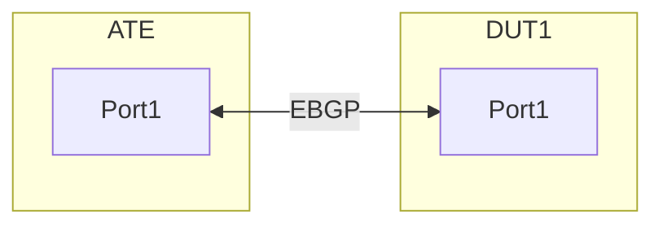

# RT-1.64 BGP Import/Export Policy Functional Test Case

## Objective

To verify the basic functioanlity of BGP import and export policies and to check if they are correctly applied on a router.

## Test Bed Setup
Device Under Test (DUT): 1 x Router

ATE BGP Peer: 1 x ATE with BGP Emulation capabilities.

### Connections:
One Ethernet link between a port on the DUT and a port on the ATE.
Create the following connections:

DUT interface: IPV4 - 10.1.1.0/31 & IPV6 - 2001:db8:204:114::0/127
ATE interface: IPV4 - 10.1.1.1/31 & IPV6 - 2001:db8:204:114::1/127

## Prerequisites

* Basic IP connectivity configured between the DUT and ATE interface.
* BGP peering established between the DUT and ATE on the connected interfaces.
* Access to configure the DUT and ATE.
* Understanding of BGP attributes (AS-Path, communities, local preference, MED).

## Test Case Scenario

This test case will focus on two scenarios:

* Export Policy: Router exports only specific prefixes to ATE based on a policy.
* Import Policy: Router imports only specific prefixes from ATE based on a policy.

## Test Steps

### Initial Setup (Pre-Test)

### DUT Configuration (Basic BGP Peering):

* Configure interface IP addresses (DUT: IPV4 - 10.1.1.0/31 & IPV6 - 2001:db8:204:114::0/127 , ATE: IPV4 - 10.1.1.1/31 & IPV6 - 2001:db8:204:114::1/127 ).
* Enable BGP on the DUT.
* Establish an EBGP peering session with the ATE (using ATE's AS as  AS65002).
* Ensure the DUT has some local routes (loopback interfaces advertised into BGP) that can be filtered.


### ATE Configuration (Basic BGP Emulation):

* Configure the ATE port with an IP address (10.1.1.1/31).
* Create a BGP Emulated Router on the ATE, acting as AS 65002.
* Establish a BGP peering session with the DUT's IP (10.1.1.0) & IPV6 (2607:f8b0:8007:614f::).

* Advertise multiple unique BGP routes from ATE, some intended to be filtered, and some to be allowed.
  * Allowed routes: IPV4 192.0.2.1/32 (AS-Path: 65002), 192.0.2.2/32 (AS-Path: 65002) and IPV6 2001:db8:300:100::0/127 (AS-Path: 65002) , 2001:db8:300:101::0/127 (AS-Path: 65002)
  * Denied routes:  IPV4 198.51.100.1/32 (AS-Path: 65002 65003), 198.51.100.2/32 (AS-Path: 65002 65004) and IPV6 2001:db8:400:100::1/128 (AS-Path: 65002 65004) , 2001:db8:400:101::1/128 (AS-Path: 65002 65004)

### Verify BGP Peering:

* On DUT: Check the BGP summary
* On ATE: Check BGP session status in IxNetwork.
* Ensure both the DUT and ATE have exchanged routes without any policy applied yet.

### Test Export Policy (Prefix-list based)

Objective: Only allow local routes 172.16.1.0/24 and 172.16.2.0/24 & 2001:db8:250:110::/64 and 2001:db8:251:110::/64  to be advertised from DUT to ATE. 192.168.10.0/24 & 2001:db8:299:110::/64 should be denied.

Configure Export Policy on DUT:
Create a prefix-list to match the desired prefixes.
Create a route-map/policy-statement to apply the prefix-list.
Apply the route-map/policy-statement to the BGP neighbor 10.1.1.1 & 2607:f8b0:8007:614f::1 as an out policy.


### Clear BGP Session (Optional, but good practice):
* On DUT: clear ip bgp 10.1.1.1 & 2607:f8b0:8007:614f::1 out (or soft reset)
* This forces the DUT to re-advertise routes based on the new policy.

### Verify Export Policy:

* ATE:
  * Go to the "Routes" tab for the emulated BGP router.
  * Observe the "Learned Routes" from the DUT.
  * Expected: Only 172.16.1.0/24 and 172.16.2.0/24 & 2001:db8:250:110::/64 and 2001:db8:251:110::/64 should be learned.
  * Expected: 192.168.10.0/24 & 2001:db8:299:110::/64 should NOT be learned.

* DUT (Verification):
  * show ip bgp neighbors 10.1.1.1 & 2607:f8b0:8007:614f::1 advertised-routes
  * Expected: The output should only show 172.16.1.0/24 and 172.16.2.0/24 & 2001:db8:250:110::/64 and 2001:db8:251:110::/64

### Test Import Policy (AS-Path based)

* Objective: Only allow routes from ATE with AS-Path 65002 (originating from the immediate neighbor) to be imported into the DUT's BGP table. Routes with longer AS-Paths (e.g., 65002 65003) should be denied.

* Configure Import Policy on DUT:
  * Create an AS-Path access-list (or regular expression) to match the desired AS-Path.
  * Create a route-map/policy-statement to apply the AS-Path access-list.
  * Apply the route-map/policy-statement to the BGP neighbor IPV4 - 10.1.1.1 & IPV6 - 2001:db8:204:114::1 as an in policy.

* Clear BGP Session (Optional, but good practice):
* On DUT: clear ip bgp 10.1.1.1 & 2001:db8:204:114::1 in (or soft reset)
* This forces the DUT to re-evaluate received routes based on the new policy.

### Verify Import Policy:

* DUT:
  * Check the bgp neighbors
  * Expected: Only IPV4 192.0.2.1/32 (AS-Path: 65002), 192.0.2.2/32 (AS-Path: 65002) and IPV6 2001:db8:300:100::0/127 (AS-Path: 65002) , 2001:db8:300:101::0/127 (AS-Path: 65002) should be present in the BGP table.
  * Expected: 198.51.100.1/32 and 198.51.100.2/32 & IPV6 2001:db8:400:100::1/128 and 2001:db8:400:101::1/128 should NOT be present in the BGP table.
  * Check the ip bgp neighbors 10.1.1.1 & 2001:db8:204:114::1 received-routes (This shows routes received BEFORE policy application.).

* ATE:
  * Observe the "Advertised Routes" from the ATE to the DUT.
  * Expected: All original advertised routes (192.0.2.1/32, 192.0.2.2/32, 198.51.100.1/32, 198.51.100.2/32, 2001:db8:300:100::0/127,2001:db8:300:101::0/127,2001:db8:400:100::1/128, 2001:db8:400:101::1/128 ) should still be showing as advertised by ATE. The filtering happens on the DUT.

### Expected Results

* Export Policy: The ATE should only learn the BGP prefixes 172.16.1.0/24 and 172.16.2.0/24 & 2001:db8:250:110::/64 and 2001:db8:251:110::/64 from the DUT. Other local prefixes should not be learned by ATE.
* Import Policy: The DUT's BGP table should only contain the BGP prefixes 192.0.2.1/32 and 192.0.2.2/32 & 2001:db8:300:100::0/127 and 2001:db8:300:101::0/127 learned from ATE. Prefixes with longer AS-Paths should be filtered and not appear in the DUT's BGP table.

### Pass/Fail Criteria

* PASS:
  * Both BGP export and import policies function as expected, allowing the desired routes and denying the unwanted routes as per the policy definitions.
  * No unintended routes are exchanged.
  * BGP session remains stable throughout the test.

* FAIL:
  * Desired routes are not exchanged (denied by policy when they should be allowed).
  * Unwanted routes are exchanged (allowed by policy when they should be denied).
  * BGP session instability or flap.

### Notes/Considerations
* Policy Complexity: This test uses simple prefix-list and AS-path filters. Real-world policies can involve communities, local preference, MED, weighted conditions, etc. More complex policies would require more elaborate test scenarios.
* Policy Order: The order of permit and deny statements within route-maps/policy-statements is crucial. An implicit deny all usually exists at the end.
* Troubleshooting: Use debug bgp commands on the DUT (with caution in production) to trace policy application. ATE's detailed route information and packet captures can also be invaluable.


## OpenConfig Path and RPC Coverage

```json

## Config Paths:

{
  "network-instances": {
    "network-instance": [
      {
        "name": "<network_instance_name>",
        "protocols": {
          "protocol": [
            {
              "identifier": "<protocol_identifier>",
              "bgp": {
                "neighbors": {
                  "neighbor": [
                    {
                      "neighbor-address": "<neighbor_ip_address>",
                      "apply-policy": {
                        "config": {
                          "import-policy": [
                            "<policy_name_1>"                          ]
                          "export-policy": [
                            "<policy_name_1>"
                          ]
                        }
                      }
                    }
                  ]
                }
              }
            }
          ]
        }
      }
    ]
  }
}```

```yaml

## State paths:

/network-instances/network-instance/protocols/protocol/bgp/peer-groups/peer-group/afi-safis/afi-safi/apply-policy/state/import-policy
/network-instances/network-instance/protocols/protocol/bgp/neighbors/neighbor/afi-safis/afi-safi/apply-policy/config/export-policy


rpcs:
  gnmi:
    gNMI.Set: /acl/config
      union_replace: true
      replace: true
    gNMI.Get: /acl/state
    gNMI.Subscribe:
      on_change: true

```


