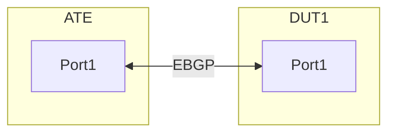

# RT-1.64 BGP Import/Export Policy Functional Test Case

## Objective
To verify that BGP import and export policies are correctly applied on a router, allowing or denying specific BGP routes based on defined criteria (e.g., AS-Path, community, prefix-list) when exchanging routing information with an Ixia traffic generator emulating a BGP peer.

## Test Bed Setup
Device Under Test (DUT): 1 x Router
Traffic Generator/BGP Peer: 1 x Ixia Chassis with BGP Emulation capabilities.

### Connections:
One Ethernet link between a port on the DUT and a port on the Ixia.
Create the following connections:

## Prerequisites
Basic IP connectivity configured between the DUT and Ixia interface.

BGP peering established between the DUT and Ixia on the connected interfaces.

Access to configure the DUT and Ixia.

Understanding of BGP attributes (AS-Path, communities, local preference, MED).

## Test Case Scenario

This test case will focus on two scenarios:

* Export Policy: Router exports only specific prefixes to Ixia based on a policy.
* Import Policy: Router imports only specific prefixes from Ixia based on a policy.

## Test Steps

### Initial Setup (Pre-Test)

### DUT Configuration (Basic BGP Peering):

* Configure interface IP addresses (DUT: 10.1.1.1/30, Ixia: 10.1.1.2/30).
* Enable BGP on the DUT.
* Establish an EBGP peering session with the Ixia (using Ixia's AS as  AS65002).
* Ensure the DUT has some local routes (loopback interfaces advertised into BGP) that can be filtered.

### Ixia Configuration (Basic BGP Emulation):

* Configure the Ixia port with an IP address (10.1.1.2/30).
* Create a BGP Emulated Router on the Ixia, acting as AS 65002.
* Establish a BGP peering session with the DUT's IP (10.1.1.1).

* Advertise multiple unique BGP routes from Ixia, some intended to be filtered, and some to be allowed.
  * Allowed routes: 192.0.2.1/32 (AS-Path: 65002), 192.0.2.2/32 (AS-Path: 65002)
  * Denied routes: 198.51.100.1/32 (AS-Path: 65002 65003), 198.51.100.2/32 (AS-Path: 65002 65004)

### Verify BGP Peering:

* On DUT: show ip bgp summary
* On Ixia: Check BGP session status in IxNetwork.
* Ensure both the DUT and Ixia have exchanged routes without any policy applied yet.

### Test Export Policy (Prefix-list based)

Objective: Only allow local routes 172.16.1.0/24 and 172.16.2.0/24 to be advertised from DUT to Ixia. 192.168.10.0/24 should be denied.

Configure Export Policy on DUT:
Create a prefix-list to match the desired prefixes.
Create a route-map/policy-statement to apply the prefix-list.
Apply the route-map/policy-statement to the BGP neighbor 10.1.1.2 as an out policy.

### Clear BGP Session (Optional, but good practice):
* On DUT: clear ip bgp 10.1.1.2 out (or soft reset)
* This forces the DUT to re-advertise routes based on the new policy.

### Verify Export Policy:

* Ixia:
  * Go to the "Routes" tab for the emulated BGP router.
  * Observe the "Learned Routes" from the DUT.
  * Expected: Only 172.16.1.0/24 and 172.16.2.0/24 should be learned.
  * Expected: 192.168.10.0/24 should NOT be learned.

* DUT (Verification):
  * show ip bgp neighbors 10.1.1.2 advertised-routes
  * Expected: The output should only show 172.16.1.0/24 and 172.16.2.0/24.

### Test Import Policy (AS-Path based)

* Objective: Only allow routes from Ixia with AS-Path 65002 (originating from the immediate neighbor) to be imported into the DUT's BGP table. Routes with longer AS-Paths (e.g., 65002 65003) should be denied.

* Configure Import Policy on DUT:
  * Create an AS-Path access-list (or regular expression) to match the desired AS-Path.
  * Create a route-map/policy-statement to apply the AS-Path access-list.
  * Apply the route-map/policy-statement to the BGP neighbor 10.1.1.2 as an in policy.

* Clear BGP Session (Optional, but good practice):
* On DUT: clear ip bgp 10.1.1.2 in (or soft reset)
* This forces the DUT to re-evaluate received routes based on the new policy.

### Verify Import Policy:

* DUT:
  * show ip bgp
  * Expected: Only 192.0.2.1/32 and 192.0.2.2/32 should be present in the BGP table.
  * Expected: 198.51.100.1/32 and 198.51.100.2/32 should NOT be present in the BGP table.
  * Check the ip bgp neighbors 10.1.1.2 received-routes (This shows routes received BEFORE policy application.).

* Ixia:
  * Observe the "Advertised Routes" from the Ixia to the DUT.
  * Expected: All original advertised routes (192.0.2.1/32, 192.0.2.2/32, 198.51.100.1/32, 198.51.100.2/32) should still be showing as advertised by Ixia. The filtering happens on the DUT.

### Expected Results

* Export Policy: The Ixia should only learn the BGP prefixes 172.16.1.0/24 and 172.16.2.0/24 from the DUT. Other local prefixes (e.g., 192.168.10.0/24) should not be learned by Ixia.
* Import Policy: The DUT's BGP table should only contain the BGP prefixes 192.0.2.1/32 and 192.0.2.2/32 learned from Ixia. Prefixes with longer AS-Paths (e.g., 198.51.100.1/32, 198.51.100.2/32) should be filtered and not appear in the DUT's BGP table.

### Pass/Fail Criteria

PASS:
Both BGP export and import policies function as expected, allowing the desired routes and denying the unwanted routes as per the policy definitions.
No unintended routes are exchanged.
BGP session remains stable throughout the test.

FAIL:
Desired routes are not exchanged (denied by policy when they should be allowed).
Unwanted routes are exchanged (allowed by policy when they should be denied).
BGP session instability or flap.

### Notes/Considerations
* Policy Complexity: This test uses simple prefix-list and AS-path filters. Real-world policies can involve communities, local preference, MED, weighted conditions, etc. More complex policies would require more elaborate test scenarios.
* Policy Order: The order of permit and deny statements within route-maps/policy-statements is crucial. An implicit deny all usually exists at the end.
* Troubleshooting: Use debug bgp commands on the DUT (with caution in production) to trace policy application. Ixia's detailed route information and packet captures can also be invaluable.

