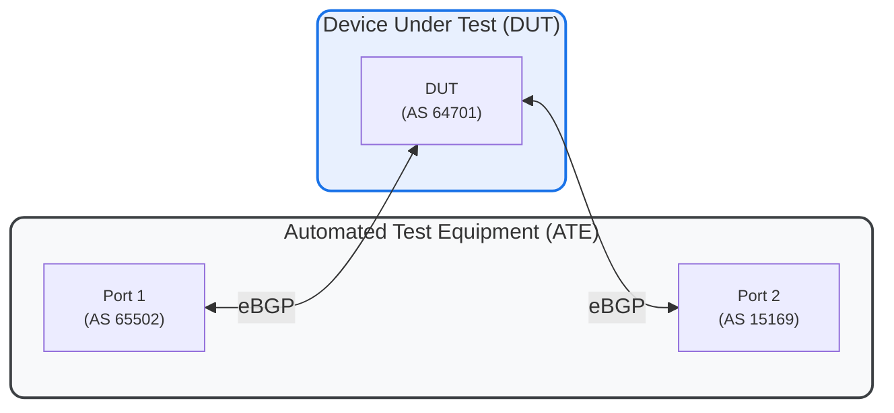

# RT-1.71: BGP Disable Peer AS Filter (`disable-peer-as-filter`)

## Summary

Verifies the `disable-peer-as-filter` feature, which allows a BGP speaker to advertise routes to an eBGP peer even if the peer's autonomous system (AS) number is already present in the AS-PATH attribute. This is essential for transit scenarios between domains sharing the same ASN.

## Testbed type

* [TESTBED_DUT_ATE_2LINKS](https://github.com/openconfig/featureprofiles/blob/main/topologies/ate_tests/base_2link_topology.testbed)

## Topology



* **ATE Port 1** (AS 65502\) connects to the **DUT** (AS 64701\) via eBGP.  
* **DUT** (AS 64701\) connects to **ATE Port 2** (AS 15169\) via eBGP.

## Procedure

### RT-1.71.1: Baseline Test (Default Filtering)

1. Configure eBGP sessions between ATE Port 1, DUT, and ATE Port 2\.  
2. Advertise a prefix (e.g., `10.0.0.0/24`) from ATE Port 1 with an AS-PATH containing the target peer's AS (`15169`) in the middle (e.g., `65502 15169 65500`).  
3. Verify that the DUT **receives** and **accepts** the route from ATE Port 1\.  
4. Verify that the DUT **does not** advertise this route to ATE Port 2 (it should filter it out because ATE Port 2 is in AS 15169).

### RT-1.71.2: Test `disable-peer-as-filter = TRUE` (Transit AS)

1. Enable `disable-peer-as-filter` on the DUT's neighbor/peer-group configuration towards ATE Port 2\.  
2. Re-advertise the prefix from ATE Port 1 with the same AS-PATH (`65502 15169 65500`).  
3. Verify that the DUT **advertises** the route to ATE Port 2\.  
4. Verify that ATE Port 2 **receives** the route (assuming it has `allowas-in` or equivalent configured to accept it).

### RT-1.71.3: Test "Originating Peer AS"

1. Ensure `disable-peer-as-filter` is enabled on the DUT's neighbor/peer-group configuration towards ATE Port 2\.  
2. Advertise a prefix from ATE Port 1 with an AS-PATH where the target peer's AS (15169) is the **originating AS** (e.g., AS-PATH: `65502 65500 15169`).  
3. Verify that the DUT **advertises** the route to ATE Port 2\.  
4. Verify that ATE Port 2 **receives** the route.  
5. Validate session state and capabilities received on DUT using telemetry.

## Canonical OC

```json
{
  "network-instances": {
    "network-instance": [
      {
        "name": "DEFAULT",
        "config": {
          "name": "DEFAULT"
        },
        "protocols": {
          "protocol": [
            {
              "identifier": "BGP",
              "name": "BGP",
              "config": {
                "identifier": "BGP",
                "name": "BGP"
              },
              "bgp": {
                "peer-groups": {
                  "peer-group": [
                    {
                      "peer-group-name": "BGP-PEER-GROUP1",
                      "config": {
                        "peer-group-name": "BGP-PEER-GROUP1"
                      },
                      "as-path-options": {
                        "config": {
                          "disable-peer-as-filter": true
                        }
                      }
                    }
                  ]
                }
              }
            }
          ]
        }
      }
    ]
  }
}
```

## OpenConfig Path and RPC Coverage

```
paths:
  ## Config paths
  /network-instances/network-instance/protocols/protocol/bgp/peer-groups/peer-group/as-path-options/config/disable-peer-as-filter:
  /network-instances/network-instance/protocols/protocol/bgp/neighbors/neighbor/as-path-options/config/disable-peer-as-filter:

  ## State paths
  /network-instances/network-instance/protocols/protocol/bgp/peer-groups/peer-group/as-path-options/state/disable-peer-as-filter:
  /network-instances/network-instance/protocols/protocol/bgp/neighbors/neighbor/as-path-options/state/disable-peer-as-filter:

rpcs:
  gnmi:
    gNMI.Set:
    gNMI.Subscribe:
```

## Required DUT platform

* Specify the minimum DUT-type:
  * vRX - virtual router device
