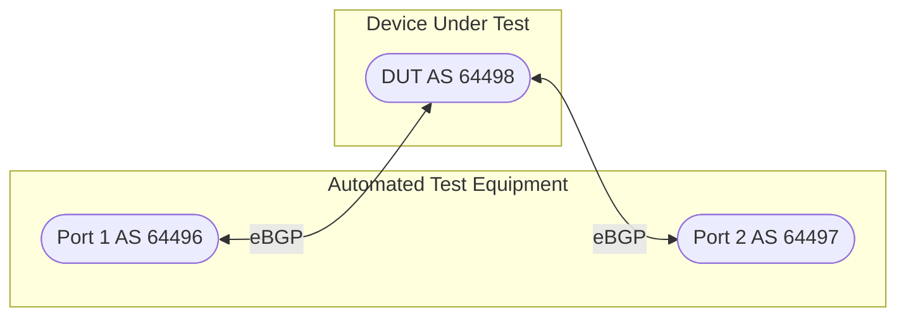
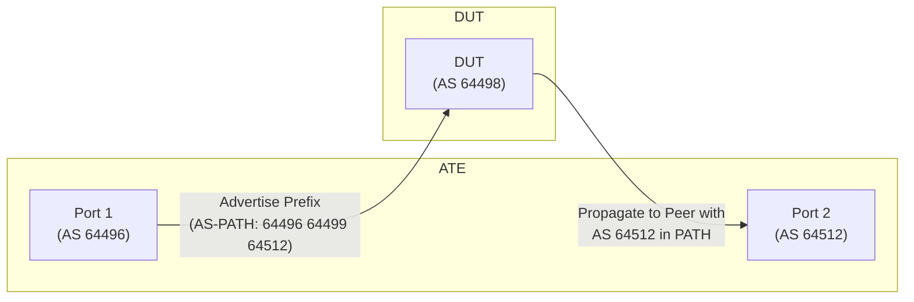

# RT-1.71: BGP Disable Peer AS Filter (`disable-peer-as-filter`)

## Summary

Verifies BGP disable-peer-as-filter functionality for both IPv4 and IPv6 Unicast sessions. This feature ensures that a router can accept routes from an eBGP peer even if the receiving router's own AS is present in the AS-PATH.

## Testbed type

* [TESTBED_DUT_ATE_2LINKS](https://github.com/openconfig/featureprofiles/blob/main/topologies/ate_tests/base_2link_topology.testbed)

## Topology


```mermaid
flowchart LR
    subgraph ATE ["Automated Test Equipment"]
        ATE1(["Port 1 AS 64496"])
        ATE2(["Port 2 AS 64497"])
    end

    subgraph DUT_Domain ["Device Under Test"]
        DUT(["DUT AS 64498"])
    end

    ATE1 <-->|eBGP| DUT
    DUT <-->|eBGP| ATE2
```

* **ATE Port 1** (AS 64496) connects to the **DUT** (AS 64498) via eBGP.
* **DUT** (AS 64498) connects to **ATE Port 2** (AS 64497) via eBGP.

## Test environment setup

1. Configure eBGP sessions (IPv4 and IPv6) between ATE Port 1, DUT, and ATE Port 2.
2. Use the following RFC-compliant addresses:
    * **Link 1 (ATE1 - DUT):** `192.0.2.0/30`, `2001:db8::1/126`
    * **Link 2 (ATE2 - DUT):** `198.51.100.0/30`, `2001:db8::5/126`


## Procedure

### RT-1.71.1: Baseline Test (Default Filtering)

1. Establish eBGP sessions (IPv4 and IPv6) between ATE Port 1, DUT, and ATE Port 2.
2. Advertise a prefix (e.g., `192.0.2.100/32` and `2001:db8:64:64::1/64`) from ATE Port 1 with an AS-PATH containing the target peer's AS (`64497`) in the middle (e.g., AS-PATH: `64496 64497 64499`).
3. Verify that the DUT **does not advertise** the route to ATE Port 2.
4. Verify that ATE Port 2 **does not receive** the route.

### RT-1.71.2: Test `disable-peer-as-filter = TRUE` (Transit AS)

1. Enable `disable-peer-as-filter` on the DUT's neighbor/peer-group configuration towards ATE Port 2 (AS 64497).
2. Re-advertise the prefixes from ATE Port 1 with the same AS-PATH (`64496 64497 64499`).
3. Verify that the DUT **advertises** the route to ATE Port 2.
4. Verify that ATE Port 2 **receives** the route.
5. Validate for both IPv4 and IPv6 families.

### RT-1.71.3: Test "Originating Peer AS"

1. Ensure `disable-peer-as-filter` is enabled on the DUT's neighbor configuration towards ATE Port 2.
2. Advertise a prefix from ATE Port 1 with an AS-PATH where the target peer's AS (`64497`) is the **originating AS** (e.g., AS-PATH: `64496 64499 64497`).
3. Verify that the DUT **advertises** the route to ATE Port 2.
4. Verify that ATE Port 2 **receives** the route.
5. Validate session state and capabilities received on DUT using telemetry.


### RT-1.71.4: Private AS Number Scenario


```mermaid
graph LR
    subgraph ATE ["ATE"]
        direction TB
        ATE1["Port 1<br/>(AS 64496)"]
        ATE2["Port 2<br/>(AS 64512)"]
    end

    subgraph DUT_Domain ["DUT"]
        DUT["DUT<br/>(AS 64498)"]
    end

    %% Advertisement Flow for RT-1.71.4
    ATE1 -- "Advertise Prefix<br/>(AS-PATH: 64496 64499 64512)" --> DUT
    DUT -- "Propagate to Peer with<br/>AS 64512 in PATH" --> ATE2
```

1. Configure **ATE Port 2** with a private AS number (e.g., `64512`).
2. Configure the **DUT** (AS `64498`) with `disable-peer-as-filter = TRUE` on the neighbor configuration towards ATE Port 2.
3. Advertise a prefix from **ATE Port 1** with an AS-PATH that includes ATE Port 2's AS (e.g., AS-PATH: `64496 64499 64512`).
4. Verify that the DUT **advertises** the route to ATE Port 2 (AS 64512).
5. Verify that ATE Port 2 **receives** the route.

### RT-1.71.5: Test "Peer-group and Neighbor level"

Ensure the tests are performed for BGP configuration at the Peer-group as well as at the Neighbor levels

## Canonical OC

```json
{
  "network-instances": {
    "network-instance": [
      {
        "name": "DEFAULT",
        "config": {
          "name": "DEFAULT"
        },
        "protocols": {
          "protocol": [
            {
              "identifier": "BGP",
              "name": "BGP",
              "config": {
                "identifier": "BGP",
                "name": "BGP"
              },
              "bgp": {
                "peer-groups": {
                  "peer-group": [
                    {
                      "peer-group-name": "BGP-PEER-GROUP1",
                      "config": {
                        "peer-group-name": "BGP-PEER-GROUP1"
                      },
                      "as-path-options": {
                        "config": {
                          "disable-peer-as-filter": true
                        }
                      }
                    }
                  ]
                }
              }
            }
          ]
        }
      }
    ]
  }
}
```

## OpenConfig Path and RPC Coverage

```yaml
paths:
  ## Config paths
  /network-instances/network-instance/protocols/protocol/bgp/peer-groups/peer-group/as-path-options/config/disable-peer-as-filter:
  /network-instances/network-instance/protocols/protocol/bgp/neighbors/neighbor/as-path-options/config/disable-peer-as-filter:

  ## State paths
  /network-instances/network-instance/protocols/protocol/bgp/peer-groups/peer-group/as-path-options/state/disable-peer-as-filter:
  /network-instances/network-instance/protocols/protocol/bgp/neighbors/neighbor/as-path-options/state/disable-peer-as-filter:
  /network-instances/network-instance/protocols/protocol/bgp/neighbors/neighbor/state/session-state:

rpcs:
  gnmi:
    gNMI.Set:
      union_replace: true
    gNMI.Subscribe:
      on_change: true
```

## Required DUT platform

* vRX - virtual router device

