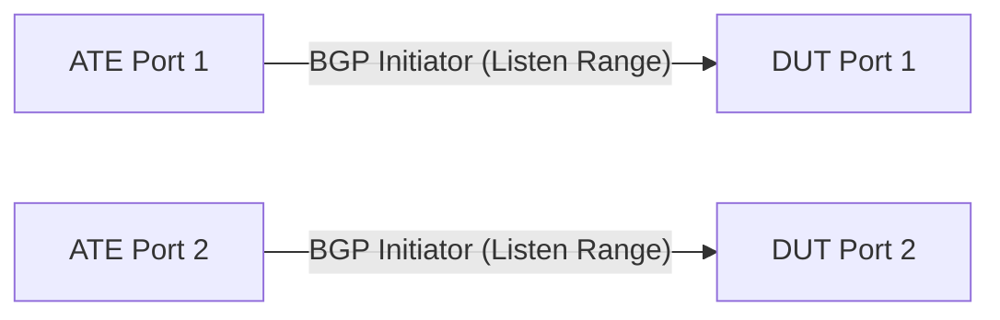

# RT-1.103: DUT iBGP passive listener FNT with common router id

## Summary

Validate the iBGP passive listener functionality on DUT using dynamic peering
and verify consistent router-id usage across multiple sessions.

> [!NOTE]
> This requirement is discussed/aligned in [PR #5620](https://github.com/openconfig/featureprofiles/pull/5620).

## Testbed type

*   `TESTBED_DUT_ATE_2LINKS` (ATE simulating multiple internal peers).

## Topology



*   Connect ATE Port 1 to DUT Port 1.
*   Connect ATE Port 2 to DUT Port 2.
*   ATE will initiate multiple BGP sessions from different source IPs within the configured listen range.
*   Simulated ATE peers may use the **same BGP Identifier (Router ID)** to verify standard transport separation behavior (identified by source IP).
*   One of the ports (e.g., ATE Port 1) will also establish a static BGP session using a direct interface IP/port IP address (outside the listen range).

## Procedure

### Configuration

1.  Configure DUT with a global router-id.
2.  Configure a peer-group for dynamic neighbors (e.g., `RM_DYNAMIC_PEERS`).
3.  Configure dynamic neighbor prefixes (listen range, e.g., `2001:db8:1::/64`) associated with the peer-group.
4.  Configure MD5 authentication on the peer-group.
5.  Configure a static BGP neighbor (outside the listen range, e.g., `2001:db8:0:1::2`).

### Tests

#### RT-1.103.1 - Dynamic Peering and Router-ID Validation

*   **Step 1**: Enable dynamic neighbor prefix on DUT (e.g., `2001:db8:1::/64`).
*   **Step 2**: Initiate BGP sessions from multiple ATE interfaces using different specific source IPs (e.g., `2001:db8:1::1`, `2001:db8:1::2`) within the listen range.
*   **Step 3**: Verify that sessions transition to `ESTABLISHED`.
*   **Step 4**: Verify that the DUT uses the configured router-id (e.g., `192.0.2.1`) for all dynamically established sessions.
*   **Step 5**: Verify concurrent session handling (e.g., 5-10 sessions established simultaneously).
*   **Step 6**: Attempt to initiate a BGP session from an IP in the listen range but using an incorrect/Different ASN (e.g., `64501` instead of `64500`).
*   **Step 7**: Verify that the DUT rejects the connection or that it fails to transition to `ESTABLISHED` state.

#### RT-1.103.2 - Telemetry for Dynamic Neighbors

*   **Step 1**: Verify that the established dynamic peers (e.g., `2001:db8:1::1`) are instantiated and visible under the `neighbors/neighbor` container in telemetry.
*   **Step 2**: Query the state leaf `/network-instances/network-instance/protocols/protocol/bgp/neighbors/neighbor/state/dynamically-configured` for the dynamic peer and verify it returns `true`.
*   **Step 3**: Verify that standard statically configured neighbors return `false` for this leaf.

#### RT-1.103.3 - Secured Dynamic Peers (iBGP MD5)

*   **Step 1**: Configure the peer group `RM_DYNAMIC_PEERS` with `auth-password`.
*   **Step 2**: Initiate BGP sessions from ATE using the correct MD5 password.
*   **Step 3**: Verify that sessions transition to `ESTABLISHED`.
*   **Step 4**: Attempt to initiate a session from ATE with an incorrect password or no password.
*   **Step 5**: Verify that the session FAILS to establish.

#### RT-1.103.4 - Duplicate ATE Router-ID (Transport Separation)

*   **Step 1**: Establish a BGP session from ATE Peer 1 (Source IP `2001:db8:1::1`) with a specific Router-ID (e.g., `192.0.2.200`).
*   **Step 2**: Initiate a BGP session from ATE Peer 2 (Source IP `2001:db8:1::2`) using the **same** Router-ID (`192.0.2.200`).
*   **Step 3**: Verify that **both** sessions transition to `ESTABLISHED` and are maintained independently, relying on transport address separation.

#### RT-1.103.5 - Overlapping Prefix Best-Path Selection and Reconvergence

Verifies that the DUT correctly evaluates BGP best-path parameters (e.g., MED) and executes seamless route reconvergence when the same prefix is received concurrently from both static and dynamic BGP peers.

*   **Step 1**: Establish a static BGP session on one of the current ports (e.g., Port 1) using an IP address outside the listen range (e.g., the direct port IP address/subnet `2001:db8:0:1::2`).
*   **Step 2**: Establish a dynamic BGP session (e.g., on Port 2 or behind Port 1) using an IP within the listen range (e.g., `2001:db8:1::1`).
*   **Step 3**: Advertise the exact same prefix (e.g., `2001:db8:2::/64` for IPv6 or `198.51.100.0/24` for IPv4) from both ATE ports/peers to DUT.
*   **Step 4**: Configure Multi-Exit Discriminator (MED) to influence best-path selection: set **MED = 50** on the static peer and **MED = 100** on the dynamic peer.
*   **Step 5**: Verify DUT selects the best path based on standard BGP decision process (favors path with lower MED, i.e., the static peer).
*   **Step 6**: Withdraw/Disable the preferred path from ATE.
*   **Step 7**: Verify seamless reconvergence to the alternative path on DUT.

## Canonical OC

```json
{
  "network-instances": {
    "network-instance": [
      {
        "config": {
          "name": "DEFAULT"
        },
        "name": "DEFAULT",
        "protocols": {
          "protocol": [
            {
              "bgp": {
                "global": {
                  "config": {
                    "as": 64500,
                    "router-id": "192.0.2.1"
                  },
                  "dynamic-neighbor-prefixes": {
                    "dynamic-neighbor-prefix": [
                      {
                        "config": {
                          "prefix": "2001:db8:1::/64",
                          "peer-group": "RM_DYNAMIC_PEERS"
                        },
                        "prefix": "2001:db8:1::/64"
                      }
                    ]
                  }
                },
                "peer-groups": {
                  "peer-group": [
                    {
                      "config": {
                        "peer-group-name": "RM_DYNAMIC_PEERS",
                        "peer-as": 64500,
                        "auth-password": "secret_md5_key"
                      },
                      "peer-group-name": "RM_DYNAMIC_PEERS"
                    },
                    {
                      "config": {
                        "peer-group-name": "STATIC_PEERS",
                        "peer-as": 64500
                      },
                      "peer-group-name": "STATIC_PEERS"
                    }
                  ]
                },
                "neighbors": {
                  "neighbor": [
                    {
                      "config": {
                        "neighbor-address": "2001:db8:0:1::2",
                        "peer-as": 64500,
                        "peer-group": "STATIC_PEERS"
                      },
                      "neighbor-address": "2001:db8:0:1::2"
                    }
                  ]
                }
              },
              "config": {
                "identifier": "BGP",
                "name": "BGP"
              },
              "identifier": "BGP",
              "name": "BGP"
            }
          ]
        }
      }
    ]
  }
}
```

## OpenConfig Path and RPC Coverage

```yaml
paths:
  # BGP Global Config
  /network-instances/network-instance/protocols/protocol/bgp/global/config/as:
  /network-instances/network-instance/protocols/protocol/bgp/global/config/router-id:
  /network-instances/network-instance/protocols/protocol/bgp/global/state/router-id:

  # BGP Dynamic Neighbors
  /network-instances/network-instance/protocols/protocol/bgp/global/dynamic-neighbor-prefixes/dynamic-neighbor-prefix/config/prefix:
  /network-instances/network-instance/protocols/protocol/bgp/global/dynamic-neighbor-prefixes/dynamic-neighbor-prefix/config/peer-group:

  # BGP Peer Group Auth
  /network-instances/network-instance/protocols/protocol/bgp/peer-groups/peer-group/config/auth-password:

  # BGP Neighbor State (Dynamic)
  /network-instances/network-instance/protocols/protocol/bgp/neighbors/neighbor/state/session-state:
  /network-instances/network-instance/protocols/protocol/bgp/neighbors/neighbor/state/dynamically-configured:

rpcs:
  gnmi:
    gNMI.Set:
      union_replace: true
    gNMI.Subscribe:
      on_change: true
```

## Required DUT platform

*   FFF (Fixed Form Factor) or MFF supporting dynamic BGP peers.
