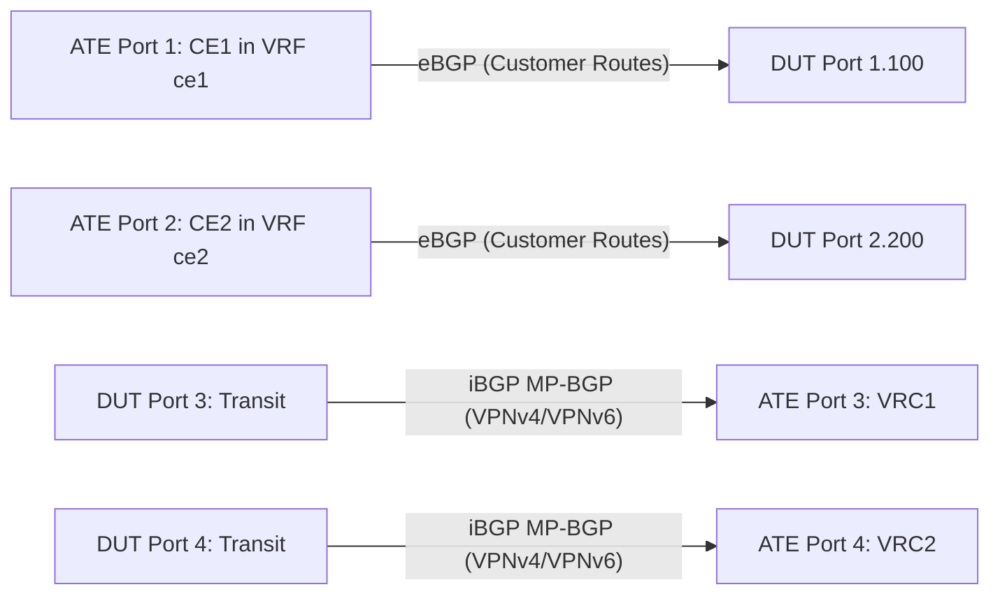

# RT-1.107: BGP FIB Isolation and Peer Soft Drain

## Summary

Validate that customer eBGP routes learned on the DUT (anPF) in tenant VRFs are maintained in the BGP control plane and advertised to core iBGP peers (VRC) via `advertise-inactive`, but are isolated and suppressed from installation into the local transit forwarding table (FIB). Furthermore, validate graceful soft-drain and undrain operations per tenant peer session (via policy-driven LOCAL_PREF deprecation and AS-Path prepending) without traffic disruption to neighboring tenants.

> [!NOTE]
> Correlates with Google internal trackers [b/535482522](http://b/535482522) and [b/494645201](http://b/494645201).
> Derived from CSE EdgeBGP LLD and KNE runbook validations (`test_fib_1_1`, `test_fib_1_2`, `test_adv_1_1`, `test_adv_1_2`).

## Testbed type

* `TESTBED_DUT_ATE_4LINKS` (ATE Port 1/2 simulating Customer Edge CE1/CE2; ATE Port 3/4 simulating Cloud Router VRC1/VRC2).

## Topology



* Connect ATE Port 1 to DUT Port 1 (configured with subinterface VLAN 100 in VRF `ce1`, IP `192.0.2.1/30`).
* Connect ATE Port 2 to DUT Port 2 (configured with subinterface VLAN 200 in VRF `ce2`, IP `192.0.2.5/30`).
* Connect ATE Port 3 to DUT Port 3 (configured with IPv6 transit peering to VRC1 in default/transit VRF).
* Connect ATE Port 4 to DUT Port 4 (configured with IPv6 transit peering to VRC2 in default/transit VRF).

## Procedure

### Test environment setup

1. Configure two tenant network instances (`ce1`, `ce2`) on the DUT with distinct Route Distinguishers (RD) and Route Targets (RT).
2. Configure eBGP sessions under VRF `ce1` (with ATE CE1 `192.0.2.2`, AS 65001) and VRF `ce2` (with ATE CE2 `192.0.2.6`, AS 65002).
3. Configure iBGP sessions towards ATE VRC1/VRC2 with multiprotocol `vpn-ipv4` and `vpn-ipv6` address families enabled.
4. Configure route install suppression policy on DUT: routes learned via customer eBGP in tenant VRFs must have `table-install` suppressed (`install-map NO-ROUTES` or routing policy `reject` on RIB-to-FIB download).
5. Enable `advertise-inactive` on the DUT BGP process so that valid BGP routes not installed in the FIB continue to be advertised to iBGP peers.

### RT-1.107.1 - Multi-Tenant FIB Routing Isolation

* **Step 1**: ATE CE1 advertises prefix `198.51.100.0/24` (IPv4) and `2001:db8:100::/64` (IPv6) to DUT in VRF `ce1`.
* **Step 2**: ATE CE2 advertises prefix `203.0.113.0/24` (IPv4) and `2001:db8:200::/64` (IPv6) to DUT in VRF `ce2`.
* **Step 3**: Verify via OpenConfig telemetry `/network-instances/network-instance[name=ce1]/table-connections` and AFT telemetry `/network-instances/network-instance[name=ce1]/afts/` that VRF `ce1` contains no forwarding entries for `203.0.113.0/24`.
* **Step 4**: Verify VRF `ce2` contains no forwarding entries for `198.51.100.0/24`.
* **Step 5**: Send bidirectional data plane probe packets from ATE CE1 destined to `203.0.113.0/24`; verify traffic is dropped on the DUT and does not leak cross-VRF.

### RT-1.107.2 - FIB Suppression (No-Install to Forwarding Table)

* **Step 1**: Verify prefix `198.51.100.0/24` is present in the DUT BGP RIB under `/network-instances/network-instance[name=ce1]/protocols/protocol[identifier=openconfig-policy-types:BGP][name=BGP]/bgp/rib/afi-safis/afi-safi[afi-safi-name=openconfig-bgp-types:IPV4_UNICAST]/ipv4-unicast/loc-rib/routes/route/state/prefix`.
* **Step 2**: Query the DUT AFT forwarding state at `/network-instances/network-instance[name=ce1]/afts/ipv4-unicast/ipv4-entry[prefix=198.51.100.0/24]`.
* **Step 3**: Verify that the route is **NOT installed** in the hardware FIB table (or state leaf reflects `not-installed` / transit-only suppression).
* **Step 4**: Verify that core transit traffic passing through DUT does not attempt local host termination for suppressed customer prefixes.

### RT-1.107.3 - Advertise Inactive Routes to iBGP Peers

* **Step 1**: With route `198.51.100.0/24` suppressed from the DUT local FIB, monitor the iBGP advertisements sent from DUT Port 3 to ATE VRC1.
* **Step 2**: Verify that ATE VRC1 receives the `198.51.100.0/24` prefix as an MP-BGP VPNv4 update carrying the appropriate Route Distinguisher and Route Target.
* **Step 3**: Verify that RIB telemetry `/network-instances/network-instance/protocols/protocol[identifier=openconfig-policy-types:BGP][name=BGP]/bgp/rib/afi-safis/afi-safi[afi-safi-name=openconfig-bgp-types:IPV4_UNICAST]/ipv4-unicast/neighbors/neighbor[neighbor-address=2001:db8:200::201]/adj-rib-out-post/routes/route/state/prefix` shows `198.51.100.0/24` as advertised.

### RT-1.107.4 - Tenant eBGP Soft Drain

* **Step 1**: Establish steady-state traffic between ATE CE1 and ATE VRC1.
* **Step 2**: Apply a soft drain policy on DUT for ATE CE1 peer (deprecating `local-pref` to `10` towards core iBGP peers and prepending AS-Path `64500 64500 64500` towards CE1 without resetting TCP transport).
* **Step 3**: Verify that the DUT re-advertises `198.51.100.0/24` towards ATE VRC1 with deprecated `local-pref` (`10`) and towards ATE CE1 with prepended AS-Path (`[64500, 64500, 64500]`), gracefully draining traffic away from the link without hard route withdrawal.
* **Step 4**: Verify that neighbor ATE CE2 in VRF `ce2` maintains its active BGP session and experiences 0% packet loss during CE1 drain.

### RT-1.107.5 - Reconvergence on Undrain

* **Step 1**: Remove the soft drain policy on DUT for ATE CE1.
* **Step 2**: Verify that the BGP session seamlessly resumes normal route advertisement with default `local-pref` (`100`) and unprepended AS-Path without session flapping.
* **Step 3**: Measure convergence latency: verify route `198.51.100.0/24` is re-advertised with restored attributes to ATE VRC1 in less than 5 seconds.

## Canonical OC

```json
{
  "network-instances": {
    "network-instance": [
      {
        "name": "ce1",
        "config": {
          "name": "ce1",
          "type": "openconfig-network-instance-types:L3VRF",
          "route-distinguisher": "64500:100"
        },
        "protocols": {
          "protocol": [
            {
              "identifier": "openconfig-policy-types:BGP",
              "name": "BGP",
              "bgp": {
                "global": {
                  "config": {
                    "as": 64500
                  }
                },
                "neighbors": {
                  "neighbor": [
                    {
                      "neighbor-address": "192.0.2.2",
                      "config": {
                        "neighbor-address": "192.0.2.2",
                        "peer-as": 65001
                      }
                    }
                  ]
                }
              }
            }
          ]
        }
      }
    ]
  }
}
```

## OpenConfig Path and RPC Coverage

```yaml
paths:
  # BGP RIB and Advertised Paths
  /network-instances/network-instance/protocols/protocol/bgp/rib/afi-safis/afi-safi/ipv4-unicast/loc-rib/routes/route/state/prefix:
  /network-instances/network-instance/protocols/protocol/bgp/rib/afi-safis/afi-safi/ipv4-unicast/neighbors/neighbor/adj-rib-out-post/routes/route/state/prefix:
  /network-instances/network-instance/protocols/protocol/bgp/rib/attr-sets/attr-set/state/local-pref:
  # Network Instance Forwarding Table (AFT)
  /network-instances/network-instance/afts/ipv4-unicast/ipv4-entry/state/prefix:
  /network-instances/network-instance/afts/ipv6-unicast/ipv6-entry/state/prefix:
  # Session State
  /network-instances/network-instance/protocols/protocol/bgp/neighbors/neighbor/state/session-state:

rpcs:
  gnmi:
    gNMI.Get:
    gNMI.Set:
    gNMI.Subscribe:
```

## Required DUT platform

* FFF
