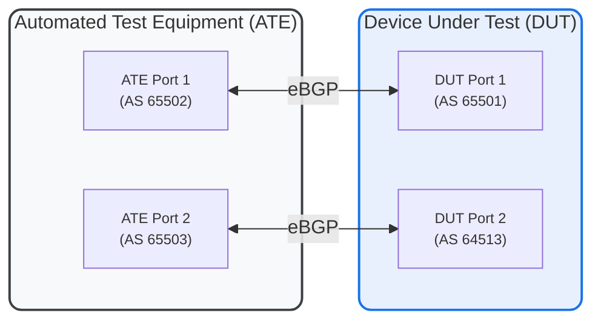

# RT-1.54: BGP Override AS-path split-horizon

## Summary

BGP Override AS-path split-horizon

## Topology




## Procedure

*  Establish BGP Session: Configure and establish an eBGP session between the DUT (Port1) and the ATE (Port1).
*  
### RT-1.54.1  Test no allow-own-in
*  Baseline Test (No "allow-own-in"):
    *  Advertise a prefix from the ATE (e.g., 192.168.1.0/24) with an AS-path that includes AS 65501 (DUT's AS) in the middle (e.g., AS-path: 65502 65500 65501 65499).
    *  Verify that the ATE Port2 doesn't receive the route. due to the presence of its own AS in the path.
    *  Validate session state and capabilities received on DUT using telemetry.

### RT-1.54.2  Test "allow-own-as 1"
*  Test "allow-own-as 1":
    *  Enable "allow-own-as 1" on the DUT.
        *  Re-advertise the prefix from the ATE with the same AS-path.
        *  Verify that the DUT accepts the route.
        *  Verify that the ATE Port2 receives the route.
        *  Validate session state and capabilities received on DUT using telemetry.
### RT-1.54.3  Test "allow-own-as 3"
*  Test "allow-own-as 3":
    *  Change the DUT's configuration to "allow-own-as 3".
    *  Test with the following AS-path occurrences:
        *  1 Occurrence: 65502 65500 65501 65499
        *  3 Occurrences: 65502 65501 65501 65501 65499
        *  4 Occurrences: 65502 65501 65501 65501 65501 65499 (Should be rejected)
    *  Verify that the ATE Port2 receives the route with 1 and 3 occurrences of AS 65501 but rejects it with 4 occurrences.
    *  Validate session state and capabilities received on DUT using telemetry.
### RT-1.54.4  Test "allow-own-as 4"
*  Test "allow-own-as 4:
    *  Change the DUT's configuration to "allow-own-as 4".
    *  Test with the following AS-path occurrences:
        *  1 Occurrence: 65502 65500 65501 65499
        *  3 Occurrences: 65502 65501 65501 65501 65499
        *  4 Occurrences: 65502 65501 65501 65501 65501 65499
    *  Verify that the ATE Port2 receives the route with 1, 3 and 4 occurrences of AS 65501.
    *  Validate session state and capabilities received on DUT using telemetry.
 ### RT-1.54.5  Test "DUTs AS as Originating AS"
*  Test "allow-own-as 1":
    *  Change the DUT's configuration to "allow-own-as 1".
    *  Test with the following AS-path occurrence:
        *  Occurrence: 65502 65500 65499 65501
    *  Verify that the ATE Port2 receives the route of AS 65501.
    *  Validate session state and capabilities received on DUT using telemetry.


## Canonical OC
```json
{
  "network-instances": {
    "network-instance": [
      {
        "name": "DEFAULT",
        "config": {
          "name": "DEFAULT"
        },
        "protocols": {
          "protocol": [
            {
              "identifier": "BGP",
              "name": "BGP",
              "config": {
                "identifier": "BGP",
                "name": "BGP"
              },
              "bgp": {
                "peer-groups": {
                  "peer-group": [
                    {
                      "peer-group-name": "BGP-PEER-GROUP1",
                      "config": {
                        "peer-group-name": "BGP-PEER-GROUP1"
                      },
                      "as-path-options": {
                        "config": {
                          "allow-own-as": 1
                        }
                      }
                    }
                  ]
                }
              }
            }
          ]
        }
      }
    ]
  }
}
```


## OpenConfig Path and RPC Coverage

```yaml
paths:
  ## Config paths
  /network-instances/network-instance/protocols/protocol/bgp/peer-groups/peer-group/as-path-options/config/allow-own-as:
  /network-instances/network-instance/protocols/protocol/bgp/neighbors/neighbor/as-path-options/config/allow-own-as:

  ## State paths
  /network-instances/network-instance/protocols/protocol/bgp/peer-groups/peer-group/as-path-options/state/allow-own-as:
  /network-instances/network-instance/protocols/protocol/bgp/neighbors/neighbor/as-path-options/state/allow-own-as:

rpcs:
  gnmi:
    gNMI.Set:
    gNMI.Subscribe:
```

## Minimum DUT platform requirement

* MFF - A modular form factor device containing LINECARDs, FABRIC and redundant CONTROLLER_CARD components
* FFF - fixed form factor
