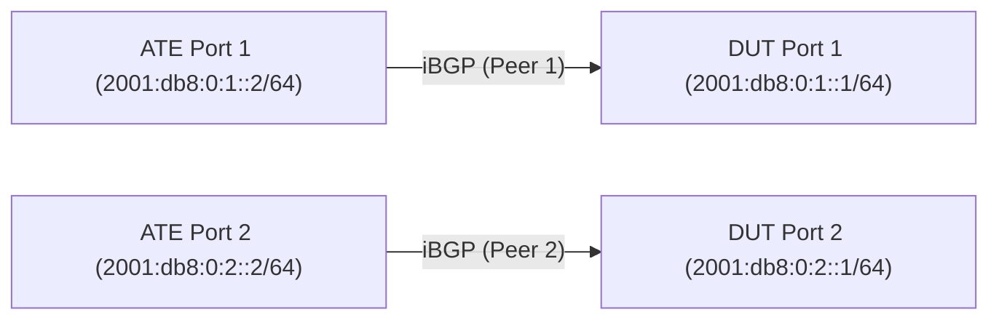

# RT-1.106: BGP RT Membership Constraints (RFC 4684)

## Summary

Validate RFC 4684 Route Target (RT) Membership Constrained Route Distribution
behavior in iBGP to prevent flooding VPN routes. Ensure the DUT only advertises
VPN routes to peers that have requested the corresponding Route Targets.

## Testbed type

*   `TESTBED_DUT_ATE_2LINKS`

## Topology



*   Connect ATE Port 1 to DUT Port 1.
*   Connect ATE Port 2 to DUT Port 2.
*   ATE will simulate iBGP peers negotiating different capabilities.
*   All iBGP sessions are transported over IPv6 using explicit point-to-point links.

## Procedure

### Configuration

1.  Configure DUT with iBGP peer group (e.g., `IBGP_PEERS`).
2.  Enable `RT_MEMBERSHIP`, `L3VPN_IPV4_UNICAST`, and `L3VPN_IPV6_UNICAST` address families for the peer group.
3.  Configure two VRFs on DUT:
    *   **VRF_100**: Export/Import RT `64496:100`, inject prefixes `198.51.100.10/32` and `2001:db8:2::10/128`.
    *   **VRF_200**: Export/Import RT `64496:200`, inject prefixes `198.51.100.20/32` and `2001:db8:2::20/128`.
4.  Setup ATE to simulate multiple iBGP peers (Simulated Peers generating VPN paths), some negotiating RT Membership and some not.

### Tests

#### RT-1.106.1 - Default RT Membership Behavior (Outbound)

*   **Step 1**: Do NOT negotiate RT Membership capability from ATE Peer 1.
*   **Step 2**: Verify that DUT assumes Peer 1 is interested in ALL VPN routes (DUT generates a default RT membership route locally on behalf of Peer 1).
*   **Step 3**: Verify Peer 1 receives all exported VPN routes (`198.51.100.10/32`, `2001:db8:2::10/128` AND `198.51.100.20/32`, `2001:db8:2::20/128`).

#### RT-1.106.2 - Constrained Route Distribution (Outbound Filtering)

*   **Step 1**: Enable RT Membership negotiation on ATE Peer 2.
*   **Step 2**: ATE Peer 2 advertises Interest in specific Route Target `64496:100` ONLY.
*   **Step 3**: Verify DUT ONLY advertises VPN routes matching this Route Target to Peer 2 (Verify `198.51.100.10/32` and `2001:db8:2::10/128` are received).
*   **Step 4**: Verify DUT does NOT advertise routes with other Route Targets to Peer 2 (Verify `198.51.100.20/32` and `2001:db8:2::20/128` are NOT received).

#### RT-1.106.3 - DUT RTC Origination (Inbound Constraints)

*   **Step 1**: Ensure DUT has `VRF_100` (Imports `64496:100`) and `VRF_200` (Imports `64496:200`) configured and active.
*   **Step 2**: Verify on ATE that it receives `RT_MEMBERSHIP` advertisements from DUT for `64496:100` and `64496:200`.
*   **Step 3**: Verify on ATE that it does **NOT** receive `RT_MEMBERSHIP` advertisements from DUT for other unconfigured Route Targets (e.g., `64496:300`).

## Canonical OpenConfig

```json
{
  "network-instances": {
    "network-instance": [
      {
        "config": {
          "name": "DEFAULT"
        },
        "name": "DEFAULT",
        "protocols": {
          "protocol": [
            {
              "bgp": {
                "peer-groups": {
                  "peer-group": [
                    {
                      "config": {
                        "peer-group-name": "IBGP_PEERS"
                      },
                      "peer-group-name": "IBGP_PEERS",
                      "afi-safis": {
                        "afi-safi": [
                          {
                            "afi-safi-name": "openconfig-bgp-types:RT_MEMBERSHIP",
                            "config": {
                              "afi-safi-name": "openconfig-bgp-types:RT_MEMBERSHIP",
                              "enabled": true
                            }
                          },
                          {
                            "afi-safi-name": "openconfig-bgp-types:L3VPN_IPV4_UNICAST",
                            "config": {
                              "afi-safi-name": "openconfig-bgp-types:L3VPN_IPV4_UNICAST",
                              "enabled": true
                            }
                          },
                          {
                            "afi-safi-name": "openconfig-bgp-types:L3VPN_IPV6_UNICAST",
                            "config": {
                              "afi-safi-name": "openconfig-bgp-types:L3VPN_IPV6_UNICAST",
                              "enabled": true
                            }
                          }
                        ]
                      }
                    }
                  ]
                }
              },
              "config": {
                "identifier": "BGP",
                "name": "BGP"
              },
              "identifier": "BGP",
              "name": "BGP"
            }
          ]
        }
      },
      {
        "config": {
          "name": "VRF_100",
          "type": "openconfig-network-instance-types:L3VRF"
        },
        "name": "VRF_100",
        "inter-instance-policies": {
          "import-export-policy": {
            "config": {
              "import-route-target": [
                "route-target:64496:100"
              ],
              "export-route-target": [
                "route-target:64496:100"
              ]
            }
          }
        },
        "interfaces": {
          "interface": [
            {
              "config": {
                "id": "Loopback100"
              },
              "id": "Loopback100"
            }
          ]
        }
      },
      {
        "config": {
          "name": "VRF_200",
          "type": "openconfig-network-instance-types:L3VRF"
        },
        "name": "VRF_200",
        "inter-instance-policies": {
          "import-export-policy": {
            "config": {
              "import-route-target": [
                "route-target:64496:200"
              ],
              "export-route-target": [
                "route-target:64496:200"
              ]
            }
          }
        },
        "interfaces": {
          "interface": [
            {
              "config": {
                "id": "Loopback200"
              },
              "id": "Loopback200"
            }
          ]
        }
      }
    ]
  },
  "interfaces": {
    "interface": [
      {
        "config": {
          "name": "Loopback100",
          "type": "iana-if-type:softwareLoopback"
        },
        "name": "Loopback100",
        "subinterfaces": {
          "subinterface": [
            {
              "config": {
                "index": 0
              },
              "index": 0,
              "ipv4": {
                "addresses": {
                  "address": [
                    {
                      "config": {
                        "ip": "198.51.100.10",
                        "prefix-length": 32
                      },
                      "ip": "198.51.100.10"
                    }
                  ]
                }
              },
              "ipv6": {
                "addresses": {
                  "address": [
                    {
                      "config": {
                        "ip": "2001:db8:2::10",
                        "prefix-length": 128
                      },
                      "ip": "2001:db8:2::10"
                    }
                  ]
                }
              }
            }
          ]
        }
      },
      {
        "config": {
          "name": "Loopback200",
          "type": "iana-if-type:softwareLoopback"
        },
        "name": "Loopback200",
        "subinterfaces": {
          "subinterface": [
            {
              "config": {
                "index": 0
              },
              "index": 0,
              "ipv4": {
                "addresses": {
                  "address": [
                    {
                      "config": {
                        "ip": "198.51.100.20",
                        "prefix-length": 32
                      },
                      "ip": "198.51.100.20"
                    }
                  ]
                }
              },
              "ipv6": {
                "addresses": {
                  "address": [
                    {
                      "config": {
                        "ip": "2001:db8:2::20",
                        "prefix-length": 128
                      },
                      "ip": "2001:db8:2::20"
                    }
                  ]
                }
              }
            }
          ]
        }
      }
    ]
  }
}
```

## OpenConfig Path and RPC Coverage

```yaml
paths:
  # Network Instance / VRF Config
  /network-instances/network-instance/config/name:
  /network-instances/network-instance/config/type:
  /network-instances/network-instance/inter-instance-policies/import-export-policy/config/import-route-target:
  /network-instances/network-instance/inter-instance-policies/import-export-policy/config/export-route-target:
  /network-instances/network-instance/interfaces/interface/config/id:

  # Interface Config (Loopbacks/Prefix Injection)
  /interfaces/interface/config/name:
  /interfaces/interface/config/type:
  /interfaces/interface/subinterfaces/subinterface/config/index:
  /interfaces/interface/subinterfaces/subinterface/ipv4/addresses/address/config/ip:
  /interfaces/interface/subinterfaces/subinterface/ipv4/addresses/address/config/prefix-length:
  /interfaces/interface/subinterfaces/subinterface/ipv6/addresses/address/config/ip:
  /interfaces/interface/subinterfaces/subinterface/ipv6/addresses/address/config/prefix-length:

  # BGP AFI-SAFI Enablement
  /network-instances/network-instance/protocols/protocol/bgp/peer-groups/peer-group/afi-safis/afi-safi/config/enabled:
  /network-instances/network-instance/protocols/protocol/bgp/peer-groups/peer-group/afi-safis/afi-safi/afi-safi-name:


  # BGP Neighbor State
  /network-instances/network-instance/protocols/protocol/bgp/neighbors/neighbor/state/session-state:

rpcs:
  gnmi:
    gNMI.Set:
      union_replace: true
    gNMI.Subscribe:
      on_change: true
```

## Required DUT platform

*   FFF (Fixed Form Factor) or MFF supporting RFC 4684.
