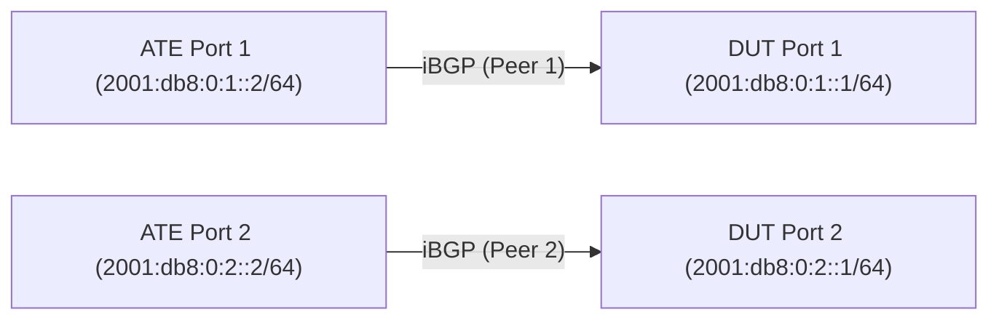

# RT-1.106: BGP RT Membership Constraints (RFC 4684)

## Summary

Validate RFC 4684 Route Target (RT) Membership Constrained Route Distribution
behavior in iBGP to prevent flooding VPN routes. Ensure the DUT only advertises
VPN routes to peers that have requested the corresponding Route Targets.

## Testbed type

*   `TESTBED_DUT_ATE_2LINKS`

## Topology



*   Connect ATE Port 1 to DUT Port 1.
*   Connect ATE Port 2 to DUT Port 2.
*   ATE will simulate iBGP peers negotiating different capabilities.
*   All iBGP sessions are transported over IPv6 using explicit point-to-point links.

## Procedure

### Configuration

1.  Configure DUT with iBGP peer group (e.g., `IBGP_PEERS`) with `auth-password`.
2.  Enable `RT_MEMBERSHIP`, `L3VPN_IPV4_UNICAST`, and `L3VPN_IPV6_UNICAST` address families for the peer group.
3.  Configure two VRFs on DUT:
    *   **VRF_100**: Export/Import RT `64496:100`, inject prefixes `198.51.100.10/32` and `2001:db8:2::10/128`.
    *   **VRF_200**: Export/Import RT `64496:200`, inject prefixes `198.51.100.20/32` and `2001:db8:2::20/128`.
4.  Setup ATE to simulate multiple iBGP peers (Simulated Peers generating VPN paths), some negotiating RT Membership and some not.

### Tests

#### RT-1.106.1 - Default RT Membership Behavior (Outbound)

*   **Step 1**: Do NOT negotiate RT Membership capability from ATE Peer 1. Ensure BGP session is ESTABLISHED using `/network-instances/network-instance/protocols/protocol/bgp/neighbors/neighbor/state/session-state`.
*   **Step 2**: Verify that DUT assumes Peer 1 is interested in ALL VPN routes (DUT generates a default RT membership route locally on behalf of Peer 1).
*   **Step 3**: Verify Peer 1 receives all exported VPN routes (`198.51.100.10/32`, `2001:db8:2::10/128` AND `198.51.100.20/32`, `2001:db8:2::20/128`). Verify using `/network-instances/network-instance/protocols/protocol/bgp/neighbors/neighbor/afi-safis/afi-safi/state/prefixes/sent` that all expected prefixes are sent to Peer 1.

#### RT-1.106.2 - Constrained Route Distribution (Outbound Filtering)

*   **Step 1**: Enable RT Membership negotiation on ATE Peer 2. Ensure BGP session is ESTABLISHED using `/network-instances/network-instance/protocols/protocol/bgp/neighbors/neighbor/state/session-state`. Verify on DUT that the RT Membership capability is active for Peer 2 using `/network-instances/network-instance/protocols/protocol/bgp/neighbors/neighbor/afi-safis/afi-safi/state/active`.
*   **Step 2**: ATE Peer 2 advertises Interest in specific Route Target `64496:100` ONLY.
*   **Step 3**: Verify DUT ONLY advertises VPN routes matching this Route Target to Peer 2 (Verify `198.51.100.10/32` and `2001:db8:2::10/128` are received). Verify using `/network-instances/network-instance/protocols/protocol/bgp/neighbors/neighbor/afi-safis/afi-safi/state/prefixes/sent` that the expected number of prefixes are sent.
*   **Step 4**: Verify DUT does NOT advertise routes with other Route Targets to Peer 2 (Verify `198.51.100.20/32` and `2001:db8:2::20/128` are NOT received). Verify using `/network-instances/network-instance/protocols/protocol/bgp/neighbors/neighbor/afi-safis/afi-safi/state/prefixes/sent` that the unexpected prefixes are NOT sent.

#### RT-1.106.3 - DUT RTC Origination (Inbound Constraints)

*   **Step 1**: Ensure DUT has `VRF_100` (Imports `64496:100`) and `VRF_200` (Imports `64496:200`) configured and active.
*   **Step 2**: Verify on ATE that it receives `RT_MEMBERSHIP` advertisements from DUT for `64496:100` and `64496:200`.
*   **Step 3**: Verify on ATE that it does **NOT** receive `RT_MEMBERSHIP` advertisements from DUT for other unconfigured Route Targets (e.g., `64496:300`).
*   **Step 4**: Verify using `/network-instances/network-instance/protocols/protocol/bgp/neighbors/neighbor/afi-safis/afi-safi/state/prefixes/received` that DUT only receives prefixes matching the advertised RTCs (assuming ATE respects the RTC advertisements).

## Canonical OC

> [!NOTE]
> `RT_MEMBERSHIP` is not yet a standard OpenConfig AFI-SAFI type enum value. It is enabled in the test procedure but omitted from this Canonical OC sample to prevent validation failures against standard schemas. See TODO below.

```json
{
  "network-instances": {
    "network-instance": [
      {
        "config": {
          "name": "DEFAULT"
        },
        "name": "DEFAULT",
        "interfaces": {
          "interface": [
            {
              "config": {
                "id": "Port1"
              },
              "id": "Port1"
            },
            {
              "config": {
                "id": "Port2"
              },
              "id": "Port2"
            }
          ]
        },
        "protocols": {
          "protocol": [
            {
              "bgp": {
                "global": {
                  "config": {
                    "as": 64496,
                    "router-id": "192.0.2.1"
                  }
                },
                "peer-groups": {
                  "peer-group": [
                    {
                      "config": {
                        "peer-group-name": "IBGP_PEERS",
                        "peer-as": 64496,
                        "auth-password": "ibgp_internal_secret"
                      },
                      "peer-group-name": "IBGP_PEERS",
                      "afi-safis": {
                        "afi-safi": [
                          {
                            "afi-safi-name": "openconfig-bgp-types:L3VPN_IPV4_UNICAST",
                            "config": {
                              "afi-safi-name": "openconfig-bgp-types:L3VPN_IPV4_UNICAST",
                              "enabled": true
                            }
                          },
                          {
                            "afi-safi-name": "openconfig-bgp-types:L3VPN_IPV6_UNICAST",
                            "config": {
                              "afi-safi-name": "openconfig-bgp-types:L3VPN_IPV6_UNICAST",
                              "enabled": true
                            }
                          }
                        ]
                      }
                    }
                  ]
                },
                "neighbors": {
                  "neighbor": [
                    {
                      "config": {
                        "neighbor-address": "2001:db8:0:1::2",
                        "peer-group": "IBGP_PEERS"
                      },
                      "neighbor-address": "2001:db8:0:1::2"
                    },
                    {
                      "config": {
                        "neighbor-address": "2001:db8:0:2::2",
                        "peer-group": "IBGP_PEERS"
                      },
                      "neighbor-address": "2001:db8:0:2::2"
                    }
                  ]
                }
              },
              "config": {
                "identifier": "BGP",
                "name": "BGP"
              },
              "identifier": "BGP",
              "name": "BGP"
            }
          ]
        }
      },
      {
        "config": {
          "name": "VRF_100",
          "type": "openconfig-network-instance-types:L3VRF",
          "route-distinguisher": "64496:100"
        },
        "name": "VRF_100",
        "inter-instance-policies": {
          "import-export-policy": {
            "config": {
              "import-route-target": [
                "64496:100"
              ],
              "export-route-target": [
                "64496:100"
              ]
            }
          }
        },
        "interfaces": {
          "interface": [
            {
              "config": {
                "id": "Loopback100"
              },
              "id": "Loopback100"
            }
          ]
        },
        "protocols": {
          "protocol": [
            {
              "bgp": {
                "global": {
                  "config": {
                    "as": 64496,
                    "router-id": "192.0.2.100"
                  }
                }
              },
              "config": {
                "identifier": "BGP",
                "name": "BGP"
              },
              "identifier": "BGP",
              "name": "BGP"
            }
          ]
        }
      },
      {
        "config": {
          "name": "VRF_200",
          "type": "openconfig-network-instance-types:L3VRF",
          "route-distinguisher": "64496:200"
        },
        "name": "VRF_200",
        "inter-instance-policies": {
          "import-export-policy": {
            "config": {
              "import-route-target": [
                "64496:200"
              ],
              "export-route-target": [
                "64496:200"
              ]
            }
          }
        },
        "interfaces": {
          "interface": [
            {
              "config": {
                "id": "Loopback200"
              },
              "id": "Loopback200"
            }
          ]
        },
        "protocols": {
          "protocol": [
            {
              "bgp": {
                "global": {
                  "config": {
                    "as": 64496,
                    "router-id": "192.0.2.200"
                  }
                }
              },
              "config": {
                "identifier": "BGP",
                "name": "BGP"
              },
              "identifier": "BGP",
              "name": "BGP"
            }
          ]
        }
      }
    ]
  },
  "interfaces": {
    "interface": [
      {
        "config": {
          "name": "Port1",
          "type": "iana-if-type:ethernetCsmacd"
        },
        "name": "Port1",
        "subinterfaces": {
          "subinterface": [
            {
              "config": {
                "index": 0
              },
              "index": 0,
              "ipv6": {
                "addresses": {
                  "address": [
                    {
                      "config": {
                        "ip": "2001:db8:0:1::1",
                        "prefix-length": 64
                      },
                      "ip": "2001:db8:0:1::1"
                    }
                  ]
                }
              }
            }
          ]
        }
      },
      {
        "config": {
          "name": "Port2",
          "type": "iana-if-type:ethernetCsmacd"
        },
        "name": "Port2",
        "subinterfaces": {
          "subinterface": [
            {
              "config": {
                "index": 0
              },
              "index": 0,
              "ipv6": {
                "addresses": {
                  "address": [
                    {
                      "config": {
                        "ip": "2001:db8:0:2::1",
                        "prefix-length": 64
                      },
                      "ip": "2001:db8:0:2::1"
                    }
                  ]
                }
              }
            }
          ]
        }
      },
      {
        "config": {
          "name": "Loopback100",
          "type": "iana-if-type:softwareLoopback"
        },
        "name": "Loopback100",
        "subinterfaces": {
          "subinterface": [
            {
              "config": {
                "index": 0
              },
              "index": 0,
              "ipv4": {
                "addresses": {
                  "address": [
                    {
                      "config": {
                        "ip": "198.51.100.10",
                        "prefix-length": 32
                      },
                      "ip": "198.51.100.10"
                    }
                  ]
                }
              },
              "ipv6": {
                "addresses": {
                  "address": [
                    {
                      "config": {
                        "ip": "2001:db8:2::10",
                        "prefix-length": 128
                      },
                      "ip": "2001:db8:2::10"
                    }
                  ]
                }
              }
            }
          ]
        }
      },
      {
        "config": {
          "name": "Loopback200",
          "type": "iana-if-type:softwareLoopback"
        },
        "name": "Loopback200",
        "subinterfaces": {
          "subinterface": [
            {
              "config": {
                "index": 0
              },
              "index": 0,
              "ipv4": {
                "addresses": {
                  "address": [
                    {
                      "config": {
                        "ip": "198.51.100.20",
                        "prefix-length": 32
                      },
                      "ip": "198.51.100.20"
                    }
                  ]
                }
              },
              "ipv6": {
                "addresses": {
                  "address": [
                    {
                      "config": {
                        "ip": "2001:db8:2::20",
                        "prefix-length": 128
                      },
                      "ip": "2001:db8:2::20"
                    }
                  ]
                }
              }
            }
          ]
        }
      }
    ]
  }
}
```

## OpenConfig Path and RPC Coverage

```yaml
paths:
  # Network Instance / VRF Config
  /network-instances/network-instance/config/name:
  /network-instances/network-instance/state/name:
  /network-instances/network-instance/config/type:
  /network-instances/network-instance/state/type:
  /network-instances/network-instance/config/route-distinguisher:
  /network-instances/network-instance/state/route-distinguisher:
  /network-instances/network-instance/inter-instance-policies/import-export-policy/config/import-route-target:
  /network-instances/network-instance/inter-instance-policies/import-export-policy/state/import-route-target:
  /network-instances/network-instance/inter-instance-policies/import-export-policy/config/export-route-target:
  /network-instances/network-instance/inter-instance-policies/import-export-policy/state/export-route-target:
  /network-instances/network-instance/interfaces/interface/config/id:
  /network-instances/network-instance/interfaces/interface/state/id:

  # Interface Config (Loopbacks/Prefix Injection)
  /interfaces/interface/config/name:
  /interfaces/interface/config/type:
  /interfaces/interface/subinterfaces/subinterface/config/index:
  /interfaces/interface/subinterfaces/subinterface/ipv4/addresses/address/config/ip:
  /interfaces/interface/subinterfaces/subinterface/ipv4/addresses/address/config/prefix-length:
  /interfaces/interface/subinterfaces/subinterface/ipv6/addresses/address/config/ip:
  /interfaces/interface/subinterfaces/subinterface/ipv6/addresses/address/config/prefix-length:

  # BGP AFI-SAFI Enablement
  /network-instances/network-instance/protocols/protocol/bgp/global/config/as:
  /network-instances/network-instance/protocols/protocol/bgp/global/config/router-id:
  /network-instances/network-instance/protocols/protocol/bgp/peer-groups/peer-group/afi-safis/afi-safi/config/enabled:
  /network-instances/network-instance/protocols/protocol/bgp/peer-groups/peer-group/afi-safis/afi-safi/state/enabled:
  /network-instances/network-instance/protocols/protocol/bgp/peer-groups/peer-group/afi-safis/afi-safi/afi-safi-name:

  # BGP Neighbor State
  /network-instances/network-instance/protocols/protocol/bgp/neighbors/neighbor/state/session-state:
  /network-instances/network-instance/protocols/protocol/bgp/neighbors/neighbor/afi-safis/afi-safi/state/active:
  /network-instances/network-instance/protocols/protocol/bgp/neighbors/neighbor/afi-safis/afi-safi/state/prefixes/sent:
  /network-instances/network-instance/protocols/protocol/bgp/neighbors/neighbor/afi-safis/afi-safi/state/prefixes/received:
  /network-instances/network-instance/protocols/protocol/bgp/neighbors/neighbor/afi-safis/afi-safi/state/prefixes/installed:

  # MD5 Auth (New in this version)
  /network-instances/network-instance/protocols/protocol/bgp/peer-groups/peer-group/config/auth-password:
  /network-instances/network-instance/protocols/protocol/bgp/peer-groups/peer-group/config/peer-as:

rpcs:
  gnmi:
    gNMI.Set:
      union_replace: true
    gNMI.Subscribe:
      on_change: true

```

## TODO

*   Request addition of `RT_MEMBERSHIP` (or `RTC`) to the standard OpenConfig `AFI_SAFI_TYPE` identities in `openconfig-bgp-types.yang` to support RFC 4684 validation natively.

## Required DUT platform

*   FFF (Fixed Form Factor) or MFF supporting RFC 4684.
