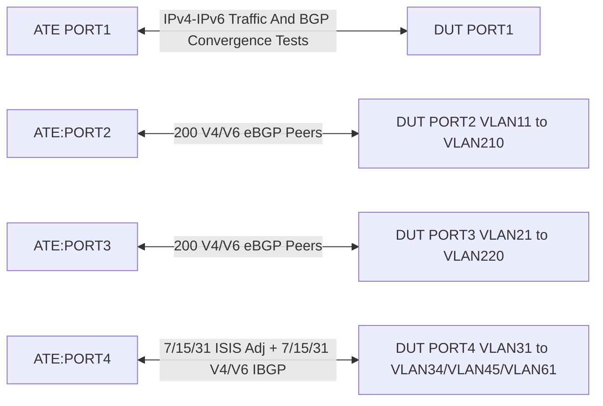

# RT-1.65: BGP scale test

## Summary

This test suite should ensure that the router will be able to handle below IS-IS
scale:

*   200-7500 v4 EBGP sessions
*   200-7500 v6 EBGP sessions
*   7-31 v4 IBGP sessions
*   7-31 v6 IBGP sessions
*   7-31 ISIS adjacencies
*   v4/v6 IBGP transport addresses received via ISIS
*   60000 x ISIS prefixes
*   1.5M IPv4 BGP prefixes; the routes are distributed across /22, /25, /24 and /30 prefix lengths
*   60k x IPv6 prefixes; the routes are distributed across /48 , /64, /126 prefix lengths
*   /25 routes are advertised with NO-ADVERTISE and 100:100 communities and redistributed into ISIS
*   multiple features enabled to ensure interaction between different features under scale conditions:
      - ebgp multipath: 64 maximum-paths
      - change default ebgp administrative distance
      - Graceful restart enabled
      - Default Hold/keepalive timers modified
      - Link bandwidth

Different scale tests to validate the router performance under different
conditions e.g steady state (no route flaps, low scale), v4/v6 EBGP sessions
scale (2 Bytes/4 Bytes AS), v4/v6 EBGP sessions and routes scale and validation
of DUT under scale condition and dynamic events; e.g routes churn, BGP peer
reset, routes withdraw/re-advertise, Altering BGP attributes.

### Testbed type

[TESTBED_DUT_ATE_4LINKS](https://github.com/openconfig/featureprofiles/blob/main/topologies/atedut_4.testbed)

### Topology


### RT-1.65.1: (Initial State 200 v4/v6 EBGP sessions, 2 Byte AS, 7 v4/v6 IBGP sessions, 7 ISIS adjacencies, no routes scale ):

*   Verification (Telemetry):
    *   Verify that all LAG port UP and all isis adjacencies are UP
    *   Verify that all EBGP/IBGP sessions established
    *   Verify that all configured BGP capabilities are negotiated
    *   Verify that no process restarted
    *   Verify that no core file generated
    *   Measure BGP convergence for both V4/V6 unicast AFI/SAFI

### RT-1.65.2: (600 v4/v6 EBGP sessions, 2Byte/4Byte ASs, 31 v4/v6 IBGP sessions, 31 ISIS adjacencies, no routes scale ):

*   Modify DUT Setup to support 600 v4/v6 EBGP sessions, 2Byte/4Byte ASs, 31 v4/v6 IBGP sessions, 31 ISIS adjacencies and no routes scale

*   Verification (Telemetry):
    *   Verify that all LAG port UP and all isis adjacencies are UP
    *   Verify that all EBGP/IBGP sessions established
    *   Verify that all configured BGP capabilities are negotiated
    *   Verify that no process restarted
    *   Verify that no core file generated
    *   Measure BGP convergence for both V4/V6 unicast AFI/SAFI

### RT-1.65.3: (600 v4/v6 EBGP sessions, 2Byte/4Byte ASs, 31 v4/v6 IBGP sessions, 31 ISIS adjacencies, v4 and v6 routes scale):

*   Modify DUT Setup to support 600 v4/v6 EBGP sessions, 2 Byte/4 Byte ASs, 31 v4/v6 IBGP sessions, 31 ISIS adjacencies and V4/V6 routes scale

*   Verification (Telemetry):
    *   Verify that all LAG port UP and all isis adjacencies are UP
    *   Verify that all EBGP/IBGP sessions established
    *   Verify that all configured BGP capabilities are negotiated
    *   Verify that no process restarted
    *   Verify that no core file generated
    *   Measure BGP convergence for both V4/V6 unicast AFI/SAFI

### RT-1.65.4: RT-1.65.3 setup + Route churn + BGP attributes modification + BGP peers reset + Routes withdrawal and re-advertise

*   Same Setup as RT-1.65.3
*   RT-1.65.4.1: Multiple iterations to reset all BGP sessions
*   RT-1.65.4.2: Multiple iterations to alter BGP attributes: Local-Preference, AS-Path length, ORIGIN
*   RT-1.65.4.3: introduce routes churn: multiple iteration to withdraw and re-advertise routes

*   Verification (Telemetry):
    *   Verify that all LAG port UP and all isis adjacencies are UP
    *   Verify that all EBGP/IBGP sessions established
    *   Verify that all configured BGP capabilities are negotiated
    *   Verify that no process restarted
    *   Verify that no core file generated
    *   Measure BGP convergence for both V4/V6 unicast AFI/SAFI

### Procedure

#### DUT Setup:

*   Connect DUT port-1, port-2, port-3 and port-4 to OTG port-1, port-2, port-3 and port-4 respectively
*   Configure OTG :
    1.   Create aggregate interface with LACP enabled
    2.   Create emulated router with Port4 ethernet interface
    3.   Add Port4 as member of AGG created in the step.1
    4.   Configure Subinterfaces to emulate 7/15/31 ISIS adjacencies
    5. Create Loopback and associate to each sub-interface
    6.   Configure ISIS on each subinterface
            *   Set ISIS System ID
            *   Set ISIS area ID
            *   Enable wide metrics
            *   Enable ISIS on the ethernet interface with Level 2 only and circuit type of point to point
            *   Create NET to advertise P2P links, /25, /64 prefixes into ISIS
    7. Configure EBGP session on all sub-interfaces that belong to Ports 1-3
        Number of SubInterfaces is part of Port's attributes to define
        the target scale. Below steps are repeated for each subInterface:
            *   Set Router ID
            *   Set EBGP session Type
            *   Enable Graceful Restart
            *   Enable Hold/Keepalive Timers
            *   Enable IPv4/v6 AFI/SAFI
            *   Set Peer Address
            * Enable learning routes from DUT for EBGP session used to measure the convergence
            *   Create NET to advertise EBGP routes: /30, /22, /25, /64, 126 prefixes. BGP attributes will be associated to each of the routes
    8. Configure IBGP session on all loopbacks addresses advertised via ISIS:
            *   Set Router ID
            *   Set IBGP session Type
            *   Enable Graceful Restart
            *   Enable Hold/Keepalive Timers
            *   Enable IPv4/v6 AFI/SAFI
            *   Set Peer Address (DUT loopback)
            *   Create NET to advertise IBGP routes: /22, /25, /64 prefixes. BGP attributes will be associated to each of the routes

    9. Create IPv4 Flows from Port1 to `ipv4Traffic` list generated as part of prefixes advertised via BGP
            *   172.30.252.0 - 172.30.252.100 + tcp ports 12345 - 12545
            *   172.31.252.0 - 172.31.252.100 + tcp ports 12345 - 12545
            *   173.30.252.0 - 173.30.252.100 + tcp ports 12345 - 12545
            *   173.31.252.0 - 173.31.252.100 + tcp ports 12345 - 12545


    10. Create IPv6 Flows from Agg2 to the below ranges
            *   2001:db8:2:118::1 - 2001:db8:2:118::64 + tcp ports 12345 - 12545
            *   2001:db8:2:119::1 - 2001:db8:2:119::64 + tcp ports 12345 - 12545
            *   fc00:abcd:2::1919:1 - fc00:abcd:2::1919:64 + tcp ports 12345 - 12545
            *   2001:db8:3:118::1 - 2001:db8:3:118::64 + tcp ports 12345 - 12545
            *   2001:db8:3:119::1 - 2001:db8:3:119::64 + tcp ports 12345 - 12545
            *   fc00:abcd:3::1919:1 - fc00:abcd:3::1919:64 + tcp ports 12345 - 12545
    11. Push configuration to OTG
*   Configure DUT:
    1.  Configure the DUT loopback and push path to DUT. this step will handle cases where DUT is already provisioned with a Loopback
    2.  Configure the default network instance and push path to DUT
    3. Configure BGP policies:
            *   IBGP_IN/IBGP_OUT policies for IBGP sessions
            *   ALLOW policy for EBGP session
    4.  Create an LAG interface set the interface IP address and LACP and push path to DUT
    5.  Create a LAG's member.
    6.  Create SubInterfaces to scale v4/v6 EBGP sessions
    7.  Configure ISIS for DUT :
            *   Create ISIS instance under the default routing instance
            *   Set ISIS net address (area ID + System ID)
            *   Set ISIS level capability to level 2 only
            *   Set metric style to wide
            *   Enable IPv4-unicast and IPv6-unicast address families.
            *   Enable ISIS on the Loopback and the  LAG's subInterfaces (7/15/31).
            *   Create BGP_TO_ISIS policy
            *   Export policy to redistribute EBGP routes tagged with communities 100:100/NO-ADVERTISE into ISIS. those /25 routes summarize PNH used to recursive lookup BGP routes.
            *   Push the configuration to the DUT.
    8.  Configure BGP for DUT :
            *   Create BGP instance under the default routing instance
            *   Set Router ID
            *   Set DUT global AS
            *   Enable EBGP AllowMultipathAS
            *   Enable GracefulRestart and set RestartTimer/StaleRouteTimer
            *   Enable V4/V6 Uncast AFI/SAFI families
            *   Enable EBGP administrative distance/Route Preference
            *   Set EBGP maximum-paths to 64
            *   Create EBGP/IBGP groups: 2 IBGP groups and set of EBGP groups
                depending on EBGP scale
                Every 4 subinterfaces will belong to same EBGP group and share
                same properties and will receive same set of EBGP routes
            *   Set BGP Peer AS (both 2 Bytes and 4 bytes will be considered)
            *   Set Import/Export policy per BGP group's type (EBGP vs IBGP)
            *   Set BGP group's description
            *   Enable SendCommunity
            *   Set Transport Address for v4/v6 IBGP groups
            *   link BGP peers to associated BGP groups
*   Start protocols on OTG
*   Wait for 1 min then confirm that DUT has:
    1. 7/15/31 ISIS adjacencies up.
    2. 200-7500 EBGP session are up.
    3. 7-31 IBGP session are up.

#### Testing steps

*   Measure IPv4/v6 BGP Convergence
*   Collect the below states from the DUT :
    1.  Count of UP ISIS adjacencies
    2.  Count of UP V4 BGP sessions
    3. Count of UP V6 BGP sessions
    4.  Count of BGP IPv4 routes advertised to Port1
    5.  Count of BGP IPv6 routes advertised to Port1
*   Start traffic flows
*   Wait for 2 mins
*   Stop traffic flows
*   Collect the number of RX and TX traffic flows packets

#### Test pass fail criteria

*   If any of the below conditions are not met test should be declared as a "FAIL"
    1.  Count of ISIS adjacencies in the "UP" state is less than 7/15/31
    2.  Count of any of the below metrics was not equal to the below values :
        a. v4 BGP sessions = 200-7500 + 7/15/31 + 1
           (The number of v4 BGP sessions is the sum of eBGP sessions (from 200
           to 7500), iBGP sessions (7, 15, or 31), and one session for
           convergence measurement)
        b. v6 BGP sessions = 200-7500 + 7/15/31 + 1
        c. BGP capabilities successfully negotiated
        d. BGP routes successfully reflected to Port1's v4/v6 EBGP sessions
    3.  Number of TX packets is not equal to RX packets.
    4. No critical process restarted during the test
    5. No core file generated during the test

## Canonical OC

```json
{
  "openconfig-network-instance:bgp": {
    "global": {
      "afi-safis": {
        "afi-safi": [
          {
            "add-paths": {
              "config": {
                "receive": false,
                "send": false
              }
            },
            "afi-safi-name": "openconfig-bgp-types:IPV4_UNICAST",
            "config": {
              "afi-safi-name": "openconfig-bgp-types:IPV4_UNICAST",
              "enabled": true
            },
            "route-selection-options": {
              "config": {
                "ignore-next-hop-igp-metric": false
              }
            },
            "use-multiple-paths": {
              "config": {
                "enabled": false
              },
              "ebgp": {
                "config": {
                  "maximum-paths": 64
                }
              },
              "ibgp": {
                "config": {
                  "maximum-paths": 1
                }
              }
            }
          },
          {
            "add-paths": {
              "config": {
                "receive": false,
                "send": false
              }
            },
            "afi-safi-name": "openconfig-bgp-types:IPV6_UNICAST",
            "config": {
              "afi-safi-name": "openconfig-bgp-types:IPV6_UNICAST",
              "enabled": true
            },
            "route-selection-options": {
              "config": {
                "ignore-next-hop-igp-metric": false
              }
            },
            "use-multiple-paths": {
              "config": {
                "enabled": false
              },
              "ebgp": {
                "config": {
                  "maximum-paths": 64
                }
              },
              "ibgp": {
                "config": {
                  "maximum-paths": 1
                }
              }
            }
          }
        ]
      },
      "config": {
        "as": 64500,
        "router-id": "44.44.44.44"
      },
      "default-route-distance": {
        "config": {
          "external-route-distance": 9
        }
      },
      "graceful-restart": {
        "config": {
          "enabled": true,
          "restart-time": 120,
          "stale-routes-time": 300
        }
      },
      "route-selection-options": {
        "config": {
          "always-compare-med": false,
          "external-compare-router-id": true,
          "ignore-as-path-length": false,
          "ignore-next-hop-igp-metric": false
        }
      },
      "use-multiple-paths": {
        "ebgp": {
          "config": {
            "allow-multiple-as": true
          }
        }
      }
    },
    "neighbors": {
      "neighbor": [
        {
          "afi-safis": {
            "afi-safi": [
              {
                "add-paths": {
                  "config": {
                    "receive": false,
                    "send": false
                  }
                },
                "afi-safi-name": "openconfig-bgp-types:IPV4_UNICAST",
                "config": {
                  "afi-safi-name": "openconfig-bgp-types:IPV4_UNICAST",
                  "enabled": false
                },
                "ipv4-labeled-unicast": {
                  "prefix-limit": {
                    "config": {
                      "prevent-teardown": false
                    }
                  }
                },
                "ipv4-unicast": {
                  "config": {
                    "send-default-route": false
                  },
                  "prefix-limit": {
                    "config": {
                      "prevent-teardown": false
                    }
                  }
                },
                "ipv6-labeled-unicast": {
                  "prefix-limit": {
                    "config": {
                      "prevent-teardown": false
                    }
                  }
                },
                "ipv6-unicast": {
                  "config": {
                    "send-default-route": false
                  },
                  "prefix-limit": {
                    "config": {
                      "prevent-teardown": false
                    }
                  }
                },
                "l2vpn-evpn": {
                  "prefix-limit": {
                    "config": {
                      "prevent-teardown": false
                    }
                  }
                },
                "l2vpn-vpls": {
                  "prefix-limit": {
                    "config": {
                      "prevent-teardown": false
                    }
                  }
                },
                "l3vpn-ipv4-multicast": {
                  "prefix-limit": {
                    "config": {
                      "prevent-teardown": false
                    }
                  }
                },
                "l3vpn-ipv4-unicast": {
                  "prefix-limit": {
                    "config": {
                      "prevent-teardown": false
                    }
                  }
                },
                "l3vpn-ipv6-multicast": {
                  "prefix-limit": {
                    "config": {
                      "prevent-teardown": false
                    }
                  }
                },
                "l3vpn-ipv6-unicast": {
                  "prefix-limit": {
                    "config": {
                      "prevent-teardown": false
                    }
                  }
                },
                "srte-policy-ipv4": {
                  "prefix-limit": {
                    "config": {
                      "prevent-teardown": false
                    }
                  }
                },
                "srte-policy-ipv6": {
                  "prefix-limit": {
                    "config": {
                      "prevent-teardown": false
                    }
                  }
                },
                "use-multiple-paths": {
                  "config": {
                    "enabled": false
                  }
                }
              },
              {
                "add-paths": {
                  "config": {
                    "receive": false,
                    "send": false
                  }
                },
                "afi-safi-name": "openconfig-bgp-types:IPV6_UNICAST",
                "apply-policy": {
                  "config": {
                    "export-policy": [
                      "ALLOW"
                    ],
                    "import-policy": [
                      "ALLOW"
                    ]
                  }
                },
                "config": {
                  "afi-safi-name": "openconfig-bgp-types:IPV6_UNICAST",
                  "enabled": true
                },
                "ipv4-labeled-unicast": {
                  "prefix-limit": {
                    "config": {
                      "prevent-teardown": false
                    }
                  }
                },
                "ipv4-unicast": {
                  "config": {
                    "send-default-route": false
                  },
                  "prefix-limit": {
                    "config": {
                      "prevent-teardown": false
                    }
                  }
                },
                "ipv6-labeled-unicast": {
                  "prefix-limit": {
                    "config": {
                      "prevent-teardown": false
                    }
                  }
                },
                "ipv6-unicast": {
                  "config": {
                    "send-default-route": false
                  },
                  "prefix-limit": {
                    "config": {
                      "prevent-teardown": false
                    }
                  }
                },
                "l2vpn-evpn": {
                  "prefix-limit": {
                    "config": {
                      "prevent-teardown": false
                    }
                  }
                },
                "l2vpn-vpls": {
                  "prefix-limit": {
                    "config": {
                      "prevent-teardown": false
                    }
                  }
                },
                "l3vpn-ipv4-multicast": {
                  "prefix-limit": {
                    "config": {
                      "prevent-teardown": false
                    }
                  }
                },
                "l3vpn-ipv4-unicast": {
                  "prefix-limit": {
                    "config": {
                      "prevent-teardown": false
                    }
                  }
                },
                "l3vpn-ipv6-multicast": {
                  "prefix-limit": {
                    "config": {
                      "prevent-teardown": false
                    }
                  }
                },
                "l3vpn-ipv6-unicast": {
                  "prefix-limit": {
                    "config": {
                      "prevent-teardown": false
                    }
                  }
                },
                "srte-policy-ipv4": {
                  "prefix-limit": {
                    "config": {
                      "prevent-teardown": false
                    }
                  }
                },
                "srte-policy-ipv6": {
                  "prefix-limit": {
                    "config": {
                      "prevent-teardown": false
                    }
                  }
                },
                "use-multiple-paths": {
                  "config": {
                    "enabled": false
                  }
                }
              }
            ]
          },
          "apply-policy": {
            "config": {
              "default-export-policy": "REJECT_ROUTE",
              "default-import-policy": "REJECT_ROUTE"
            }
          },
          "as-path-options": {
            "config": {
              "allow-own-as": 0,
              "disable-peer-as-filter": false,
              "replace-peer-as": false
            }
          },
          "config": {
            "enabled": true,
            "neighbor-address": "1000:1:11:0:50:1:1:2",
            "peer-as": 800101,
            "peer-group": "BGP-PEER-GROUP-V62-1",
            "route-flap-damping": false,
            "send-community": "NONE"
          },
          "ebgp-multihop": {
            "config": {
              "enabled": false
            }
          },
          "error-handling": {
            "config": {
              "treat-as-withdraw": false
            }
          },
          "logging-options": {
            "config": {
              "log-neighbor-state-changes": true
            }
          },
          "neighbor-address": "1000:1:11:0:50:1:1:2",
          "route-reflector": {
            "config": {
              "route-reflector-client": false
            }
          },
          "timers": {
            "config": {
              "hold-time": 90,
              "keepalive-interval": 30,
              "minimum-advertisement-interval": 30
            }
          },
          "transport": {
            "config": {
              "mtu-discovery": false,
              "passive-mode": false
            }
          }
        },
        {
          "afi-safis": {
            "afi-safi": [
              {
                "add-paths": {
                  "config": {
                    "receive": false,
                    "send": false
                  }
                },
                "afi-safi-name": "openconfig-bgp-types:IPV4_UNICAST",
                "config": {
                  "afi-safi-name": "openconfig-bgp-types:IPV4_UNICAST",
                  "enabled": false
                },
                "ipv4-labeled-unicast": {
                  "prefix-limit": {
                    "config": {
                      "prevent-teardown": false
                    }
                  }
                },
                "ipv4-unicast": {
                  "config": {
                    "send-default-route": false
                  },
                  "prefix-limit": {
                    "config": {
                      "prevent-teardown": false
                    }
                  }
                },
                "ipv6-labeled-unicast": {
                  "prefix-limit": {
                    "config": {
                      "prevent-teardown": false
                    }
                  }
                },
                "ipv6-unicast": {
                  "config": {
                    "send-default-route": false
                  },
                  "prefix-limit": {
                    "config": {
                      "prevent-teardown": false
                    }
                  }
                },
                "l2vpn-evpn": {
                  "prefix-limit": {
                    "config": {
                      "prevent-teardown": false
                    }
                  }
                },
                "l2vpn-vpls": {
                  "prefix-limit": {
                    "config": {
                      "prevent-teardown": false
                    }
                  }
                },
                "l3vpn-ipv4-multicast": {
                  "prefix-limit": {
                    "config": {
                      "prevent-teardown": false
                    }
                  }
                },
                "l3vpn-ipv4-unicast": {
                  "prefix-limit": {
                    "config": {
                      "prevent-teardown": false
                    }
                  }
                },
                "l3vpn-ipv6-multicast": {
                  "prefix-limit": {
                    "config": {
                      "prevent-teardown": false
                    }
                  }
                },
                "l3vpn-ipv6-unicast": {
                  "prefix-limit": {
                    "config": {
                      "prevent-teardown": false
                    }
                  }
                },
                "srte-policy-ipv4": {
                  "prefix-limit": {
                    "config": {
                      "prevent-teardown": false
                    }
                  }
                },
                "srte-policy-ipv6": {
                  "prefix-limit": {
                    "config": {
                      "prevent-teardown": false
                    }
                  }
                },
                "use-multiple-paths": {
                  "config": {
                    "enabled": false
                  }
                }
              },
              {
                "add-paths": {
                  "config": {
                    "receive": false,
                    "send": false
                  }
                },
                "afi-safi-name": "openconfig-bgp-types:IPV6_UNICAST",
                "apply-policy": {
                  "config": {
                    "export-policy": [
                      "ALLOW"
                    ],
                    "import-policy": [
                      "ALLOW"
                    ]
                  }
                },
                "config": {
                  "afi-safi-name": "openconfig-bgp-types:IPV6_UNICAST",
                  "enabled": true
                },
                "ipv4-labeled-unicast": {
                  "prefix-limit": {
                    "config": {
                      "prevent-teardown": false
                    }
                  }
                },
                "ipv4-unicast": {
                  "config": {
                    "send-default-route": false
                  },
                  "prefix-limit": {
                    "config": {
                      "prevent-teardown": false
                    }
                  }
                },
                "ipv6-labeled-unicast": {
                  "prefix-limit": {
                    "config": {
                      "prevent-teardown": false
                    }
                  }
                },
                "ipv6-unicast": {
                  "config": {
                    "send-default-route": false
                  },
                  "prefix-limit": {
                    "config": {
                      "prevent-teardown": false
                    }
                  }
                },
                "l2vpn-evpn": {
                  "prefix-limit": {
                    "config": {
                      "prevent-teardown": false
                    }
                  }
                },
                "l2vpn-vpls": {
                  "prefix-limit": {
                    "config": {
                      "prevent-teardown": false
                    }
                  }
                },
                "l3vpn-ipv4-multicast": {
                  "prefix-limit": {
                    "config": {
                      "prevent-teardown": false
                    }
                  }
                },
                "l3vpn-ipv4-unicast": {
                  "prefix-limit": {
                    "config": {
                      "prevent-teardown": false
                    }
                  }
                },
                "l3vpn-ipv6-multicast": {
                  "prefix-limit": {
                    "config": {
                      "prevent-teardown": false
                    }
                  }
                },
                "l3vpn-ipv6-unicast": {
                  "prefix-limit": {
                    "config": {
                      "prevent-teardown": false
                    }
                  }
                },
                "srte-policy-ipv4": {
                  "prefix-limit": {
                    "config": {
                      "prevent-teardown": false
                    }
                  }
                },
                "srte-policy-ipv6": {
                  "prefix-limit": {
                    "config": {
                      "prevent-teardown": false
                    }
                  }
                },
                "use-multiple-paths": {
                  "config": {
                    "enabled": false
                  }
                }
              }
            ]
          },
          "apply-policy": {
            "config": {
              "default-export-policy": "REJECT_ROUTE",
              "default-import-policy": "REJECT_ROUTE"
            }
          },
          "as-path-options": {
            "config": {
              "allow-own-as": 0,
              "disable-peer-as-filter": false,
              "replace-peer-as": false
            }
          },


          "config": {
            "enabled": true,
            "neighbor-address": "192.0.2.2",
            "peer-as": 800100,
            "peer-group": "BGP-PEER-GROUP-V41",
            "route-flap-damping": false,
            "send-community": "NONE"
          },
          "ebgp-multihop": {
            "config": {
              "enabled": false
            }
          },
          "error-handling": {
            "config": {
              "treat-as-withdraw": false
            }
          },
          "logging-options": {
            "config": {
              "log-neighbor-state-changes": true
            }
          },
          "neighbor-address": "192.0.2.2",
          "route-reflector": {
            "config": {
              "route-reflector-client": false
            }
          },
          "timers": {
            "config": {
              "hold-time": 90,
              "keepalive-interval": 30,
              "minimum-advertisement-interval": 30
            }
          },
          "transport": {
            "config": {
              "mtu-discovery": false,
              "passive-mode": false
            }
          }
        },
        {
          "afi-safis": {
            "afi-safi": [
              {
                "add-paths": {
                  "config": {
                    "receive": false,
                    "send": false
                  }
                },
                "afi-safi-name": "openconfig-bgp-types:IPV4_UNICAST",
                "config": {
                  "afi-safi-name": "openconfig-bgp-types:IPV4_UNICAST",
                  "enabled": false
                },
                "ipv4-labeled-unicast": {
                  "prefix-limit": {
                    "config": {
                      "prevent-teardown": false
                    }
                  }
                },
                "ipv4-unicast": {
                  "config": {
                    "send-default-route": false
                  },
                  "prefix-limit": {
                    "config": {
                      "prevent-teardown": false
                    }
                  }
                },
                "ipv6-labeled-unicast": {
                  "prefix-limit": {
                    "config": {
                      "prevent-teardown": false
                    }
                  }
                },
                "ipv6-unicast": {
                  "config": {
                    "send-default-route": false
                  },
                  "prefix-limit": {
                    "config": {
                      "prevent-teardown": false
                    }
                  }
                },
                "l2vpn-evpn": {
                  "prefix-limit": {
                    "config": {
                      "prevent-teardown": false
                    }
                  }
                },
                "l2vpn-vpls": {
                  "prefix-limit": {
                    "config": {
                      "prevent-teardown": false
                    }
                  }
                },
                "l3vpn-ipv4-multicast": {
                  "prefix-limit": {
                    "config": {
                      "prevent-teardown": false
                    }
                  }
                },
                "l3vpn-ipv4-unicast": {
                  "prefix-limit": {
                    "config": {
                      "prevent-teardown": false
                    }
                  }
                },
                "l3vpn-ipv6-multicast": {
                  "prefix-limit": {
                    "config": {
                      "prevent-teardown": false
                    }
                  }
                },
                "l3vpn-ipv6-unicast": {
                  "prefix-limit": {
                    "config": {
                      "prevent-teardown": false
                    }
                  }
                },
                "srte-policy-ipv4": {
                  "prefix-limit": {
                    "config": {
                      "prevent-teardown": false
                    }
                  }
                },
                "srte-policy-ipv6": {
                  "prefix-limit": {
                    "config": {
                      "prevent-teardown": false
                    }
                  }
                },
                "use-multiple-paths": {
                  "config": {
                    "enabled": false
                  }
                }
              },
              {
                "add-paths": {
                  "config": {
                    "receive": false,
                    "send": false
                  }
                },
                "afi-safi-name": "openconfig-bgp-types:IPV6_UNICAST",
                "apply-policy": {
                  "config": {
                    "export-policy": [
                      "ALLOW"
                    ],
                    "import-policy": [
                      "ALLOW"
                    ]
                  }
                },
                "config": {
                  "afi-safi-name": "openconfig-bgp-types:IPV6_UNICAST",
                  "enabled": true
                },
                "ipv4-labeled-unicast": {
                  "prefix-limit": {
                    "config": {
                      "prevent-teardown": false
                    }
                  }
                },
                "ipv4-unicast": {
                  "config": {
                    "send-default-route": false
                  },
                  "prefix-limit": {
                    "config": {
                      "prevent-teardown": false
                    }
                  }
                },
                "ipv6-labeled-unicast": {
                  "prefix-limit": {
                    "config": {
                      "prevent-teardown": false
                    }
                  }
                },
                "ipv6-unicast": {
                  "config": {
                    "send-default-route": false
                  },
                  "prefix-limit": {
                    "config": {
                      "prevent-teardown": false
                    }
                  }
                },
                "l2vpn-evpn": {
                  "prefix-limit": {
                    "config": {
                      "prevent-teardown": false
                    }
                  }
                },
                "l2vpn-vpls": {
                  "prefix-limit": {
                    "config": {
                      "prevent-teardown": false
                    }
                  }
                },
                "l3vpn-ipv4-multicast": {
                  "prefix-limit": {
                    "config": {
                      "prevent-teardown": false
                    }
                  }
                },
                "l3vpn-ipv4-unicast": {
                  "prefix-limit": {
                    "config": {
                      "prevent-teardown": false
                    }
                  }
                },
                "l3vpn-ipv6-multicast": {
                  "prefix-limit": {
                    "config": {
                      "prevent-teardown": false
                    }
                  }
                },
                "l3vpn-ipv6-unicast": {
                  "prefix-limit": {
                    "config": {
                      "prevent-teardown": false
                    }
                  }
                },
                "srte-policy-ipv4": {
                  "prefix-limit": {
                    "config": {
                      "prevent-teardown": false
                    }
                  }
                },
                "srte-policy-ipv6": {
                  "prefix-limit": {
                    "config": {
                      "prevent-teardown": false
                    }
                  }
                },
                "use-multiple-paths": {
                  "config": {
                    "enabled": false
                  }
                }
              }
            ]
          },
          "apply-policy": {
            "config": {
              "default-export-policy": "REJECT_ROUTE",
              "default-import-policy": "REJECT_ROUTE"
            }
          },
          "as-path-options": {
            "config": {
              "allow-own-as": 0,
              "disable-peer-as-filter": false,
              "replace-peer-as": false
            }
          },
          "config": {
            "enabled": true,
            "neighbor-address": "2001:db8::192:0:2:2",
            "peer-as": 800100,
            "peer-group": "BGP-PEER-GROUP-V61",
            "route-flap-damping": false,
            "send-community": "NONE"
          },
          "ebgp-multihop": {
            "config": {
              "enabled": false
            }
          },
          "error-handling": {
            "config": {
              "treat-as-withdraw": false
            }
          },
          "logging-options": {
            "config": {
              "log-neighbor-state-changes": true
            }
          },
          "neighbor-address": "2001:db8::192:0:2:2",
          "route-reflector": {
            "config": {
              "route-reflector-client": false
            }
          },
          "timers": {
            "config": {
              "hold-time": 90,
              "keepalive-interval": 30,
              "minimum-advertisement-interval": 30
            }
          },
          "transport": {
            "config": {
              "mtu-discovery": false,
              "passive-mode": false
            }
          }
        },
        {
          "afi-safis": {
            "afi-safi": [
              {
                "add-paths": {
                  "config": {
                    "receive": false,
                    "send": false
                  }
                },
                "afi-safi-name": "openconfig-bgp-types:IPV4_UNICAST",
                "config": {
                  "afi-safi-name": "openconfig-bgp-types:IPV4_UNICAST",
                  "enabled": false
                },
                "ipv4-labeled-unicast": {
                  "prefix-limit": {
                    "config": {
                      "prevent-teardown": false
                    }
                  }
                },
                "ipv4-unicast": {
                  "config": {
                    "send-default-route": false
                  },
                  "prefix-limit": {
                    "config": {
                      "prevent-teardown": false
                    }
                  }
                },
                "ipv6-labeled-unicast": {
                  "prefix-limit": {
                    "config": {
                      "prevent-teardown": false
                    }
                  }
                },
                "ipv6-unicast": {
                  "config": {
                    "send-default-route": false
                  },
                  "prefix-limit": {
                    "config": {
                      "prevent-teardown": false
                    }
                  }
                },
                "l2vpn-evpn": {
                  "prefix-limit": {
                    "config": {
                      "prevent-teardown": false
                    }
                  }
                },
                "l2vpn-vpls": {
                  "prefix-limit": {
                    "config": {
                      "prevent-teardown": false
                    }
                  }
                },
                "l3vpn-ipv4-multicast": {
                  "prefix-limit": {
                    "config": {
                      "prevent-teardown": false
                    }
                  }
                },
                "l3vpn-ipv4-unicast": {
                  "prefix-limit": {
                    "config": {
                      "prevent-teardown": false
                    }
                  }
                },
                "l3vpn-ipv6-multicast": {
                  "prefix-limit": {
                    "config": {
                      "prevent-teardown": false
                    }
                  }
                },
                "l3vpn-ipv6-unicast": {
                  "prefix-limit": {
                    "config": {
                      "prevent-teardown": false
                    }
                  }
                },
                "srte-policy-ipv4": {
                  "prefix-limit": {
                    "config": {
                      "prevent-teardown": false
                    }
                  }
                },
                "srte-policy-ipv6": {
                  "prefix-limit": {
                    "config": {
                      "prevent-teardown": false
                    }
                  }
                },
                "use-multiple-paths": {
                  "config": {
                    "enabled": false
                  }
                }
              },
              {
                "add-paths": {
                  "config": {
                    "receive": false,
                    "send": false
                  }
                },
                "afi-safi-name": "openconfig-bgp-types:IPV6_UNICAST",
                "apply-policy": {
                  "config": {
                    "export-policy": [
                      "IBGP-OUT"
                    ],
                    "import-policy": [
                      "IBGP-IN"
                    ]
                  }
                },
                "config": {
                  "afi-safi-name": "openconfig-bgp-types:IPV6_UNICAST",
                  "enabled": true
                },
                "ipv4-labeled-unicast": {
                  "prefix-limit": {
                    "config": {
                      "prevent-teardown": false
                    }
                  }
                },
                "ipv4-unicast": {
                  "config": {
                    "send-default-route": false
                  },
                  "prefix-limit": {
                    "config": {
                      "prevent-teardown": false
                    }
                  }
                },
                "ipv6-labeled-unicast": {
                  "prefix-limit": {
                    "config": {
                      "prevent-teardown": false
                    }
                  }
                },
                "ipv6-unicast": {
                  "config": {
                    "send-default-route": false
                  },
                  "prefix-limit": {
                    "config": {
                      "prevent-teardown": false
                    }
                  }
                },
                "l2vpn-evpn": {
                  "prefix-limit": {
                    "config": {
                      "prevent-teardown": false
                    }
                  }
                },
                "l2vpn-vpls": {
                  "prefix-limit": {
                    "config": {
                      "prevent-teardown": false
                    }
                  }
                },
                "l3vpn-ipv4-multicast": {
                  "prefix-limit": {
                    "config": {
                      "prevent-teardown": false
                    }
                  }
                },
                "l3vpn-ipv4-unicast": {
                  "prefix-limit": {
                    "config": {
                      "prevent-teardown": false
                    }
                  }
                },
                "l3vpn-ipv6-multicast": {
                  "prefix-limit": {
                    "config": {
                      "prevent-teardown": false
                    }
                  }
                },
                "l3vpn-ipv6-unicast": {
                  "prefix-limit": {
                    "config": {
                      "prevent-teardown": false
                    }
                  }
                },
                "srte-policy-ipv4": {
                  "prefix-limit": {
                    "config": {
                      "prevent-teardown": false
                    }
                  }
                },
                "srte-policy-ipv6": {
                  "prefix-limit": {
                    "config": {
                      "prevent-teardown": false
                    }
                  }
                },
                "use-multiple-paths": {
                  "config": {
                    "enabled": false
                  }
                }
              }
            ]
          },
          "apply-policy": {
            "config": {
              "default-export-policy": "REJECT_ROUTE",
              "default-import-policy": "REJECT_ROUTE"
            }
          },
          "as-path-options": {
            "config": {
              "allow-own-as": 0,
              "disable-peer-as-filter": false,
              "replace-peer-as": false
            }
          },      
          "config": {
            "enabled": true,
            "neighbor-address": "2001:db8::203:0:113:1",
            "peer-as": 64500,
            "peer-group": "BGP-RR-GROUP-V6",
            "route-flap-damping": false,
            "send-community": "NONE"
          },
          "ebgp-multihop": {
            "config": {
              "enabled": false
            }
          },
          "error-handling": {
            "config": {
              "treat-as-withdraw": false
            }
          },
          "logging-options": {
            "config": {
              "log-neighbor-state-changes": true
            }
          },
          "neighbor-address": "2001:db8::203:0:113:1",
          "route-reflector": {
            "config": {
              "route-reflector-client": false
            }
          },
          "timers": {
            "config": {
              "hold-time": 90,
              "keepalive-interval": 30,
              "minimum-advertisement-interval": 30
            }
          },
          "transport": {
            "config": {
              "mtu-discovery": false,
              "passive-mode": false
            }
          }
        },
        {
          "afi-safis": {
            "afi-safi": [
              {
                "add-paths": {
                  "config": {
                    "receive": false,
                    "send": false
                  }
                },
                "afi-safi-name": "openconfig-bgp-types:IPV4_UNICAST",
                "config": {
                  "afi-safi-name": "openconfig-bgp-types:IPV4_UNICAST",
                  "enabled": false
                },
                "ipv4-labeled-unicast": {
                  "prefix-limit": {
                    "config": {
                      "prevent-teardown": false
                    }
                  }
                },
                "ipv4-unicast": {
                  "config": {
                    "send-default-route": false
                  },
                  "prefix-limit": {
                    "config": {
                      "prevent-teardown": false
                    }
                  }
                },
                "ipv6-labeled-unicast": {
                  "prefix-limit": {
                    "config": {
                      "prevent-teardown": false
                    }
                  }
                },
                "ipv6-unicast": {
                  "config": {
                    "send-default-route": false
                  },
                  "prefix-limit": {
                    "config": {
                      "prevent-teardown": false
                    }
                  }
                },
                "l2vpn-evpn": {
                  "prefix-limit": {
                    "config": {
                      "prevent-teardown": false
                    }
                  }
                },
                "l2vpn-vpls": {
                  "prefix-limit": {
                    "config": {
                      "prevent-teardown": false
                    }
                  }
                },
                "l3vpn-ipv4-multicast": {
                  "prefix-limit": {
                    "config": {
                      "prevent-teardown": false
                    }
                  }
                },
                "l3vpn-ipv4-unicast": {
                  "prefix-limit": {
                    "config": {
                      "prevent-teardown": false
                    }
                  }
                },
                "l3vpn-ipv6-multicast": {
                  "prefix-limit": {
                    "config": {
                      "prevent-teardown": false
                    }
                  }
                },
                "l3vpn-ipv6-unicast": {
                  "prefix-limit": {
                    "config": {
                      "prevent-teardown": false
                    }
                  }
                },
                "srte-policy-ipv4": {
                  "prefix-limit": {
                    "config": {
                      "prevent-teardown": false
                    }
                  }
                },
                "srte-policy-ipv6": {
                  "prefix-limit": {
                    "config": {
                      "prevent-teardown": false
                    }
                  }
                },
                "use-multiple-paths": {
                  "config": {
                    "enabled": false
                  }
                }
              },
              {
                "add-paths": {
                  "config": {
                    "receive": false,
                    "send": false
                  }
                },
                "afi-safi-name": "openconfig-bgp-types:IPV6_UNICAST",
                "apply-policy": {
                  "config": {
                    "export-policy": [
                      "IBGP-OUT"
                    ],
                    "import-policy": [
                      "IBGP-IN"
                    ]
                  }
                },
                "config": {
                  "afi-safi-name": "openconfig-bgp-types:IPV6_UNICAST",
                  "enabled": true
                },
                "ipv4-labeled-unicast": {
                  "prefix-limit": {
                    "config": {
                      "prevent-teardown": false
                    }
                  }
                },
                "ipv4-unicast": {
                  "config": {
                    "send-default-route": false
                  },
                  "prefix-limit": {
                    "config": {
                      "prevent-teardown": false
                    }
                  }
                },
                "ipv6-labeled-unicast": {
                  "prefix-limit": {
                    "config": {
                      "prevent-teardown": false
                    }
                  }
                },
                "ipv6-unicast": {
                  "config": {
                    "send-default-route": false
                  },
                  "prefix-limit": {
                    "config": {
                      "prevent-teardown": false
                    }
                  }
                },
                "l2vpn-evpn": {
                  "prefix-limit": {
                    "config": {
                      "prevent-teardown": false
                    }
                  }
                },
                "l2vpn-vpls": {
                  "prefix-limit": {
                    "config": {
                      "prevent-teardown": false
                    }
                  }
                },
                "l3vpn-ipv4-multicast": {
                  "prefix-limit": {
                    "config": {
                      "prevent-teardown": false
                    }
                  }
                },
                "l3vpn-ipv4-unicast": {
                  "prefix-limit": {
                    "config": {
                      "prevent-teardown": false
                    }
                  }
                },
                "l3vpn-ipv6-multicast": {
                  "prefix-limit": {
                    "config": {
                      "prevent-teardown": false
                    }
                  }
                },
                "l3vpn-ipv6-unicast": {
                  "prefix-limit": {
                    "config": {
                      "prevent-teardown": false
                    }
                  }
                },
                "srte-policy-ipv4": {
                  "prefix-limit": {
                    "config": {
                      "prevent-teardown": false
                    }
                  }
                },
                "srte-policy-ipv6": {
                  "prefix-limit": {
                    "config": {
                      "prevent-teardown": false
                    }
                  }
                },
                "use-multiple-paths": {
                  "config": {
                    "enabled": false
                  }
                }
              }
            ]
          },
          "apply-policy": {
            "config": {
              "default-export-policy": "REJECT_ROUTE",
              "default-import-policy": "REJECT_ROUTE"
            }
          },
          "as-path-options": {
            "config": {
              "allow-own-as": 0,
              "disable-peer-as-filter": false,
              "replace-peer-as": false
            }
          },
          "config": {
            "enabled": true,
            "neighbor-address": "203.0.113.1",
            "peer-as": 64500,
            "peer-group": "BGP-RR-GROUP-V4",
            "route-flap-damping": false,
            "send-community": "NONE"
          },
          "ebgp-multihop": {
            "config": {
              "enabled": false
            }
          },
          "error-handling": {
            "config": {
              "treat-as-withdraw": false
            }
          },
          "logging-options": {
            "config": {
              "log-neighbor-state-changes": true
            }
          },
          "neighbor-address": "203.0.113.1",
          "route-reflector": {
            "config": {
              "route-reflector-client": false
            }
          },
          "timers": {
            "config": {
              "hold-time": 90,
              "keepalive-interval": 30,
              "minimum-advertisement-interval": 30
            }
          },
          "transport": {
            "config": {
              "mtu-discovery": false,
              "passive-mode": false
            }
          }
        },
        {
          "afi-safis": {
            "afi-safi": [
              {
                "add-paths": {
                  "config": {
                    "receive": false,
                    "send": false
                  }
                },
                "afi-safi-name": "openconfig-bgp-types:IPV4_UNICAST",
                "apply-policy": {
                  "config": {
                    "export-policy": [
                      "IBGP-OUT"
                    ],
                    "import-policy": [
                      "IBGP-IN"
                    ]
                  }
                },
                "config": {
                  "afi-safi-name": "openconfig-bgp-types:IPV4_UNICAST",
                  "enabled": true
                },
                "ipv4-labeled-unicast": {
                  "prefix-limit": {
                    "config": {
                      "prevent-teardown": false
                    }
                  }
                },
                "ipv4-unicast": {
                  "config": {
                    "send-default-route": false
                  },
                  "prefix-limit": {
                    "config": {
                      "prevent-teardown": false
                    }
                  }
                },
                "ipv6-labeled-unicast": {
                  "prefix-limit": {
                    "config": {
                      "prevent-teardown": false
                    }
                  }
                },
                "ipv6-unicast": {
                  "config": {
                    "send-default-route": false
                  },
                  "prefix-limit": {
                    "config": {
                      "prevent-teardown": false
                    }
                  }
                },
                "l2vpn-evpn": {
                  "prefix-limit": {
                    "config": {
                      "prevent-teardown": false
                    }
                  }
                },
                "l2vpn-vpls": {
                  "prefix-limit": {
                    "config": {
                      "prevent-teardown": false
                    }
                  }
                },
                "l3vpn-ipv4-multicast": {
                  "prefix-limit": {
                    "config": {
                      "prevent-teardown": false
                    }
                  }
                },
                "l3vpn-ipv4-unicast": {
                  "prefix-limit": {
                    "config": {
                      "prevent-teardown": false
                    }
                  }
                },
                "l3vpn-ipv6-multicast": {
                  "prefix-limit": {
                    "config": {
                      "prevent-teardown": false
                    }
                  }
                },
                "l3vpn-ipv6-unicast": {
                  "prefix-limit": {
                    "config": {
                      "prevent-teardown": false
                    }
                  }
                },
                "srte-policy-ipv4": {
                  "prefix-limit": {
                    "config": {
                      "prevent-teardown": false
                    }
                  }
                },
                "srte-policy-ipv6": {
                  "prefix-limit": {
                    "config": {
                      "prevent-teardown": false
                    }
                  }
                },
                "use-multiple-paths": {
                  "config": {
                    "enabled": false
                  }
                }
              },
              {
                "add-paths": {
                  "config": {
                    "receive": false,
                    "send": false
                  }
                },
                "afi-safi-name": "openconfig-bgp-types:IPV6_UNICAST",
                "config": {
                  "afi-safi-name": "openconfig-bgp-types:IPV6_UNICAST",
                  "enabled": false
                },
                "ipv4-labeled-unicast": {
                  "prefix-limit": {
                    "config": {
                      "prevent-teardown": false
                    }
                  }
                },
                "ipv4-unicast": {
                  "config": {
                    "send-default-route": false
                  },
                  "prefix-limit": {
                    "config": {
                      "prevent-teardown": false
                    }
                  }
                },
                "ipv6-labeled-unicast": {
                  "prefix-limit": {
                    "config": {
                      "prevent-teardown": false
                    }
                  }
                },
                "ipv6-unicast": {
                  "config": {
                    "send-default-route": false
                  },
                  "prefix-limit": {
                    "config": {
                      "prevent-teardown": false
                    }
                  }
                },
                "l2vpn-evpn": {
                  "prefix-limit": {
                    "config": {
                      "prevent-teardown": false
                    }
                  }
                },
                "l2vpn-vpls": {
                  "prefix-limit": {
                    "config": {
                      "prevent-teardown": false
                    }
                  }
                },
                "l3vpn-ipv4-multicast": {
                  "prefix-limit": {
                    "config": {
                      "prevent-teardown": false
                    }
                  }
                },
                "l3vpn-ipv4-unicast": {
                  "prefix-limit": {
                    "config": {
                      "prevent-teardown": false
                    }
                  }
                },
                "l3vpn-ipv6-multicast": {
                  "prefix-limit": {
                    "config": {
                      "prevent-teardown": false
                    }
                  }
                },
                "l3vpn-ipv6-unicast": {
                  "prefix-limit": {
                    "config": {
                      "prevent-teardown": false
                    }
                  }
                },
                "srte-policy-ipv4": {
                  "prefix-limit": {
                    "config": {
                      "prevent-teardown": false
                    }
                  }
                },
                "srte-policy-ipv6": {
                  "prefix-limit": {
                    "config": {
                      "prevent-teardown": false
                    }
                  }
                },
                "use-multiple-paths": {
                  "config": {
                    "enabled": false
                  }
                }
              }
            ]
          },
          "apply-policy": {
            "config": {
              "default-export-policy": "REJECT_ROUTE",
              "default-import-policy": "REJECT_ROUTE"
            }
          },
          "as-path-options": {
            "config": {
              "allow-own-as": 0,
              "disable-peer-as-filter": false,
              "replace-peer-as": false
            }
          },
          "config": {
            "enabled": true,
            "neighbor-address": "50.1.1.2",
            "peer-as": 800101,
            "peer-group": "BGP-PEER-GROUP-V42-1",
            "route-flap-damping": false,
            "send-community": "NONE"
          },
          "ebgp-multihop": {
            "config": {
              "enabled": false
            }
          },
          "error-handling": {
            "config": {
              "treat-as-withdraw": false
            }
          },
          "logging-options": {
            "config": {
              "log-neighbor-state-changes": true
            }
          },
          "neighbor-address": "50.1.1.2",
          "route-reflector": {
            "config": {
              "route-reflector-client": false
            }
          },
          "timers": {
            "config": {
              "hold-time": 90,
              "keepalive-interval": 30,
              "minimum-advertisement-interval": 30
            }
          },
          "transport": {
            "config": {
              "mtu-discovery": false,
              "passive-mode": false
            }
          }
        },
        {
          "afi-safis": {
            "afi-safi": [
              {
                "add-paths": {
                  "config": {
                    "receive": false,
                    "send": false
                  }
                },
                "afi-safi-name": "openconfig-bgp-types:IPV4_UNICAST",
                "apply-policy": {
                  "config": {
                    "export-policy": [
                      "ALLOW"
                    ],
                    "import-policy": [
                      "ALLOW"
                    ]
                  }
                },
                "config": {
                  "afi-safi-name": "openconfig-bgp-types:IPV4_UNICAST",
                  "enabled": true
                },
                "ipv4-labeled-unicast": {
                  "prefix-limit": {
                    "config": {
                      "prevent-teardown": false
                    }
                  }
                },
                "ipv4-unicast": {
                  "config": {
                    "send-default-route": false
                  },
                  "prefix-limit": {
                    "config": {
                      "prevent-teardown": false
                    }
                  }
                },
                "ipv6-labeled-unicast": {
                  "prefix-limit": {
                    "config": {
                      "prevent-teardown": false
                    }
                  }
                },
                "ipv6-unicast": {
                  "config": {
                    "send-default-route": false
                  },
                  "prefix-limit": {
                    "config": {
                      "prevent-teardown": false
                    }
                  }
                },
                "l2vpn-evpn": {
                  "prefix-limit": {
                    "config": {
                      "prevent-teardown": false
                    }
                  }
                },
                "l2vpn-vpls": {
                  "prefix-limit": {
                    "config": {
                      "prevent-teardown": false
                    }
                  }
                },
                "l3vpn-ipv4-multicast": {
                  "prefix-limit": {
                    "config": {
                      "prevent-teardown": false
                    }
                  }
                },
                "l3vpn-ipv4-unicast": {
                  "prefix-limit": {
                    "config": {
                      "prevent-teardown": false
                    }
                  }
                },
                "l3vpn-ipv6-multicast": {
                  "prefix-limit": {
                    "config": {
                      "prevent-teardown": false
                    }
                  }
                },
                "l3vpn-ipv6-unicast": {
                  "prefix-limit": {
                    "config": {
                      "prevent-teardown": false
                    }
                  }
                },
                "srte-policy-ipv4": {
                  "prefix-limit": {
                    "config": {
                      "prevent-teardown": false
                    }
                  }
                },
                "srte-policy-ipv6": {
                  "prefix-limit": {
                    "config": {
                      "prevent-teardown": false
                    }
                  }
                },
                "use-multiple-paths": {
                  "config": {
                    "enabled": false
                  }
                }
              },
              {
                "add-paths": {
                  "config": {
                    "receive": false,
                    "send": false
                  }
                },
                "afi-safi-name": "openconfig-bgp-types:IPV6_UNICAST",
                "config": {
                  "afi-safi-name": "openconfig-bgp-types:IPV6_UNICAST",
                  "enabled": false
                },
                "ipv4-labeled-unicast": {
                  "prefix-limit": {
                    "config": {
                      "prevent-teardown": false
                    }
                  }
                },
                "ipv4-unicast": {
                  "config": {
                    "send-default-route": false
                  },
                  "prefix-limit": {
                    "config": {
                      "prevent-teardown": false
                    }
                  }
                },
                "ipv6-labeled-unicast": {
                  "prefix-limit": {
                    "config": {
                      "prevent-teardown": false
                    }
                  }
                },
                "ipv6-unicast": {
                  "config": {
                    "send-default-route": false
                  },
                  "prefix-limit": {
                    "config": {
                      "prevent-teardown": false
                    }
                  }
                },
                "l2vpn-evpn": {
                  "prefix-limit": {
                    "config": {
                      "prevent-teardown": false
                    }
                  }
                },
                "l2vpn-vpls": {
                  "prefix-limit": {
                    "config": {
                      "prevent-teardown": false
                    }
                  }
                },
                "l3vpn-ipv4-multicast": {
                  "prefix-limit": {
                    "config": {
                      "prevent-teardown": false
                    }
                  }
                },
                "l3vpn-ipv4-unicast": {
                  "prefix-limit": {
                    "config": {
                      "prevent-teardown": false
                    }
                  }
                },
                "l3vpn-ipv6-multicast": {
                  "prefix-limit": {
                    "config": {
                      "prevent-teardown": false
                    }
                  }
                },
                "l3vpn-ipv6-unicast": {
                  "prefix-limit": {
                    "config": {
                      "prevent-teardown": false
                    }
                  }
                },
                "srte-policy-ipv4": {
                  "prefix-limit": {
                    "config": {
                      "prevent-teardown": false
                    }
                  }
                },
                "srte-policy-ipv6": {
                  "prefix-limit": {
                    "config": {
                      "prevent-teardown": false
                    }
                  }
                },
                "use-multiple-paths": {
                  "config": {
                    "enabled": false
                  }
                }
              }
            ]
          },
          "apply-policy": {
            "config": {
              "default-export-policy": "REJECT_ROUTE",
              "default-import-policy": "REJECT_ROUTE"
            }
          },
          "as-path-options": {
            "config": {
              "allow-own-as": 0,
              "disable-peer-as-filter": false,
              "replace-peer-as": false
            }
          },
          "config": {
            "enabled": true,
            "neighbor-address": "50.2.1.2",
            "peer-as": 800102,
            "peer-group": "BGP-PEER-GROUP-V43-1",
            "route-flap-damping": false,
            "send-community": "NONE"
          },
          "ebgp-multihop": {
            "config": {
              "enabled": false
            }
          },
          "error-handling": {
            "config": {
              "treat-as-withdraw": false
            }
          },
          "logging-options": {
            "config": {
              "log-neighbor-state-changes": true
            }
          },
          "neighbor-address": "50.2.1.2",
          "route-reflector": {
            "config": {
              "route-reflector-client": false
            }
          },
          "timers": {
            "config": {
              "hold-time": 90,
              "keepalive-interval": 30,
              "minimum-advertisement-interval": 30
            }
          },
          "transport": {
            "config": {
              "mtu-discovery": false,
              "passive-mode": false
            }
          }
        },
        {
          "afi-safis": {
            "afi-safi": [
              {
                "add-paths": {
                  "config": {
                    "receive": false,
                    "send": false
                  }
                },
                "afi-safi-name": "openconfig-bgp-types:IPV4_UNICAST",
                "apply-policy": {
                  "config": {
                    "export-policy": [
                      "ALLOW"
                    ],
                    "import-policy": [
                      "ALLOW"
                    ]
                  }
                },
                "config": {
                  "afi-safi-name": "openconfig-bgp-types:IPV4_UNICAST",
                  "enabled": true
                },
                "ipv4-labeled-unicast": {
                  "prefix-limit": {
                    "config": {
                      "prevent-teardown": false
                    }
                  }
                },
                "ipv4-unicast": {
                  "config": {
                    "send-default-route": false
                  },
                  "prefix-limit": {
                    "config": {
                      "prevent-teardown": false
                    }
                  }
                },
                "ipv6-labeled-unicast": {
                  "prefix-limit": {
                    "config": {
                      "prevent-teardown": false
                    }
                  }
                },
                "ipv6-unicast": {
                  "config": {
                    "send-default-route": false
                  },
                  "prefix-limit": {
                    "config": {
                      "prevent-teardown": false
                    }
                  }
                },
                "l2vpn-evpn": {
                  "prefix-limit": {
                    "config": {
                      "prevent-teardown": false
                    }
                  }
                },
                "l2vpn-vpls": {
                  "prefix-limit": {
                    "config": {
                      "prevent-teardown": false
                    }
                  }
                },
                "l3vpn-ipv4-multicast": {
                  "prefix-limit": {
                    "config": {
                      "prevent-teardown": false
                    }
                  }
                },
                "l3vpn-ipv4-unicast": {
                  "prefix-limit": {
                    "config": {
                      "prevent-teardown": false
                    }
                  }
                },
                "l3vpn-ipv6-multicast": {
                  "prefix-limit": {
                    "config": {
                      "prevent-teardown": false
                    }
                  }
                },
                "l3vpn-ipv6-unicast": {
                  "prefix-limit": {
                    "config": {
                      "prevent-teardown": false
                    }
                  }
                },
                "srte-policy-ipv4": {
                  "prefix-limit": {
                    "config": {
                      "prevent-teardown": false
                    }
                  }
                },
                "srte-policy-ipv6": {
                  "prefix-limit": {
                    "config": {
                      "prevent-teardown": false
                    }
                  }
                },
                "use-multiple-paths": {
                  "config": {
                    "enabled": false
                  }
                }
              },
              {
                "add-paths": {
                  "config": {
                    "receive": false,
                    "send": false
                  }
                },
                "afi-safi-name": "openconfig-bgp-types:IPV6_UNICAST",
                "config": {
                  "afi-safi-name": "openconfig-bgp-types:IPV6_UNICAST",
                  "enabled": false
                },
                "ipv4-labeled-unicast": {
                  "prefix-limit": {
                    "config": {
                      "prevent-teardown": false
                    }
                  }
                },
                "ipv4-unicast": {
                  "config": {
                    "send-default-route": false
                  },
                  "prefix-limit": {
                    "config": {
                      "prevent-teardown": false
                    }
                  }
                },
                "ipv6-labeled-unicast": {
                  "prefix-limit": {
                    "config": {
                      "prevent-teardown": false
                    }
                  }
                },
                "ipv6-unicast": {
                  "config": {
                    "send-default-route": false
                  },
                  "prefix-limit": {
                    "config": {
                      "prevent-teardown": false
                    }
                  }
                },
                "l2vpn-evpn": {
                  "prefix-limit": {
                    "config": {
                      "prevent-teardown": false
                    }
                  }
                },
                "l2vpn-vpls": {
                  "prefix-limit": {
                    "config": {
                      "prevent-teardown": false
                    }
                  }
                },
                "l3vpn-ipv4-multicast": {
                  "prefix-limit": {
                    "config": {
                      "prevent-teardown": false
                    }
                  }
                },
                "l3vpn-ipv4-unicast": {
                  "prefix-limit": {
                    "config": {
                      "prevent-teardown": false
                    }
                  }
                },
                "l3vpn-ipv6-multicast": {
                  "prefix-limit": {
                    "config": {
                      "prevent-teardown": false
                    }
                  }
                },
                "l3vpn-ipv6-unicast": {
                  "prefix-limit": {
                    "config": {
                      "prevent-teardown": false
                    }
                  }
                },
                "srte-policy-ipv4": {
                  "prefix-limit": {
                    "config": {
                      "prevent-teardown": false
                    }
                  }
                },
                "srte-policy-ipv6": {
                  "prefix-limit": {
                    "config": {
                      "prevent-teardown": false
                    }
                  }
                },
                "use-multiple-paths": {
                  "config": {
                    "enabled": false
                  }
                }
              }
            ]
          },
          "apply-policy": {
            "config": {
              "default-export-policy": "REJECT_ROUTE",
              "default-import-policy": "REJECT_ROUTE"
            }
          },
          "as-path-options": {
            "config": {
              "allow-own-as": 0,
              "disable-peer-as-filter": false,
              "replace-peer-as": false
            }
          },
          "timers": {
            "config": {
              "hold-time": 90,
              "keepalive-interval": 30,
              "minimum-advertisement-interval": 30
            }
          },
          "transport": {
            "config": {
              "mtu-discovery": false,
              "passive-mode": false
            }
          }
        }
      ]
    },
    "peer-groups": {
      "peer-group": [
        {
          "afi-safis": {
            "afi-safi": [
              {
                "add-paths": {
                  "config": {
                    "receive": false,
                    "send": false
                  }
                },
                "afi-safi-name": "openconfig-bgp-types:IPV4_UNICAST",
                "config": {
                  "afi-safi-name": "openconfig-bgp-types:IPV4_UNICAST",
                  "enabled": true
                },
                "ipv4-labeled-unicast": {
                  "prefix-limit": {
                    "config": {
                      "prevent-teardown": false
                    }
                  }
                },
                "ipv4-unicast": {
                  "config": {
                    "send-default-route": false
                  },
                  "prefix-limit": {
                    "config": {
                      "prevent-teardown": false
                    }
                  }
                },
                "ipv6-labeled-unicast": {
                  "prefix-limit": {
                    "config": {
                      "prevent-teardown": false
                    }
                  }
                },
                "ipv6-unicast": {
                  "config": {
                    "send-default-route": false
                  },
                  "prefix-limit": {
                    "config": {
                      "prevent-teardown": false
                    }
                  }
                },
                "l2vpn-evpn": {
                  "prefix-limit": {
                    "config": {
                      "prevent-teardown": false
                    }
                  }
                },
                "l2vpn-vpls": {
                  "prefix-limit": {
                    "config": {
                      "prevent-teardown": false
                    }
                  }
                },
                "l3vpn-ipv4-multicast": {
                  "prefix-limit": {
                    "config": {
                      "prevent-teardown": false
                    }
                  }
                },
                "l3vpn-ipv4-unicast": {
                  "prefix-limit": {
                    "config": {
                      "prevent-teardown": false
                    }
                  }
                },
                "l3vpn-ipv6-multicast": {
                  "prefix-limit": {
                    "config": {
                      "prevent-teardown": false
                    }
                  }
                },
                "l3vpn-ipv6-unicast": {
                  "prefix-limit": {
                    "config": {
                      "prevent-teardown": false
                    }
                  }
                },
                "srte-policy-ipv4": {
                  "prefix-limit": {
                    "config": {
                      "prevent-teardown": false
                    }
                  }
                },
                "srte-policy-ipv6": {
                  "prefix-limit": {
                    "config": {
                      "prevent-teardown": false
                    }
                  }
                },
                "use-multiple-paths": {
                  "config": {
                    "enabled": true
                  }
                }
              },
              {
                "add-paths": {
                  "config": {
                    "receive": false,
                    "send": false
                  }
                },
                "afi-safi-name": "openconfig-bgp-types:IPV6_UNICAST",
                "config": {
                  "afi-safi-name": "openconfig-bgp-types:IPV6_UNICAST",
                  "enabled": false
                },
                "ipv4-labeled-unicast": {
                  "prefix-limit": {
                    "config": {
                      "prevent-teardown": false
                    }
                  }
                },
                "ipv4-unicast": {
                  "config": {
                    "send-default-route": false
                  },
                  "prefix-limit": {
                    "config": {
                      "prevent-teardown": false
                    }
                  }
                },
                "ipv6-labeled-unicast": {
                  "prefix-limit": {
                    "config": {
                      "prevent-teardown": false
                    }
                  }
                },
                "ipv6-unicast": {
                  "config": {
                    "send-default-route": false
                  },
                  "prefix-limit": {
                    "config": {
                      "prevent-teardown": false
                    }
                  }
                },
                "l2vpn-evpn": {
                  "prefix-limit": {
                    "config": {
                      "prevent-teardown": false
                    }
                  }
                },
                "l2vpn-vpls": {
                  "prefix-limit": {
                    "config": {
                      "prevent-teardown": false
                    }
                  }
                },
                "l3vpn-ipv4-multicast": {
                  "prefix-limit": {
                    "config": {
                      "prevent-teardown": false
                    }
                  }
                },
                "l3vpn-ipv4-unicast": {
                  "prefix-limit": {
                    "config": {
                      "prevent-teardown": false
                    }
                  }
                },
                "l3vpn-ipv6-multicast": {
                  "prefix-limit": {
                    "config": {
                      "prevent-teardown": false
                    }
                  }
                },
                "l3vpn-ipv6-unicast": {
                  "prefix-limit": {
                    "config": {
                      "prevent-teardown": false
                    }
                  }
                },
                "srte-policy-ipv4": {
                  "prefix-limit": {
                    "config": {
                      "prevent-teardown": false
                    }
                  }
                },
                "srte-policy-ipv6": {
                  "prefix-limit": {
                    "config": {
                      "prevent-teardown": false
                    }
                  }
                },
                "use-multiple-paths": {
                  "config": {
                    "enabled": false
                  }
                }
              }
            ]
          },
          "apply-policy": {
            "config": {
              "default-export-policy": "REJECT_ROUTE",
              "default-import-policy": "REJECT_ROUTE"
            }
          },
          "as-path-options": {
            "config": {
              "allow-own-as": 0,
              "disable-peer-as-filter": false,
              "replace-peer-as": false
            }
          },
          "config": {
            "description": "BGP-PEER-GROUP-V41",
            "peer-as": 800100,
            "peer-group-name": "BGP-PEER-GROUP-V41",
            "route-flap-damping": false,
            "send-community": "NONE"
          },
          "ebgp-multihop": {
            "config": {
              "enabled": false
            }
          },
          "error-handling": {
            "config": {
              "treat-as-withdraw": false
            }
          },
          "graceful-restart": {
            "config": {
              "enabled": true
            }
          },
          "logging-options": {
            "config": {
              "log-neighbor-state-changes": true
            }
          },
          "peer-group-name": "BGP-PEER-GROUP-V41",
          "route-reflector": {
            "config": {
              "route-reflector-client": false
            }
          },
          "timers": {
            "config": {
              "hold-time": 240,
              "keepalive-interval": 80,
              "minimum-advertisement-interval": 30
            }
          },
          "transport": {
            "config": {
              "mtu-discovery": false,
              "passive-mode": false
            }
          }
        },
        {
          "afi-safis": {
            "afi-safi": [
              {
                "add-paths": {
                  "config": {
                    "receive": false,
                    "send": false
                  }
                },
                "afi-safi-name": "openconfig-bgp-types:IPV4_UNICAST",
                "config": {
                  "afi-safi-name": "openconfig-bgp-types:IPV4_UNICAST",
                  "enabled": true
                },
                "ipv4-labeled-unicast": {
                  "prefix-limit": {
                    "config": {
                      "prevent-teardown": false
                    }
                  }
                },
                "ipv4-unicast": {
                  "config": {
                    "send-default-route": false
                  },
                  "prefix-limit": {
                    "config": {
                      "prevent-teardown": false
                    }
                  }
                },
                "ipv6-labeled-unicast": {
                  "prefix-limit": {
                    "config": {
                      "prevent-teardown": false
                    }
                  }
                },
                "ipv6-unicast": {
                  "config": {
                    "send-default-route": false
                  },
                  "prefix-limit": {
                    "config": {
                      "prevent-teardown": false
                    }
                  }
                },
                "l2vpn-evpn": {
                  "prefix-limit": {
                    "config": {
                      "prevent-teardown": false
                    }
                  }
                },
                "l2vpn-vpls": {
                  "prefix-limit": {
                    "config": {
                      "prevent-teardown": false
                    }
                  }
                },
                "l3vpn-ipv4-multicast": {
                  "prefix-limit": {
                    "config": {
                      "prevent-teardown": false
                    }
                  }
                },
                "l3vpn-ipv4-unicast": {
                  "prefix-limit": {
                    "config": {
                      "prevent-teardown": false
                    }
                  }
                },
                "l3vpn-ipv6-multicast": {
                  "prefix-limit": {
                    "config": {
                      "prevent-teardown": false
                    }
                  }
                },
                "l3vpn-ipv6-unicast": {
                  "prefix-limit": {
                    "config": {
                      "prevent-teardown": false
                    }
                  }
                },
                "srte-policy-ipv4": {
                  "prefix-limit": {
                    "config": {
                      "prevent-teardown": false
                    }
                  }
                },
                "srte-policy-ipv6": {
                  "prefix-limit": {
                    "config": {
                      "prevent-teardown": false
                    }
                  }
                },
                "use-multiple-paths": {
                  "config": {
                    "enabled": true
                  }
                }
              },
              {
                "add-paths": {
                  "config": {
                    "receive": false,
                    "send": false
                  }
                },
                "afi-safi-name": "openconfig-bgp-types:IPV6_UNICAST",
                "config": {
                  "afi-safi-name": "openconfig-bgp-types:IPV6_UNICAST",
                  "enabled": false
                },
                "ipv4-labeled-unicast": {
                  "prefix-limit": {
                    "config": {
                      "prevent-teardown": false
                    }
                  }
                },
                "ipv4-unicast": {
                  "config": {
                    "send-default-route": false
                  },
                  "prefix-limit": {
                    "config": {
                      "prevent-teardown": false
                    }
                  }
                },
                "ipv6-labeled-unicast": {
                  "prefix-limit": {
                    "config": {
                      "prevent-teardown": false
                    }
                  }
                },
                "ipv6-unicast": {
                  "config": {
                    "send-default-route": false
                  },
                  "prefix-limit": {
                    "config": {
                      "prevent-teardown": false
                    }
                  }
                },
                "l2vpn-evpn": {
                  "prefix-limit": {
                    "config": {
                      "prevent-teardown": false
                    }
                  }
                },
                "l2vpn-vpls": {
                  "prefix-limit": {
                    "config": {
                      "prevent-teardown": false
                    }
                  }
                },
                "l3vpn-ipv4-multicast": {
                  "prefix-limit": {
                    "config": {
                      "prevent-teardown": false
                    }
                  }
                },
                "l3vpn-ipv4-unicast": {
                  "prefix-limit": {
                    "config": {
                      "prevent-teardown": false
                    }
                  }
                },
                "l3vpn-ipv6-multicast": {
                  "prefix-limit": {
                    "config": {
                      "prevent-teardown": false
                    }
                  }
                },
                "l3vpn-ipv6-unicast": {
                  "prefix-limit": {
                    "config": {
                      "prevent-teardown": false
                    }
                  }
                },
                "srte-policy-ipv4": {
                  "prefix-limit": {
                    "config": {
                      "prevent-teardown": false
                    }
                  }
                },
                "srte-policy-ipv6": {
                  "prefix-limit": {
                    "config": {
                      "prevent-teardown": false
                    }
                  }
                },
                "use-multiple-paths": {
                  "config": {
                    "enabled": false
                  }
                }
              }
            ]
          },
          "apply-policy": {
            "config": {
              "default-export-policy": "REJECT_ROUTE",
              "default-import-policy": "REJECT_ROUTE"
            }
          },
          "as-path-options": {
            "config": {
              "allow-own-as": 0,
              "disable-peer-as-filter": false,
              "replace-peer-as": false
            }
          },
          "config": {
            "description": "BGP-PEER-GROUP-V61",
            "peer-as": 800100,
            "peer-group-name": "BGP-PEER-GROUP-V61",
            "route-flap-damping": false,
            "send-community": "NONE"
          },
          "ebgp-multihop": {
            "config": {
              "enabled": false
            }
          },
          "error-handling": {
            "config": {
              "treat-as-withdraw": false
            }
          },
          "graceful-restart": {
            "config": {
              "enabled": true
            }
          },
          "logging-options": {
            "config": {
              "log-neighbor-state-changes": true
            }
          },
          "peer-group-name": "BGP-PEER-GROUP-V61",
          "route-reflector": {
            "config": {
              "route-reflector-client": false
            }
          },
          "timers": {
            "config": {
              "hold-time": 240,
              "keepalive-interval": 80,
              "minimum-advertisement-interval": 30
            }
          },
          "transport": {
            "config": {
              "mtu-discovery": false,
              "passive-mode": false
            }
          }
        },
        {
          "afi-safis": {
            "afi-safi": [
              {
                "add-paths": {
                  "config": {
                    "receive": false,
                    "send": false
                  }
                },
                "afi-safi-name": "openconfig-bgp-types:IPV4_UNICAST",
                "config": {
                  "afi-safi-name": "openconfig-bgp-types:IPV4_UNICAST",
                  "enabled": false
                },
                "ipv4-labeled-unicast": {
                  "prefix-limit": {
                    "config": {
                      "prevent-teardown": false
                    }
                  }
                },
                "ipv4-unicast": {
                  "config": {
                    "send-default-route": false
                  },
                  "prefix-limit": {
                    "config": {
                      "prevent-teardown": false
                    }
                  }
                },
                "ipv6-labeled-unicast": {
                  "prefix-limit": {
                    "config": {
                      "prevent-teardown": false
                    }
                  }
                },
                "ipv6-unicast": {
                  "config": {
                    "send-default-route": false
                  },
                  "prefix-limit": {
                    "config": {
                      "prevent-teardown": false
                    }
                  }
                },
                "l2vpn-evpn": {
                  "prefix-limit": {
                    "config": {
                      "prevent-teardown": false
                    }
                  }
                },
                "l2vpn-vpls": {
                  "prefix-limit": {
                    "config": {
                      "prevent-teardown": false
                    }
                  }
                },
                "l3vpn-ipv4-multicast": {
                  "prefix-limit": {
                    "config": {
                      "prevent-teardown": false
                    }
                  }
                },
                "l3vpn-ipv4-unicast": {
                  "prefix-limit": {
                    "config": {
                      "prevent-teardown": false
                    }
                  }
                },
                "l3vpn-ipv6-multicast": {
                  "prefix-limit": {
                    "config": {
                      "prevent-teardown": false
                    }
                  }
                },
                "l3vpn-ipv6-unicast": {
                  "prefix-limit": {
                    "config": {
                      "prevent-teardown": false
                    }
                  }
                },
                "srte-policy-ipv4": {
                  "prefix-limit": {
                    "config": {
                      "prevent-teardown": false
                    }
                  }
                },
                "srte-policy-ipv6": {
                  "prefix-limit": {
                    "config": {
                      "prevent-teardown": false
                    }
                  }
                },
                "use-multiple-paths": {
                  "config": {
                    "enabled": false
                  }
                }
              },
              {
                "add-paths": {
                  "config": {
                    "receive": false,
                    "send": false
                  }
                },
                "afi-safi-name": "openconfig-bgp-types:IPV6_UNICAST",
                "config": {
                  "afi-safi-name": "openconfig-bgp-types:IPV6_UNICAST",
                  "enabled": true
                },
                "ipv4-labeled-unicast": {
                  "prefix-limit": {
                    "config": {
                      "prevent-teardown": false
                    }
                  }
                },
                "ipv4-unicast": {
                  "config": {
                    "send-default-route": false
                  },
                  "prefix-limit": {
                    "config": {
                      "prevent-teardown": false
                    }
                  }
                },
                "ipv6-labeled-unicast": {
                  "prefix-limit": {
                    "config": {
                      "prevent-teardown": false
                    }
                  }
                },
                "ipv6-unicast": {
                  "config": {
                    "send-default-route": false
                  },
                  "prefix-limit": {
                    "config": {
                      "prevent-teardown": false
                    }
                  }
                },
                "l2vpn-evpn": {
                  "prefix-limit": {
                    "config": {
                      "prevent-teardown": false
                    }
                  }
                },
                "l2vpn-vpls": {
                  "prefix-limit": {
                    "config": {
                      "prevent-teardown": false
                    }
                  }
                },
                "l3vpn-ipv4-multicast": {
                  "prefix-limit": {
                    "config": {
                      "prevent-teardown": false
                    }
                  }
                },
                "l3vpn-ipv4-unicast": {
                  "prefix-limit": {
                    "config": {
                      "prevent-teardown": false
                    }
                  }
                },
                "l3vpn-ipv6-multicast": {
                  "prefix-limit": {
                    "config": {
                      "prevent-teardown": false
                    }
                  }
                },
                "l3vpn-ipv6-unicast": {
                  "prefix-limit": {
                    "config": {
                      "prevent-teardown": false
                    }
                  }
                },
                "srte-policy-ipv4": {
                  "prefix-limit": {
                    "config": {
                      "prevent-teardown": false
                    }
                  }
                },
                "srte-policy-ipv6": {
                  "prefix-limit": {
                    "config": {
                      "prevent-teardown": false
                    }
                  }
                },
                "use-multiple-paths": {
                  "config": {
                    "enabled": true
                  }
                }
              }
            ]
          },
          "apply-policy": {
            "config": {
              "default-export-policy": "REJECT_ROUTE",
              "default-import-policy": "REJECT_ROUTE"
            }
          },
          "as-path-options": {
            "config": {
              "allow-own-as": 0,
              "disable-peer-as-filter": false,
              "replace-peer-as": false
            }
          },
          "config": {
            "description": "BGP-RR-GROUP-V4",
            "peer-as": 64500,
            "peer-group-name": "BGP-RR-GROUP-V4",
            "route-flap-damping": false,
            "send-community": "NONE"
          },
          "ebgp-multihop": {
            "config": {
              "enabled": false
            }
          },
          "error-handling": {
            "config": {
              "treat-as-withdraw": false
            }
          },
          "graceful-restart": {
            "config": {
              "enabled": true
            }
          },
          "logging-options": {
            "config": {
              "log-neighbor-state-changes": true
            }
          },
          "peer-group-name": "BGP-RR-GROUP-V4",
          "route-reflector": {
            "config": {
              "route-reflector-client": false
            }
          },
          "timers": {
            "config": {
              "hold-time": 240,
              "keepalive-interval": 80,
              "minimum-advertisement-interval": 30
            }
          },
          "transport": {
            "config": {
              "local-address": "44.44.44.44",
              "mtu-discovery": false,
              "passive-mode": false
            }
          }
        },
        {
          "afi-safis": {
            "afi-safi": [
              {
                "add-paths": {
                  "config": {
                    "receive": false,
                    "send": false
                  }
                },
                "afi-safi-name": "openconfig-bgp-types:IPV4_UNICAST",
                "config": {
                  "afi-safi-name": "openconfig-bgp-types:IPV4_UNICAST",
                  "enabled": false
                },
                "ipv4-labeled-unicast": {
                  "prefix-limit": {
                    "config": {
                      "prevent-teardown": false
                    }
                  }
                },
                "ipv4-unicast": {
                  "config": {
                    "send-default-route": false
                  },
                  "prefix-limit": {
                    "config": {
                      "prevent-teardown": false
                    }
                  }
                },
                "ipv6-labeled-unicast": {
                  "prefix-limit": {
                    "config": {
                      "prevent-teardown": false
                    }
                  }
                },
                "ipv6-unicast": {
                  "config": {
                    "send-default-route": false
                  },
                  "prefix-limit": {
                    "config": {
                      "prevent-teardown": false
                    }
                  }
                },
                "l2vpn-evpn": {
                  "prefix-limit": {
                    "config": {
                      "prevent-teardown": false
                    }
                  }
                },
                "l2vpn-vpls": {
                  "prefix-limit": {
                    "config": {
                      "prevent-teardown": false
                    }
                  }
                },
                "l3vpn-ipv4-multicast": {
                  "prefix-limit": {
                    "config": {
                      "prevent-teardown": false
                    }
                  }
                },
                "l3vpn-ipv4-unicast": {
                  "prefix-limit": {
                    "config": {
                      "prevent-teardown": false
                    }
                  }
                },
                "l3vpn-ipv6-multicast": {
                  "prefix-limit": {
                    "config": {
                      "prevent-teardown": false
                    }
                  }
                },
                "l3vpn-ipv6-unicast": {
                  "prefix-limit": {
                    "config": {
                      "prevent-teardown": false
                    }
                  }
                },
                "srte-policy-ipv4": {
                  "prefix-limit": {
                    "config": {
                      "prevent-teardown": false
                    }
                  }
                },
                "srte-policy-ipv6": {
                  "prefix-limit": {
                    "config": {
                      "prevent-teardown": false
                    }
                  }
                },
                "use-multiple-paths": {
                  "config": {
                    "enabled": false
                  }
                }
              },
              {
                "add-paths": {
                  "config": {
                    "receive": false,
                    "send": false
                  }
                },
                "afi-safi-name": "openconfig-bgp-types:IPV6_UNICAST",
                "config": {
                  "afi-safi-name": "openconfig-bgp-types:IPV6_UNICAST",
                  "enabled": true
                },
                "ipv4-labeled-unicast": {
                  "prefix-limit": {
                    "config": {
                      "prevent-teardown": false
                    }
                  }
                },
                "ipv4-unicast": {
                  "config": {
                    "send-default-route": false
                  },
                  "prefix-limit": {
                    "config": {
                      "prevent-teardown": false
                    }
                  }
                },
                "ipv6-labeled-unicast": {
                  "prefix-limit": {
                    "config": {
                      "prevent-teardown": false
                    }
                  }
                },
                "ipv6-unicast": {
                  "config": {
                    "send-default-route": false
                  },
                  "prefix-limit": {
                    "config": {
                      "prevent-teardown": false
                    }
                  }
                },
                "l2vpn-evpn": {
                  "prefix-limit": {
                    "config": {
                      "prevent-teardown": false
                    }
                  }
                },
                "l2vpn-vpls": {
                  "prefix-limit": {
                    "config": {
                      "prevent-teardown": false
                    }
                  }
                },
                "l3vpn-ipv4-multicast": {
                  "prefix-limit": {
                    "config": {
                      "prevent-teardown": false
                    }
                  }
                },
                "l3vpn-ipv4-unicast": {
                  "prefix-limit": {
                    "config": {
                      "prevent-teardown": false
                    }
                  }
                },
                "l3vpn-ipv6-multicast": {
                  "prefix-limit": {
                    "config": {
                      "prevent-teardown": false
                    }
                  }
                },
                "l3vpn-ipv6-unicast": {
                  "prefix-limit": {
                    "config": {
                      "prevent-teardown": false
                    }
                  }
                },
                "srte-policy-ipv4": {
                  "prefix-limit": {
                    "config": {
                      "prevent-teardown": false
                    }
                  }
                },
                "srte-policy-ipv6": {
                  "prefix-limit": {
                    "config": {
                      "prevent-teardown": false
                    }
                  }
                },
                "use-multiple-paths": {
                  "config": {
                    "enabled": false
                  }
                }
              }
            ]
          },
          "apply-policy": {
            "config": {
              "default-export-policy": "REJECT_ROUTE",
              "default-import-policy": "REJECT_ROUTE"
            }
          },
          "as-path-options": {
            "config": {
              "allow-own-as": 0,
              "disable-peer-as-filter": false,
              "replace-peer-as": false
            }
          },
          "config": {
            "description": "BGP-RR-GROUP-V6",
            "peer-as": 64500,
            "peer-group-name": "BGP-RR-GROUP-V6",
            "route-flap-damping": false,
            "send-community": "NONE"
          },
          "ebgp-multihop": {
            "config": {
              "enabled": false
            }
          },
          "error-handling": {
            "config": {
              "treat-as-withdraw": false
            }
          },
          "graceful-restart": {
            "config": {
              "enabled": true
            }
          },
          "logging-options": {
            "config": {
              "log-neighbor-state-changes": true
            }
          },
          "peer-group-name": "BGP-RR-GROUP-V6",
          "route-reflector": {
            "config": {
              "route-reflector-client": false
            }
          },
          "timers": {
            "config": {
              "hold-time": 240,
              "keepalive-interval": 80,
              "minimum-advertisement-interval": 30
            }
          },
          "transport": {
            "config": {
              "local-address": "2001:1:db8:0:203:0:113:200",
              "mtu-discovery": false,
              "passive-mode": false
            }
          }
        },
        {
          "afi-safis": {
            "afi-safi": [
              {
                "add-paths": {
                  "config": {
                    "receive": false,
                    "send": false
                  }
                },
                "afi-safi-name": "openconfig-bgp-types:IPV4_UNICAST",
                "config": {
                  "afi-safi-name": "openconfig-bgp-types:IPV4_UNICAST",
                  "enabled": true
                },
                "ipv4-labeled-unicast": {
                  "prefix-limit": {
                    "config": {
                      "prevent-teardown": false
                    }
                  }
                },
                "ipv4-unicast": {
                  "config": {
                    "send-default-route": false
                  },
                  "prefix-limit": {
                    "config": {
                      "prevent-teardown": false
                    }
                  }
                },
                "ipv6-labeled-unicast": {
                  "prefix-limit": {
                    "config": {
                      "prevent-teardown": false
                    }
                  }
                },
                "ipv6-unicast": {
                  "config": {
                    "send-default-route": false
                  },
                  "prefix-limit": {
                    "config": {
                      "prevent-teardown": false
                    }
                  }
                },
                "l2vpn-evpn": {
                  "prefix-limit": {
                    "config": {
                      "prevent-teardown": false
                    }
                  }
                },
                "l2vpn-vpls": {
                  "prefix-limit": {
                    "config": {
                      "prevent-teardown": false
                    }
                  }
                },
                "l3vpn-ipv4-multicast": {
                  "prefix-limit": {
                    "config": {
                      "prevent-teardown": false
                    }
                  }
                },
                "l3vpn-ipv4-unicast": {
                  "prefix-limit": {
                    "config": {
                      "prevent-teardown": false
                    }
                  }
                },
                "l3vpn-ipv6-multicast": {
                  "prefix-limit": {
                    "config": {
                      "prevent-teardown": false
                    }
                  }
                },
                "l3vpn-ipv6-unicast": {
                  "prefix-limit": {
                    "config": {
                      "prevent-teardown": false
                    }
                  }
                },
                "srte-policy-ipv4": {
                  "prefix-limit": {
                    "config": {
                      "prevent-teardown": false
                    }
                  }
                },
                "srte-policy-ipv6": {
                  "prefix-limit": {
                    "config": {
                      "prevent-teardown": false
                    }
                  }
                },
                "use-multiple-paths": {
                  "config": {
                    "enabled": false
                  }
                }
              },
              {
                "add-paths": {
                  "config": {
                    "receive": false,
                    "send": false
                  }
                },
                "afi-safi-name": "openconfig-bgp-types:IPV6_UNICAST",
                "config": {
                  "afi-safi-name": "openconfig-bgp-types:IPV6_UNICAST",
                  "enabled": false
                },
                "ipv4-labeled-unicast": {
                  "prefix-limit": {
                    "config": {
                      "prevent-teardown": false
                    }
                  }
                },
                "ipv4-unicast": {
                  "config": {
                    "send-default-route": false
                  },
                  "prefix-limit": {
                    "config": {
                      "prevent-teardown": false
                    }
                  }
                },
                "ipv6-labeled-unicast": {
                  "prefix-limit": {
                    "config": {
                      "prevent-teardown": false
                    }
                  }
                },
                "ipv6-unicast": {
                  "config": {
                    "send-default-route": false
                  },
                  "prefix-limit": {
                    "config": {
                      "prevent-teardown": false
                    }
                  }
                },
                "l2vpn-evpn": {
                  "prefix-limit": {
                    "config": {
                      "prevent-teardown": false
                    }
                  }
                },
                "l2vpn-vpls": {
                  "prefix-limit": {
                    "config": {
                      "prevent-teardown": false
                    }
                  }
                },
                "l3vpn-ipv4-multicast": {
                  "prefix-limit": {
                    "config": {
                      "prevent-teardown": false
                    }
                  }
                },
                "l3vpn-ipv4-unicast": {
                  "prefix-limit": {
                    "config": {
                      "prevent-teardown": false
                    }
                  }
                },
                "l3vpn-ipv6-multicast": {
                  "prefix-limit": {
                    "config": {
                      "prevent-teardown": false
                    }
                  }
                },
                "l3vpn-ipv6-unicast": {
                  "prefix-limit": {
                    "config": {
                      "prevent-teardown": false
                    }
                  }
                },
                "srte-policy-ipv4": {
                  "prefix-limit": {
                    "config": {
                      "prevent-teardown": false
                    }
                  }
                },
                "srte-policy-ipv6": {
                  "prefix-limit": {
                    "config": {
                      "prevent-teardown": false
                    }
                  }
                },
                "use-multiple-paths": {
                  "config": {
                    "enabled": false
                  }
                }
              }
            ]
          },
          "apply-policy": {
            "config": {
              "default-export-policy": "REJECT_ROUTE",
              "default-import-policy": "REJECT_ROUTE"
            }
          },
          "as-path-options": {
            "config": {
              "allow-own-as": 0,
              "disable-peer-as-filter": false,
              "replace-peer-as": false
            }
          },
          "timers": {
            "config": {
              "hold-time": 240,
              "keepalive-interval": 80,
              "minimum-advertisement-interval": 30
            }
          },
          "transport": {
            "config": {
              "local-address": "2001:1:db8:0:203:0:113:200",
              "mtu-discovery": false,
              "passive-mode": false
            }
          }
        }
      ]
    }
  },
  "openconfig-network-instance:config": {
    "identifier": "openconfig-policy-types:BGP",
    "name": "BGP"
  },
  "openconfig-network-instance:name": "BGP"
}
```

## OpenConfig Path and RPC Coverage
```yaml
paths:

  ## Config paths

  /network-instances/network-instance/protocols/protocol/bgp/global/config/as:
  /network-instances/network-instance/protocols/protocol/bgp/global/config/router-id:
  /network-instances/network-instance/protocols/protocol/bgp/peer-groups/peer-group/timers/config/minimum-advertisement-interval:
  /network-instances/network-instance/protocols/protocol/bgp/neighbors/neighbor/timers/config/minimum-advertisement-interval:
  /network-instances/network-instance/protocols/protocol/bgp/neighbors/neighbor/timers/config/hold-time:
  /network-instances/network-instance/protocols/protocol/bgp/neighbors/neighbor/timers/config/keepalive-interval:
  /network-instances/network-instance/protocols/protocol/bgp/neighbors/neighbor/transport/config/local-address:
  /network-instances/network-instance/protocols/protocol/bgp/neighbors/neighbor/config/neighbor-address:
  /network-instances/network-instance/protocols/protocol/bgp/neighbors/neighbor/config/peer-as:
  /network-instances/network-instance/protocols/protocol/bgp/neighbors/neighbor/neighbor-address:
  /network-instances/network-instance/protocols/protocol/bgp/neighbors/neighbor/afi-safis/afi-safi/config/enabled:
  /network-instances/network-instance/protocols/protocol/bgp/peer-groups/peer-group/config/peer-as:
  /network-instances/network-instance/protocols/protocol/bgp/peer-groups/peer-group/afi-safis/afi-safi/config/enabled:
  /network-instances/network-instance/protocols/protocol/bgp/global/afi-safis/afi-safi/config/enabled:
  /network-instances/network-instance/protocols/protocol/bgp/global/default-route-distance/config/external-route-distance:
  /network-instances/network-instance/protocols/protocol/bgp/peer-groups/peer-group/graceful-restart/config/enabled:
  /network-instances/network-instance/protocols/protocol/bgp/peer-groups/peer-group/afi-safis/afi-safi/graceful-restart/config/enabled:
  /network-instances/network-instance/protocols/protocol/bgp/peer-groups/peer-group/graceful-restart/config/helper-only:
  /network-instances/network-instance/protocols/protocol/bgp/global/graceful-restart/config/restart-time:
  /network-instances/network-instance/protocols/protocol/bgp/global/graceful-restart/config/stale-routes-time:
  /network-instances/network-instance/protocols/protocol/bgp/peer-groups/peer-group/afi-safis/afi-safi/use-multiple-paths/ebgp/link-bandwidth-ext-community/config/enabled:
  /network-instances/network-instance/protocols/protocol/bgp/peer-groups/peer-group/afi-safis/afi-safi/use-multiple-paths/ibgp/link-bandwidth-ext-community/config/enabled:
  /network-instances/network-instance/protocols/protocol/bgp/peer-groups/peer-group/afi-safis/afi-safi/use-multiple-paths/config/enabled:
  /network-instances/network-instance/protocols/protocol/bgp/global/afi-safis/afi-safi/use-multiple-paths/ebgp/config/allow-multiple-as:
  /network-instances/network-instance/protocols/protocol/bgp/global/afi-safis/afi-safi/use-multiple-paths/ebgp/config/maximum-paths:

  /network-instances/network-instance/table-connections/table-connection/config/address-family:
  /network-instances/network-instance/table-connections/table-connection/config/src-protocol:
  /network-instances/network-instance/table-connections/table-connection/config/dst-protocol:
  /network-instances/network-instance/table-connections/table-connection/config/disable-metric-propagation:
  /network-instances/network-instance/table-connections/table-connection/config/import-policy:
  /routing-policy/policy-definitions/policy-definition/config/name:
  /routing-policy/policy-definitions/policy-definition/statements/statement/config/name:
  /routing-policy/defined-sets/bgp-defined-sets/community-sets/community-set/config/community-set-name:
  /routing-policy/defined-sets/bgp-defined-sets/community-sets/community-set/config/community-member:
  /routing-policy/defined-sets/bgp-defined-sets/community-sets/community-set/config/match-set-options:
  /routing-policy/policy-definitions/policy-definition/statements/statement/conditions/bgp-conditions/match-community-set/config/community-set:
  /routing-policy/policy-definitions/policy-definition/statements/statement/conditions/bgp-conditions/match-community-set/config/match-set-options:
  /routing-policy/policy-definitions/policy-definition/statements/statement/actions/config/policy-result:
  /network-instances/network-instance/protocols/protocol/bgp/neighbors/neighbor/afi-safis/afi-safi/apply-policy/config/import-policy:

  ## Telemetry State paths
  /interfaces/interface/state/admin-status:
  /network-instances/network-instance/protocols/protocol/isis/interfaces/interface/levels/level/adjacencies/adjacency/state:
  /network-instances/network-instance/protocols/protocol/bgp/neighbors/neighbor/state/supported-capabilities:
  /network-instances/network-instance/protocols/protocol/bgp/neighbors/neighbor/state/session-state:
  /network-instances/network-instance/protocols/protocol/bgp/neighbors/neighbor/afi-safis/afi-safi/state/prefixes/sent:
  /system/processes/process/state/cpu-utilization:
  /system/processes/process/state/memory-utilization:

rpcs:
  gnmi:
    gNMI.Subscribe:
    gNMI.Set:
```
