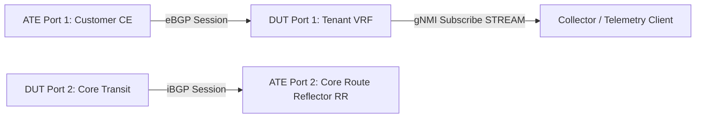

# RT-1.109: BGP Streaming Telemetry and Operational State Verification

## Summary

Validate continuous and event-driven OpenConfig gNMI streaming telemetry for BGP operational state on the DUT. Verify telemetry accuracy and subscription latency for session transitions (`ESTABLISHED`, `IDLE`), prefix telemetry counters (`received`, `sent`, `installed`), max-prefix warning/teardown events, and multiprotocol L3VPN state exports for streaming telemetry collectors.

## Testbed type

* `TESTBED_DUT_ATE_2LINKS` (ATE Port 1 simulating Customer CE peer; ATE Port 2 simulating Core iBGP peer).

## Topology



## Procedure

### Test environment setup

1. Configure tenant VRF `ce1` and establish eBGP session on DUT Port 1 (`192.0.2.1/30`) with ATE Port 1 (`192.0.2.2`, AS 65001).
2. Configure max-prefix limit on DUT for ATE CE: `max-prefixes 100`, `warning-threshold-pct 80` (80 prefixes).
3. Establish gNMI `Subscribe` session in `STREAM` mode with `SAMPLE` and `ON_CHANGE` subscription modes targeting:
   - `/network-instances/network-instance/protocols/protocol/bgp/neighbors/neighbor/state/`
   - `/network-instances/network-instance/protocols/protocol/bgp/neighbors/neighbor/afi-safis/afi-safi/state/prefixes/`

### RT-1.109.1 - Session Operational State & Transition Counters

* **Step 1**: Establish BGP session with ATE CE.
* **Step 2**: Subscribe to `/network-instances/network-instance[name=ce1]/protocols/protocol[identifier=openconfig-policy-types:BGP][name=BGP]/bgp/neighbors/neighbor[neighbor-address=192.0.2.2]/state/session-state`.
* **Step 3**: Verify initial stream update reports `ESTABLISHED`.
* **Step 4**: Simulate peer flap by administrative shutdown on ATE CE.
* **Step 5**: Verify event-driven `ON_CHANGE` gNMI update is streamed with `session-state: IDLE` in less than **10 seconds**.
* **Step 6**: Verify `established-transitions` and `last-established` timestamps update accurately.

### RT-1.109.2 - Prefix Counters Streaming

* **Step 1**: ATE CE advertises 50 IPv4 routes (`198.51.100.0/24` block) and 25 IPv6 routes (`2001:db8:100::/48` block), while DUT advertises 10 IPv4 routes (`203.0.113.0/24` block) to ATE CE.
* **Step 2**: Subscribe to `/network-instances/network-instance[name=ce1]/protocols/protocol[identifier=openconfig-policy-types:BGP][name=BGP]/bgp/neighbors/neighbor[neighbor-address=192.0.2.2]/afi-safis/afi-safi[afi-safi-name=openconfig-bgp-types:IPV4_UNICAST]/state/prefixes/received`, `.../state/prefixes/sent`, and `.../state/prefixes/installed`.
* **Step 3**: Verify telemetry reports `received: 50`, `installed: 50`, and `sent: 10`.
* **Step 4**: ATE CE advertises 20 additional IPv4 routes (total 70 routes).
* **Step 5**: Verify telemetry stream updates promptly to `received: 70` and `installed: 70`.

### RT-1.109.3 - Max-Prefix Warning Telemetry

* **Step 1**: ATE CE advertises 15 additional routes (total 85 routes, exceeding the 80% warning threshold).
* **Step 2**: Verify the BGP session remains `ESTABLISHED`.
* **Step 3**: Verify telemetry state leaf `/network-instances/network-instance[name=ce1]/protocols/protocol[identifier=openconfig-policy-types:BGP][name=BGP]/bgp/neighbors/neighbor[neighbor-address=192.0.2.2]/afi-safis/afi-safi[afi-safi-name=openconfig-bgp-types:IPV4_UNICAST]/ipv4-unicast/prefix-limit/state/prefix-limit-exceeded` or vendor warning event is streamed to telemetry client.

### RT-1.109.4 - Max-Prefix Teardown Telemetry

* **Step 1**: ATE CE advertises 20 additional routes (total 105 routes, exceeding the hard limit of 100).
* **Step 2**: Verify the DUT tears down the BGP session and sends a Notification (Cease / Maximum Number of Prefixes Reached).
* **Step 3**: Verify telemetry stream emits `session-state: IDLE` and `/network-instances/network-instance[name=ce1]/protocols/protocol[identifier=openconfig-policy-types:BGP][name=BGP]/bgp/neighbors/neighbor[neighbor-address=192.0.2.2]/state/last-prefix-limit-exceeded` timestamp updates to indicate max-prefix limit violation.

## Canonical OC

```json
{
  "network-instances": {
    "network-instance": [
      {
        "name": "ce1",
        "protocols": {
          "protocol": [
            {
              "identifier": "openconfig-policy-types:BGP",
              "name": "BGP",
              "bgp": {
                "neighbors": {
                  "neighbor": [
                    {
                      "neighbor-address": "192.0.2.2",
                      "afi-safis": {
                        "afi-safi": [
                          {
                            "afi-safi-name": "openconfig-bgp-types:IPV4_UNICAST",
                            "ipv4-unicast": {
                              "prefix-limit": {
                                "config": {
                                  "max-prefixes": 100,
                                  "warning-threshold-pct": 80
                                }
                              }
                            }
                          }
                        ]
                      }
                    }
                  ]
                }
              }
            }
          ]
        }
      }
    ]
  }
}
```

## OpenConfig Path and RPC Coverage

```yaml
paths:
  # Operational State
  /network-instances/network-instance/protocols/protocol/bgp/neighbors/neighbor/state/session-state:
  /network-instances/network-instance/protocols/protocol/bgp/neighbors/neighbor/state/last-established:
  /network-instances/network-instance/protocols/protocol/bgp/neighbors/neighbor/state/established-transitions:
  /network-instances/network-instance/protocols/protocol/bgp/neighbors/neighbor/state/last-prefix-limit-exceeded:
  /network-instances/network-instance/protocols/protocol/bgp/neighbors/neighbor/afi-safis/afi-safi/ipv4-unicast/prefix-limit/state/prefix-limit-exceeded:
  # Prefix Counters
  /network-instances/network-instance/protocols/protocol/bgp/neighbors/neighbor/afi-safis/afi-safi/state/prefixes/received:
  /network-instances/network-instance/protocols/protocol/bgp/neighbors/neighbor/afi-safis/afi-safi/state/prefixes/sent:
  /network-instances/network-instance/protocols/protocol/bgp/neighbors/neighbor/afi-safis/afi-safi/state/prefixes/installed:

rpcs:
  gnmi:
    gNMI.Subscribe:
```

## Required DUT platform

* FFF
