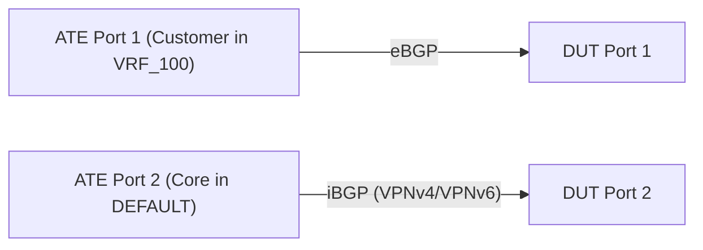

# RT-1.102: DUT eBGP FNTs coverage for new L3VPN params

## Summary

Validate eBGP session establishment and L3VPN attribute Handling on DUT within
tenant VRFs for both IPv4 and IPv6. Ensures multi-tenancy isolation and correct
attribute propagation over explicit dual-stack sessions.

## Topology



*   Connect ATE Port 1 to DUT Port 1.
*   Connect ATE Port 2 to DUT Port 2.
*   Note: `VRF_200` is a local VRF configured on the DUT for isolation testing
    and does not require a dedicated ATE port in this topology.

### Explicit Parameter Assignments

#### Autonomous System Numbers (ASNs)

*   **DUT ASN**: `64496`
*   **ATE Port 1 (Customer Peer)**: `64497`
*   **ATE Port 2 (Core Peer)**: `64496`

#### VRF & L3VPN Parameters

*   **Tenant VRF 1 Name**: `VRF_100`
    *   **Route Distinguisher (RD)**: `64496:100`
    *   **Import/Export Route Target (RT)**: `64496:100`
*   **Tenant VRF 2 Name (Isolation)**: `VRF_200`
    *   **Route Distinguisher (RD)**: `64496:200`
    *   **Import/Export Route Target (RT)**: `64496:200`

#### IP Addressing Assignments

*   **Link 1**: ATE Port 1 <-> DUT Port 1 (VRF_100)
    *   **IPv4 Subnet**: `192.0.2.0/30` (DUT: `192.0.2.1`, ATE: `192.0.2.2`)
    *   **IPv6 Subnet**: `2001:DB8:1::/64` (DUT: `2001:DB8:1::1`, ATE: `2001:DB8:1::2`)

*   **Link 2**: ATE Port 2 <-> DUT Port 2 (DEFAULT)
    *   **IPv4 Subnet**: `198.51.100.0/30` (DUT: `198.51.100.1`, ATE: `198.51.100.2`)
    *   **IPv6 Subnet**: `2001:DB8:2::/64` (DUT: `2001:DB8:2::1`, ATE: `2001:DB8:2::2`)


#### BGP Router IDs

*   **DUT DEFAULT Network Instance**: `198.51.100.1`
*   **DUT VRF_100**: `192.0.2.1`

--------------------------------------------------------------------------------

## Configuration

1.  Configure DUT with tenant VRFs `VRF_100` and `VRF_200`.
2.  Configure DUT Port 1 and assign it to `VRF_100`.
3.  Configure dual-stack (IPv4/IPv6) eBGP sessions on DUT Port 1 within
    `VRF_100`.
4.  Configure L3VPN parameters (RD/RT) associated with the tenant VRFs.
5.  Configure iBGP sessions on DUT Port 2 in the Default Network Instance
    (`"DEFAULT"`) supporting `L3VPN_IPV4_UNICAST` and `L3VPN_IPV6_UNICAST`.

--------------------------------------------------------------------------------

## Tests

### RT-1.102.1 - eBGP Session Establishment in VRF

*   **Step 1**: Configure the eBGP neighbors on DUT (`192.0.2.2`,
    `2001:DB8:1::2`) with Peer AS `64497`, MD5 authentication, and Graceful
    Restart enabled with a 120-second restart time.
*   **Step 2**: Bring up the peers on ATE.
*   **Step 3**: Verify the session states transition to `ESTABLISHED`.
*   **Step 4**: Verify the sessions are contained within `VRF_100` and
    independent Router ID `192.0.2.1` is used for this VRF.

### RT-1.102.2 - L3VPN Attribute Validation

*   **Step 1**: Inject prefixes `203.0.113.10/32` and `2001:DB8:3::10/128` from
    ATE Port 1 to DUT.
*   **Step 2**: Verify that routes learned from the customer eBGP peer correctly
    attach the configured `VRF_100`'s RD/RT attributes (`64496:100`).
*   **Step 3**: Verify these attributes are preserved/visible in the local VRF
    RIB.
*   **Step 4**: Verify these routes are propagated to the iBGP peer (ATE Port 2)
    over the VPNv4/VPNv6 sessions with the correct Extended Communities.

### RT-1.102.3 - Maximum Prefix Limit Enforcement (IPv4 and IPv6)

*   **Step 1**: Configure a maximum prefix limit (e.g., 5000) on both IPv4 and
    IPv6 address families for the eBGP neighbor in `VRF_100`.
*   **Step 2**: Advertise IPv4 and IPv6 prefixes up to the limit and verify
    sessions remain established.
*   **Step 3**: Exceed the limit for each address family independently and
    verify standard behavior (warning or teardown) per configuration.

### RT-1.102.4 - Negative Verification & Isolation Boundary

*   **Step 1 (Default Isolation)**: Verify customer prefixes (`203.0.113.10/32`,
    `2001:DB8:3::10/128`) are **NOT** visible in the Default Network Instance
    (`"DEFAULT"`) Unicast RIB.
*   **Step 2 (Inter-Tenant Isolation)**: Verify customer prefixes injected into
    `VRF_100` are **NOT** visible in `VRF_200` RIB.

### RT-1.102.5 - BGP Graceful Restart Verification in VRF

*   **Step 1**: Verify the eBGP sessions in `VRF_100` are established and
    customer prefixes are propagated to the iBGP peer.
*   **Step 2 (DUT as Helper)**: Simulate a restart of the customer eBGP peer
    (ATE Port 1) by dropping the BGP session/TCP connection without sending a
    BGP CEASE notification.
*   **Step 3**: Verify that the DUT (acting as Helper) retains the customer
    prefixes in `VRF_100` RIB/FIB and continues to forward traffic toward them.
*   **Step 4**: Verify that the prefixes remain advertised to the iBGP peer (ATE
    Port 2) during this state.
*   **Step 5**: Restore the customer eBGP session on ATE within the Graceful
    Restart timer window (less than 120 seconds).
*   **Step 6**: Verify that the session is re-established successfully without
    causing route flaps, withdrawals, or traffic disruption in the core.
*   **Step 7 (Timeout Scenario)**: Repeat Step 2, but keep the customer peer
    down for longer than 120 seconds. Verify that prefixes are eventually
    withdrawn from both `VRF_100` and the iBGP peer.

### RT-1.102.6 - Immediate Prefix Withdrawal without Graceful Restart

*   **Step 1**: Disable Graceful Restart on the customer eBGP neighbor in
    `VRF_100` (or configure the ATE peer to not advertise GR capability).
*   **Step 2**: Verify the eBGP session is established and customer prefixes are
    propagated to the iBGP peer.
*   **Step 3**: Drop the BGP session/TCP connection on ATE Port 1 (Customer
    simulator) without sending a BGP CEASE notification.
*   **Step 4**: Verify that the DUT immediately withdraws the customer prefixes
    from `VRF_100` RIB/FIB (Fail-Fast/No Retention).
*   **Step 5**: Verify that the withdrawals are immediately propagated to the
    iBGP peer (ATE Port 2).

--------------------------------------------------------------------------------

## Canonical OC

```json
{
  "interfaces": {
    "interface": [
      {
        "name": "port1",
        "config": {
          "name": "port1",
          "type": "iana-if-type:ethernetCsmacd"
        },
        "subinterfaces": {
          "subinterface": [
            {
              "index": 0,
              "config": {
                "index": 0
              }
            }
          ]
        }
      },
      {
        "name": "port2",
        "config": {
          "name": "port2",
          "type": "iana-if-type:ethernetCsmacd"
        },
        "subinterfaces": {
          "subinterface": [
            {
              "index": 0,
              "config": {
                "index": 0
              }
            }
          ]
        }
      }
    ]
  },
  "network-instances": {
    "network-instance": [
      {
        "config": {
          "name": "DEFAULT"
        },
        "name": "DEFAULT",
        "interfaces": {
          "interface": [
            {
              "config": {
                "id": "port2",
                "interface": "port2",
                "subinterface": 0
              },
              "id": "port2"
            }
          ]
        },
        "protocols": {
          "protocol": [
            {
              "bgp": {
                "global": {
                  "config": {
                    "as": 64496,
                    "router-id": "198.51.100.1"
                  }
                },
                "neighbors": {
                  "neighbor": [
                    {
                      "config": {
                        "neighbor-address": "198.51.100.2",
                        "peer-as": 64496
                      },
                      "neighbor-address": "198.51.100.2",
                      "afi-safis": {
                        "afi-safi": [
                          {
                            "afi-safi-name": "openconfig-bgp-types:L3VPN_IPV4_UNICAST",
                            "config": {
                              "afi-safi-name": "openconfig-bgp-types:L3VPN_IPV4_UNICAST",
                              "enabled": true
                            }
                          },
                          {
                            "afi-safi-name": "openconfig-bgp-types:L3VPN_IPV6_UNICAST",
                            "config": {
                              "afi-safi-name": "openconfig-bgp-types:L3VPN_IPV6_UNICAST",
                              "enabled": true
                            }
                          }
                        ]
                      }
                    },
                    {
                      "config": {
                        "neighbor-address": "2001:DB8:2::2",
                        "peer-as": 64496
                      },
                      "neighbor-address": "2001:DB8:2::2",
                      "afi-safis": {
                        "afi-safi": [
                          {
                            "afi-safi-name": "openconfig-bgp-types:L3VPN_IPV4_UNICAST",
                            "config": {
                              "afi-safi-name": "openconfig-bgp-types:L3VPN_IPV4_UNICAST",
                              "enabled": true
                            }
                          },
                          {
                            "afi-safi-name": "openconfig-bgp-types:L3VPN_IPV6_UNICAST",
                            "config": {
                              "afi-safi-name": "openconfig-bgp-types:L3VPN_IPV6_UNICAST",
                              "enabled": true
                            }
                          }
                        ]
                      }
                    }
                  ]
                }
              },
              "config": {
                "identifier": "BGP",
                "name": "BGP"
              },
              "identifier": "BGP",
              "name": "BGP"
            }
          ]
        }
      },
      {
        "config": {
          "name": "VRF_100",
          "type": "openconfig-network-instance-types:L3VRF",
          "route-distinguisher": "64496:100"
        },
        "name": "VRF_100",
        "interfaces": {
          "interface": [
            {
              "config": {
                "id": "port1",
                "interface": "port1",
                "subinterface": 0
              },
              "id": "port1"
            }
          ]
        },
        "inter-instance-policies": {
          "import-export-policy": {
            "config": {
              "import-route-target": [
                "64496:100"
              ],
              "export-route-target": [
                "64496:100"
              ]
            }
          }
        },
        "protocols": {
          "protocol": [
            {
              "bgp": {
                "global": {
                  "config": {
                    "as": 64496,
                    "router-id": "192.0.2.1"
                  }
                },
                "neighbors": {
                  "neighbor": [
                    {
                      "config": {
                        "neighbor-address": "192.0.2.2",
                        "peer-as": 64497,
                        "auth-password": "customer_secret_v4"
                      },
                      "neighbor-address": "192.0.2.2",
                      "graceful-restart": {
                        "config": {
                          "enabled": true,
                          "restart-time": 120
                        }
                      },
                      "afi-safis": {
                        "afi-safi": [
                          {
                            "afi-safi-name": "openconfig-bgp-types:IPV4_UNICAST",
                            "config": {
                              "afi-safi-name": "openconfig-bgp-types:IPV4_UNICAST",
                              "enabled": true
                            },
                            "ipv4-unicast": {
                              "prefix-limit": {
                                "config": {
                                  "max-prefixes": 5000
                                }
                              }
                            }
                          }
                        ]
                      }
                    },
                    {
                      "config": {
                        "neighbor-address": "2001:DB8:1::2",
                        "peer-as": 64497,
                        "auth-password": "customer_secret_v6"
                      },
                      "neighbor-address": "2001:DB8:1::2",
                      "graceful-restart": {
                        "config": {
                          "enabled": true,
                          "restart-time": 120
                        }
                      },
                      "afi-safis": {
                        "afi-safi": [
                          {
                            "afi-safi-name": "openconfig-bgp-types:IPV6_UNICAST",
                            "config": {
                              "afi-safi-name": "openconfig-bgp-types:IPV6_UNICAST",
                              "enabled": true
                            },
                            "ipv6-unicast": {
                              "prefix-limit": {
                                "config": {
                                  "max-prefixes": 5000
                                }
                              }
                            }
                          }
                        ]
                      }
                    }
                  ]
                }
              },
              "config": {
                "identifier": "BGP",
                "name": "BGP"
              },
              "identifier": "BGP",
              "name": "BGP"
            }
          ]
        }
      },
      {
        "config": {
          "name": "VRF_200",
          "type": "openconfig-network-instance-types:L3VRF",
          "route-distinguisher": "64496:200"
        },
        "name": "VRF_200",
        "inter-instance-policies": {
          "import-export-policy": {
            "config": {
              "import-route-target": [
                "64496:200"
              ],
              "export-route-target": [
                "64496:200"
              ]
            }
          }
        }
      }
    ]
  }
}
```

## OpenConfig Path and RPC Coverage

```yaml
paths:
  # Network Instance / VRF Config
  /network-instances/network-instance/config/name:
  /network-instances/network-instance/config/type:
  /network-instances/network-instance/config/route-distinguisher:
  /network-instances/network-instance/inter-instance-policies/import-export-policy/config/import-route-target:
  /network-instances/network-instance/inter-instance-policies/import-export-policy/config/export-route-target:
  /network-instances/network-instance/interfaces/interface/config/id:
  /network-instances/network-instance/interfaces/interface/config/interface:
  /network-instances/network-instance/interfaces/interface/config/subinterface:

  # BGP Neighbor Config
  /network-instances/network-instance/protocols/protocol/bgp/neighbors/neighbor/config/neighbor-address:
  /network-instances/network-instance/protocols/protocol/bgp/neighbors/neighbor/config/peer-as:
  /network-instances/network-instance/protocols/protocol/bgp/neighbors/neighbor/graceful-restart/config/enabled:
  /network-instances/network-instance/protocols/protocol/bgp/neighbors/neighbor/graceful-restart/config/restart-time:

  # BGP AFI-SAFI Enablement
  /network-instances/network-instance/protocols/protocol/bgp/neighbors/neighbor/afi-safis/afi-safi/config/enabled:
  /network-instances/network-instance/protocols/protocol/bgp/neighbors/neighbor/afi-safis/afi-safi/afi-safi-name:

  # BGP Neighbor State
  /network-instances/network-instance/protocols/protocol/bgp/neighbors/neighbor/state/session-state:

  # Telemetry / AFT Paths
  /network-instances/network-instance/afts/ipv4-unicast/ipv4-entry/state:
  /network-instances/network-instance/afts/ipv6-unicast/ipv6-entry/state:

  # MD5 Auth & Router ID (New in this version)
  /network-instances/network-instance/protocols/protocol/bgp/neighbors/neighbor/config/auth-password:
  /network-instances/network-instance/protocols/protocol/bgp/global/config/router-id:

  # Prefix Limit (New in this version)
  /network-instances/network-instance/protocols/protocol/bgp/neighbors/neighbor/afi-safis/afi-safi/ipv4-unicast/prefix-limit/config/max-prefixes:
  /network-instances/network-instance/protocols/protocol/bgp/neighbors/neighbor/afi-safis/afi-safi/ipv6-unicast/prefix-limit/config/max-prefixes:

rpcs:
  gnmi:
    gNMI.Set:
      union_replace: true
    gNMI.Subscribe:
      on_change: true
```

## TODO

*   Add coverage for Bidirectional Forwarding Detection (BFD) to accelerate convergence on BGP sessions.

## Required DUT platform


*   FFF (Fixed Form Factor) or MFF supporting L3VPN and per-VRF BGP.
