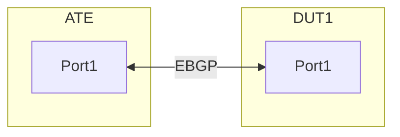

# RT-1.64: BGP Import/Export Policy (Control plane only) Functional Test Case

## Objective

To verify the basic functioanlity of BGP import and export policies and to check if they are correctly applied on a router.

## Test Bed Setup

*  [`featureprofiles/topologies/atedut_2.testbed`](https://github.com/openconfig/featureprofiles/blob/main/topologies/atedut_2.testbed)
  
* Device Under Test (DUT): 1 x Router
* ATE BGP Peer: 1 x ATE with BGP Emulation capabilities.

### Connections:
One Ethernet link between a port on the DUT and a port on the ATE.
Create the following connections:

DUT interface: IPV4 - 10.1.1.0/31 & IPV6 - 2001:db8:204:114::0/127
ATE interface: IPV4 - 10.1.1.1/31 & IPV6 - 2001:db8:204:114::1/127

## Prerequisites

* Basic IPv4 and IPv6 connectivity configured between the DUT and ATE interface.
* BGP peering established between the DUT and ATE on the connected interfaces for both IPV4 and IPV6 address families.
* Access to configure the DUT and ATE.
* BGP parameters to be defined that includes the RouterID, AS paths to be used.

## Test Case Scenario

This test case will focus on two scenarios:

* Export Policy: Router exports only specific prefixes to ATE based on a policy.
* Import Policy: Router imports only specific prefixes from ATE based on a policy.

## Test Steps

### Initial Setup (Pre-Test)

### DUT Configuration (Basic BGP Peering):

* Configure interface IP addresses (DUT: IPV4 - 10.1.1.0/31 & IPV6 - 2001:db8:204:114::0/127 , ATE: IPV4 - 10.1.1.1/31 & IPV6 - 2001:db8:204:114::1/127 ).
* Enable BGP on the DUT.
* Establish an EBGP peering session with the ATE (using ATE's AS as  AS65002).
* Ensure the DUT has some local routes (loopback interfaces advertised into BGP) that can be filtered.
* Routes advertised by DUT:
   * IPV4: 172.16.1.0/24, 172.16.2.0/24, 192.168.10.0/24
   * IPV6: 2001:db8:250:110::/64, 2001:db8:251:110::/64, 2001:db8:299:110::/64
* Routes advertised by ATE: 
   * IPV4: 192.0.2.1/32, 192.0.2.2/32, 198.51.100.1/32, 198.51.100.2/32 
   * IPV6: 2001:db8:300:100::0/127, 2001:db8:300:101::0/127, 2001:db8:400:100::1/128, 2001:db8:400:101::1/128

### ATE Configuration (Basic BGP Emulation):

* Configure the ATE port with an IP address (10.1.1.1/31) & IPv6 address (2001:db8:204:114::1/127).
* Create a BGP Emulated Router on the ATE, acting as AS 65002.
* Establish a BGP peering session with the DUT's IP (10.1.1.0) & IPV6 (2607:f8b0:8007:614f::).

* Advertise multiple unique BGP routes from ATE, some intended to be filtered, and some to be allowed on the DUT.
  * Allowed routes: IPV4 192.0.2.1/32 (AS-Path: 65002), 192.0.2.2/32 (AS-Path: 65002) and IPV6 2001:db8:300:100::0/127 (AS-Path: 65002) , 2001:db8:300:101::0/127 (AS-Path: 65002)
  * Denied routes:  IPV4 198.51.100.1/32 (AS-Path: 65002 65003), 198.51.100.2/32 (AS-Path: 65002 65004) and IPV6 2001:db8:400:100::1/128 (AS-Path: 65002 65004) , 2001:db8:400:101::1/128 (AS-Path: 65002 65004)

### RT-1.64.1 Verify BGP Peering without policy

* On DUT:
  * Check the BGP summary and make sure the session towards ATE is established.
  * Check if the routes advertised by ATE are received on the DUT, using OC afts state paths
    * /network-instances/network-instance/afts/ipv4-unicast/ipv4-entry/state/prefix
    * /network-instances/network-instance/afts/ipv6-unicast/ipv6-entry/state/prefix

* On ATE:
  * Check BGP session status towards DUT and the session should be in established state.
  * Check if the DUT advertised routes are present on the ATE

### RT-1.64.2 Test Export Policy (Prefix-list based)

Objective: Only allow local routes 172.16.1.0/24 and 172.16.2.0/24 & 2001:db8:250:110::/64 and 2001:db8:251:110::/64  to be advertised from DUT to ATE. 192.168.10.0/24 & 2001:db8:299:110::/64 should be denied.

Configure Export Policy on DUT:
Create a routing policy.
Apply the routing policy to the BGP neighbor 10.1.1.1 & 2607:f8b0:8007:614f::1 as an output policy.

### Verify Export Policy:

* On DUT:
  * Check the BGP summary and make sure the session towards ATE is established.
  * Check if the routes advertised by ATE are received on the DUT, using OC afts state paths
    * /network-instances/network-instance/afts/ipv4-unicast/ipv4-entry/state/prefix
    * /network-instances/network-instance/afts/ipv6-unicast/ipv6-entry/state/prefix

* On ATE:
  * Check BGP session status towards DUT and the session should be in established state.
  * Check if the DUT advertised routes are present on the ATE

### RT-1.64.3 Test Import Policy (AS-Path based)

* Objective: Only allow routes from ATE with AS-Path 65002 (originating from the immediate neighbor) to be imported into the DUT's BGP table. Routes with longer AS-Paths (e.g., 65002 65003) should be denied.

* Configure Import Policy on DUT:
  * Create a routing policy to match the desired AS-Path and prefixes.
  * Apply the rrouting policy to the BGP neighbor IPV4 - 10.1.1.1 & IPV6 - 2001:db8:204:114::1 as an import policy.


### Verify Import Policy:

* DUT:
  * Check the bgp neighbors and received routes from ATE in DUT BGP table
    * Routes 192.0.2.1/32 (AS-Path: 65002), 192.0.2.2/32 (AS-Path: 65002), 2001:db8:300:100::0/127 (AS-Path: 65002), 2001:db8:300:101::0/127 (AS-Path: 65002) should be received.
    * Routes 198.51.100.1/32, 198.51.100.2/32, 2001:db8:400:100::1/128, 2001:db8:400:101::1/128 should be rejected.
  * Check the bgp neighbors 10.1.1.1 & 2001:db8:204:114::1 received-routes and all the routes from ATE should be shown as routing policy doesnt get applied yet.

* ATE:
  * Observe the "Advertised Routes" from the ATE to the DUT.
  * Expected: All original advertised routes (192.0.2.1/32, 192.0.2.2/32, 198.51.100.1/32, 198.51.100.2/32, 2001:db8:300:100::0/127,2001:db8:300:101::0/127,2001:db8:400:100::1/128, 2001:db8:400:101::1/128 ) should still be showing as advertised by ATE. The filtering happens on the DUT.

### Expected Results

* Export Policy: The ATE should only learn the BGP prefixes 172.16.1.0/24 and 172.16.2.0/24 & 2001:db8:250:110::/64 and 2001:db8:251:110::/64 from the DUT. Other local prefixes should not be learned by ATE.
* Import Policy: The DUT's AFT table should only contain the BGP prefixes 192.0.2.1/32 and 192.0.2.2/32 & 2001:db8:300:100::0/127 and 2001:db8:300:101::0/127 learned from ATE. Prefixes with longer AS-Paths should be filtered and not appear in the DUT's AFT table.


## Canonical OC

```json
{
  "network-instances": {
    "network-instance": [
      {
        "config": {
          "name": "DEFAULT"
        },
        "name": "DEFAULT",
        "protocols": {
          "protocol": [
            {
              "bgp": {
                "neighbors": {
                  "neighbor": [
                    {
                      "apply-policy": {
                        "config": {
                          "export-policy": [
                            "test_export"
                          ],
                          "import-policy": [
                            "test_import"
                          ]
                        }
                      },
                      "config": {
                        "neighbor-address": "192.168.1.1"
                      },
                      "neighbor-address": "192.168.1.1"
                    }
                  ]
                }
              },
              "config": {
                "identifier": "BGP",
                "name": "BGP"
              },
              "identifier": "BGP",
              "name": "BGP"
            }
          ]
        }
      }
    ]
  }
}
```


#### OpenConfig Path and RPC Coverage

```yaml
paths:

#Telemetry

/network-instances/network-instance/protocols/protocol/bgp/neighbors/neighbor/state:
/network-instances/network-instance/protocols/protocol/bgp/neighbors/neighbor/state/neighbor-address:
/network-instances/network-instance/protocols/protocol/bgp/neighbors/neighbor/state/session-state:
/network-instances/network-instance/protocols/protocol/bgp/neighbors/neighbor/state/peer-type:
/network-instances/network-instance/protocols/protocol/bgp/peer-groups/peer-group/afi-safis/afi-safi/apply-policy/state/import-policy:
/network-instances/network-instance/protocols/protocol/bgp/neighbors/neighbor/afi-safis/afi-safi/apply-policy/state/export-policy:

rpcs:
  gnmi:
    gNMI.Set:
      union_replace: true
      replace: true
    gNMI.Subscribe:
      on_change: true
```

## Required DUT platform

* FFF
* MFF


