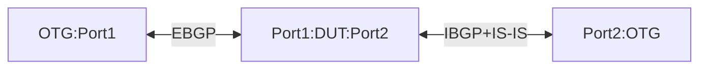

# RT-7.1: BGP default policies

## Summary

Following expectation for default-policies at the peer-group and neighbor levels
* For eBGP peers, when no policy is attached all routes should be rejected for import and export per [RFC 8212](https://www.rfc-editor.org/rfc/rfc8212.html).
    * TODO: OC clarification to confirm the eBGP behavior, https://github.com/openconfig/public/issues/981


* For IBGP peers when no policy is attached including the default-policy, default should be import and export all BGP routes.
    * TODO:  OC clarification on iBGP behavior, https://github.com/openconfig/public/issues/981

  
## Topology


## Procedure
* DUT:Port1 has EBGP peering with ATE:Port1. Ensure ATE:Port1 advertises IPv4-prefix1, IPv4-prefix2, IPv4-prefix3, IPv6-prefix1, IPv6-prefix2 and IPv6-prefix3. Please also configure IPv4-prefix7 and IPv6-prefix7 on ATE:Port1 but these shouldn't be advertised over EBGP to the DUT
* DUT:Port2 has IBGP peering with ATE:Port2 using its loopback interface. The loopback interface is reachable only via IS-IS. Ensure ATE:Port2 advertises IPv4-prefix4, IPv4-prefix5, IPv4-prefix6, IPv6-prefix4, IPv6-prefix5 and IPv6-prefix6 over IBGP. Please also configure IPv4-prefix8 and IPv6-prefix8 on ATE:Port2 but these shouldnt be advertised over IBGP to the DUT
* Conduct following test procedures by applying policies at the Peer-group and Neighbor AFI-SAFI levels.

### RT-7.1.1 : Policy definition in policy chain is not satisfied and Default Policy has REJECT_ROUTE action
  * Create a default-policy REJECT-ALL with action as REJECT_ROUTE and apply the same to both IPV4-unicast and IPV6-unicast AFI-SAFI
  * Create policy EBGP-IMPORT-IPV4 that only accepts IPv4-prefix1 and IPv4-prefix2 and then terminates
  * Create policy EBGP-IMPORT-IPV6 that only accepts IPv6-prefix1 and IPv6-prefix2 and then terminates
  * Create policy EBGP-EXPORT-IPV4 that only allows IPv4-prefix4 and terminates
  * Create policy EBGP-EXPORT-IPV6 that only allows IPv6-prefix4 and terminates
  * Create policy IBGP-IMPORT-IPV4 that only accepts IPv4-prefix4 and IPv4-prefix5 and then terminates
  * Create policy IBGP-IMPORT-IPV6 that only accepts IPv6-prefix4 and IPv6-prefix5 and then terminates
  * Create policy IBGP-EXPORT-IPV4 that only allows IPv4-prefix1 and terminates
  * Create policy IBGP-EXPORT-IPV6 that only allows IPv6-prefix1 and terminates
  * Apply the above policies to the respective peering at the repective AFI-SAFI levels
  * Add following static routes
    * Static route for IPv4-prefix7 and IPv6-prefix7 pointing at ATE:Port1
    * Static route for IPv4-prefix8 and IPv6-prefix8 pointing at ATE:Port2
  * Following test expectations. If expectations not met, the test should fail.
    * DUT:Port1 should reject import of IPv4-prefix3 and IPv6-prefix3
    * DUT:Port1 should reject export of IPv4-prefix5 and IPv6-prefix5
    * DUT:Port2 should reject import of IPv4-prefix6 and IPv6-prefix6
    * DUT:Port2 should reject export of IPv4-prefix2 and IPv6-prefix2
    * IS-IS and static routes shouldn't be advertised to the EBGP and IBGP peers.

### RT-7.1.2 : Policy definition in policy chain is not satisfied and Default Policy has ACCEPT_ROUTE action  
  * Continue with the same configuration as RT-7.1.1
  * Replace the default-policy REJECT-ALL with default-policy ACCEPT-ALL which has action ACCEPT_ROUTE.
  * Ensure ACCEPT-ALL default-policy is applied to both IPv4-unicast and IPv6-unicast AFI-SAFI of both IBGP and EBGP peers
  * Following test expectations. If expectations not met, the test should fail.
    * DUT:Port1 should accept import of IPv4-prefix1, IPv4-prefix2, IPv4-prefix3, IPv6-prefix1, IPv6-prefix2 and IPv6-prefix3
    * DUT:Port1 should allow export of IPv4-prefix4, IPv4-prefix5, IPv4-prefix6, IPv6-prefix4, IPv6-prefix5 and IPv6-prefix6
    * DUT:Port2 should accept import of IPv4-prefix4, IPv4-prefix5, IPv4-prefix6, IPv6-prefix4, IPv6-prefix5 and IPv6-prefix6
    * DUT:Port2 should allow export of IPv4-prefix1, IPv4-prefix2, IPv4-prefix3, IPv6-prefix1, IPv6-prefix2 and IPv6-prefix3
    * IS-IS and static routes shouldn't be advertised to the EBGP and IBGP peers.
      
### RT-7.1.3 : No policy attached either at the Peer-group or at the neighbor level and Default Policy has ACCEPT_ROUTE action
  * Continue with the same configuration as RT-7.1.2. However, do not attach any non-default import/export policies to the peers at either the peer-group or neighbor levels.
  * Ensure that the ACCEPT-ALL default-policy with default action of ACCEPT_ROUTE is appled to both IPv4-unicast and IPv6-unicast AFI-SAFI of both IBGP and EBGP peers
  * Following test expectations. If expectations not met, the test should fail.
    * DUT:Port1 should accept import of IPv4-prefix1, IPv4-prefix2, IPv4-prefix3, IPv6-prefix1, IPv6-prefix2 and IPv6-prefix3
    * DUT:Port1 should allow export of IPv4-prefix4, IPv4-prefix5, IPv4-prefix6, IPv6-prefix4, IPv6-prefix5 and IPv6-prefix6
    * DUT:Port2 should accept import of IPv4-prefix4, IPv4-prefix5, IPv4-prefix6, IPv6-prefix4, IPv6-prefix5 and IPv6-prefix6
    * DUT:Port2 should allow export of IPv4-prefix1, IPv4-prefix2, IPv4-prefix3, IPv6-prefix1, IPv6-prefix2 and IPv6-prefix3
    * IS-IS and static routes shouldn't be advertised to the EBGP and IBGP peers.

### RT-7.1.4 : No policy attached either at the Peer-group or at the neighbor level and Default Policy has REJECT_ROUTE action
  * Continue with the same configuration as RT-7.1.3. Ensure no non-default import/export policies are applied to the peers at either the peer-group or neighbor levels.
  * Ensure that only the REJECT-ALL default-policy with default action of REJECT_ROUTE is appled to both IPv4-unicast and IPv6-unicast AFI-SAFI of both IBGP and EBGP peers
  * Following test expectations. If expectations not met, the test should fail.
    * DUT:Port1 should reject import of IPv4-prefix1, IPv4-prefix2, IPv4-prefix3, IPv6-prefix1, IPv6-prefix2 and IPv6-prefix3
    * DUT:Port1 should reject export of IPv4-prefix4, IPv4-prefix5, IPv4-prefix6, IPv6-prefix4, IPv6-prefix5 and IPv6-prefix6
    * DUT:Port2 should reject import of IPv4-prefix4, IPv4-prefix5, IPv4-prefix6, IPv6-prefix4, IPv6-prefix5 and IPv6-prefix6
    * DUT:Port2 should reject export of IPv4-prefix1, IPv4-prefix2, IPv4-prefix3, IPv6-prefix1, IPv6-prefix2 and IPv6-prefix3
    * IS-IS and static routes shouldn't be advertised to the EBGP and IBGP peers.

### RT-7.1.5 : No policy, including the default-policy is attached either at the Peer-group or at the neighbor level for only IBGP peer
#### TODO: RT-7.5 should be automated only after the expected behavior is confirmed in https://github.com/openconfig/public/issues/981
  * Continue with the same configuration as RT-7.1.4. However, do not attach any non-default OR default import/export policies to the IBGP peer at the peer-group or neighbor levels. This is true for both IPv4-unicast and IPv6-unicast AFI-SAFI.
  * Ensure that only the ACCEPT-ALL IMPORT/EXPORT default-policy with default action of ACCEPT_ROUTE is appled to the EBGP peer on both IPv4-unicast and IPv6-unicast AFI-SAFI
  * Following test expectations. If expectations not met, the test should fail.
    * DUT:Port1 should accept import of IPv4-prefix1, IPv4-prefix2, IPv4-prefix3, IPv6-prefix1, IPv6-prefix2 and IPv6-prefix3
    * DUT:Port1 should accept export of IPv4-prefix4, IPv4-prefix5, IPv4-prefix6, IPv6-prefix4, IPv6-prefix5 and IPv6-prefix6
    * DUT:Port2 should accept import of IPv4-prefix4, IPv4-prefix5, IPv4-prefix6, IPv6-prefix4, IPv6-prefix5 and IPv6-prefix6
    * DUT:Port2 should allow export of IPv4-prefix1, IPv4-prefix2, IPv4-prefix3, IPv6-prefix1, IPv6-prefix2 and IPv6-prefix3
    * IS-IS and static routes shouldn't be advertised to the EBGP and IBGP peers.
   
### RT-7.1.6 : No policy, including the default-policy is attached either at the Peer-group or at the neighbor level for both EBGP and IBGP peers
#### TODO: RT-7.1.6 should be automated only after the expected behavior is confirmed in https://github.com/openconfig/public/issues/981
  * Continue with the same configuration as RT-7.1.5. However, do not attach any non-default OR default import/export policies to the IBGP and EBGP peers at the peer-group or neighbor levels. This is true for both IPv4-unicast and IPv6-unicast AFI-SAFI.
  * Following test expectations. If expectations not met, the test should fail.
    * DUT:Port1 should reject import of IPv4-prefix1, IPv4-prefix2, IPv4-prefix3, IPv6-prefix1, IPv6-prefix2 and IPv6-prefix3
    * DUT:Port1 should reject export of IPv4-prefix4, IPv4-prefix5, IPv4-prefix6, IPv6-prefix4, IPv6-prefix5 and IPv6-prefix6
    * DUT:Port2 should accept import of IPv4-prefix4, IPv4-prefix5, IPv4-prefix6, IPv6-prefix4, IPv6-prefix5 and IPv6-prefix6
    * DUT:Port2 wouldn't export routes to IPv4-prefix1, IPv4-prefix2, IPv4-prefix3, IPv6-prefix1, IPv6-prefix2 and IPv6-prefix3 since they are missing from the DUT's forwarding table.
    * IS-IS and static routes shouldn't be advertised to the EBGP and IBGP peers.
   

## OpenConfig Path and RPC Coverage
```yaml
paths:
  # Defined Sets
  /routing-policy/defined-sets/prefix-sets/prefix-set/prefixes/prefix/config/ip-prefix:
  /routing-policy/defined-sets/prefix-sets/prefix-set/prefixes/prefix/config/masklength-range:
  # Policy-Definition
  /routing-policy/policy-definitions/policy-definition/config/name:
  /routing-policy/policy-definitions/policy-definition/statements/statement/config/name:
  /routing-policy/policy-definitions/policy-definition/statements/statement/conditions/match-prefix-set/config/prefix-set:
  /routing-policy/policy-definitions/policy-definition/statements/statement/conditions/match-prefix-set/config/match-set-options:
  /routing-policy/policy-definitions/policy-definition/statements/statement/actions/config/policy-result:  
  # Apply Policy at Neighbor or Peer-Group level
  /network-instances/network-instance/protocols/protocol/bgp/neighbors/neighbor/afi-safis/afi-safi/apply-policy/config/import-policy:
  /network-instances/network-instance/protocols/protocol/bgp/neighbors/neighbor/afi-safis/afi-safi/apply-policy/config/export-policy:
  /network-instances/network-instance/protocols/protocol/bgp/neighbors/neighbor/afi-safis/afi-safi/apply-policy/config/default-import-policy:
  /network-instances/network-instance/protocols/protocol/bgp/neighbors/neighbor/afi-safis/afi-safi/apply-policy/config/default-export-policy:
  # Paths under Neighbor and Peer-Group level
  /network-instances/network-instance/protocols/protocol/bgp/neighbors/neighbor/afi-safis/afi-safi/apply-policy/state/export-policy:
  /network-instances/network-instance/protocols/protocol/bgp/neighbors/neighbor/afi-safis/afi-safi/apply-policy/state/import-policy:
  /network-instances/network-instance/protocols/protocol/bgp/neighbors/neighbor/afi-safis/afi-safi/state/prefixes/installed:
  /network-instances/network-instance/protocols/protocol/bgp/neighbors/neighbor/afi-safis/afi-safi/state/prefixes/received:
  /network-instances/network-instance/protocols/protocol/bgp/neighbors/neighbor/afi-safis/afi-safi/state/prefixes/received-pre-policy:
  /network-instances/network-instance/protocols/protocol/bgp/neighbors/neighbor/afi-safis/afi-safi/state/prefixes/sent:
rpcs:
  gnmi:
    gNMI.Get:
    gNMI.Set:
    gNMI.Subscribe:
```
