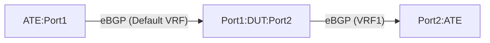

# TE-6.5: Community-based dynamic route-leaking between VRFs

## Objective

Validate the router's (DUT) capability to dynamically leak routes between VRFs (Virtual Routing and Forwarding instances) based on BGP communities. Specifically, this test verifies that routing information can be dynamically exported from the Default/Global routing instance to a non-default VRF when the routes contain any of the following pre-defined BGP communities:

*   `64500:1` (COMMUNITY_1)
*   `64500:2` (COMMUNITY_2)

The leaked routes must retain all relevant BGP attributes (such as MED, AS path, Local Pref, etc.) during the VRF leaking process.

The routing policy imports a route if it matches **ANY** of the communities in the configured set (logical OR). This test ensures proper route leaking under single matches, compound matches, and partial community withdrawals.

## Testbed Type

*   [`featureprofiles/topologies/atedut_2.testbed`](https://github.com/openconfig/featureprofiles/blob/main/topologies/atedut_2.testbed)

## Topology



*   **DUT:Port1**: Belongs to the Default/Global network instance.
*   **DUT:Port2**: Belongs to a non-default VRF1 network instance.
*   **ATE:Port1**: Peers with the DUT in the Default network instance.
*   **ATE:Port2**: Peers with the DUT in the VRF1 network instance.

---

## Procedure

### DUT Configuration

1.  Create a non-default VRF named `VRF1` with `L3VRF` type.
2.  Assign DUT:Port2 to the `VRF1` network instance. Keep DUT:Port1 in the Default network instance.
3.  Configure eBGP sessions:
    *   Global BGP session between DUT:Port1 (AS 64498) and ATE:Port1 (AS 64496).
    *   BGP session in `VRF1` VRF between DUT:Port2 (AS 64498) and ATE:Port2 (AS 64497).
4.  Configure a BGP community set containing the standard communities:
    *   `64500:1`
    *   `64500:2`
5.  Configure a routing policy that matches any community in the defined set, and dynamically imports matching routes from the Default instance into the `VRF1` instance, retaining BGP attributes. Apply this import policy to the `VRF1` network instance.

### ATE Configuration

*   Peering sessions:
    *   **Session 1**: ATE:Port1 (AS 64496) peers to DUT:Port1.
    *   **Session 2**: ATE:Port2 (AS 64497) peers to DUT:Port2.
*   **ATE Traffic flow**:
    *   Traffic is generated from ATE:Port2 (VRF1) to the prefixes advertised by ATE:Port1 (Default).
    *   PPS: 10,000, frame size: 256 bytes.

*   **Prefix Advertisements**:
    ATE:Port1 peers to DUT:Port1 through its eBGP session peering. It advertises prefixes with the following BGP attributes:

    | Prefix | BGP Community | MED | AS Path | Description |
    |---|---|---|---|---|
    | `IPv4Prefix1/24` (`192.0.2.0/24`) <br> `IPv6Prefix1/64` (`2001:db8:1::/64`) | `64500:1` | 10000 | `65515 65514 65513` | Route matching Community 1 |
    | `IPv4Prefix2/24` (`198.51.100.0/24`) <br> `IPv6Prefix2/64` (`2001:db8:2::/64`) | `64500:2` | 8000 | `65515 65514` | Route matching Community 2 |
    | `IPv4Prefix3/24` (`203.0.113.0/24`) <br> `IPv6Prefix3/64` (`2001:db8:3::/64`) | `64500:1`<br>`64500:2` | 11000 | `65515 65514 65513 65512` | Compound match (both communities) |
    | `IPv4Prefix4/24` (`203.0.113.128/25`) <br> `IPv6Prefix4/64` (`2001:db8:4::/64`) | `64500:13` | 12000 | `65515` | Negative scenario (non-matching community) |

---

### Test Cases

#### TE-6.5.1: Dynamic Route Leak on Community Match

1.  From ATE:Port1, advertise `IPv4Prefix1/24`, `IPv4Prefix2/24`, `IPv4Prefix3/24`, `IPv6Prefix1/64`, `IPv6Prefix2/64`, and `IPv6Prefix3/64` prefixes containing the above mentioned BGP attributes.
2.  Verify using state paths that the advertised routes are installed in both the Default routing instance table and dynamically leaked/imported into the `VRF1` routing instance table.
3.  Initiate traffic from ATE:Port2 to the leaked prefixes in VRF1.
4.  **Verification**:
    *   DUT dynamically leaks `IPv4Prefix1/24`, `IPv4Prefix2/24`, `IPv4Prefix3/24`, `IPv6Prefix1/64`, `IPv6Prefix2/64`, and `IPv6Prefix3/64` to `VRF1`.
    *   Traffic flows with 0% packet loss.
    *   Leaked routes on the DUT `VRF1` instance must retain all advertised BGP attributes (AS_PATH, Community, and MED values must remain intact). If not, the test fails even with 0% traffic loss.

#### TE-6.5.2: Route Retention on Partial Community Withdrawal

1.  Start with routes advertised in **TE-6.5.1** (containing both `64500:1` and `64500:2` and leaked to `VRF1`).
2.  Withdraw the community `64500:1` from `IPv4Prefix3/24` and `IPv6Prefix3/64` advertisements, while keeping `64500:2` attached to the prefixes.
3.  Verify that the routes are *retained* in the `VRF1` routing table, as they still match `64500:2`.
4.  Initiate traffic from ATE:Port2.
5.  **Verification**:
    *   Leaked routes are retained post partial community withdrawal.
    *   Traffic continues to flow with 0% packet loss.

#### TE-6.5.3: Dynamic Route Removal on Complete Community Withdrawal

1.  Start with routes from **TE-6.5.2** (now containing only `64500:2`).
2.  Withdraw the remaining community `64500:2` from the advertised prefixes `IPv4Prefix3/24` and `IPv6Prefix3/64`.
3.  Verify that the routes are dynamically removed from the `VRF1` routing table (remaining only in the Default instance routing table).
4.  Initiate traffic from ATE:Port2.
5.  **Verification**:
    *   Leaked routes are dynamically withdrawn and removed from `VRF1`.
    *   100% traffic loss is observed.

#### TE-6.5.4: No Route Leak on Non-matching Community (Negative Case)

1.  From ATE:Port1, advertise `IPv4Prefix4/24` and `IPv6Prefix4/64` containing BGP community `64500:13`.
2.  Verify that the routes are installed in the Default instance routing table but are NOT imported/leaked into the `VRF1` routing table.
3.  Initiate traffic from ATE:Port2 to these prefixes.
4.  **Verification**:
    *   The routes with non-matching community are not imported to `VRF1`.
    *   100% traffic loss is observed.

---

## Canonical OC

```json
{
  "network-instances": {
    "network-instance": [
      {
        "name": "DEFAULT",
        "config": {
          "name": "DEFAULT",
          "type": "DEFAULT_INSTANCE"
        }
      },
      {
        "name": "VRF1",
        "config": {
          "name": "VRF1",
          "type": "L3VRF"
        },
        "inter-instance-policies": {
          "apply-policy": {
            "config": {
              "import-policy": ["leak-matching-communities"]
            }
          }
        }
      }
    ]
  },
  "routing-policy": {
    "defined-sets": {
      "bgp-defined-sets": {
        "community-sets": {
          "community-set": [
            {
              "community-set-name": "leak-communities",
              "config": {
                "community-set-name": "leak-communities",
                "community-member": [
                  "64500:1",
                  "64500:2"
                ]
              }
            }
          ]
        }
      }
    },
    "policy-definitions": {
      "policy-definition": [
        {
          "name": "leak-matching-communities",
          "config": {
            "name": "leak-matching-communities"
          },
          "statements": {
            "statement": [
              {
                "name": "leak-rule",
                "config": {
                  "name": "leak-rule"
                },
                "conditions": {
                  "bgp-conditions": {
                    "match-community-set": {
                      "config": {
                        "community-set": "leak-communities",
                        "match-set-options": "ANY"
                      }
                    }
                  }
                },
                "actions": {
                  "config": {
                    "policy-result": "ACCEPT_ROUTE"
                  }
                }
              }
            ]
          }
        }
      ]
    }
  }
}
```

## OpenConfig Path and RPC Coverage

```yaml
paths:
  /network-instances/network-instance/config/type:
  /network-instances/network-instance/inter-instance-policies/apply-policy/config/import-policy:
  /routing-policy/defined-sets/bgp-defined-sets/community-sets/community-set/config/community-member:
  /routing-policy/policy-definitions/policy-definition/statements/statement/conditions/bgp-conditions/match-community-set/config/community-set:
  /routing-policy/policy-definitions/policy-definition/statements/statement/conditions/bgp-conditions/match-community-set/config/match-set-options:
  /routing-policy/policy-definitions/policy-definition/statements/statement/actions/config/policy-result:
  /network-instances/network-instance/protocols/protocol/bgp/rib/afi-safis/afi-safi/ipv4-unicast/loc-rib/routes/route/state/attr-index:
  /network-instances/network-instance/protocols/protocol/bgp/rib/afi-safis/afi-safi/ipv6-unicast/loc-rib/routes/route/state/attr-index:
  /network-instances/network-instance/protocols/protocol/bgp/rib/attr-sets/attr-set/state/as-path:
  /network-instances/network-instance/protocols/protocol/bgp/rib/attr-sets/attr-set/state/med:
  /network-instances/network-instance/protocols/protocol/bgp/rib/attr-sets/attr-set/state/community:

rpcs:
  gnmi:
    gNMI.Get:
    gNMI.Set:
    gNMI.Subscribe:
```

## Required DUT Platform

*   FFF
*   MFF
