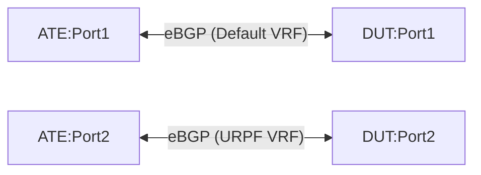

# TE-6.5: Community-based dynamic route-leaking between VRFs

## Objective

Validate the router's (DUT) capability to dynamically leak routes between VRFs (Virtual Routing and Forwarding instances) based on BGP communities. Specifically, this test verifies that routing information can be dynamically exported from the Default/Global routing instance to a non-default URPF VRF when the routes contain any of the following standard BGP communities:

*   `64500:10100` (COMMUNITY_INTERNAL)
*   `64500:10110` (COMMUNITY_EXTERNAL)
*   `64500:10730` (COMMUNITY_PARTNER_A)
*   `64500:10740` (COMMUNITY_PARTNER_B)

The leaked routes must retain all relevant BGP attributes (such as MED, AS path, Local Pref, etc.) during the VRF leaking process.

## Testbed Type

*   [`featureprofiles/topologies/atedut_2.testbed`](https://github.com/openconfig/featureprofiles/blob/main/topologies/atedut_2.testbed)

## Topology



*   **DUT:Port1**: Belongs to the Default/Global network instance.
*   **DUT:Port2**: Belongs to a non-default URPF network instance.
*   **ATE:Port1**: Peers with the DUT in the Default network instance.
*   **ATE:Port2**: Peers with the DUT in the URPF network instance.

---

## Procedure

### DUT Configuration

1.  Create a non-default VRF named `URPF` with `L3VRF` type.
2.  Assign DUT:Port2 to the `URPF` network instance. Keep DUT:Port1 in the Default network instance.
3.  Configure eBGP sessions:
    *   Global BGP session between DUT:Port1 (AS 65003) and ATE:Port1 (AS 65001).
    *   BGP session in `URPF` VRF between DUT:Port2 (AS 65003) and ATE:Port2 (AS 65002).
4.  Configure a BGP community set containing the standard communities:
    *   `64500:10100`
    *   `64500:10110`
    *   `64500:10730`
    *   `64500:10740`
5.  Configure a routing policy that matches any community in the defined set, and dynamically imports matching routes from the Default instance into the `URPF` instance, retaining BGP attributes. Apply this import policy to the `URPF` network instance.

### ATE Configuration

*   Peering sessions:
    *   **Session 1**: ATE:Port1 (AS 65001) peers to DUT:Port1.
    *   **Session 2**: ATE:Port2 (AS 65002) peers to DUT:Port2.
*   **ATE Traffic flow**:
    *   Traffic is generated from ATE:Port2 (URPF) to the prefixes advertised by ATE:Port1 (Default).
    *   PPS: 10,000, frame size: 256 bytes.

---

### Test Cases

#### TE-6.5.1: Dynamic Route Leak on BGP Community Match

1.  From ATE:Port1, advertise a list of prefixes (e.g., `100.1.1.0/24` and `2001:db8:1::/48`) containing one of the matching communities (e.g., `64500:10100`).
2.  Verify using state paths that the advertised routes are installed in both the Default routing instance table and dynamically imported into the `URPF` routing instance table.
3.  Initiate traffic from ATE:Port2 to the advertised prefixes.
4.  **Verification**:
    *   DUT dynamically leaks the matching routes to URPF.
    *   Traffic flows with 0% packet loss.
    *   Leaked routes on the DUT URPF instance retain their BGP attributes (MED and AS path must match the ones advertised from ATE:Port1).

#### TE-6.5.2: No Route Leak on Community Absence

1.  From ATE:Port1, advertise a new list of prefixes (e.g., `100.2.2.0/24` and `2001:db8:2::/48`) containing either *no communities* or a non-matching community (e.g., `64500:9999`).
2.  Verify that the routes are installed in the Default instance but *not* imported/leaked into the `URPF` VRF table.
3.  Initiate traffic from ATE:Port2 to these prefixes.
4.  **Verification**:
    *   No routes are leaked.
    *   100% traffic loss is observed.

#### TE-6.5.3: Dynamic Route Removal on Community Withdrawal

1.  Update the advertisements from ATE:Port1 in case **TE-6.5.1** by withdrawing the matching BGP community from the routes.
2.  Verify that the routes are dynamically removed from the URPF routing table (retaining them only in the Default instance routing table).
3.  Initiate traffic from ATE:Port2 to the prefixes.
4.  **Verification**:
    *    Leaked routes are dynamically withdrawn and removed.
    *   100% traffic loss is observed.

---

## Canonical OC

```json
{
  "network-instances": {
    "network-instance": [
      {
        "name": "DEFAULT",
        "config": {
          "name": "DEFAULT",
          "type": "DEFAULT_INSTANCE"
        }
      },
      {
        "name": "URPF",
        "config": {
          "name": "URPF",
          "type": "L3VRF"
        },
        "inter-instance-policies": {
          "apply-policy": {
            "config": {
              "import-policy": ["leak-matching-communities"]
            }
          }
        }
      }
    ]
  },
  "routing-policy": {
    "defined-sets": {
      "bgp-defined-sets": {
        "community-sets": {
          "community-set": [
            {
              "community-set-name": "leak-communities",
              "config": {
                "community-set-name": "leak-communities",
                "community-member": [
                  "64500:10100",
                  "64500:10110",
                  "64500:10730",
                  "64500:10740"
                ]
              }
            }
          ]
        }
      }
    },
    "policy-definitions": {
      "policy-definition": [
        {
          "name": "leak-matching-communities",
          "config": {
            "name": "leak-matching-communities"
          },
          "statements": {
            "statement": [
              {
                "name": "leak-rule",
                "config": {
                  "name": "leak-rule"
                },
                "conditions": {
                  "bgp-conditions": {
                    "match-community-set": {
                      "config": {
                        "community-set": "leak-communities",
                        "match-set-options": "ANY"
                      }
                    }
                  }
                },
                "actions": {
                  "config": {
                    "policy-result": "ACCEPT_ROUTE"
                  }
                }
              }
            ]
          }
        }
      ]
    }
  }
}
```

## OpenConfig Path and RPC Coverage

```yaml
paths:
  /network-instances/network-instance/config/type:
  /network-instances/network-instance/inter-instance-policies/apply-policy/config/import-policy:
  /routing-policy/defined-sets/bgp-defined-sets/community-sets/community-set/config/community-member:
  /routing-policy/policy-definitions/policy-definition/statements/statement/conditions/bgp-conditions/match-community-set/config/community-set:
  /routing-policy/policy-definitions/policy-definition/statements/statement/conditions/bgp-conditions/match-community-set/config/match-set-options:
  /routing-policy/policy-definitions/policy-definition/statements/statement/actions/config/policy-result:

rpcs:
  gnmi:
    gNMI.Get:
    gNMI.Set:
    gNMI.Subscribe:
```

## Required DUT Platform

*   FFF
*   MFF
