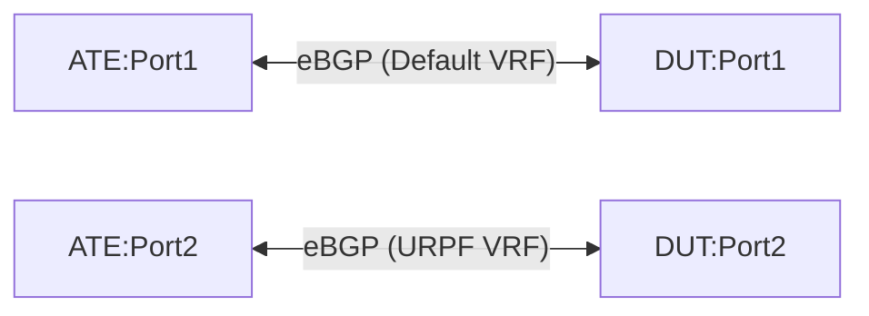

# TE-6.5: Community-based dynamic route-leaking between VRFs

## Objective

Validate the router's (DUT) capability to dynamically leak routes between VRFs (Virtual Routing and Forwarding instances) based on BGP communities. Specifically, this test verifies that routing information can be dynamically exported from the Default/Global routing instance to a non-default URPF VRF when the routes contain any of the following standard BGP communities:

*   `64500:1` (COMMUNITY_1)
*   `64500:2` (COMMUNITY_2)

The leaked routes must retain all relevant BGP attributes (such as MED, AS path, Local Pref, etc.) during the VRF leaking process.

The routing policy imports a route if it matches **ANY** of the communities in the configured set (logical OR). This test ensures proper route leaking under single matches, compound matches, and partial community withdrawals.

## Testbed Type

*   [`featureprofiles/topologies/atedut_2.testbed`](https://github.com/openconfig/featureprofiles/blob/main/topologies/atedut_2.testbed)

## Topology



*   **DUT:Port1**: Belongs to the Default/Global network instance.
*   **DUT:Port2**: Belongs to a non-default URPF network instance.
*   **ATE:Port1**: Peers with the DUT in the Default network instance.
*   **ATE:Port2**: Peers with the DUT in the URPF network instance.

---

## Procedure

### DUT Configuration

1.  Create a non-default VRF named `URPF` with `L3VRF` type.
2.  Assign DUT:Port2 to the `URPF` network instance. Keep DUT:Port1 in the Default network instance.
3.  Configure eBGP sessions:
    *   Global BGP session between DUT:Port1 (AS 64498) and ATE:Port1 (AS 64496).
    *   BGP session in `URPF` VRF between DUT:Port2 (AS 64498) and ATE:Port2 (AS 64497).
4.  Configure a BGP community set containing the standard communities:
    *   `64500:1`
    *   `64500:2`
5.  Configure a routing policy that matches any community in the defined set, and dynamically imports matching routes from the Default instance into the `URPF` instance, retaining BGP attributes. Apply this import policy to the `URPF` network instance.

### ATE Configuration

*   Peering sessions:
    *   **Session 1**: ATE:Port1 (AS 64496) peers to DUT:Port1.
    *   **Session 2**: ATE:Port2 (AS 64497) peers to DUT:Port2.
*   **ATE Traffic flow**:
    *   Traffic is generated from ATE:Port2 (URPF) to the prefixes advertised by ATE:Port1 (Default).
    *   PPS: 10,000, frame size: 256 bytes.

---

### Test Cases

#### TE-6.5.1: Dynamic Route Leak on BGP COMMUNITY_1 Match

1.  From ATE:Port1, advertise a list of prefixes (e.g., `192.0.2.0/24` and `2001:db8:1::/48`) containing BGP community `64500:1`.
2.  Verify using state paths that the advertised routes are installed in both the Default routing instance table and dynamically imported into the `URPF` routing instance table.
3.  Initiate traffic from ATE:Port2 to the advertised prefixes.
4.  **Verification**:
    *   DUT dynamically leaks the routes containing `64500:1` to URPF.
    *   Traffic flows with 0% packet loss.
    *   Leaked routes on the DUT URPF instance retain their BGP attributes (MED and AS path must match the ones advertised from ATE:Port1).

#### TE-6.5.2: Dynamic Route Leak on BGP COMMUNITY_2 Match

1.  From ATE:Port1, advertise a new list of prefixes (e.g., `198.51.100.0/24` and `2001:db8:2::/48`) containing BGP community `64500:2`.
2.  Verify that the routes are dynamically imported into the `URPF` VRF table.
3.  Initiate traffic from ATE:Port2 to these prefixes.
4.  **Verification**:
    *   DUT dynamically leaks the routes containing `64500:2` to URPF.
    *   Traffic flows with 0% packet loss.

#### TE-6.5.3: Dynamic Route Leak on Compound Match (Both Communities)

1.  From ATE:Port1, advertise prefixes (e.g., `203.0.113.0/24` and `2001:db8:3::/48`) containing *both* communities `64500:1` and `64500:2`.
2.  Verify using state paths that the routes are installed dynamically in the URPF routing instance table.
3.  Initiate traffic from ATE:Port2 to these prefixes.
4.  **Verification**:
    *   DUT dynamically leaks the routes containing both communities to URPF.
    *   Traffic flows with 0% packet loss.

#### TE-6.5.4: Route Retention on Partial Community Withdrawal

1.  Start with routes advertised in **TE-6.5.3** (containing both `64500:1` and `64500:2` and leaked to URPF).
2.  Withdraw the community `64500:1` from the advertisements, while keeping `64500:2` attached to the prefixes.
3.  Verify that the routes are *retained* in the URPF routing table, as they still match `64500:2`.
4.  Initiate traffic from ATE:Port2.
5.  **Verification**:
    *   Leaked routes are retained post partial community withdrawal.
    *   Traffic continues to flow with 0% packet loss.

#### TE-6.5.5: Dynamic Route Removal on Complete Community Withdrawal

1.  Start with routes from **TE-6.5.4** (now containing only `64500:2`).
2.  Withdraw the remaining community `64500:2` from the advertised prefixes (so the routes no longer have any matching communities).
3.  Verify that the routes are dynamically removed from the URPF routing table (remaining only in the Default instance routing table).
4.  Initiate traffic from ATE:Port2.
5.  **Verification**:
    *   Leaked routes are dynamically withdrawn and removed.
    *   100% traffic loss is observed.

---

## Canonical OC

```json
{
  "network-instances": {
    "network-instance": [
      {
        "name": "DEFAULT",
        "config": {
          "name": "DEFAULT",
          "type": "DEFAULT_INSTANCE"
        }
      },
      {
        "name": "URPF",
        "config": {
          "name": "URPF",
          "type": "L3VRF"
        },
        "inter-instance-policies": {
          "apply-policy": {
            "config": {
              "import-policy": ["leak-matching-communities"]
            }
          }
        }
      }
    ]
  },
  "routing-policy": {
    "defined-sets": {
      "bgp-defined-sets": {
        "community-sets": {
          "community-set": [
            {
              "community-set-name": "leak-communities",
              "config": {
                "community-set-name": "leak-communities",
                "community-member": [
                  "64500:1",
                  "64500:2"
                ]
              }
            }
          ]
        }
      }
    },
    "policy-definitions": {
      "policy-definition": [
        {
          "name": "leak-matching-communities",
          "config": {
            "name": "leak-matching-communities"
          },
          "statements": {
            "statement": [
              {
                "name": "leak-rule",
                "config": {
                  "name": "leak-rule"
                },
                "conditions": {
                  "bgp-conditions": {
                    "match-community-set": {
                      "config": {
                        "community-set": "leak-communities",
                        "match-set-options": "ANY"
                      }
                    }
                  }
                },
                "actions": {
                  "config": {
                    "policy-result": "ACCEPT_ROUTE"
                  }
                }
              }
            ]
          }
        }
      ]
    }
  }
}
```

## OpenConfig Path and RPC Coverage

```yaml
paths:
  /network-instances/network-instance/config/type:
  /network-instances/network-instance/inter-instance-policies/apply-policy/config/import-policy:
  /routing-policy/defined-sets/bgp-defined-sets/community-sets/community-set/config/community-member:
  /routing-policy/policy-definitions/policy-definition/statements/statement/conditions/bgp-conditions/match-community-set/config/community-set:
  /routing-policy/policy-definitions/policy-definition/statements/statement/conditions/bgp-conditions/match-community-set/config/match-set-options:
  /routing-policy/policy-definitions/policy-definition/statements/statement/actions/config/policy-result:

rpcs:
  gnmi:
    gNMI.Get:
    gNMI.Set:
    gNMI.Subscribe:
```

## Required DUT Platform

*   FFF
*   MFF
