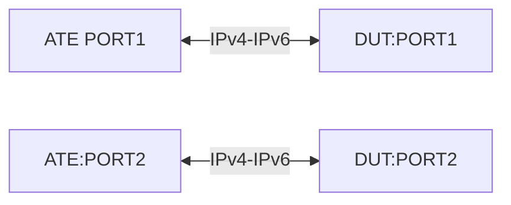

# TE-6.3: Route Leakage between Non Default VRF

## Summary

Validate that Route leakage from VRF-1 to VRF-2 is possible and is able to 
.

## Testbed type

* [`featureprofiles/topologies/atedut_2.testbed`](https://github.com/openconfig/featureprofiles/blob/main/topologies/atedut_2.testbed)

## Topology:



## Procedure

### Initial setup

*   Connect ATE port-1 to DUT port-1, and ATE port-2 to DUT port-2.
*   Configure 192.1.1.1/30 to DUT port-1 and 192.1.1.2/30 to ATE port-1 and 
    Configure 192.1.1.4/30 to DUT port-2 and 192.1.1.5/30 to ATE port-2
*   Create a non-default VRF (VRF-1) that includes DUT port-1 and create
    another non-default VRF (VRF-2) that includes DUT port-2.
*   Configure eBGP from ATE port-1 (AS 65001) to DUT port-1 (AS 65003) and also 
    from ATE port-2 (AS 65003) to DUT port-2 (AS 65002)
*   Advertise 50.1.1.0/24 route from ATE-port1 using the eBGP session. Advertise
    60.1.1.0/24 route from ATE-port2 using the eBGP session.
*   Configure a bi-directional traffic flow with following parameters
    Src: 50.1.1.0/24 & Dst: 60.1.1.0/24 and vice-versa
    Traffic: PPS of 10,000 packets per second, Frame size of 256 bytes

### TE-6.3.1

*   Start the protocols from ATE-port1 and ATE-port2 
*   Verify that 50.1.1.0/24 is installed in VRF-1 routing-instance and 
    60.1.1.0/24 is installed in VRF-2 routing-instance.
*   Start the traffic from ATE-port1 and ATE-port2
*   Validate that there is 100% traffic loss seen as the VRF-1 routes are 
    reachable by VRF-2 routes and vice-versa.

### TE-6.3.2
*   Leak the route 50.1.1.0/24 from VRF-1 routing-instance of ATE-port1 to
    VRF-2 routing-instance.
*   Leak the route 60.1.1.0/24 from VRF-2 routing-instance of ATE-port2 to
    VRF-1 routing-instance.
*   Start the protocols from ATE-port1 and ATE-port2 
*   Verify that 50.1.1.0/24 is installed in VRF-1 routing-instance and 
    60.1.1.0/24 is installed in VRF-2 routing-instance.
*   Start the traffic from ATE-port1 and ATE-port2
*   Validate that traffic is flowing in both directions with 0% traffic loss.

## Canonical OC
```json
 {
  "network-instances": {
    "openconfig-network-instance:network-instance": [
      {
        "config": {
          "name": "VRF-1",
          "type": "openconfig-network-instance-types:L3VRF"
        },
        "name": "VRF-1",
        "protocols": {
          "protocol": [
            {
              "bgp": {
                "global": {
                  "afi-safis": {
                    "afi-safi": [
                      {
                        "afi-safi-name": "openconfig-bgp-types:IPV4_UNICAST",
                        "config": {
                          "afi-safi-name": "openconfig-bgp-types:IPV4_UNICAST",
                          "enabled": true
                        }
                      }
                    ]
                  },
                  "config": {
                    "as": 65003,
                    "router-id": "192.1.1.1"
                  }
                },
                "neighbors": {
                  "neighbor": [
                    {
                      "afi-safis": {
                        "afi-safi": [
                          {
                            "add-paths": {
                              "config": {
                                "receive": true,
                                "send": true
                              }
                            },
                            "afi-safi-name": "openconfig-bgp-types:IPV4_UNICAST",
                            "config": {
                              "afi-safi-name": "openconfig-bgp-types:IPV4_UNICAST",
                              "enabled": true
                            },
                            "graceful-restart": {},
                            "ipv4-unicast": {
                              "config": {
                                "send-default-route": true
                              },
                              "prefix-limit": {},
                              "prefix-limit-received": {}
                            }
                          },
                          {
                            "add-paths": {
                              "config": {
                                "receive": true,
                                "send": true
                              }
                            },
                            "afi-safi-name": "openconfig-bgp-types:IPV6_UNICAST",
                            "config": {
                              "afi-safi-name": "openconfig-bgp-types:IPV6_UNICAST",
                              "enabled": true
                            },
                            "graceful-restart": {},
                            "ipv6-unicast": {
                              "config": {
                                "send-default-route": true
                              },
                              "prefix-limit": {},
                              "prefix-limit-received": {}
                            }
                          }
                        ]
                      },
                      "apply-policy": {
                        "config": {
                          "default-export-policy": "ACCEPT_ROUTE",
                          "default-import-policy": "ACCEPT_ROUTE"
                        }
                      },
                      "config": {
                        "neighbor-address": "192.1.1.2",
                        "peer-as": 65001
                      },
                      "ebgp-multihop": {
                        "config": {
                          "multihop-ttl": 0
                        }
                      },
                      "neighbor-address": "192.1.1.2"
                    }
                  ]
                }
              },
              "config": {
                "identifier": "openconfig-policy-types:BGP",
                "name": "BGP"
              },
              "identifier": "openconfig-policy-types:BGP",
              "name": "BGP"
            }
          ]
        }
      },
      {
        "config": {
          "name": "VRF-2",
          "type": "openconfig-network-instance-types:L3VRF"
        },
        "name": "VRF-2",
        "protocols": {
          "protocol": [
            {
              "bgp": {
                "global": {
                  "afi-safis": {
                    "afi-safi": [
                      {
                        "afi-safi-name": "openconfig-bgp-types:IPV4_UNICAST",
                        "config": {
                          "afi-safi-name": "openconfig-bgp-types:IPV4_UNICAST",
                          "enabled": true
                        }
                      }
                    ]
                  },
                  "config": {
                    "as": 65002,
                    "router-id": "192.1.1.5"
                  }
                },
                "neighbors": {
                  "neighbor": [
                    {
                      "afi-safis": {
                        "afi-safi": [
                          {
                            "add-paths": {
                              "config": {
                                "receive": true,
                                "send": true
                              }
                            },
                            "afi-safi-name": "openconfig-bgp-types:IPV4_UNICAST",
                            "config": {
                              "afi-safi-name": "openconfig-bgp-types:IPV4_UNICAST",
                              "enabled": true
                            },
                            "graceful-restart": {},
                            "ipv4-unicast": {
                              "config": {
                                "send-default-route": true
                              },
                              "prefix-limit": {},
                              "prefix-limit-received": {}
                            }
                          },
                          {
                            "add-paths": {
                              "config": {
                                "receive": true,
                                "send": true
                              }
                            },
                            "afi-safi-name": "openconfig-bgp-types:IPV6_UNICAST",
                            "config": {
                              "afi-safi-name": "openconfig-bgp-types:IPV6_UNICAST",
                              "enabled": true
                            },
                            "graceful-restart": {},
                            "ipv6-unicast": {
                              "config": {
                                "send-default-route": true
                              },
                              "prefix-limit": {},
                              "prefix-limit-received": {}
                            }
                          }
                        ]
                      },
                      "apply-policy": {
                        "config": {
                          "default-export-policy": "ACCEPT_ROUTE",
                          "default-import-policy": "ACCEPT_ROUTE"
                        }
                      },
                      "config": {
                        "neighbor-address": "192.1.1.6",
                        "peer-as": 65003
                      },
                      "ebgp-multihop": {
                        "config": {
                          "multihop-ttl": 0
                        }
                      },
                      "neighbor-address": "192.1.1.6"
                    }
                  ]
                }
              },
              "config": {
                "identifier": "openconfig-policy-types:BGP",
                "name": "BGP"
              },
              "identifier": "openconfig-policy-types:BGP",
              "name": "BGP"
            }
          ]
        }
      }
    ]
  }
}
```

## OpenConfig Path and RPC Coverage

```yaml
rpcs:
  gnmi:
    gNMI.Get:
    gNMI.Set:
    gNMI.Subscribe:

paths:
    /network-instances/network-instance/config/name:
    /network-instances/network-instance/config/description:
    
    /network-instances/network-instance/state/name:
    /network-instances/network-instance/state/description:
```

## Minimum DUT platform requirement

FFF
