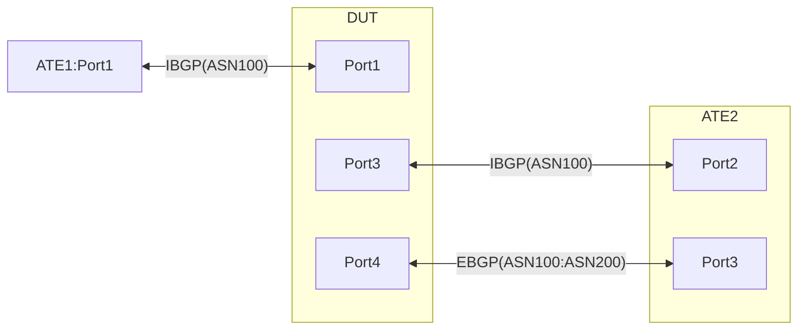

# RT-3.32: DSCP based traffic steering from Non-default VRF to Default VRF using Policy based VRF selection plus GUE DECAP and ENCAP

## Summary
This test is extension from RT-3.31. In this case, traffic is gradually moved from the Non-default VRF to the Default VRF per traffic class and then in the Default VRF it is Static GUE encaped.<br><br><br> 

## Testbed type
  [atedut_4.binding](https://github.com/openconfig/featureprofiles/blob/main/topologies/atedut_4.binding)


## Procedure
Test environment setup<br><br>

### Topology
Create the following connections:


### Advertisements:
   * ATE1:Port1 advertises following prefixes over IBGP to DUT:Port1. These Prefixes will have the Default Local Preference of 100
     * IPv4Prefix1/24 IPv6Prefix1/64
     * IPv4Prefix2/24 IPv6Prefix2/64
     * IPv4Prefix3/24 IPv6Prefix3/64
     * IPv4Prefix4/24 IPv6Prefix4/64
     * IPv4Prefix5/24 IPv6Prefix5/64<br>

   * ATE2:Port3 and DUT:Port4 form EBGP neighborship between each other over on respective AFI-SAFI connections and advertise the following prefixes
     * From ATE2:Port3 to DUT:Port4
       * IPv4Prefix11/28 <<-- [Pretending as if ATE2 learnt ATE1's Tunnel endpoint over their imaginary EBGP session]
       * IPv4Prefix15, IPv6Prefix15
       * IPv4Prefix6/24 IPv6Prefix6/64
       * IPv4Prefix7/24 IPv6Prefix7/64
       * IPv4Prefix8/24 IPv6Prefix8/64
       * IPv4Prefix9/24 IPv6Prefix9/64
       * IPv4Prefix10/24 IPv6Prefix10/64
     * From DUT:Port4 to ATE2:Port3
       * IPv4Prefix12/28
       * IPv4Prefix14, IPv6Prefix14
       * All the IBGP learnt prefixes from Prefix1 to Prefix5<br>
         
   * ATE2:Port2 and DUT:Port3 form IBGP neighborship between each other over Prefix14 and Prefix15 on the respective AFI-SAFI
     * **[Important: Please note]** Following advertisements must happen only during the test one at a time as instructed<br>

       ATE2:Port2 advertises the following prefixes to DUT:Port3 with a higher Local-Preference of 200. ATE2:Port2 also must change the next-hop on the advertised prefixes to IPv4Prefix17 and IPv6Prefix17 based on the AFI type. Prefix17 in this case is called as the Virtual Protocol Next-hop (VPNH).
       * IPv4Prefix1/24 IPv6Prefix1/64    &nbsp; &nbsp; <-- ***To be adverised during RT-3.32.2 to RT-3.32.6***
       * IPv4Prefix2/24 IPv6Prefix2/64    &nbsp; &nbsp; <-- ***To be adverised during RT-3.32.3 to RT-3.32.6***
       * IPv4Prefix3/24 IPv6Prefix3/64    &nbsp; &nbsp; <-- ***To be adverised during RT-3.32.4 to RT-3.32.6***
       * IPv4Prefix4/24 IPv6Prefix4/64    &nbsp; &nbsp; <-- ***To be adverised during RT-3.32.5 to RT-3.32.6***
       * IPv4Prefix5/24 IPv6Prefix5/64    &nbsp; &nbsp; <-- ***To be adverised during RT-3.32.6 to RT-3.32.6***<br>

   * DUT Must have a Static GUE encap configuration that routes all traffic to the VPNH addresses IPv4Prefix17 and IPv6Prefix17 to ATE1:Port1's tunnel endpoint "IPv4Prefix11/28" which is advertised by ATE2:Port3 to DUT:Port4. Please note here that the IPv6 destination address is also pointing at a IPv4 Next-hop. An implemetation can opt to covert the nexthop to IPv4 mapped IPv6 address internally.<br>
     
   * Configure the DUT to rewrite the TOS byte of GUE encaped traffic destined to "IPv4Prefix11/28" in its egress path towards ATE2:Port3. Following rewrite rule
     
  | Match Condition                           | Outer Header DSCP Set to: |
  |-------------------------------------------|---------------------------|
  | DSCP value BE1, Destination IPv4Prefix11/28"                         | 3                         |
  | DSCP value AF1, Destination IPv4Prefix11/28"                         | 11                        |
  | DSCP value AF2, Destination IPv4Prefix11/28"                         | 19                        |
  | DSCP value AF3, Destination IPv4Prefix11/28"                         | 27                        |
  | DSCP value AF4, Destination IPv4Prefix11/28"                         | 35                        |

* Please also ensure that the TTL value from the inner header is copied to the outer header and decremented before forwarding out.<br>

   * DUT has a GUE decap configuration to decap all GUE Encaped traffic destined to IPv4Prefix12/28. While Decaping, the TTL value from outer header is copied to the inner header.<br>
     
   * DUT has 2 VRFs, Default and Non-Default. Configure Route leaking from the Default to the Non-default VRF to share reachability between VRFs. However, ensure there is no leaking of IBGP learnt routes from ATE2:Port2<br><br>


### Flows:

Flows from ATE2:Port3 to DUT:Port4
   
   * Following are GUE encaped with Tunnel destination as IPv4Prefix12/28. ATE2 pretends these GUE encaped flows to be received from ATE1 via their imaginary EBGP session and then forwards to DUT:Port4
       * IPv4Prefix1/24 to IPv4Prefix6/24 [DSCP:BE1]
       * IPv6Prefix1/64 to IPv6Prefix6/64 [DSCP:BE1]
       * IPv4Prefix2/24 to IPv4Prefix7/24 [DSCP:AF1]
       * IPv6Prefix2/64 to IPv6Prefix7/64 [DSCP:AF1]
       * IPv4Prefix3/24 to IPv4Prefix8/24 [DSCP:AF2]
       * IPv6Prefix3/64 to IPv6Prefix8/64 [DSCP:AF2]
       * IPv4Prefix4/24 to IPv4Prefix9/24 [DSCP:AF3]
       * IPv6Prefix4/64 to IPv6Prefix9/64 [DSCP:AF3]
       * IPv4Prefix5/24 to IPv4Prefix10/24 [DSCP:AF4]
       * IPv6Prefix5/64 to IPv6Prefix10/64 [DSCP:AF4]

   * Unencaped Flows from ATE2:Port3 to ATE1:Port1
       * IPv4Prefix6/24 to IPv4Prefix1/24 [DSCP:BE1]
       * IPv6Prefix6/64 to IPv6Prefix1/64 [DSCP:BE1]
       * IPv4Prefix7/24 to IPv4Prefix2/24 [DSCP:AF1]
       * IPv6Prefix7/64 to IPv6Prefix2/64 [DSCP:AF1]
       * IPv4Prefix8/24 to IPv4Prefix3/24 [DSCP:AF2]
       * IPv6Prefix8/64 to IPv6Prefix3/64 [DSCP:AF2]
       * IPv4Prefix9/24 to IPv4Prefix4/24 [DSCP:AF3]
       * IPv6Prefix9/64 to IPv6Prefix4/64 [DSCP:AF3]
       * IPv4Prefix10/24 to IPv4Prefix5/24 [DSCP:AF4]
       * IPv6Prefix10/64 to IPv6Prefix5/64 [DSCP:AF4]<br><br><br>

### Following Health checks to be run Pre and Post every sub test
  * No system/kernel/process/component coredumps
  * No high CPU spike or usage on control or forwarding plane
  * No high memory utilization or usage on control or forwarding plane
  * No processes/daemons high CPU/Memory utilization
  * No generic drop counters
    * QUEUE drops
    * Interfaces
    * VOQ
    * Fabric drops
    * ASIC drops
  * No flow control frames tx/rx
  * No CRC or Layer 1 errors on interfaces
  * No config commit errors
  * No system level alarms
  * In spec hardware should be in proper state
    * No hardware errors
    * Major Alarms
  * No HW component or SW processes crash
Openconfig-paths for the above are covered in the `OpenConfig Path and RPC Coverage` section below<br><br><br>


**RT-3.32.1: [Baseline] Traffic flow between ATE1:Port1 and ATE2:Port1 via DUT's Default VRF**
  * Please run all the health checks suggested above prior to starting the test as a baseline.
  * Start all the Flows from ATE2:Port3 to DUT:Port4 both GUE encaped as well as unencaped.
  * DUT has the following VRF selection policy
    * Statement1: traffic matching tunnel-destination "IPv4Prefix12/28", Punt to default vrf
    * Statement2: traffic matching DSCP BE1, Punt to Non-default vrf
    * Statement3: traffic matching DSCP AF1, Punt to Non-default vrf
    * Statement4: traffic matching DSCP AF2, Punt to Non-default vrf
    * Statement5: traffic matching DSCP AF3, Punt to Non-default vrf
    * Statement5: traffic matching DSCP AF4, Punt to Non-default vrf<br>
  * Expectations:
    * All GUE encaped traffic received in the Default VRF destined for IPv4Prefix12/28 is decaped and sent back to ATE2:Port3 based on LPM lookup of EBGP learnt routes. Ensure that the DSCP vaule from Outer header is copied to the inner header. Also, ensure that the TTL value of the inner header is accurate and is the same as what it was prior to encap.
    * Unencaped BE1-AF4 traffic received from ATE2:Port3 must be routed to ATE1:Port1 via the DEFAULT VRF in the DUT based on LPM lookup of the IBGP learnt routes.
    * Run post test Health checks above to ensure no anomalies<br><br><br>

    
**RT-3.32.2: BE1 traffic migration to Default VRF, GUE encap and then route to ATE2:Port3**
  * Please run all the health checks suggested above prior to starting the test as a baseline.
  * DUT has the following VRF selection policy
    * Statement1: traffic matching tunnel-destination "IPv4Prefix12/28", Punt to default vrf
    * Statement2: traffic matching DSCP BE1, Punt to default vrf
    * Statement3: traffic matching DSCP AF1, Punt to Non-default vrf
    * Statement4: traffic matching DSCP AF2, Punt to Non-default vrf
    * Statement5: traffic matching DSCP AF3, Punt to Non-default vrf
    * Statement5: traffic matching DSCP AF4, Punt to Non-default vrf
  * Configure the IBGP peering on ATE2:Port2 to advertise the following
    * IPv4Prefix1/24, IPv6Prefix1/64 with a local-preference of 200 and VPNH of IPv4Prefix17 and IPv6Prefix17
  * Start all the Flows from ATE2:Port3 to DUT:Port4, both GUE encaped as well as unencaped.<br>
  * Expectations:
    * All GUE encaped traffic received in the Default VRF destined for IPv4Prefix12/28 is decaped and sent back to ATE2:Port3 based on LPM lookup of EBGP learnt routes. Ensure that the DSCP vaule from Outer header is copied to the inner header. Also, ensure that the TTL value of the inner header is accurate and is the same as what it was prior to encap.
    * Unencaped BE1 traffic is punted to default VRF and then GUE encaped to IPv4Prefix11/28, its TOS Byte updated as per the table above plus, ttl value from the inner header is copied to the outer header.
    * Unencaped AF1-AF4 traffic received from ATE2:Port3 must be routed to ATE1:Port1 via the DEFAULT VRF in the DUT based on LPM lookup of the IBGP learnt routes from ATE1:Port1.
    * All traffic flows must be 100% successful.
    * Run post test Health checks above to ensure no anomalies<br><br><br>

     
**RT-3.32.3: BE1-AF1 traffic migration to Default VRF, GUE encap and then route to ATE2:Port3**
  * Please run all the health checks suggested above prior to starting the test as a baseline.
  * DUT has the following VRF selection policy
    * Statement1: traffic matching tunnel-destination "IPv4Prefix12/28", Punt to default vrf
    * Statement2: traffic matching DSCP BE1, Punt to default vrf
    * Statement3: traffic matching DSCP AF1, Punt to default vrf
    * Statement4: traffic matching DSCP AF2, Punt to Non-default vrf
    * Statement5: traffic matching DSCP AF3, Punt to Non-default vrf
    * Statement5: traffic matching DSCP AF4, Punt to Non-default vrf
  * Configure the IBGP peering on ATE2:Port2 to advertise the following
    * IPv4Prefix1/24, IPv6Prefix1/64, IPv4Prefix1/24, IPv6Prefix1/64 with a local-preference of 200 and VPNH of IPv4Prefix17 and IPv6Prefix17
  * Start all the Flows from ATE2:Port3 to DUT:Port4, both GUE encaped as well as unencaped.<br>
  * Expectations:
    * All GUE encaped traffic received in the Default VRF destined for IPv4Prefix12/28 is decaped and sent back to ATE2:Port3 based on LPM lookup of EBGP learnt routes. Ensure that the DSCP vaule from Outer header is copied to the inner header. Also, ensure that the TTL value of the inner header is accurate and is the same as what it was prior to encap.
    * Unencaped BE1-AF1 traffic is punted to default VRF and then GUE encaped to IPv4Prefix11/28, its TOS Byte updated as per the table above plus, ttl value from the inner header is copied to the outer header.
    * Unencaped AF2-AF4 traffic received from ATE2:Port3 must be routed to ATE1:Port1 via the DEFAULT VRF in the DUT based on LPM lookup of the IBGP learnt routes from ATE1:Port1.
    * Run post test Health checks above to ensure no anomalies<br><br><br>

**RT-3.32.4 to RT-3.32.6: BE1-AF4 traffic migration to Default VRF, GUE encap and then route to ATE2:Port3**
  * Follow RT-3.32.2 and RT-3.32.3 for migrating rest of the traffic i.e. AF2-AF3 to Default VRF, encap, remark and send out DUT:Port4 towards ATE2:Port3

**RT-3.32.7: BE1-AF4 traffic fallback to DUT:Port1 towards ATE1:Port1**
  * Please run all the health checks suggested above prior to starting the test as a baseline.
  * Start all traffic flows
  * Stop advertising "Prefix14 and Prefix15 over the EBGP session between DUT:Port4 and ATE2:Port3. This will result in the IBGP session via DUT:Port3 and ATE2:Port2 to be down.<br>

  * Expectations:
    * Zero traffic loss expected as the unencaped BE1-AF4 traffic flows from ATE2:Port3 is expected to be routed by the DUT via the lower local-preference routes that the DUT learnt on its IBGP peering with ATE1:Port1.
    * Run post test Health checks above to ensure no anomalies<br><br>

## To Dos:

Following paths yet to be defied in Yang

  1. `/network-instances/network-instance/inter-instance-policies` is missing option to configure "export-to" or "import-from" VRF`
  
  2. Configuring the IPv4oUDP encapsulation/decapsulation is dependent on the proposal in https://github.com/openconfig/public/pull/1153<br><br>
  

## OpenConfig Path and RPC Coverage
```yaml
paths:
  # Policy for route leaking between VRFs
  /network-instances/network-instance/inter-instance-policies/apply-policy
  # Following applied in Default VRF
  /network-instances/network-instance/inter-instance-policies/apply-policy/config/export-policy
  # Following applied in Non-default VRF
  /network-instances/network-instance/inter-instance-policies/apply-policy/config/import-policy

  # Config for VRF selection
  # Create different VRFs: "Default or Non-default"
  /network-instances/network-instance/config/name:
  # Create VRF seletion policy with different rules that match on desination-prefix-set as first rule and then few other rules to match different Traffic-classes that determine BE1 to AF4 traffic
  /network-instances/network-instance/policy-forwarding/policies/policy-id: 
  /network-instances/network-instance/policy-forwarding/policies/policy/rules/rule/ipv4/config/destination-address-prefix-set:
  /network-instances/network-instance/policy-forwarding/policies/policy/rules/rule/ipv4/config/dscp-set:
  /network-instances/network-instance/policy-forwarding/policies/policy/rules/rule/ipv6/config/dscp-set:

  # Action that sets the VRF for matching conditions.
  /network-instances/network-instance/policy-forwarding/policies/policy/rules/rule/action/config/network-instance:

  # Creating the Prefix-Set required for the above VRF selection policy
  /routing-policy/defined-sets/prefix-sets/prefix-set/name:
  /routing-policy/defined-sets/prefix-sets/prefix-set/config/name:
  /routing-policy/defined-sets/prefix-sets/prefix-set/prefixes/prefix/config/ip-prefix:
  /routing-policy/defined-sets/prefix-sets/prefix-set/prefixes/prefix/config/masklength-range:

  # Apply VRF selection policy as per the Test procedure above
  /network-instances/network-instance/policy-forwarding/interfaces/interface/config/apply-vrf-selection-policy:

  # BGP configuration at the neighbor and peer-group levels
  /network-instances/network-instance/protocols/protocol/bgp/neighbors/peer-group/
  /network-instances/network-instance/protocols/protocol/bgp/neighbors/neighbor/config/neighbor-address
  /network-instances/network-instance/protocols/protocol/bgp/neighbors/neighbor/config/peer-as
  /network-instances/network-instance/protocols/protocol/bgp/neighbors/neighbor/config/local-as

  # BGP Policy definition for sharing of routes between IBGP and EBGP
  /routing-policy/policy-definitions/policy-definition/config/name
  /routing-policy/policy-definitions/policy-definition/statements/statement/config/name
  /routing-policy/policy-definitions/policy-definition/statements/statement/conditions/match-prefix-set/config/prefix-set
  /routing-policy/policy-definitions/policy-definition/statements/statement/conditions/match-prefix-set/config/match-set-options
  /routing-policy/policy-definitions/policy-definition/statements/statement/actions/config/policy-result/ACCEPT_ROUTE

  # Static route for VPNH for routes learnt via BGP. Routes MUST be in Default VRF and Protocol is Static
  /network-instances/network-instance/protocols/protocol/static-routes/static/config/prefix:
  /network-instances/network-instance/protocols/protocol/static-routes/ipv4/route/next-hops/next-hop/config/index
  /network-instances/network-instance/protocols/protocol/static-routes/ipv4/route/next-hops/next-hop/config/next-hop

  # Next-hop defined in the Static route above must lead to a IPv4oUDP encap to a destination learnt via EBGP
  <!-- Configuration for the NH above is dependent on the proposal in https://github.com/openconfig/public/pull/1153 -->

  # Config for policy-based Decap of IPv4oUDP packets
  /network-instances/network-instance/policy-forwarding/policies/policy/rules/rule/ipv4/config/destination-address-prefix-set
  /network-instances/network-instance/policy-forwarding/policies/policy/rules/rule/action/config/decapsulate-gue

  # State Paths:
  # Folliwing for normal health check pre and post each test
  /system/processes/process/state/cpu-utilization
  /system/processes/process/state/memory-utilization
  /qos/interfaces/interface/input/queues/queue/state/dropped-pkts
  /qos/interfaces/interface/output/queues/queue/state/dropped-pkts
  /qos/interfaces/interface/input/virtual-output-queues/voq-interface/queues/queue/state/dropped-pkts
  /interfaces/interface/state/counters/in-discards
  /interfaces/interface/state/counters/in-errors
  /interfaces/interface/state/counters/in-multicast-pkts
  /interfaces/interface/state/counters/in-unknown-protos
  /interfaces/interface/state/counters/out-discards
  /interfaces/interface/state/counters/out-errors
  /interfaces/interface/state/oper-status
  /interfaces/interface/state/admin-status
  /interfaces/interface/state/counters/out-octets
  /interfaces/interface/state/description
  /interfaces/interface/state/type
  /interfaces/interface/subinterfaces/subinterface/state/counters/in-discards
  /interfaces/interface/subinterfaces/subinterface/state/counters/in-errors
  /interfaces/interface/subinterfaces/subinterface/state/counters/in-unknown-protos
  /interfaces/interface/subinterfaces/subinterface/state/counters/out-discards
  /interfaces/interface/subinterfaces/subinterface/state/counters/out-errors
  /interfaces/interface/ethernet/state/counters/in-mac-pause-frames
  /interfaces/interface/ethernet/state/counters/out-mac-pause-frames
  /interfaces/interface/ethernet/state/counters/in-crc-errors
  /interfaces/interface/ethernet/state/counters/in-block-errors

  # IPv4oUDP Decap state
  /network-instances/network-instance/policy-forwarding/policies/policy/rules/rule/action/state/decapsulate-gue

  # BGP state paths
  /network-instances/network-instance/protocols/protocol/bgp/neighbors/neighbor/state/session-state
  /network-instances/network-instance/protocols/protocol/bgp/neighbors/neighbor/state/received-prefixes
  /network-instances/network-instance/protocols/protocol[identifier='BGP']/bgp/neighbors/neighbor/state/advertised-prefixes
  /network-instances/network-instance/protocols/protocol/bgp/neighbors/neighbor/state/peer-as

  # Packet counters matching forwarding rules for IPv4oUDP Decap
  /network-instances/network-instance/policy-forwarding/policies/policy/rules/rule/state/counters/forwarded-packets
  /network-instances/network-instance/policy-forwarding/policies/policy/rules/rule/state/counters/dropped-packets
  /network-instances/network-instance[name='<instance-name>']/policy-forwarding/state/active-policy
  /network-instances/network-instance/policy-forwarding/policies/policy/rules/rule/action/state/next-hop


rpcs:
  gnmi:
    gNMI.Set:
      union_replace: true
    gNMI.Subscribe:
      on_change: true
```

## Required DUT platform

* Specify the minimum DUT-type:
  * MFF - A modular form factor device containing LINECARDs, FABRIC and redundant CONTROLLER_CARD components
  * FFF - fixed form factor


