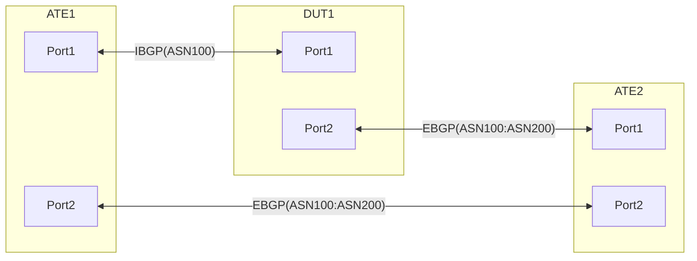

# RT-3.3: Multiple VRFs and GUE DECAP in Default VRF

## Summary
This test ensures NOS is able to host multiple VRFs and at the sametime perform GUE tunnel DECAP in the default VRF

## Procedure
Test environment setup

### Topology
Create the following connections:

### Advertisements:

	ATE1:Port1 advertises following prefixes over IBGP to DUT:Port1
		- IPv4Prefix1/24 IPv6Prefix1/64
		- IPv4Prefix2/24 IPv6Prefix2/64
		- IPv4Prefix3/24 IPv6Prefix3/64
		- IPv4Prefix4/24 IPv6Prefix4/64
		- IPv4Prefix5/24 IPv6Prefix5/64
	
	ATE2:Port1 advertieses following prefixes to DUT:Port2 over EBGP
		- IPv4Prefix6/24 IPv6Prefix6/64
		- IPv4Prefix7/24 IPv6Prefix7/64
		- IPv4Prefix8/24 IPv6Prefix8/64
		- IPv4Prefix9/24 IPv6Prefix9/64
		- IPv4Prefix10/24 IPv6Prefix10/64

	DUT:Port2 advertises following tunnel endpoint prefixe to ATE2:Port1 over EBGP. 
		- IPv4Prefix12/28

	ATE1:Port2 advertises following tunnel endpoint prefix to ATE2:Port2
		- IPv4Prefix11/28

### Flows:

	From ATE1:Port1 to ATE2:Port1
		- IPv4Prefix1/24 to IPv4Prefix6/24 [DSCP:BE1]
		- IPv6Prefix1/64 to IPv6Prefix6/64 [DSCP:BE1]

		- IPv4Prefix2/24 to IPv4Prefix7/24 [DSCP:AF1]
		- IPv6Prefix2/64 to IPv6Prefix7/64 [DSCP:AF1]

		- IPv4Prefix3/24 to IPv4Prefix8/24 [DSCP:AF2]
		- IPv6Prefix3/64 to IPv6Prefix8/64 [DSCP:AF2]

		- IPv4Prefix4/24 to IPv4Prefix9/24 [DSCP:AF3]
		- IPv6Prefix4/64 to IPv6Prefix9/64 [DSCP:AF3]

		- IPv4Prefix5/24 to IPv4Prefix10/24 [DSCP:AF4]
		- IPv6Prefix5/64 to IPv6Prefix10/64 [DSCP:AF4]

	Flows from ATE2:Port1 to ATE1:Port1
		- IPv4Prefix6/24 to IPv4Prefix1/24 [DSCP:BE1]
		- IPv6Prefix6/64 to IPv6Prefix1/64 [DSCP:BE1]

		- IPv4Prefix7/24 to IPv4Prefix2/24 [DSCP:AF1]
		- IPv6Prefix7/64 to IPv6Prefix2/64 [DSCP:AF1]

		- IPv4Prefix8/24 to IPv4Prefix3/24 [DSCP:AF2]
		- IPv6Prefix8/64 to IPv6Prefix3/64 [DSCP:AF2]

		- IPv4Prefix9/24 to IPv4Prefix4/24 [DSCP:AF3]
		- IPv6Prefix9/64 to IPv6Prefix4/64 [DSCP:AF3]

		- IPv4Prefix10/24 to IPv4Prefix5/24 [DSCP:AF4]
		- IPv6Prefix10/64 to IPv6Prefix5/64 [DSCP:AF4]

  - DUT has 2 VRFs, Default and Non-Default. Ensure leaking routes from the default to the non-default VRFs so prefixes learnt over IBGP and EBGP are available in the tables of bothe VRFs.
  - DUT:PORT1 and DUT:Port2 are in the Default VRF.
  - Ensure IPv4Prefix12/28 is configured on the Loopback0 interface of DUT which is also in the Default VRF   

**RT-3.3.1: [Baseline] Traffic flow between ATE1:Port1 and ATE2:Port1 via DUT's Default VRF**
  * Start above mentioned flows between ATE1:Port1 and ATE2:Port1.
  * Ensure 100% success   
    

**RT-3.3.2: BE1 traffic from ATE1:Port1 to ATE2:Port1 simulated to be GUE Encaped and sent to the DUT's Default VRF by ATE2:Port1**
  * ATE2:Port1 sends "Prefix1 to Prefix6" IPv4 and IPv6 traffic encaped inside tunnel destination IPv4Prefix12
  * ATE2:Port1 sends the following IPv4 and IPv6 flows as is
    * Prefix6/24 to IPv4Prefix1/24 [DSCP:BE1]
    * Prefix7/24 to IPv4Prefix2/24 [DSCP:AF1]
    * Prefix8/24 to IPv4Prefix3/24 [DSCP:AF2]
    * Prefix9/24 to IPv4Prefix4/24 [DSCP:AF3]
    * Prefix10/24 to IPv4Prefix5/24 [DSCP:AF4]
  * ATE1:Port1 continues sending the folllowing IPv4 and IPv6 traffic
    * Prefix2 to Prefix7 with DSCP:AF1
    * Prefix3 to Prefix8 with DSCP:AF2
    * Prefix4 to Prefix9 with DSCP:AF3
    * Prefix5 to Prefix10 with DSCP:AF4
  * DUT:Port2 receives the tunneled traffic, decaps it, does a LPM lookup on the destination prefix (Prefix6) and routes it back to ATE2:Port1
  * All the traffic flows MUST show 100% success.
  * Streamed data on the number of packets decaped by the Tunnel endpoint "IPv4Prefix12" must match the number of tunnel encaped packets sent.   
  
   

**RT-3.3.3 to RT-3.3.6: ATE2:Port1 simulates different traffic classes (BE1 to AF4) of FLOWS from ATE1:Port1 being GUE tunneled inside IPv4Prefix12 and sent to DUT:Port2**
  * Follow each step in RT-3.3.2 for the following subtest cases
    * RT-3.3.3: BE1 and AF1 traffic from ATE1:Port1 to ATE2:Port1 simulated to be GUE Encaped and sent to the DUT's Default VRF by ATE2:Port1
      * Since "Prefix1 to Prefix6" and "Prefix2 to Prefix7" IPv4 and IPv6 flows are sent inside the tunnel, ATE1:Port1 musn't send these flows
    
    * RT-3.3.3: BE1, AF1 and AF2 traffic from ATE1:Port1 to ATE2:Port1 simulated to be GUE Encaped and sent to the DUT's Default VRF by ATE2:Port1
      * Since "Prefix1 to Prefix6", "Prefix2 to Prefix7" and "Prefix3 to Prefix8" IPv4 and IPv6 flows are sent inside the tunnel, ATE1:Port1 musn't send these flows
        
    * RT-3.3.3: BE1, AF1, AF2 and AF3 traffic from ATE1:Port1 to ATE2:Port1 simulated to be GUE Encaped and sent to the DUT's Default VRF by ATE2:Port1
      * Since "Prefix1 to Prefix6", "Prefix2 to Prefix7", "Prefix3 to Prefix8" and "Prefix4 to Prefix9" IPv4 and IPv6 flows are sent inside the tunnel, ATE1:Port1 musn't send these flows
        
    * RT-3.3.3: BE1, AF1, AF2, AF3 and AF4 traffic from ATE1:Port1 to ATE2:Port1 simulated to be GUE Encaped and sent to the DUT's Default VRF by ATE2:Port1
      * Since "Prefix1 to Prefix6", "Prefix2 to Prefix7", "Prefix3 to Prefix8", "Prefix4 to Prefix9" and "Prefix5 to Prefix10" IPv4 and IPv6 flows are sent inside the tunnel, ATE1:Port1 musn't send these flows
        
  * Verification steps are the same as that of RT-3.3.2

