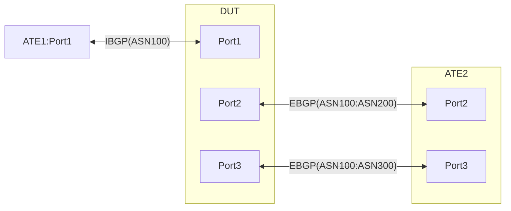

# RT-3.33: DSCP based traffic steering from Non-default VRF to Default VRF using Policy based VRF selection


## Summary
In this case, traffic is gradually moved from the Default VRF to the non-Default VRF per traffic class and then move traffic from Non default VRF to Default VRF based on DSCP value & destination prefix.

## Testbed type
  [atedut_4.binding](https://github.com/openconfig/featureprofiles/blob/main/topologies/atedut_4.binding)

## Procedure
Test environment setup<br><br>

### Topology
Create the following connections:

### Advertisements:
   * ATE1:Port1 advertises following prefixes over IBGP to DUT:Port1.
     * IPv4Prefix1/24 IPv6Prefix1/64
     * IPv4Prefix2/24 IPv6Prefix2/64
     * IPv4Prefix3/24 IPv6Prefix3/64
     * IPv4Prefix4/24 IPv6Prefix4/64
     * IPv4Prefix5/24 IPv6Prefix5/64<br>

   * ATE2:Port2 and DUT:Port2 from EBGP neighborship between each other over on respective AFI-SAFI connections and advertise the following prefixes
     * From ATE2:Port2 to DUT:Port2
       * IPv4Prefix6/24 IPv6Prefix6/64
       * IPv4Prefix7/24 IPv6Prefix7/64
       * IPv4Prefix8/24 IPv6Prefix8/64
       * IPv4Prefix9/24 IPv6Prefix9/64
       * IPv4Prefix10/24 IPv6Prefix10/64
     * From DUT:Port2 to ATE2:Port2
       * All the IBGP learnt prefixes from Prefix1 to Prefix5<br>

   * ATE2:Port3 and DUT:Port3 from EBGP neighborship between each other over on respective AFI-SAFI connections and advertise the following prefixes
     * From ATE2:Port2 to DUT:Port2
       * IPv4Prefix6/24 IPv6Prefix6/64
       * IPv4Prefix7/24 IPv6Prefix7/64
       * IPv4Prefix8/24 IPv6Prefix8/64
       * IPv4Prefix9/24 IPv6Prefix9/64
       * IPv4Prefix10/24 IPv6Prefix10/64
     * From DUT:Port2 to ATE2:Port2
       * All the IBGP learnt prefixes from Prefix1 to Prefix5<br>


     * **[Important: Please note]** Following advertisements must happen only during the test one at a time as instructed<br>

* Configure the DUT to honor the TOS byte of destination 
| Match Condition                           | Outer Header DSCP Set to: |
|-------------------------------------------|---------------------------|
| DSCP value BE1, Destination IPv4Prefix6/24"                         | 3                         |
| DSCP value BE1, Destination IPv6Prefix6/64"                         | 3                         |
| DSCP value AF1, Destination IPv4Prefix7/24"                         | 11                        |
| DSCP value AF1, Destination IPv6Prefix7/64"                         | 11                        |
| DSCP value AF2, Destination IPv4Prefix8/24"                         | 19                        |
| DSCP value AF2, Destination IPv6Prefix8/24"                         | 19                        |
| DSCP value AF3, Destination IPv4Prefix9/24"                         | 27                        |
| DSCP value AF3, Destination IPv6Prefix9/64"                         | 27                        |
| DSCP value AF4, Destination IPv4Prefix10/24"                       | 35                        |
| DSCP value AF4, Destination IPv6Prefix10/24"                       | 35                        |


   * DUT has 2 VRFs, Default and Non-Default. Configure Route leaking from the Default to the Non-default VRF to share reachability between VRFs.<br>


### Flows:

Flows from ATE1:Port1 to DUT:Port1

   * Following are destinations.
       * IPv4Prefix1/24 to IPv4Prefix6/24 [DSCP:BE1]
       * IPv6Prefix1/64 to IPv6Prefix6/64 [DSCP:BE1]
       * IPv4Prefix2/24 to IPv4Prefix7/24 [DSCP:AF1]
       * IPv6Prefix2/64 to IPv6Prefix7/64 [DSCP:AF1]
       * IPv4Prefix3/24 to IPv4Prefix8/24 [DSCP:AF2]
       * IPv6Prefix3/64 to IPv6Prefix8/64 [DSCP:AF2]
       * IPv4Prefix4/24 to IPv4Prefix9/24 [DSCP:AF3]
       * IPv6Prefix4/64 to IPv6Prefix9/64 [DSCP:AF3]
       * IPv4Prefix5/24 to IPv4Prefix10/24 [DSCP:AF4]
       * IPv6Prefix5/64 to IPv6Prefix10/64 [DSCP:AF4] br><br><br>


### Following Health checks to be run Pre and Post every sub test
  * No system/kernel/process/component coredumps
  * No high CPU spike or usage on control or forwarding plane
  * No high memory utilization or usage on control or forwarding plane
  * No processes/daemons high CPU/Memory utilization
  * No generic drop counters
    * QUEUE drops
    * Interfaces
    * VOQ
    * Fabric drops
    * ASIC drops
  * No flow control frames tx/rx
  * No CRC or Layer 1 errors on interfaces
  * No config commit errors
  * No system level alarms
  * In spec hardware should be in proper state
    * No hardware errors
    * Major Alarms
  * No HW component or SW processes crash
Openconfig-paths for the above are covered in the `OpenConfig Path and RPC Coverage` section below<br><br><br>


**RT-3.33.1: [Baseline] Traffic flow between ATE1:Port1 and ATE2:Port2 via DUT's Default VRF**
  * Please run all the health checks suggested above prior to starting the test as a baseline.
  * Start all the Flows from ATE1:Port1 to DUT:Port1 
  * DUT has the following VRF selection policy
    * Statement1: traffic matching any IPV4 0r IPV6 destination with any DSCP value, Punt to default vrf <br>
  * Expectations:
    * All traffic received in the Default VRF destined for any IPv4Prefix is sent back to ATE2:Port2 based on LPM lookup of EBGP learnt routes. 
    * Run post test Health checks above to ensure no anomalies<br><br><br>


**RT-3.33.2: Identify traffic by DSCP (BE1) and punt to non-default VRF**
  * Please run all the health checks suggested above prior to starting the test.
  * Start all the Flows from ATE1:Port1 to DUT:Port1 
  * DUT has the following VRF selection policy
    * Statement1: Traffic matching any IPV4 or IPV6 destination with DSCP value BE1, Punt to non-default vrf
  * Statement2: Traffic matching any IPV4 or IPV6 destination with DSCP value AF1,AF2,AF3,AF4, Punt to default vrf <br>
  * Expectations:
    * All traffic received in the Default VRF destined for any Destination but with DSCP value BE1 is punted to Non-Default VRF and sent back to ATE2:Port3 based on LPM lookup of EBGP learnt routes. 
 * All traffic received in the Default VRF destined for any Destination but with DSCP value AF1,AF2,AF3,AF4 is sent back to ATE2:Port2 based on LPM lookup of EBGP learnt routes. 

    * Run post test Health checks above to ensure no anomalies<br><br><br>


**RT-3.33.3: Identify traffic by DSCP (BE1,AF1,AF2,AF3,AF4) and punt to non-default VRF**


* Please run all the health checks suggested above prior to starting the test.
  * Start all the Flows from ATE1:Port1 to DUT:Port1 
  * DUT has the following VRF selection policy
    * Statement1: Traffic matching any IPV4 or IPV6 destination with DSCP value BE1,AF1,AF2,AF3,AF4 Punt to non-default vrf<br>
  * Expectations:
    * All traffic received in the Default VRF destined for any Destination but with DSCP value BE1,AF1,AF2,AF3,AF4 is punted to Non-Default VRF and sent back to ATE2:Port3 based on LPM lookup of EBGP learnt routes. 
    * Run post test Health checks above to ensure no anomalies<br><br><br>


**RT-3.33.4: Identify traffic by DSCP (BE1) and prefix and punt to default VRF**


* Please run all the health checks suggested above prior to starting the test.
  * Start all the Flows from ATE1:Port1 to DUT:Port1 
  * DUT has the following VRF selection policy
    * Statement1: Traffic matching any IPv4Prefix6/24 and IPv6Prefix6/64 destination with DSCP value BE1 Punt to default vrf <br>
  * Expectations:
    * All traffic received in the Default VRF destined for IPv4Prefix6/24 and IPv6Prefix6/64 and with DSCP value BE1 is punted to Default VRF and sent back to ATE2:Port2 based on LPM lookup of EBGP learnt routes. 
 * All traffic received in the Default VRF destined for any other Destination but with DSCP value AF1,AF2,AF3,AF4 is sent to ATE2:Port3 based on LPM lookup of EBGP learnt routes. 

    * Run post test Health checks above to ensure no anomalies<br><br><br>

**RT-3.33.5: Identify traffic by DSCP (BE1,AF1,AF2,AF3,AF4) and prefix and punt to non-default VRF**


* Please run all the health checks suggested above prior to starting the test.
  * Start all the Flows from ATE1:Port1 to DUT:Port1 
  * DUT has the following VRF selection policy
    * Statement1: Traffic matching any IPv4Prefix6/24 and IPv6Prefix6/64 with DSCP value BE1
IPv4Prefix7/24 and IPv6Prefix7/64 with DSCP value AF1, IPv4Prefix8/24 and IPv6Prefix8/64  with DSCP value AF2, IPv4Prefix9/24 and IPv6Prefix9/64  with DSCP value AF3, IPv4Prefix10/24 and IPv6Prefix10/64  with DSCP value AF4 Punt to default vrf<br>
  * Expectations:
    * All traffic received in the Default VRF destined for IPv4Prefix6/24 and IPv6Prefix6/64 with DSCP value BE1
IPv4Prefix7/24 and IPv6Prefix7/64 with DSCP value AF1, IPv4Prefix8/24 and IPv6Prefix8/64  with DSCP value AF2, IPv4Prefix9/24 and IPv6Prefix9/64  with DSCP value AF3, IPv4Prefix10/24 and IPv6Prefix10/64  with DSCP value AF4  is punted to Default VRF and sent back to ATE2:Port2 based on LPM lookup of EBGP learnt routes. 

    * Run post test Health checks above to ensure no anomalies<br><br><br>


## To Dos:

Following paths yet to be defied in Yang

  1. `/network-instances/network-instance/inter-instance-policies` is missing option to configure "export-to" or "import-from" VRF`

  2. Configuring the IPv4oUDP encapsulation/decapsulation is dependent on the proposal in https://github.com/openconfig/public/pull/1153<br><br>


## OpenConfig Path and RPC Coverage
```yaml
paths:
  # Policy for route leaking between VRFs
  /network-instances/network-instance/inter-instance-policies/apply-policy
  # Following applied in Default VRF
  /network-instances/network-instance/inter-instance-policies/apply-policy/config/export-policy
  # Following applied in Non-default VRF
  /network-instances/network-instance/inter-instance-policies/apply-policy/config/import-policy

  # Config for VRF selection
  # Create different VRFs: "Default or Non-default"
  /network-instances/network-instance/config/name:
  # Create VRF seletion policy with different rules that match on desination-prefix-set as first rule and then few other rules to match different Traffic-classes that determine BE1 to AF4 traffic
  /network-instances/network-instance/policy-forwarding/policies/policy-id: 
  /network-instances/network-instance/policy-forwarding/policies/policy/rules/rule/ipv4/config/destination-address-prefix-set:
  /network-instances/network-instance/policy-forwarding/policies/policy/rules/rule/ipv4/config/dscp-set:
  /network-instances/network-instance/policy-forwarding/policies/policy/rules/rule/ipv6/config/dscp-set:

  # Action that sets the VRF for matching conditions.
  /network-instances/network-instance/policy-forwarding/policies/policy/rules/rule/action/config/network-instance:

  # Creating the Prefix-Set required for the above VRF selection policy
  /routing-policy/defined-sets/prefix-sets/prefix-set/name:
  /routing-policy/defined-sets/prefix-sets/prefix-set/config/name:
  /routing-policy/defined-sets/prefix-sets/prefix-set/prefixes/prefix/config/ip-prefix:
  /routing-policy/defined-sets/prefix-sets/prefix-set/prefixes/prefix/config/masklength-range:

  # Apply VRF selection policy as per the Test procedure above
  /network-instances/network-instance/policy-forwarding/interfaces/interface/config/apply-vrf-selection-policy:

  # BGP configuration at the neighbor and peer-group levels
  /network-instances/network-instance/protocols/protocol/bgp/neighbors/peer-group/
  /network-instances/network-instance/protocols/protocol/bgp/neighbors/neighbor/config/neighbor-address
  /network-instances/network-instance/protocols/protocol/bgp/neighbors/neighbor/config/peer-as
  /network-instances/network-instance/protocols/protocol/bgp/neighbors/neighbor/config/local-as

  # BGP Policy definition for sharing of routes between IBGP and EBGP
  /routing-policy/policy-definitions/policy-definition/config/name
  /routing-policy/policy-definitions/policy-definition/statements/statement/config/name
  /routing-policy/policy-definitions/policy-definition/statements/statement/conditions/match-prefix-set/config/prefix-set
  /routing-policy/policy-definitions/policy-definition/statements/statement/conditions/match-prefix-set/config/match-set-options
  /routing-policy/policy-definitions/policy-definition/statements/statement/actions/config/policy-result/ACCEPT_ROUTE

  # Static route for VPNH for routes learnt via BGP. Routes MUST be in Default VRF and Protocol is Static
  /network-instances/network-instance/protocols/protocol/static-routes/static/config/prefix:
  /network-instances/network-instance/protocols/protocol/static-routes/ipv4/route/next-hops/next-hop/config/index
  /network-instances/network-instance/protocols/protocol/static-routes/ipv4/route/next-hops/next-hop/config/next-hop

  # Next-hop defined in the Static route above must lead to a IPv4oUDP encap to a destination learnt via EBGP
  <!-- Configuration for the NH above is dependent on the proposal in https://github.com/openconfig/public/pull/1153 -->

  # Config for policy-based Decap of IPv4oUDP packets
  /network-instances/network-instance/policy-forwarding/policies/policy/rules/rule/ipv4/config/destination-address-prefix-set
  /network-instances/network-instance/policy-forwarding/policies/policy/rules/rule/action/config/decapsulate-gue

  # State Paths:
  # Folliwing for normal health check pre and post each test
  /system/processes/process/state/cpu-utilization
  /system/processes/process/state/memory-utilization
  /qos/interfaces/interface/input/queues/queue/state/dropped-pkts
  /qos/interfaces/interface/output/queues/queue/state/dropped-pkts
  /qos/interfaces/interface/input/virtual-output-queues/voq-interface/queues/queue/state/dropped-pkts
  /interfaces/interface/state/counters/in-discards
  /interfaces/interface/state/counters/in-errors
  /interfaces/interface/state/counters/in-multicast-pkts
  /interfaces/interface/state/counters/in-unknown-protos
  /interfaces/interface/state/counters/out-discards
  /interfaces/interface/state/counters/out-errors
  /interfaces/interface/state/oper-status
  /interfaces/interface/state/admin-status
  /interfaces/interface/state/counters/out-octets
  /interfaces/interface/state/description
  /interfaces/interface/state/type
  /interfaces/interface/subinterfaces/subinterface/state/counters/in-discards
  /interfaces/interface/subinterfaces/subinterface/state/counters/in-errors
  /interfaces/interface/subinterfaces/subinterface/state/counters/in-unknown-protos
  /interfaces/interface/subinterfaces/subinterface/state/counters/out-discards
  /interfaces/interface/subinterfaces/subinterface/state/counters/out-errors
  /interfaces/interface/ethernet/state/counters/in-mac-pause-frames
  /interfaces/interface/ethernet/state/counters/out-mac-pause-frames
  /interfaces/interface/ethernet/state/counters/in-crc-errors
  /interfaces/interface/ethernet/state/counters/in-block-errors

  # IPv4oUDP Decap state
  /network-instances/network-instance/policy-forwarding/policies/policy/rules/rule/action/state/decapsulate-gue

  # BGP state paths
  /network-instances/network-instance/protocols/protocol/bgp/neighbors/neighbor/state/session-state
  /network-instances/network-instance/protocols/protocol/bgp/neighbors/neighbor/state/received-prefixes
  /network-instances/network-instance/protocols/protocol[identifier='BGP']/bgp/neighbors/neighbor/state/advertised-prefixes
  /network-instances/network-instance/protocols/protocol/bgp/neighbors/neighbor/state/peer-as

  # Packet counters matching forwarding rules for IPv4oUDP Decap
  /network-instances/network-instance/policy-forwarding/policies/policy/rules/rule/state/counters/forwarded-packets
  /network-instances/network-instance/policy-forwarding/policies/policy/rules/rule/state/counters/dropped-packets
  /network-instances/network-instance[name='<instance-name>']/policy-forwarding/state/active-policy
  /network-instances/network-instance/policy-forwarding/policies/policy/rules/rule/action/state/next-hop


rpcs:
  gnmi:
    gNMI.Set:
      union_replace: true
    gNMI.Subscribe:
      on_change: true
```
## Required DUT platform
* Specify the minimum DUT-type:
  * MFF - A modular form factor device containing LINECARDs, FABRIC and redundant CONTROLLER_CARD components
  * FFF - fixed form factor


