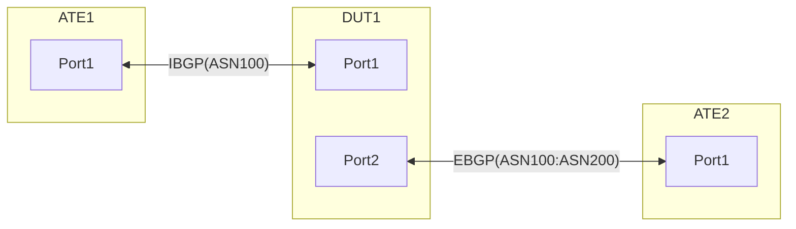

## Summary
This test ensures NOS is able to host multiple VRFs, perform GUE tunnel DECAP in the default VRF and also allows for gradual traffic migration from Default to Non-Default VRF using VRF selection policy.

## Procedure
Test environment setup

### Topology
Create the following connections:

### Advertisements:

	ATE1:Port1 advertises following prefixes over IBGP to DUT:Port1
		- IPv4Prefix1/24 IPv6Prefix1/64
		- IPv4Prefix2/24 IPv6Prefix2/64
		- IPv4Prefix3/24 IPv6Prefix3/64
		- IPv4Prefix4/24 IPv6Prefix4/64
		- IPv4Prefix5/24 IPv6Prefix5/64

	ATE2:Port1 advertieses following prefixes to DUT:Port2 over EBGP
		- IPv4Prefix6/24 IPv6Prefix6/64
		- IPv4Prefix7/24 IPv6Prefix7/64
		- IPv4Prefix8/24 IPv6Prefix8/64
		- IPv4Prefix9/24 IPv6Prefix9/64
		- IPv4Prefix10/24 IPv6Prefix10/64

### Flows:

	From ATE1:Port1 to ATE2:Port1
		- IPv4Prefix1/24 to IPv4Prefix6/24 
		- IPv6Prefix1/64 to IPv6Prefix6/64 

		- IPv4Prefix2/24 to IPv4Prefix7/24 
		- IPv6Prefix2/64 to IPv6Prefix7/64 

		- IPv4Prefix3/24 to IPv4Prefix8/24 
		- IPv6Prefix3/64 to IPv6Prefix8/64 

		- IPv4Prefix4/24 to IPv4Prefix9/24 
		- IPv6Prefix4/64 to IPv6Prefix9/64 

		- IPv4Prefix5/24 to IPv4Prefix10/24 
		- IPv6Prefix5/64 to IPv6Prefix10/64 

	Flows from ATE2:Port1 to ATE1:Port1
		- IPv4Prefix6/24 to IPv4Prefix1/24 
		- IPv6Prefix6/64 to IPv6Prefix1/64 

		- IPv4Prefix7/24 to IPv4Prefix2/24 
		- IPv6Prefix7/64 to IPv6Prefix2/64 

		- IPv4Prefix8/24 to IPv4Prefix3/24
		- IPv6Prefix8/64 to IPv6Prefix3/64 

		- IPv4Prefix9/24 to IPv4Prefix4/24 
		- IPv6Prefix9/64 to IPv6Prefix4/64

		- IPv4Prefix10/24 to IPv4Prefix5/24 
		- IPv6Prefix10/64 to IPv6Prefix5/64 

**RT-3.33.1: [Baseline] Default VRF for all flows. Regular traffic.**

In this case ATE2:Port1 simulates the regular flows from ATE2:Port1 as stated above.
  * ATE2 sends following IPv4 and IPv6 flows:
		- IPv4Prefix6/24 to IPv4Prefix1/24 
		- IPv4Prefix7/24 to IPv4Prefix2/24
		- IPv4Prefix8/24 to IPv4Prefix3/24 
		- IPv4Prefix9/24 to IPv4Prefix4/24 
		- IPv4Prefix10/24 to IPv4Prefix5/24
		- IPv6Prefix6/64 to IPv6Prefix1/64 
		- IPv6Prefix7/64 to IPv6Prefix2/64
		- IPv6Prefix8/64 to IPv6Prefix3/64 
		- IPv6Prefix9/64 to IPv6Prefix4/64 
		- IPv6Prefix10/64 to IPv6Prefix5/64    
	- Expectations:
		- All traffic must be successful   

**RT-3.33.2: Traffic from ATE2:Port1 to ATE1:Port1 Prefix 1 migrated to Non-Default VRF using the VRF selection policy.**
  * ATE2 sends following IPv4 and IPv6 flows:
    * IPv4Prefix6/24 to IPv4Prefix1/24 
    * IPv4Prefix7/24 to IPv4Prefix2/24
    * IPv4Prefix8/24 to IPv4Prefix3/24 
    * IPv4Prefix9/24 to IPv4Prefix4/24 
    * IPv4Prefix10/24 to IPv4Prefix5/24
    * IPv6Prefix6/64 to IPv6Prefix1/64 
    * IPv6Prefix7/64 to IPv6Prefix2/64
    * IPv6Prefix8/64 to IPv6Prefix3/64 
    * IPv6Prefix9/64 to IPv6Prefix4/64 
    * IPv6Prefix10/64 to IPv6Prefix5/64
  * DUT has the following VRF selection policy
    * Statement1: traffic matching IPv4Prefix1/24 & IPv6Prefix1/64, Punt to Non-default vrf
    * Statement2: traffic matching IPv4Prefix2/24 & IPv6Prefix2/64, Punt to default vrf
    * Statement3: traffic matching IPv4Prefix3/24 & IPv6Prefix3/64, Punt to default vrf
    * Statement4: traffic matching IPv4Prefix4/24 & IPv6Prefix4/64, Punt to default vrf
    * Statement5: traffic matching IPv4Prefix5/24 & IPv6Prefix5/64, Punt to default vrf
    * Statement6: traffic matching IPv4Prefix6/24 & IPv6Prefix6/64, Punt to default vrf
  * DUT must also leak all the routes from the Default VRF to the non-default VRF
  * Expectations:
    * Traffic for Prefix 1 received from ATE2:Port1 once punted to non-defailt VRF by the VRF selection policy, must be received by ATE1:Port1
    * Traffic sent by ATE2:Port1 must be routed to ATE1:Port1 via the DEFAULT VRF in the DUT.   

**RT-3.33.3 to RT-3.33.7: Traffic from ATE2:Port1 to ATE1:Port1 migrated to Non-Default VRF using the VRF selection policy.**
Follow the steps in RT-3.31.2 above to gradually move different traffic flows from the Default VRF to the Non-Defailt in the following sequence:

  * RT-3.33.3 Prefix 1-2 Traffic from ATE2:Port1 to ATE1:Port1 migrated to Non-Default VRF using the VRF selection policy.
    VRF selection policy on DUT:Port2 changes as follows:
    * Statement1: traffic matching IPv4Prefix1/24 & IPv6Prefix1/64, Punt to Non-default vrf
    * Statement2: traffic matching IPv4Prefix2/24 & IPv6Prefix2/64, Punt to Non-default vrf
    * Statement3: traffic matching IPv4Prefix3/24 & IPv6Prefix3/64, Punt to default vrf
    * Statement4: traffic matching IPv4Prefix4/24 & IPv6Prefix4/64, Punt to default vrf
    * Statement5: traffic matching IPv4Prefix5/24 & IPv6Prefix5/64, Punt to default vrf
    * Statement6: traffic matching IPv4Prefix6/24 & IPv6Prefix6/64, Punt to default vrf  
  * RT-3.33.4 Prefix 1-3  Traffic from ATE2:Port1 to ATE1:Port1 migrated to Non-Default VRF using the VRF selection policy.
    VRF selection policy on DUT:Port2 changes as follows:
    * Statement1: traffic matching IPv4Prefix1/24 & IPv6Prefix1/64, Punt to Non-default vrf
    * Statement2: traffic matching IPv4Prefix2/24 & IPv6Prefix2/64, Punt to Non-default vrf
    * Statement3: traffic matching IPv4Prefix3/24 & IPv6Prefix3/64, Punt to Non-default vrf
    * Statement4: traffic matching IPv4Prefix4/24 & IPv6Prefix4/64, Punt to default vrf
    * Statement5: traffic matching IPv4Prefix5/24 & IPv6Prefix5/64, Punt to default vrf
    * Statement6: traffic matching IPv4Prefix6/24 & IPv6Prefix6/64, Punt to default vrf  
  * RT-3.31.5 Prefix 1-4  Traffic from ATE2:Port1 to ATE1:Port1 migrated to Non-Default VRF using the VRF selection policy.
    VRF selection policy on DUT:Port2 changes as follows:
    * Statement1: traffic matching IPv4Prefix1/24 & IPv6Prefix1/64, Punt to Non-default vrf
    * Statement2: traffic matching IPv4Prefix2/24 & IPv6Prefix2/64, Punt to Non-default vrf
    * Statement3: traffic matching IPv4Prefix3/24 & IPv6Prefix3/64, Punt to Non-default vrf
    * Statement4: traffic matching IPv4Prefix4/24 & IPv6Prefix4/64, Punt to Non-default vrf
    * Statement5: traffic matching IPv4Prefix5/24 & IPv6Prefix5/64, Punt to default vrf
    * Statement6: traffic matching IPv4Prefix6/24 & IPv6Prefix6/64, Punt to default vrf  
  * RT-3.31.6 Prefix 1-5 Traffic from ATE2:Port1 to ATE1:Port1 migrated to Non-Default VRF using the VRF selection policy.
    VRF selection policy on DUT:Port2 changes as follows:
    * Statement1: traffic matching IPv4Prefix1/24 & IPv6Prefix1/64, Punt to Non-default vrf
    * Statement2: traffic matching IPv4Prefix2/24 & IPv6Prefix2/64, Punt to Non-default vrf
    * Statement3: traffic matching IPv4Prefix3/24 & IPv6Prefix3/64, Punt to Non-default vrf
    * Statement4: traffic matching IPv4Prefix4/24 & IPv6Prefix4/64, Punt to Non-default vrf
    * Statement5: traffic matching IPv4Prefix5/24 & IPv6Prefix5/64, Punt to Non-default vrf
    * Statement6: traffic matching IPv4Prefix6/24 & IPv6Prefix6/64, Punt to default vrf  
  * RT-3.31.7 Prefix 1-6 Traffic from ATE2:Port1 to ATE1:Port1 migrated to Non-Default VRF using the VRF selection policy.
    VRF selection policy on DUT:Port2 changes as follows:
    * Statement1: traffic matching IPv4Prefix1/24 & IPv6Prefix1/64, Punt to Non-default vrf
    * Statement2: traffic matching IPv4Prefix2/24 & IPv6Prefix2/64, Punt to Non-default vrf
    * Statement3: traffic matching IPv4Prefix3/24 & IPv6Prefix3/64, Punt to Non-default vrf
    * Statement4: traffic matching IPv4Prefix4/24 & IPv6Prefix4/64, Punt to Non-default vrf
    * Statement5: traffic matching IPv4Prefix5/24 & IPv6Prefix5/64, Punt to Non-default vrf
    * Statement6: traffic matching IPv4Prefix6/24 & IPv6Prefix6/64, Punt to Non-default vrf  
  * Expectations are the same for traffic routed via the Default and the Non-Default VRFs on the DUT.
