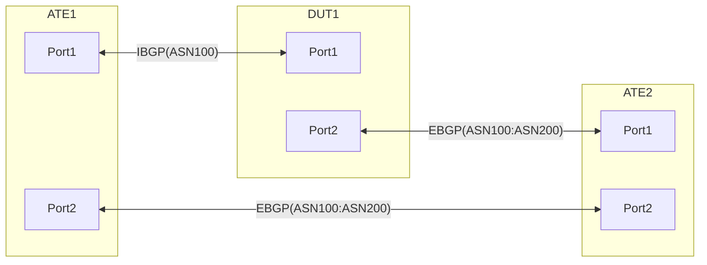

# RT-3.31: DSCP based traffic steering from default VRF to non-Default VRF using Policy based VRF selection plus GUE DECAP

## Summary
This test ensures NOS is able to host multiple VRFs, perform GUE tunnel DECAP in the default VRF and also allows for gradual traffic migration from Default to Non-Default VRF using DSCP based VRF selection policy.

## Procedure
Test environment setup

### Topology
Create the following connections:

### Advertisements:

	ATE1:Port1 advertises following prefixes over IBGP to DUT:Port1
		- IPv4Prefix1/24 IPv6Prefix1/64
		- IPv4Prefix2/24 IPv6Prefix2/64
		- IPv4Prefix3/24 IPv6Prefix3/64
		- IPv4Prefix4/24 IPv6Prefix4/64
		- IPv4Prefix5/24 IPv6Prefix5/64
	
	ATE2:Port1 advertieses following prefixes to DUT:Port2 over EBGP
		- IPv4Prefix6/24 IPv6Prefix6/64
		- IPv4Prefix7/24 IPv6Prefix7/64
		- IPv4Prefix8/24 IPv6Prefix8/64
		- IPv4Prefix9/24 IPv6Prefix9/64
		- IPv4Prefix10/24 IPv6Prefix10/64

	DUT:Port2 advertises following tunnel endpoint prefixe to ATE2:Port1 over EBGP. 
		- IPv4Prefix12/28

	ATE1:Port2 advertises following tunnel endpoint prefix to ATE2:Port2
		- IPv4Prefix11/28

### Flows:

	From ATE1:Port1 to ATE2:Port1
		- IPv4Prefix1/24 to IPv4Prefix6/24 [DSCP:BE1]
		- IPv6Prefix1/64 to IPv6Prefix6/64 [DSCP:BE1]

		- IPv4Prefix2/24 to IPv4Prefix7/24 [DSCP:AF1]
		- IPv6Prefix2/64 to IPv6Prefix7/64 [DSCP:AF1]

		- IPv4Prefix3/24 to IPv4Prefix8/24 [DSCP:AF2]
		- IPv6Prefix3/64 to IPv6Prefix8/64 [DSCP:AF2]

		- IPv4Prefix4/24 to IPv4Prefix9/24 [DSCP:AF3]
		- IPv6Prefix4/64 to IPv6Prefix9/64 [DSCP:AF3]

		- IPv4Prefix5/24 to IPv4Prefix10/24 [DSCP:AF4]
		- IPv6Prefix5/64 to IPv6Prefix10/64 [DSCP:AF4]

	Flows from ATE2:Port1 to ATE1:Port1
		- IPv4Prefix6/24 to IPv4Prefix1/24 [DSCP:BE1]
		- IPv6Prefix6/64 to IPv6Prefix1/64 [DSCP:BE1]

		- IPv4Prefix7/24 to IPv4Prefix2/24 [DSCP:AF1]
		- IPv6Prefix7/64 to IPv6Prefix2/64 [DSCP:AF1]

		- IPv4Prefix8/24 to IPv4Prefix3/24 [DSCP:AF2]
		- IPv6Prefix8/64 to IPv6Prefix3/64 [DSCP:AF2]

		- IPv4Prefix9/24 to IPv4Prefix4/24 [DSCP:AF3]
		- IPv6Prefix9/64 to IPv6Prefix4/64 [DSCP:AF3]

		- IPv4Prefix10/24 to IPv4Prefix5/24 [DSCP:AF4]
		- IPv6Prefix10/64 to IPv6Prefix5/64 [DSCP:AF4]

**RT-3.31.1: [Baseline] Default VRF for all flows. GUE encaped as well as regular traffic.**

In this case ATE2:Port1 simulates the GUE encaped traffic from ATE:Port1 plus the regular flows from ATE2:Port1 as stated above.
  * ATE2 sends following IPv4 and IPv6 flows:
    * Prefix1 to Prefix6 traffic encaped inside tunnel destination IPv4Prefix12
    * Prefix2 to Prefix7 traffic encaped inside tunnel destination IPv4Prefix12
    * Prefix3 to Prefix8 traffic encaped inside tunnel destination IPv4Prefix12
    * Prefix4 to Prefix9 traffic encaped inside tunnel destination IPv4Prefix12
    * Prefix5 to Prefix10 traffic encaped inside tunnel destination IPv4Prefix12
	- ATE2 sends the following IPv4 and IPv6 flows
		- Prefix6/24 to IPv4Prefix1/24 [DSCP:BE1]
		- Prefix7/24 to IPv4Prefix2/24 [DSCP:AF1]
		- Prefix8/24 to IPv4Prefix3/24 [DSCP:AF2]
		- Prefix9/24 to IPv4Prefix4/24 [DSCP:AF3]
		- Prefix10/24 to IPv4Prefix5/24 [DSCP:AF4]
	- Expectations:
		- All traffic must be successful
		- Ensure streamed data for the different Traffic classes (TC) is matching the traffic sent by ATE2 per TC.
		- Ensure the stream data for the number of decaped packets is matching the amount of data sent to IPv4Prefix12   

**RT-3.31.2: Unencaped BE1 traffic from ATE2:Port1 to ATE1:Port1 migrated to Non-Default VRF using the VRF selection policy.**
  * ATE2 sends following IPv4 and IPv6 flows:
    * Prefix1 to Prefix6 traffic encaped inside tunnel destination IPv4Prefix12
    * Prefix2 to Prefix7 traffic encaped inside tunnel destination IPv4Prefix12
    * Prefix3 to Prefix8 traffic encaped inside tunnel destination IPv4Prefix12
    * Prefix4 to Prefix9 traffic encaped inside tunnel destination IPv4Prefix12
    * Prefix5 to Prefix10 traffic encaped inside tunnel destination IPv4Prefix12
  * ATE2 sends the following IPv4 and IPv6 flows
    * Prefix6/24 to IPv4Prefix1/24 [DSCP:BE1]
    * Prefix7/24 to IPv4Prefix2/24 [DSCP:AF1]
    * Prefix8/24 to IPv4Prefix3/24 [DSCP:AF2]
    * Prefix9/24 to IPv4Prefix4/24 [DSCP:AF3]
    * Prefix10/24 to IPv4Prefix5/24 [DSCP:AF4]
  * DUT has the following VRF selection policy
    * Statement1: traffic matching tunnel-destination "IPv4Prefix12/28", Punt to default vrf
    * Statement2: traffic matching DSCP BE1, Punt to Non-default vrf
    * Statement3: traffic matching DSCP AF1, Punt to default vrf
    * Statement4: traffic matching DSCP AF2, Punt to default vrf
    * Statement5: traffic matching DSCP AF3, Punt to default vrf
    * Statement5: traffic matching DSCP AF4, Punt to default vrf
  * DUT must also leak all the routes from the Default VRF to the non-default VRF
  * Expectations:
    * All GUE encaped traffic received in the Default VRF must be decaped and sent back to ATE2:Port1 based on destination routing.
    * Unencaped BE1 traffic received from ATE2:Port1 once punted to non-defailt VRF by the VRF selection policy, must be received by ATE1:Port1
    * Unencaped AF1-AF4 traffic sent by ATE2:Port1 must be routed to ATE1:Port1 via the DEFAULT VRF in the DUT.   
   
**RT-3.31.3 to RT-3.31.6: Unencaped BE1-AF4 traffic from ATE2:Port1 to ATE1:Port1 migrated to Non-Default VRF using the VRF selection policy.**
Follow the steps in RT-3.31.2 above to gradually move different unencaped classes of traffic from the Default VRF to the Non-Defailt in the following sequence:

  * RT-3.31.3 Unencaped BE1-AF1 traffic from ATE2:Port1 to ATE1:Port1 migrated to Non-Default VRF using the VRF selection policy.
    VRF selection policy on DUT:Port2 changes as follows:
      * Statement1: traffic matching tunnel-destination "IPv4Prefix12/28", Punt to default vrf
      * Statement2: traffic matching DSCP BE1, Punt to Non-default vrf
      * Statement3: traffic matching DSCP AF1, Punt to Non-default vrf
      * Statement4: traffic matching DSCP AF2, Punt to default vrf
      * Statement5: traffic matching DSCP AF3, Punt to default vrf
      * Statement5: traffic matching DSCP AF4, Punt to default vrf  
  * RT-3.31.4 Unencaped BE1-AF2 traffic from ATE2:Port1 to ATE1:Port1 migrated to Non-Default VRF using the VRF selection policy.
    VRF selection policy on DUT:Port2 changes as follows:
      * Statement1: traffic matching tunnel-destination "IPv4Prefix12/28", Punt to default vrf
      * Statement2: traffic matching DSCP BE1, Punt to Non-default vrf
      * Statement3: traffic matching DSCP AF1, Punt to Non-default vrf
      * Statement4: traffic matching DSCP AF2, Punt to Non-default vrf
      * Statement5: traffic matching DSCP AF3, Punt to default vrf
      * Statement5: traffic matching DSCP AF4, Punt to default vrf  
  * RT-3.31.5 Unencaped BE1-AF3 traffic from ATE2:Port1 to ATE1:Port1 migrated to Non-Default VRF using the VRF selection policy.
    VRF selection policy on DUT:Port2 changes as follows:
      * Statement1: traffic matching tunnel-destination "IPv4Prefix12/28", Punt to default vrf
      * Statement2: traffic matching DSCP BE1, Punt to Non-default vrf
      * Statement3: traffic matching DSCP AF1, Punt to Non-default vrf
      * Statement4: traffic matching DSCP AF2, Punt to Non-default vrf
      * Statement5: traffic matching DSCP AF3, Punt to Non-default vrf
      * Statement5: traffic matching DSCP AF4, Punt to default vrf  
  * RT-3.31.6 Unencaped BE1-AF4 traffic from ATE2:Port1 to ATE1:Port1 migrated to Non-Default VRF using the VRF selection policy.
    VRF selection policy on DUT:Port2 changes as follows:
      * Statement1: traffic matching tunnel-destination "IPv4Prefix12/28", Punt to default vrf
      * Statement2: traffic matching DSCP BE1, Punt to Non-default vrf
      * Statement3: traffic matching DSCP AF1, Punt to Non-default vrf
      * Statement4: traffic matching DSCP AF2, Punt to Non-default vrf
      * Statement5: traffic matching DSCP AF3, Punt to Non-default vrf
      * Statement5: traffic matching DSCP AF4, Punt to Non-default vrf  
  * Expectations are the same for traffic routed via the Default and the Non-Default VRFs on the DUT.
