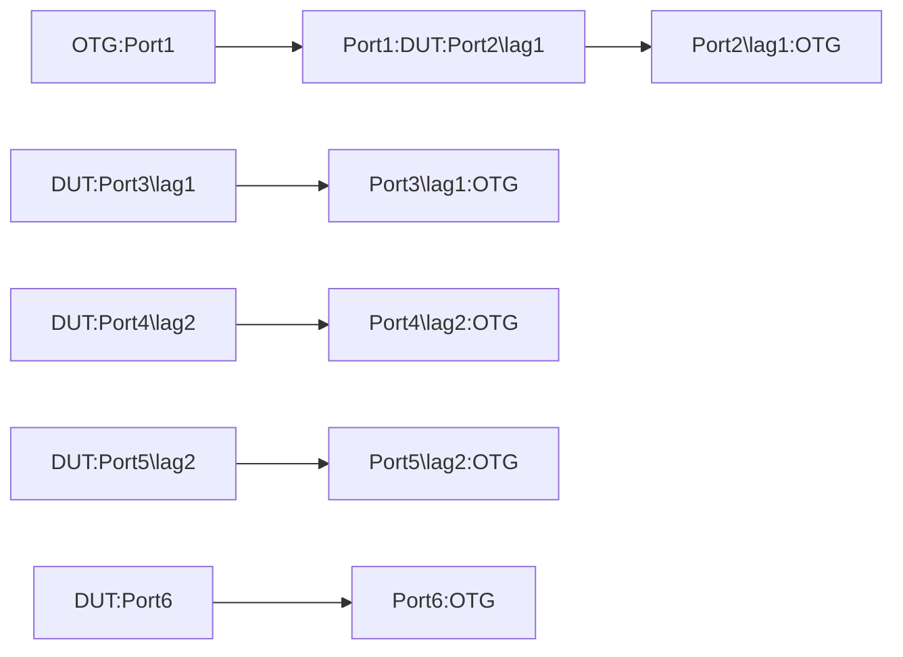

# TUN-1.6: Tunnel End Point Resize - Interface Based GRE Tunnel

## Summary
* Tunnel End Point Resize test for Interface Based GRE Tunnels to ensure inflight increase or decrease in tunnel endpoints do not cause packet drops. The test will be conducted for both Encapsulation as well as decapsulation of packets.

## Topology

## SUB-Test:1 Encap Test
*   The test should configure 32 GRE tunnel interfaces each with different /32 and /128 tunnel destination prefixes of the same /27 and /64 prefix range. Each of these tunnel interfaces should use the loopback address as the source-address for their respective address-families.
 *   Configure an IPv4 and an IPv6 address for each of the 32xtunnel interfaces.
 *   Add 32 different v4 and v6 static routes for the same /24 IPv4 and /64 IPv6 destination prefixes. These static routes should point at the 32 different tunnel interface addresses by their respective address families as next-hop.
 *   Add static routes for the /27 IPv4 and /64 IPv6 tunnel destination prefixes to point at lag1, lag2 and port6 for ECMP.
 *   The test should send 1000 IPv4 and 1000 1Pv6 flows from the ATE:Port1 to the DUT:Port1. The flows should have variations in the following,
        * Source IP address
        * Source Port
        * Destination IP adresses. These will be from the same /24 and /64 destination prefixes for which the static routes were added
        * Destination Port
        * Payload protocol
 *   Incoming traffic on DUT:PORT1 should be load shared across all 32 Tunnel interfaces for encapsulation and then routed out the combination of lag and singleton interfaces, i.e. lag1, lag2 and Port6. Follow all the verifications steps for Sub-test1 below
 *   Reduce the number of Tunnel interfaces(e.g. From 32 to 16):
        * If the static routes are used to forward traffic to tunnel, please disable or delete the static route in this test to simulate the reduction in available paths
* Incoming traffic on DUT:PORT1 should be load shared across all remainging 16 Tunnel interfaces. Follow all the verifications steps for Sub-test1 below
* Increase number of Tunnel interfaces(e.g. From 16 to 32)
* Incoming traffic on DUT:PORT1 should now be load shared across all 32 Tunnel interfaces. Follow all the verifications steps for Sub-test1 below
* Increasing and decreasing the number of tunnel interfaces and related static route shouldn’t case traffic drops.
        

## SUB-Test:2 Encap Test

## Verification steps for Subtest-1
*   Verify the next hop counters for packet being diverted or sent for encapsulation
        *   Verify the tunnel interfaces counters to confirm traffic encapsulation
        *   Verify the tunnel interfaces for optimal load balancing of traffic/flow. Acceptable deviation is <=3%

## Verification steps for Subtest-2
 *   After decapsulation, traffic should be load balanced/hashed to all available L3 ECMP which untimately resolves over a combination of LAG and Singleton interfaces. Acceptable deviation is <=3%.
 *   Verify the tunnel interfaces counters to confirm the traffic decapsulation
 *   Validate system for:
        * Health-1.1
        * No feature related error or drop counters incrementing

## Verification steps for Subtest-2    
*   After decapsulation, traffic should be load balanced/hashed to all available L3 ECMP or LAG or combination of both features
        * Verify the tunnel interfaces counters to confirm the traffic decapsulation
*   Validate system for: 
        * Health-1.1 
        * No feature related error or drop counters incrementing
    
## Config Parameter coverage

*   -interfaces:interfaces/interface 
*   gre/ 
*   gre/decap-group/ 
*   gre/dest/ 
*   gre/dest/address/ 
*   gre/dest/address/ipv4/ 
*   gre/dest/address/ipv6/ 
*   gre/dest/nexthop-group/ 
*   gre/source/ 
*   gre/source/address/ 
*   gre/source/address/ipv4/ 
*   gre/source/address/ipv6/ 
*   gre/source/interface/ 

## Telemetry Parameter coverage

*   state/counters/in-pkts 
*   state/counters/in-octets 
*   state/counters/out-pkts 
*   state/counters/out-octets 
*   state/counters/in-error-pkts 
*   state/counters/in-forwarded-pkts 
*   state/counters/in-forwarded-octets 
*   state/counters/in-discarded-pkts 
*   state/counters/out-error-pkts 
*   state/counters/out-forwarded-pkts 
*   state/counters/out-forwarded-octets 
*   state/counters/out-discarded-pkts 
