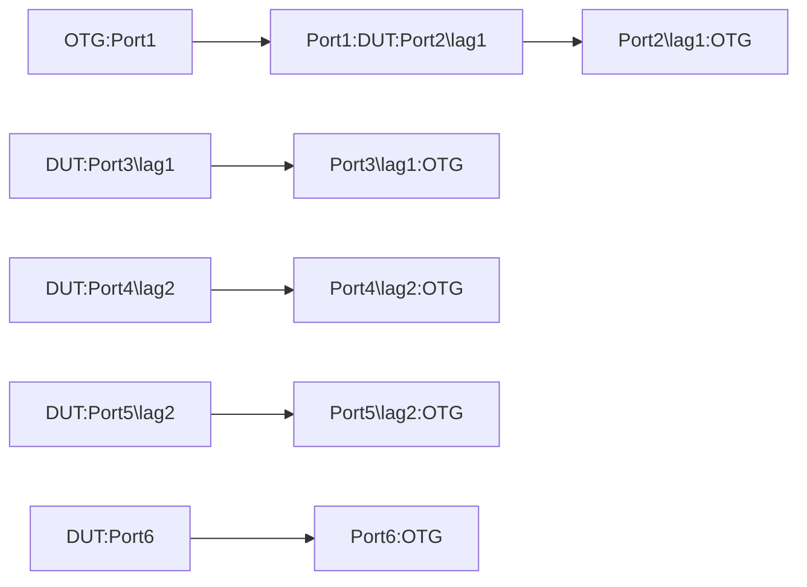

# TUN-1.6: Tunnel End Point Resize for Ecapsulation - Interface Based GRE Tunnel

## Summary
* Tunnel End Point Resize test for Interface Based GRE Tunnels to ensure inflight increase or decrease in tunnel endpoints do not cause packet drops for encap function.

## Topology

## Test Procedure
 *   The test should configure 32 GRE tunnel interfaces per address family and each should be configured with different /32 and /128 tunnel destination prefixes of the same /27 and /64 prefix range. Each of these tunnel interfaces should use the loopback address as the source-address for their respective address-families. Hence, we will have total 64xtunnel interfaces, 32 per address-family as source and destination addresses of the tunnels.
        * Configure dualstack IPv4 and an IPv6 address for each of the 64xtunnel interfaces. The IP addresses can be of /30 and /127 prefix-lengths.
        * Pick 2 different /24 IPv4 and /64 IPv6 subnets each to emulate destination of payload traffic to be tunneled.
        * Add 128 different v4 and v6 static routes (64 for each address-family) for the 2 sets of /24 IPv4 and /64 IPv6 payload prefixes. The static routes should be such that, the first set of 1x /24 IPv4 and 1x/64 should point at the tunnel interfaces configured w/ IPv4 tunnel destination and the second set of 1x /24 IPv4 and 1x /64 should point at the tunnel interfaces w/ IPv6 tunnel destinations.
        * Add static routes for the /27 IPv4 and /64 IPv6 tunnel destination prefixes to point at lag1, lag2 and port6 for ECMP.
 *   The test should send 2000 IPv4 and 2000 1Pv6 flows from the ATE:Port1 to the DUT:Port1. These flows should equally be split between the 2x /24 IPv4 and 2x /64 IPv6 destination prefixes mentioned above. The flows should use variations in the following,
        * Source IP address
        * Source Port
        * Destination IP adresses.
        * Destination Port
        * Payload protocol
 *   Incoming traffic on DUT:PORT1 should be load shared across all 64 Tunnel interfaces for encapsulation and then routed out the combination of lag and singleton interfaces, i.e. lag1, lag2 and Port6. Follow all the verifications steps below
 *   Reduce the number of Tunnel interfaces, e.g. From 32 to 16 for each of the tunnel destination group by address-family:
        * If the static routes are used to forward traffic to tunnel, please disable or delete the static route in this test to simulate the reduction in available paths
 *   Incoming traffic on DUT:PORT1 should be load shared across all remaining 16 Tunnel interfaces per tunnel-destination by address-family. Follow all the "verifications steps below
 *   Increase number of Tunnel interfaces, e.g. From 16 to 32 per tunnel-destination by address-family.
 *   Incoming traffic on DUT:PORT1 should now be load shared across all 32 Tunnel interfaces per tunnel-destination by address-family. Follow all the verifications steps below
 *   Increasing and decreasing of the number of tunnel interfaces and related static route shouldn’t cause traffic drops.

#### Verification steps
 *   Verify the next hop counters for packets being diverted or sent for encapsulation
 *   Verify the tunnel interfaces counters to confirm traffic encapsulation
 *   Verify the tunnel interfaces for optimal load balancing of traffic/flow. Acceptable deviation is <=3%
 *   Validate system for:
        * Health-1.1
        * No feature related error or drop counters incrementing
        

    
## Config Parameter coverage

*   -interfaces:interfaces/interface 
*   gre/ 
*   gre/dest/ 
*   gre/dest/address/ 
*   gre/dest/address/ipv4/ 
*   gre/dest/address/ipv6/ 
*   gre/dest/nexthop-group/ 
*   gre/source/ 
*   gre/source/address/ 
*   gre/source/address/ipv4/ 
*   gre/source/address/ipv6/ 
*   gre/source/interface/ 

## Telemetry Parameter coverage

*   state/counters/in-pkts 
*   state/counters/in-octets 
*   state/counters/out-pkts 
*   state/counters/out-octets 
*   state/counters/in-error-pkts 
*   state/counters/in-forwarded-pkts 
*   state/counters/in-forwarded-octets 
*   state/counters/in-discarded-pkts 
*   state/counters/out-error-pkts 
*   state/counters/out-forwarded-pkts 
*   state/counters/out-forwarded-octets 
*   state/counters/out-discarded-pkts 
