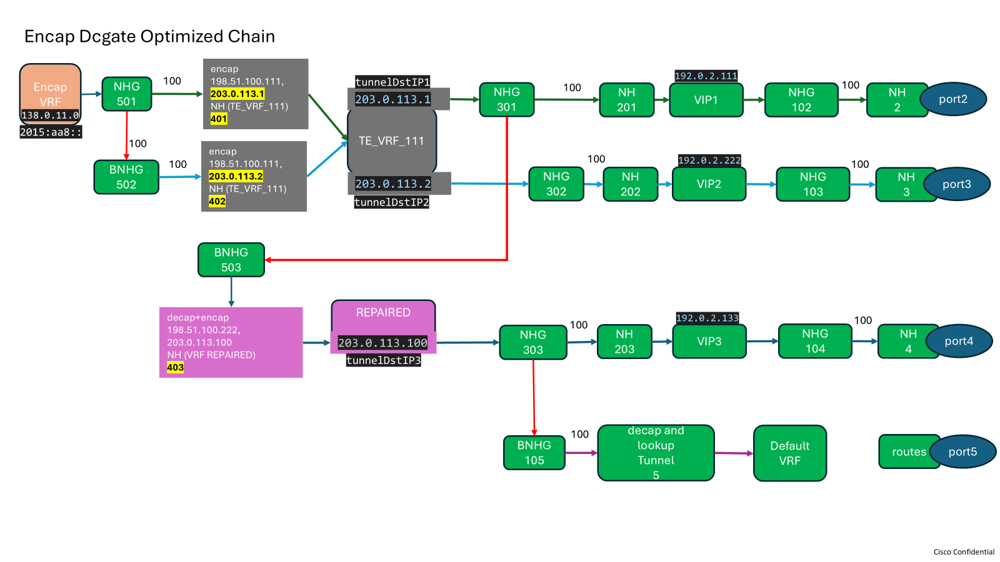
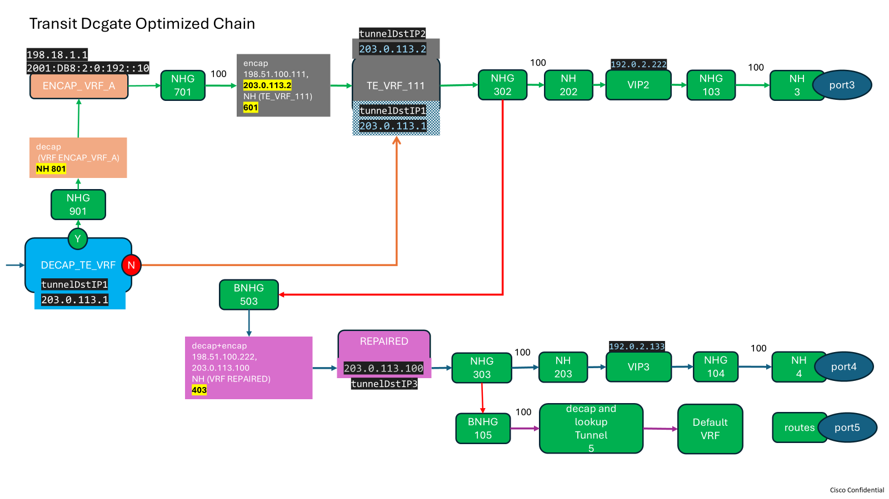
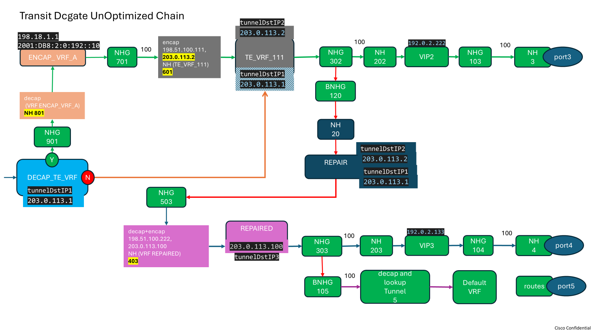
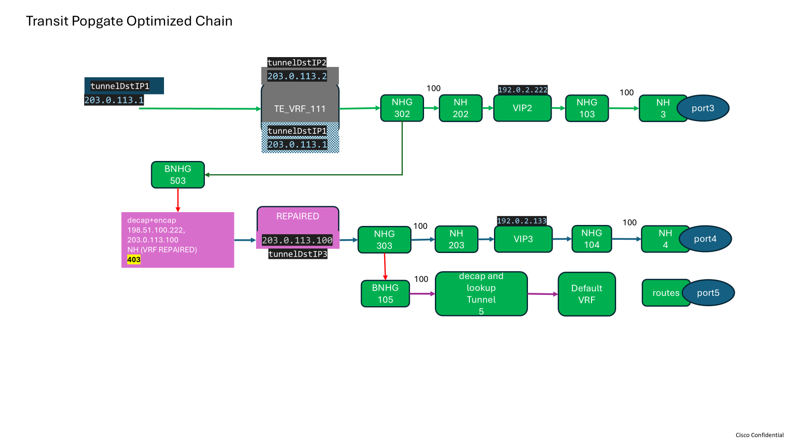
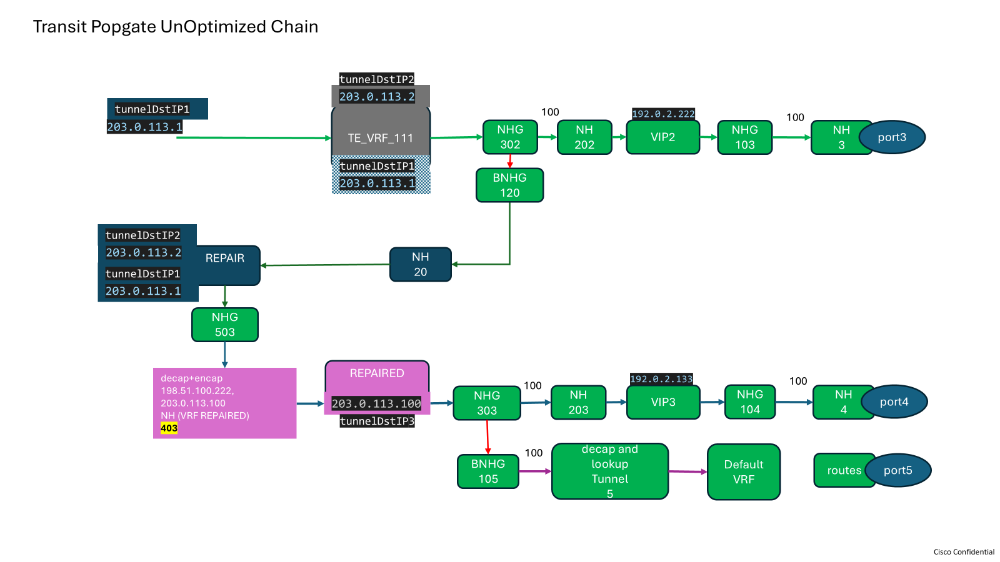

# fib_chains_test.go

## Overview

This file contains integration tests for verifying FIB (Forwarding Information Base) chain behaviors on Cisco devices using the gRIBI protocol. The tests are designed to validate the correct handling of TTL (Time To Live) and DSCP (Differentiated Services Code Point) values, as well as the failover and backup path mechanisms in various chain topologies.

## Test Structure

The main test function, `TestFibChains`, iterates over a set of chain types and scenarios, each defined by a name, description, test function, and chain type. For each scenario, the DUT (Device Under Test) and ATE (Automated Test Equipment) are configured, and a gRIBI client is established to program the FIB entries.

### Chain Types Tested

- **dcgate_cluster_optimized**
- **dcgate_wan_optimized**
- **dcgate_wan_unoptimized**
- **popgate_optimized**
- **popgate_unoptimized**

Each chain type corresponds to a specific network topology and forwarding behavior.

## Key Test Functions

- `testEncapDcgateOptimized`
- `testTransitDcgateOptimized`
- `testTransitDcgateUnoptimized`
- `testPopGateOptimized`
- `testPopGateUnOptimized`

These functions set up the necessary gRIBI entries (Next Hops, Next Hop Groups, and Prefixes) and run subtests to verify traffic forwarding, TTL/DSCP handling, and failover scenarios.

## Test Scenarios

Each test function includes multiple subtests, such as:

- Traffic forwarding through primary and backup paths
- TTL and DSCP value verification
- Handling of TTL expiry (TTL=0 or TTL=1)
- Failover when primary or backup links are shut down
- Fallback to default VRF or backup NHG when prefixes are missing

## Dependencies

- [ondatra](https://github.com/openconfig/ondatra): Test framework for network devices
- [gRIBI](https://github.com/openconfig/gribi): gRIBI client for programming FIB entries
- [gosnappi](https://github.com/open-traffic-generator/snappi): Traffic generation and analysis

## Usage

These tests are intended to be run as part of a CI/CD pipeline or manually using Go's testing framework:

```sh
go test -v fib_chains_test.go
```

## FibChains Reference Diagrams

Diagrams showing FIB chain topologies with labeled VRFs, Prefixes, VIPs, NHGs, NHs and Ports. The diagram illustrates primary, frr1 (aka decap+encap tunnel path) and frr2 (aka decap tunnel path) paths between devices, with arrows indicating prefix lookup in various VRFs and operations performed on the prefix.
Any changes to the fibchains code should be in accordance with the below diagrams.






