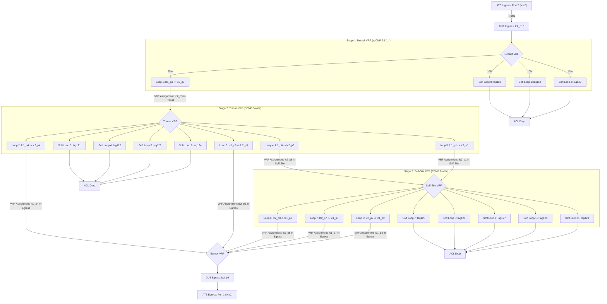

# Hashing: Dataplane Hashing with Physical/Software Loopbacks

## Summary
Verify Dataplane Hashing using a mix of physical loopback ports and software loopback interfaces across multiple Network Instances.

## Topology
The test requires a DUT and an ATE.
The topology uses a multiple looped back ports configuration to route traffic through multiple hashing stages on the DUT.



### Port Details and Loopbacks
The test utilizes physical loopback cables and software terminal loopbacks.
Physical loopbacks are formed by connecting two ports on the same DUT:
- **Loop 1**: `lc1_p3` <-> `lc2_p3`
- **Loop 2**: `lc1_p4` <-> `lc2_p4`
- **Loop 3**: `lc1_p5` <-> `lc2_p5`
- **Loop 4**: `lc1_p6` <-> `lc2_p6`
- **Loop 5**: `lc1_p1` <-> `lc2_p1` 
- **Loop 6**: `lc2_p8` <-> `lc1_p8`
- **Loop 7**: `lc2_p7` <-> `lc1_p7`
- **Loop 8**: `lc2_p2` <-> `lc1_p2` 

Software loopbacks (Terminal Loopbacks) are configured on the DUT ports:
- **Stage 1 Soft Loops**: 3 ports configured in TERMINAL loopback mode, with each port assigned as the sole member of a dedicated Link Aggregation Group (LAG).
- **Stage 2 Soft Loops**: 4 ports configured in TERMINAL loopback mode, with each port assigned as the sole member of a dedicated Link Aggregation Group (LAG).
- **Stage 3 Soft Loops**: 5 ports configured in TERMINAL loopback mode, with each port assigned as the sole member of a dedicated Link Aggregation Group (LAG).
Total 12 software loopbacks are dynamically discovered from the unused ports on the DUT and configured.

ATE Connection:
- **ATE Port 1** (ixia1) connects to **DUT Port lc2_p9** (Egress).
- **ATE Port 2** (ixia2) connects to **DUT Port lc2_p10** (Ingress).

## Test Scenario 1: Hash Distribution 

### 1. Baseline Configuration
- Configure all DUT ports as LAG interfaces (each port in its own LAG, e.g., `lc2_p10` in `lag110`).
- Configure 12 discovered unused ports as soft loops (in TERMINAL loopback mode, each in its own LAG).
- Configure Static ARP on all interfaces.
- Configure ACLs on all soft loops to drop ingress traffic (to prevent loops/packet storm).
- Configure Network Instances (VRFs): `TRANSIT`, `SELF_SITE`, `EGRESS`.
- Assign interfaces to VRFs:
  - Default VRF: Ingress `lc2_p10`, Stage 1 Soft Loops.
  - `TRANSIT` VRF: `lc2_p3` (Loop 1 RX), `lc1_p4` (Loop 2 TX), `lc1_p5` (Loop 3 TX), `lc1_p6` (Loop 4 TX), `lc1_p1` (Loop 5 TX), Stage 2 Soft Loops.
  - `SELF_SITE` VRF: `lc2_p6` (Loop 4 RX), `lc2_p1` (Loop 5 RX), `lc2_p8` (Loop 6 TX), `lc2_p7` (Loop 7 TX), `lc2_p2` (Loop 8 TX), Stage 3 Soft Loops.
  - `EGRESS` VRF: `lc2_p4` (Loop 2 RX), `lc2_p5` (Loop 3 RX), `lc1_p8` (Loop 6 RX), `lc1_p7` (Loop 7 RX), `lc1_p2` (Loop 8 RX), `lc2_p9` (Egress).

### 2. Interface VRF Assignment Configuration
Assign RX ports of the loopbacks to their respective VRFs to route traffic to the next stage VRF:
- **On `lc2_p3` (Loop 1 RX)**: Assign to `TRANSIT` VRF.
- **On `lc2_p6`, `lc2_p1` (Loop 4, 5 RX)**: Assign to `SELF_SITE` VRF.
- **On `lc2_p4`, `lc2_p5` (Loop 2, 3 RX)**: Assign to `EGRESS` VRF.
- **On `lc1_p8`, `lc1_p7`, `lc1_p2` (Loop 6, 7, 8 RX)**: Assign to `EGRESS` VRF.

### 3. gRIBI Programming
- **Default VRF**:
  - Route `198.51.100.0/24` -> NHG 1 (WCMP: `lc1_p3` weight 7, 3 soft loops weight 1 each).
- **`TRANSIT` VRF**:
  - Route `198.51.100.0/24` -> NHG 2 (ECMP 8-wide: `lc1_p4`, `lc1_p5`, `lc1_p6`, `lc1_p1` and 4 soft loops, weight 1 each).
- **`SELF_SITE` VRF**:
  - Route `198.51.100.0/24` -> NHG 3 (ECMP 8-wide: `lc2_p8`, `lc2_p7`, `lc2_p2` and 5 soft loops, weight 1 each).
- **`EGRESS` VRF**:
  - Route `198.51.100.0/24` -> NHG 4 (pointing to egress port `lc2_p9`).

### 4. Traffic Verification
- **Generate Test Traffic**: Send traffic from ATE Port 2 targeting random destination IP addresses within the `198.51.100.0/24` subnet. Vary the source IPv4 addresses, source UDP ports, and destination UDP ports to ensure sufficient entropy for hashing.
- **Tolerance Threshold**: Hashing distribution tolerance is defined as ±2% of the expected value (relative). For example, with an expected value of 12.5%, the acceptable range is 12.25% to 12.75%.
- **Verify Packet Distribution**:
  - **Stage 1 (Default VRF)**: ~70% to `lc1_p3` (acceptable range: 68.6% – 71.4%), and ~10% to each of the 3 soft loops (acceptable range: 9.8% – 10.2%).
  - **Stage 2 (Transit VRF)**: ~12.5% to each of the 8 members of NHG 2 (acceptable range: 12.25% – 12.75%).
  - **Stage 3 (Self-Site VRF)**: ~12.5% to each of the 8 members of NHG 3 (acceptable range: 12.25% – 12.75%).
  - **Egress**: All traffic routed to `EGRESS` VRF is received on ATE Port 1 (ixia1).

## Canonical OC

```json
{
  "interfaces": {
    "interface": [
      {
        "config": {
          "enabled": true,
          "name": "ae1",
          "type": "ieee8023adLag"
        },
        "name": "ae1"
      },
      {
        "config": {
          "enabled": true,
          "name": "ae2",
          "type": "ieee8023adLag"
        },
        "name": "ae2"
      },
      {
        "config": {
          "enabled": true,
          "name": "eth1",
          "type": "ethernetCsmacd"
        },
        "ethernet": {
          "config": {
            "aggregate-id": "ae1"
          }
        },
        "name": "eth1"
      },
      {
        "config": {
          "enabled": true,
          "loopback-mode": "TERMINAL",
          "name": "eth2",
          "type": "ethernetCsmacd"
        },
        "ethernet": {
          "config": {
            "aggregate-id": "ae2"
          }
        },
        "name": "eth2"
      }
    ]
  },
  "network-instances": {
    "network-instance": [
      {
        "config": {
          "name": "DEFAULT",
          "type": "DEFAULT_INSTANCE"
        },
        "interfaces": {
          "interface": [
            {
              "config": {
                "id": "ae1",
                "interface": "ae1"
              },
              "id": "ae1"
            }
          ]
        },
        "name": "DEFAULT"
      },
      {
        "config": {
          "name": "TRANSIT",
          "type": "L3VRF"
        },
        "interfaces": {
          "interface": [
            {
              "config": {
                "id": "ae2",
                "interface": "ae2"
              },
              "id": "ae2"
            }
          ]
        },
        "name": "TRANSIT"
      }
    ]
  }
}
```

## OpenConfig Path and RPC Coverage

```yaml
paths:
  /interfaces/interface/config/name:
  /interfaces/interface/config/enabled:
  /interfaces/interface/state/counters/in-pkts:
  /interfaces/interface/state/counters/out-pkts:
  /network-instances/network-instance/config/name:
  /network-instances/network-instance/config/type:
  /network-instances/network-instance/interfaces/interface/config/id:
  /network-instances/network-instance/interfaces/interface/config/interface:
rpcs:
  gribi:
    gRIBI.Modify:
```