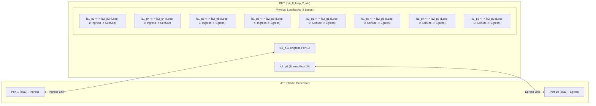
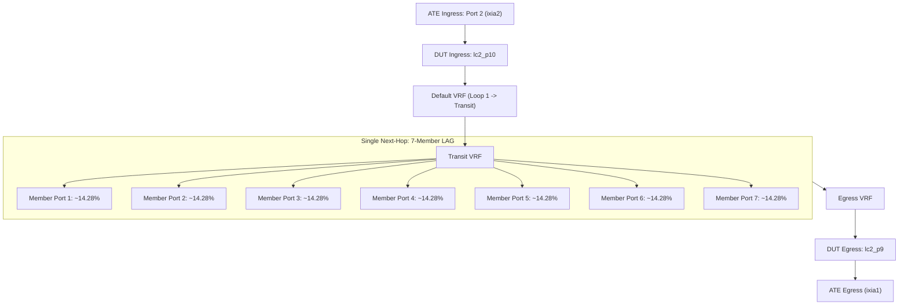
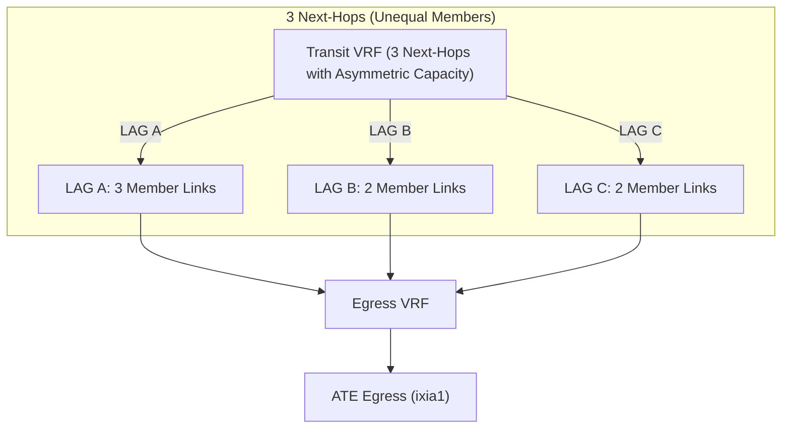

# Hashing: Dataplane Hashing with Physical Loopbacks

## Summary
Verify Dataplane Hashing (ECMP, WCMP, and Intra-LAG) using physical loopback ports across multiple Network Instances (`DEFAULT`, `SELF_SITE`, `EGRESS`).

The test suite validates hashing uniformity, weight enforcement, and anti-polarization across two traffic profiles:
1. **Plain IPv4/IPv6 Traffic** (5-tuple entropy).
2. **IPnIP Encapsulated Traffic** (Outer IP static, inner 5-tuple entropy).

## Topology
The testbed requires a DUT (`dut_8_loop_2_ate.testbed`) and an ATE.
The topology utilizes physical loopback pairs to route and verify traffic across multiple hashing stages on the DUT without relying on software drop loops.


```mermaid
graph LR
    subgraph ATE ["ATE (Traffic Generator)"]
        ate2["Port 1 (ixia2) - Ingress"]
        ate1["Port 10 (ixia1) - Egress"]
    end

    subgraph DUT ["DUT (dut_8_loop_2_ate)"]
        inPort["lc2_p10 (Ingress Port 1)"]
        egPort["lc2_p9 (Egress Port 10)"]
        
        subgraph PhysLoops ["Physical Loopbacks (8 Loops)"]
            l1["lc1_p3 <--> lc2_p3 (Loop 1: Ingress -> SelfSite)"]
            l2["lc1_p4 <--> lc2_p4 (Loop 2: Ingress -> SelfSite)"]
            l3["lc1_p5 <--> lc2_p5 (Loop 3: Ingress -> Egress)"]
            l4["lc1_p6 <--> lc2_p6 (Loop 4: Ingress -> Egress)"]
            l5["lc1_p1 <--> lc2_p1 (Loop 5: SelfSite -> Egress)"]
            l6["lc1_p8 <--> lc2_p8 (Loop 6: SelfSite -> Egress)"]
            l7["lc1_p7 <--> lc2_p7 (Loop 7: SelfSite -> Egress)"]
            l8["lc1_p2 <--> lc2_p2 (Loop 8: SelfSite -> Egress)"]
        end
    end

    ate2 <-->|Ingress Link| inPort
    egPort <-->|Egress Link| ate1
```

### Port Details and Loopbacks
The test utilizes all 8 physical loopback cables and 2 ATE links on `dut_8_loop_2_ate.testbed`:
- **Physical Loopbacks**:
  - **Loop 1 (Port 2)**: `lc1_p3` (Ingress) <-> `lc2_p3` (SelfSite)
  - **Loop 2 (Port 3)**: `lc1_p4` (Ingress) <-> `lc2_p4` (SelfSite)
  - **Loop 3 (Port 4)**: `lc1_p5` (Ingress) <-> `lc2_p5` (Egress)
  - **Loop 4 (Port 5)**: `lc1_p6` (Ingress) <-> `lc2_p6` (Egress)
  - **Loop 5 (Port 6)**: `lc1_p1` (SelfSite) <-> `lc2_p1` (Egress)
  - **Loop 6 (Port 7)**: `lc1_p8` (SelfSite) <-> `lc2_p8` (Egress)
  - **Loop 7 (Port 8)**: `lc1_p7` (SelfSite) <-> `lc2_p7` (Egress)
  - **Loop 8 (Port 9)**: `lc1_p2` (SelfSite) <-> `lc2_p2` (Egress)

- **ATE Connections**:
  - **ATE Ingress Port 1** (`ixia2`) connects to **DUT Port lc2_p10** (Ingress source).
  - **ATE Egress Port 10** (`ixia1`) connects to **DUT Port lc2_p9** (Egress sink).

---

## Traffic Profile Specifications

All test scenarios are executed against the following two traffic profiles:

### 1. Plain IP Traffic (IPv4 / IPv6)
- **Header Structure**: Standard Ethernet + IPv4/IPv6 + UDP/TCP.
- **Entropy Generation**:
  - Destination IP: Random within target subnet `198.51.100.0/24`.
  - Source IP: Incrementing / pseudo-random addresses across a /16 range.
  - L4 Ports: Source and Destination UDP ports incremented across 1024–65535.
- **Verification**: Evaluates native 5-tuple hash distribution across member next-hops.

### 2. IPnIP Encapsulated Traffic (Encap)
- **Header Structure**: Outer IPv4 Header + Inner IPv4 Header + UDP Payload.
- **Outer Header**:
  - Source IP: Static `10.10.10.1`.
  - Destination IP: Incrementing across `172.16.0.1` to `172.16.0.254` (count 254).
- **Inner Header**: 5-tuple varied IPv4 + UDP packets (1,009 src IPs, 1,013 dst IPs, 1,019 src UDP ports, 1,021 dst UDP ports).
- **Verification**: Verifies that the DUT hashing engine parses and computes hash keys from both outer and inner packet headers, ensuring uniform distribution without tunnel polarization.

---

## Tolerance and Evaluation Criteria

The acceptable hashing distribution across any set of next-hops or LAG member links is defined with a **$\pm 2\%$ relative tolerance** of the ideal mathematical expectation:

$$\text{Acceptable Ratio Range} = \text{Expected Ratio} \times (1 \pm 0.02)$$

*Examples*:
- Expected **20.00%** (1/5 share) $\rightarrow$ Acceptable Range: **19.60% to 20.40%**
- Expected **33.33%** (3-wide equal) $\rightarrow$ Acceptable Range: **32.66% to 34.00%**
- Expected **60.00%** (6/10 weight) $\rightarrow$ Acceptable Range: **58.80% to 61.20%**
- Expected **14.28%** (7-member LAG) $\rightarrow$ Acceptable Range: **14.00% to 14.57%**
- Expected **42.86%** (3:2:2 weight) $\rightarrow$ Acceptable Range: **42.00% to 43.71%**

---

## Test Scenario 1: Multi-Stage ECMP & Anti-Polarization Hashing

### 1. Description
Verifies end-to-end dataplane hashing across `DEFAULT` (Ingress), `SELF_SITE`, and `EGRESS` network instances using an 8-loop topology:
- **Ingress VRF (`DEFAULT`)**: Evaluates 4-way ECMP (1:1:1:1 equal weight) across:
  - **Port 2 (`lc1_p3` -> SelfSite)**: Weight 1 (25%)
  - **Port 3 (`lc1_p4` -> SelfSite)**: Weight 1 (25%)
  - **Port 4 (`lc1_p5` -> Egress)**: Weight 1 (25%)
  - **Port 5 (`lc1_p6` -> Egress)**: Weight 1 (25%)
  Total weight: 4. Split is 50% to `SELF_SITE` and 50% to `EGRESS`.
- **SelfSite VRF (`SELF_SITE`)**: Receives 50% of traffic on Ports 2 & 3. Evaluates 4-way ECMP (1:1:1:1) across:
  - **Port 6 (`lc1_p1` -> Egress)**: Weight 1 (12.5% of total traffic)
  - **Port 7 (`lc1_p8` -> Egress)**: Weight 1 (12.5% of total traffic)
  - **Port 8 (`lc1_p7` -> Egress)**: Weight 1 (12.5% of total traffic)
  - **Port 9 (`lc1_p2` -> Egress)**: Weight 1 (12.5% of total traffic)
- **Egress VRF (`EGRESS`)**: Recombines all 6 forwarded streams:
  - Direct from Ingress: Port 4 (25%), Port 5 (25%)
  - Indirect via SelfSite: Port 6 (12.5%), Port 7 (12.5%), Port 8 (12.5%), Port 9 (12.5%)
  Total arriving: 100%. All forwarded out Port 10 (`lc2_p9`) to ATE Egress (`ixia1`).

```mermaid
graph TD
    Ixia["ATE Ingress: Port 1 (ixia2)"] --> IngressPort1["Ingress: Port 1 (lc2_p10)"]
    
    subgraph IngressVRF ["Ingress VRF (NHG_01: 1:1:1:1 ECMP)"]
        IngressPort1 -->|25% (Weight 1)| IngressP2["Port 2 (lc1_p3)"]
        IngressPort1 -->|25% (Weight 1)| IngressP3["Port 3 (lc1_p4)"]
        IngressPort1 -->|25% (Weight 1)| IngressP4["Port 4 (lc1_p5)"]
        IngressPort1 -->|25% (Weight 1)| IngressP5["Port 5 (lc1_p6)"]
    end

    IngressP2 -->|Loop 1 (25%)| SelfSiteP2["SelfSite: Port 2 (lc2_p3)"]
    IngressP3 -->|Loop 2 (25%)| SelfSiteP3["SelfSite: Port 3 (lc2_p4)"]
    IngressP4 -->|Loop 3 (25%)| EgressP4["Egress: Port 4 (lc2_p5)"]
    IngressP5 -->|Loop 4 (25%)| EgressP5["Egress: Port 5 (lc2_p6)"]

    subgraph SelfSiteVRF ["SelfSite VRF (NHG_02: 1:1:1:1 ECMP)"]
        SelfSiteP2 -.->|ECMP| SelfSiteP6["Port 6 (lc1_p1): 12.5%"]
        SelfSiteP2 -.->|ECMP| SelfSiteP7["Port 7 (lc1_p8): 12.5%"]
        SelfSiteP2 -.->|ECMP| SelfSiteP8["Port 8 (lc1_p7): 12.5%"]
        SelfSiteP2 -.->|ECMP| SelfSiteP9["Port 9 (lc1_p2): 12.5%"]
        SelfSiteP3 -.->|ECMP| SelfSiteP6
        SelfSiteP3 -.->|ECMP| SelfSiteP7
        SelfSiteP3 -.->|ECMP| SelfSiteP8
        SelfSiteP3 -.->|ECMP| SelfSiteP9
    end

    SelfSiteP6 -->|Loop 5 (12.5%)| EgressP6["Egress: Port 6 (lc2_p1)"]
    SelfSiteP7 -->|Loop 6 (12.5%)| EgressP7["Egress: Port 7 (lc2_p8)"]
    SelfSiteP8 -->|Loop 7 (12.5%)| EgressP8["Egress: Port 8 (lc2_p7)"]
    SelfSiteP9 -->|Loop 8 (12.5%)| EgressP9["Egress: Port 9 (lc2_p2)"]

    subgraph EgressVRF ["Egress VRF (6-Stream Arrival)"]
        EgressP4 --> EgressOut["Port 10 (lc2_p9)"]
        EgressP5 --> EgressOut
        EgressP6 --> EgressOut
        EgressP7 --> EgressOut
        EgressP8 --> EgressOut
        EgressP9 --> EgressOut
    end

    EgressOut --> ATE_Egress["ATE Egress: Port 10 (ixia1)"]
```

### 2. Traffic Verification

- **Stage 1 (`DEFAULT` / Ingress VRF)**:
  - **Port 2 (`lc1_p3`)**: **~25.0%** (acceptable range: **24.5% – 25.5%**).
  - **Port 3 (`lc1_p4`)**: **~25.0%** (acceptable range: **24.5% – 25.5%**).
  - **Port 4 (`lc1_p5`)**: **~25.0%** (acceptable range: **24.5% – 25.5%**).
  - **Port 5 (`lc1_p6`)**: **~25.0%** (acceptable range: **24.5% – 25.5%**).
- **Stage 2 (`SELF_SITE` VRF)**:
  - **Port 6 (`lc1_p1`)**: **~25.0%** of SelfSite traffic (acceptable range: **24.5% – 25.5%**).
  - **Port 7 (`lc1_p8`)**: **~25.0%** of SelfSite traffic (acceptable range: **24.5% – 25.5%**).
  - **Port 8 (`lc1_p7`)**: **~25.0%** of SelfSite traffic (acceptable range: **24.5% – 25.5%**).
  - **Port 9 (`lc1_p2`)**: **~25.0%** of SelfSite traffic (acceptable range: **24.5% – 25.5%**).
- **Stage 3 (`EGRESS` VRF Multi-Stream Arrival)**:
  - **Direct Stream 1 (Port 4)**: **~25.0%** of total traffic (acceptable range: **24.5% – 25.5%**).
  - **Direct Stream 2 (Port 5)**: **~25.0%** of total traffic (acceptable range: **24.5% – 25.5%**).
  - **Via SelfSite (Port 6)**: **~12.5%** of total traffic (acceptable range: **12.25% – 12.75%**).
  - **Via SelfSite (Port 7)**: **~12.5%** of total traffic (acceptable range: **12.25% – 12.75%**).
  - **Via SelfSite (Port 8)**: **~12.5%** of total traffic (acceptable range: **12.25% – 12.75%**).
  - **Via SelfSite (Port 9)**: **~12.5%** of total traffic (acceptable range: **12.25% – 12.75%**).
- **Stage 4 (Egress Arrival)**:
  - Verify 100% full traffic arrival on ATE Port 10 (`ixia1`).
- **Traffic Profiles**: Execute for Plain IP and IPnIP Encap.
- **Traffic Profiles**: Execute for Plain IP and IPnIP Encap.

---

## Test Scenario 2: Intra-LAG Member Traffic Distribution

### 1. Description
Verifies traffic load balancing across member links within a single Link Aggregation Group (LAG). Traffic received on the Ingress interface is looked up in the `TRANSIT` VRF and routed to a single Next-Hop consisting of a 7-member LAG bundle.


```mermaid
graph TD
    Ingress["ATE Ingress: Port 2 (ixia2)"] --> IngressPort["DUT Ingress: lc2_p10"]
    IngressPort --> DefaultVRF["Default VRF (Loop 1 -> Transit)"]
    DefaultVRF --> TransitVRF["Transit VRF"]
    
    subgraph SingleNH ["Single Next-Hop: 7-Member LAG"]
        TransitVRF --> M1["Member Port 1: ~14.28%"]
        TransitVRF --> M2["Member Port 2: ~14.28%"]
        TransitVRF --> M3["Member Port 3: ~14.28%"]
        TransitVRF --> M4["Member Port 4: ~14.28%"]
        TransitVRF --> M5["Member Port 5: ~14.28%"]
        TransitVRF --> M6["Member Port 6: ~14.28%"]
        TransitVRF --> M7["Member Port 7: ~14.28%"]
    end
    
    SingleNH --> EgressVRF["Egress VRF"] --> EgressPort["DUT Egress: lc2_p9"] --> Egress["ATE Egress (ixia1)"]
```

### 2. Traffic Verification
- **Expected Distribution**: Uniform distribution across all 7 active member links:
  - **Per-Member Expected**: ~14.28% (acceptable range: **14.00% – 14.57%**).
- **Traffic Profiles**: Execute for Plain IP and IPnIP Encap.

---

## Test Scenario 3: Asymmetric Paths & Weighted Load Balancing (3-Wide LAGs)

### 1. Description
Assesses the ability of the dataplane hashing engine to handle asymmetric next-hop capacities and verifies that software-programmed weights either align with or override physical member link counts.

The `TRANSIT` VRF is configured with **3 Next-Hops** having unequal member link capacities:
- **LAG A**: 3 member links.
- **LAG B**: 2 member links.
- **LAG C**: 2 member links.


```mermaid
graph TD
    TransitVRF["Transit VRF (3 Next-Hops with Asymmetric Capacity)"]
    
    subgraph AsymmetricPaths ["3 Next-Hops (Unequal Members)"]
        TransitVRF -->|LAG A| LagA["LAG A: 3 Member Links"]
        TransitVRF -->|LAG B| LagB["LAG B: 2 Member Links"]
        TransitVRF -->|LAG C| LagC["LAG C: 2 Member Links"]
    end
    
    LagA --> EgressVRF["Egress VRF"]
    LagB --> EgressVRF
    LagC --> EgressVRF
    EgressVRF --> Egress["ATE Egress (ixia1)"]
```

### 2. Sub-cases & Hashing Verification

#### **Sub-case 3.1: Capacity-Based Unequal Weights (3:2:2)**
- **Goal**: Validates proportional distribution when weights align with physical link capacity.
- **gRIBI Programming**: Program NHG with weights `3 : 2 : 2` matching the member counts of LAG A, LAG B, and LAG C.
- **Expected Distribution**:
  - **LAG A (weight 3)**: **~42.86%** (acceptable range: **42.00% – 43.71%**).
  - **LAG B (weight 2)**: **~28.57%** (acceptable range: **28.00% – 29.14%**).
  - **LAG C (weight 2)**: **~28.57%** (acceptable range: **28.00% – 29.14%**).
- **Traffic Profiles**: Execute for Plain IP and IPnIP Encap.

#### **Sub-case 3.2: Overriding Capacity with Equal Weights (1:1:1)**
- **Goal**: Validates that software-configured weights strictly override physical underlying capacity.
- **gRIBI Programming**: Program NHG with uniform weights `1 : 1 : 1` across LAG A, LAG B, and LAG C.
- **Expected Distribution**:
  - **LAG A (weight 1)**: **~33.33%** (acceptable range: **32.66% – 34.00%**).
  - **LAG B (weight 1)**: **~33.33%** (acceptable range: **32.66% – 34.00%**).
  - **LAG C (weight 1)**: **~33.33%** (acceptable range: **32.66% – 34.00%**).
- **Traffic Profiles**: Execute for Plain IP and IPnIP Encap.

---

## Canonical OC

```json
{
  "interfaces": {
    "interface": [
      {
        "config": {
          "enabled": true,
          "name": "ae1",
          "type": "ieee8023adLag"
        },
        "name": "ae1"
      },
      {
        "config": {
          "enabled": true,
          "name": "ae2",
          "type": "ieee8023adLag"
        },
        "name": "ae2"
      },
      {
        "config": {
          "enabled": true,
          "name": "eth1",
          "type": "ethernetCsmacd"
        },
        "ethernet": {
          "config": {
            "aggregate-id": "ae1"
          }
        },
        "name": "eth1"
      },
      {
        "config": {
          "enabled": true,
          "loopback-mode": "TERMINAL",
          "name": "eth2",
          "type": "ethernetCsmacd"
        },
        "ethernet": {
          "config": {
            "aggregate-id": "ae2"
          }
        },
        "name": "eth2"
      }
    ]
  },
  "network-instances": {
    "network-instance": [
      {
        "config": {
          "name": "DEFAULT",
          "type": "DEFAULT_INSTANCE"
        },
        "interfaces": {
          "interface": [
            {
              "config": {
                "id": "ae1",
                "interface": "ae1"
              },
              "id": "ae1"
            }
          ]
        },
        "name": "DEFAULT"
      },
      {
        "config": {
          "name": "TRANSIT",
          "type": "L3VRF"
        },
        "interfaces": {
          "interface": [
            {
              "config": {
                "id": "ae2",
                "interface": "ae2"
              },
              "id": "ae2"
            }
          ]
        },
        "name": "TRANSIT"
      },
      {
        "config": {
          "name": "SELF_SITE",
          "type": "L3VRF"
        },
        "name": "SELF_SITE"
      },
      {
        "config": {
          "name": "EGRESS",
          "type": "L3VRF"
        },
        "name": "EGRESS"
      }
    ]
  }
}
```

---

## OpenConfig Path and RPC Coverage

```yaml
paths:
  /interfaces/interface/config/name:
  /interfaces/interface/config/enabled:
  /interfaces/interface/config/loopback-mode:
  /interfaces/interface/ethernet/config/aggregate-id:
  /interfaces/interface/aggregation/config/lag-type:
  /interfaces/interface/state/counters/in-pkts:
  /interfaces/interface/state/counters/out-pkts:
  /network-instances/network-instance/config/name:
  /network-instances/network-instance/config/type:
  /network-instances/network-instance/interfaces/interface/config/id:
  /network-instances/network-instance/interfaces/interface/config/interface:
  /acl/interfaces/interface/ingress-acl-sets/ingress-acl-set/config/set-name:
  /acl/interfaces/interface/ingress-acl-sets/ingress-acl-set/config/type:

rpcs:
  gribi:
    gRIBI.Modify:
    gRIBI.Flush:
  gnmi:
    gNMI.Set:
    gNMI.Get:
    gNMI.Subscribe:
```
