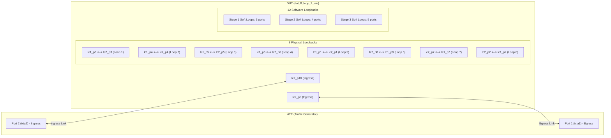
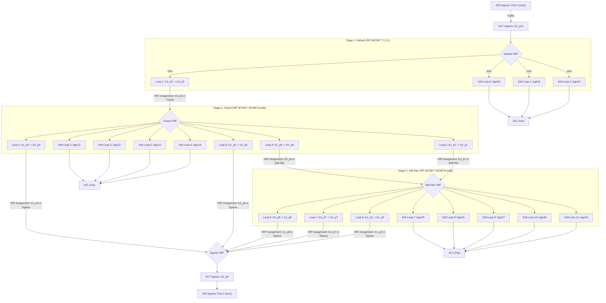
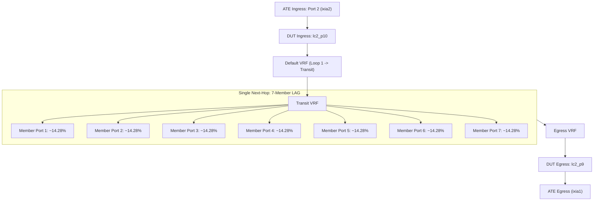
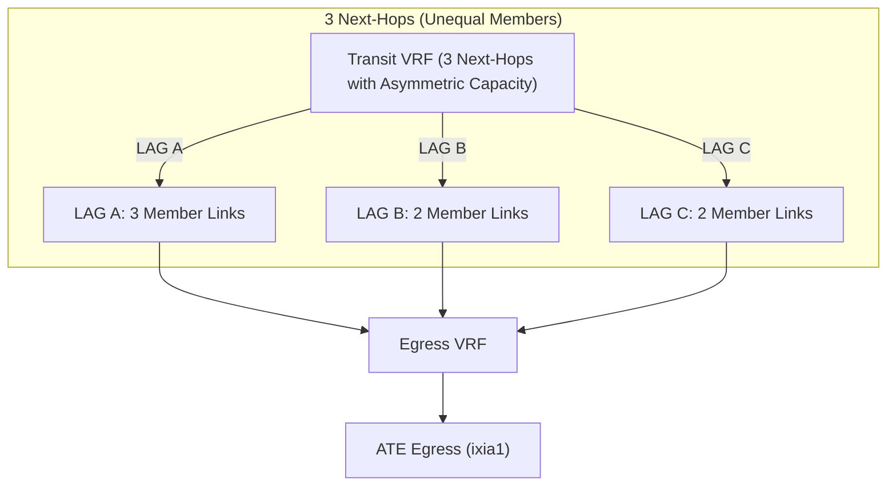

# Hashing: Dataplane Hashing with Physical/Software Loopbacks

## Summary
Verify Dataplane Hashing (ECMP, WCMP, and Intra-LAG) using a combination of physical loopback ports and software terminal loopback interfaces across multiple Network Instances (`DEFAULT`, `TRANSIT`, `SELF_SITE`, `EGRESS`).

The test suite validates hashing uniformity, weight enforcement, and anti-polarization across two traffic profiles:
1. **Plain IPv4/IPv6 Traffic** (5-tuple entropy).
2. **IPnIP Encapsulated Traffic** (Outer IP static, inner 5-tuple entropy).

## Topology
The testbed requires a DUT (`dut_8_loop_2_ate.testbed`) and an ATE.
The topology utilizes 8 physical loopback pairs and 12 software terminal loopback interfaces to route and verify traffic across multiple hashing stages on the DUT.


```mermaid
graph LR
    subgraph ATE ["ATE (Traffic Generator)"]
        ate2["Port 2 (ixia2) - Ingress"]
        ate1["Port 1 (ixia1) - Egress"]
    end

    subgraph DUT ["DUT (dut_8_loop_2_ate)"]
        inPort["lc2_p10 (Ingress)"]
        egPort["lc2_p9 (Egress)"]
        
        subgraph PhysLoops ["8 Physical Loopbacks"]
            l1["lc1_p3 <--> lc2_p3 (Loop 1)"]
            l2["lc1_p4 <--> lc2_p4 (Loop 2)"]
            l3["lc1_p5 <--> lc2_p5 (Loop 3)"]
            l4["lc1_p6 <--> lc2_p6 (Loop 4)"]
            l5["lc1_p1 <--> lc2_p1 (Loop 5)"]
            l6["lc2_p8 <--> lc1_p8 (Loop 6)"]
            l7["lc2_p7 <--> lc1_p7 (Loop 7)"]
            l8["lc2_p2 <--> lc1_p2 (Loop 8)"]
        end
        
        subgraph SoftLoops ["12 Software Loopbacks"]
            sl1["Stage 1 Soft Loops: 3 ports"]
            sl2["Stage 2 Soft Loops: 4 ports"]
            sl3["Stage 3 Soft Loops: 5 ports"]
        end
    end

    ate2 <-->|Ingress Link| inPort
    egPort <-->|Egress Link| ate1
```

### Port Details and Loopbacks
The test utilizes physical loopback cables and software terminal loopbacks:
- **Physical Loopbacks (8 pairs)**: Formed by connecting two physical ports on the DUT:
  - **Loop 1**: `lc1_p3` <-> `lc2_p3` (Stage 1 -> Transit)
  - **Loop 2**: `lc1_p4` <-> `lc2_p4` (Transit -> Egress)
  - **Loop 3**: `lc1_p5` <-> `lc2_p5` (Transit -> Egress)
  - **Loop 4**: `lc1_p6` <-> `lc2_p6` (Transit -> Self-Site)
  - **Loop 5**: `lc1_p1` <-> `lc2_p1` (Transit -> Self-Site)
  - **Loop 6**: `lc2_p8` <-> `lc1_p8` (Self-Site -> Egress)
  - **Loop 7**: `lc2_p7` <-> `lc1_p7` (Self-Site -> Egress)
  - **Loop 8**: `lc2_p2` <-> `lc1_p2` (Self-Site -> Egress)

- **Software Loopbacks (12 ports in TERMINAL mode)**:
  - **Stage 1 Soft Loops**: 3 ports configured in TERMINAL loopback mode, assigned to dedicated LAGs.
  - **Stage 2 Soft Loops**: 4 ports configured in TERMINAL loopback mode, assigned to dedicated LAGs.
  - **Stage 3 Soft Loops**: 5 ports configured in TERMINAL loopback mode, assigned to dedicated LAGs.
  - Software loopback interfaces have ingress ACLs configured to drop all incoming packets to avoid loops.

- **ATE Connections**:
  - **ATE Port 1** (`ixia1`) connects to **DUT Port lc2_p9** (Egress sink).
  - **ATE Port 2** (`ixia2`) connects to **DUT Port lc2_p10** (Ingress source).

---

## Traffic Profile Specifications

All test scenarios are executed against the following two traffic profiles:

### 1. Plain IP Traffic (IPv4 / IPv6)
- **Header Structure**: Standard Ethernet + IPv4/IPv6 + UDP/TCP.
- **Entropy Generation**:
  - Destination IP: Random within target subnet `198.51.100.0/24`.
  - Source IP: Incrementing / pseudo-random addresses across a /16 range.
  - L4 Ports: Source and Destination UDP ports incremented across 1024–65535.
- **Verification**: Evaluates native 5-tuple hash distribution across member next-hops.

### 2. IPnIP Encapsulated Traffic (Encap)
- **Header Structure**: Outer IPv4 Header + Inner IPv4 Header + UDP Payload.
- **Outer Header**: Static Source and Destination IPv4 addresses (zero entropy in outer header).
- **Inner Header**: 5-tuple varied IPv4 + UDP packets.
- **Verification**: Verifies that the DUT hashing engine parses and computes hash keys from the **inner packet headers**, ensuring uniform distribution without tunnel polarization.

---

## Tolerance and Evaluation Criteria

The acceptable hashing distribution across any set of next-hops or LAG member links is defined with a **$\pm 2\%$ relative tolerance** of the ideal mathematical expectation:

$$\text{Acceptable Ratio Range} = \text{Expected Ratio} \times (1 \pm 0.02)$$

*Examples*:
- Expected **12.50%** (8-wide ECMP) $\rightarrow$ Acceptable Range: **12.25% to 12.75%**
- Expected **14.28%** (7-member LAG) $\rightarrow$ Acceptable Range: **14.00% to 14.57%**
- Expected **33.33%** (3-wide equal) $\rightarrow$ Acceptable Range: **32.66% to 34.00%**
- Expected **42.86%** (3:2:2 weight) $\rightarrow$ Acceptable Range: **42.00% to 43.71%**

---

## Test Scenario 1: Multi-Stage Max Fan-out (8-Wide ECMP & WCMP)

### 1. Description
Verifies end-to-end dataplane hashing across all three network instance stages (`DEFAULT`, `TRANSIT`, `SELF_SITE`) and ensures traffic reaches the `EGRESS` VRF on ATE Port 1.


```mermaid
graph TD
    Ingress["ATE Ingress: Port 2 (ixia2)"] -->|Traffic| IngressPort["DUT Ingress: lc2_p10"]
    IngressPort --> DefaultVRF{Default VRF}
    
    subgraph Stage1 ["Stage 1: Default VRF (WCMP 7:1:1:1)"]
        DefaultVRF -->|70%| Loop1["Loop 1: lc1_p3 -> lc2_p3"]
        DefaultVRF -->|10%| SL0["Soft Loop 0: lag118"]
        DefaultVRF -->|10%| SL1["Soft Loop 1: lag119"]
        DefaultVRF -->|10%| SL2["Soft Loop 2: lag120"]
    end
    
    SL0 --> Drop1["ACL Drop"]
    SL1 --> Drop1
    SL2 --> Drop1
    
    Loop1 -->|VRF Assignment: lc2_p3 in Transit| TransitVRF{Transit VRF}
    
    subgraph Stage2 ["Stage 2: Transit VRF (ECMP / WCMP 8-wide)"]
        TransitVRF --> Loop2["Loop 2: lc1_p4 -> lc2_p4"]
        TransitVRF --> Loop3["Loop 3: lc1_p5 -> lc2_p5"]
        TransitVRF --> Loop4["Loop 4: lc1_p6 -> lc2_p6"]
        TransitVRF --> Loop5["Loop 5: lc1_p1 -> lc2_p1"]
        TransitVRF --> SL3["Soft Loop 3: lag121"]
        TransitVRF --> SL4["Soft Loop 4: lag122"]
        TransitVRF --> SL5["Soft Loop 5: lag123"]
        TransitVRF --> SL6["Soft Loop 6: lag124"]
    end
    
    SL3 --> Drop2["ACL Drop"]
    SL4 --> Drop2
    SL5 --> Drop2
    SL6 --> Drop2
    
    Loop2 -->|VRF Assignment: lc2_p4 in Egress| EgressVRF{Egress VRF}
    Loop3 -->|VRF Assignment: lc2_p5 in Egress| EgressVRF
    
    Loop4 -->|VRF Assignment: lc2_p6 in Self-Site| SelfSiteVRF{Self-Site VRF}
    Loop5 -->|VRF Assignment: lc2_p1 in Self-Site| SelfSiteVRF
    
    subgraph Stage3 ["Stage 3: Self-Site VRF (ECMP / WCMP 8-wide)"]
        SelfSiteVRF --> Loop6["Loop 6: lc2_p8 -> lc1_p8"]
        SelfSiteVRF --> Loop7["Loop 7: lc2_p7 -> lc1_p7"]
        SelfSiteVRF --> Loop8["Loop 8: lc2_p2 -> lc1_p2"]
        SelfSiteVRF --> SL7["Soft Loop 7: lag125"]
        SelfSiteVRF --> SL8["Soft Loop 8: lag126"]
        SelfSiteVRF --> SL9["Soft Loop 9: lag127"]
        SelfSiteVRF --> SL10["Soft Loop 10: lag128"]
        SelfSiteVRF --> SL11["Soft Loop 11: lag129"]
    end
    
    SL7 --> Drop3["ACL Drop"]
    SL8 --> Drop3
    SL9 --> Drop3
    SL10 --> Drop3
    SL11 --> Drop3
    
    Loop6 -->|VRF Assignment: lc1_p8 in Egress| EgressVRF
    Loop7 -->|VRF Assignment: lc1_p7 in Egress| EgressVRF
    Loop8 -->|VRF Assignment: lc1_p2 in Egress| EgressVRF
    
    EgressVRF --> EgressPort["DUT Egress: lc2_p9"] --> Egress["ATE Egress: Port 1 (ixia1)"]
```

### 2. Sub-cases & Hashing Verification

#### **Sub-case 1.1: 8-Wide Uniform ECMP**
- **gRIBI Programming**: Program NHG 2 (`TRANSIT`) and NHG 3 (`SELF_SITE`) with 8 equal weight next-hops (weight 1 each).
- **Traffic Verification**:
  - **Stage 1 (`DEFAULT`)**: ~70% to `lc1_p3` (68.6% – 71.4%), ~10% to each of 3 soft loops (9.8% – 10.2%).
  - **Stage 2 (`TRANSIT`)**: ~12.5% to each of the 8 next-hops (12.25% – 12.75%).
  - **Stage 3 (`SELF_SITE`)**: ~12.5% to each of the 8 next-hops (12.25% – 12.75%).
  - **Egress**: Verify full traffic arrival on ATE Port 1 (`ixia1`).
- **Traffic Profiles**: Execute for Plain IP and IPnIP Encap.

#### **Sub-case 1.2: Equal Paths, Unequal Weights (8-Wide WCMP 1:2 Ratio)**
- **gRIBI Programming**: Program 8 next-hops with a **1:2 weight ratio**:
  - Weight `1` for Soft Loop interfaces.
  - Weight `2` for Physical Loop interfaces.
- **Traffic Verification**:
  - **Stage 2 (`TRANSIT`)** (4 Physical Loops @ weight 2 + 4 Soft Loops @ weight 1 $\rightarrow$ Total weight = 12):
    - **Soft Loops (4 ports)**: **~8.33%** each (acceptable range: **8.16% – 8.50%**).
    - **Physical Loops (4 ports)**: **~16.67%** each (acceptable range: **16.33% – 17.00%**).
  - **Stage 3 (`SELF_SITE`)** (3 Physical Loops @ weight 2 + 5 Soft Loops @ weight 1 $\rightarrow$ Total weight = 11):
    - **Soft Loops (5 ports)**: **~9.09%** each (acceptable range: **8.91% – 9.27%**).
    - **Physical Loops (3 ports)**: **~18.18%** each (acceptable range: **17.82% – 18.54%**).
  - **Egress**: Verify full traffic arrival on ATE Port 1 (`ixia1`).
- **Traffic Profiles**: Execute for Plain IP and IPnIP Encap.

---

## Test Scenario 2: Intra-LAG Member Traffic Distribution

### 1. Description
Verifies traffic load balancing across member links within a single Link Aggregation Group (LAG). Traffic received on the Ingress interface is looked up in the `TRANSIT` VRF and routed to a single Next-Hop consisting of a 7-member LAG bundle.


```mermaid
graph TD
    Ingress["ATE Ingress: Port 2 (ixia2)"] --> IngressPort["DUT Ingress: lc2_p10"]
    IngressPort --> DefaultVRF["Default VRF (Loop 1 -> Transit)"]
    DefaultVRF --> TransitVRF["Transit VRF"]
    
    subgraph SingleNH ["Single Next-Hop: 7-Member LAG"]
        TransitVRF --> M1["Member Port 1: ~14.28%"]
        TransitVRF --> M2["Member Port 2: ~14.28%"]
        TransitVRF --> M3["Member Port 3: ~14.28%"]
        TransitVRF --> M4["Member Port 4: ~14.28%"]
        TransitVRF --> M5["Member Port 5: ~14.28%"]
        TransitVRF --> M6["Member Port 6: ~14.28%"]
        TransitVRF --> M7["Member Port 7: ~14.28%"]
    end
    
    SingleNH --> EgressVRF["Egress VRF"] --> EgressPort["DUT Egress: lc2_p9"] --> Egress["ATE Egress (ixia1)"]
```

### 2. Traffic Verification
- **Expected Distribution**: Uniform distribution across all 7 active member links:
  - **Per-Member Expected**: ~14.28% (acceptable range: **14.00% – 14.57%**).
- **Traffic Profiles**: Execute for Plain IP and IPnIP Encap.

---

## Test Scenario 3: Asymmetric Paths & Weighted Load Balancing (3-Wide LAGs)

### 1. Description
Assesses the ability of the dataplane hashing engine to handle asymmetric next-hop capacities and verifies that software-programmed weights either align with or override physical member link counts.

The `TRANSIT` VRF is configured with **3 Next-Hops** having unequal member link capacities:
- **LAG A**: 3 member links.
- **LAG B**: 2 member links.
- **LAG C**: 2 member links.


```mermaid
graph TD
    TransitVRF["Transit VRF (3 Next-Hops with Asymmetric Capacity)"]
    
    subgraph AsymmetricPaths ["3 Next-Hops (Unequal Members)"]
        TransitVRF -->|LAG A| LagA["LAG A: 3 Member Links"]
        TransitVRF -->|LAG B| LagB["LAG B: 2 Member Links"]
        TransitVRF -->|LAG C| LagC["LAG C: 2 Member Links"]
    end
    
    LagA --> EgressVRF["Egress VRF"]
    LagB --> EgressVRF
    LagC --> EgressVRF
    EgressVRF --> Egress["ATE Egress (ixia1)"]
```

### 2. Sub-cases & Hashing Verification

#### **Sub-case 3.1: Capacity-Based Unequal Weights (3:2:2)**
- **Goal**: Validates proportional distribution when weights align with physical link capacity.
- **gRIBI Programming**: Program NHG with weights `3 : 2 : 2` matching the member counts of LAG A, LAG B, and LAG C.
- **Expected Distribution**:
  - **LAG A (weight 3)**: **~42.86%** (acceptable range: **42.00% – 43.71%**).
  - **LAG B (weight 2)**: **~28.57%** (acceptable range: **28.00% – 29.14%**).
  - **LAG C (weight 2)**: **~28.57%** (acceptable range: **28.00% – 29.14%**).
- **Traffic Profiles**: Execute for Plain IP and IPnIP Encap.

#### **Sub-case 3.2: Overriding Capacity with Equal Weights (1:1:1)**
- **Goal**: Validates that software-configured weights strictly override physical underlying capacity.
- **gRIBI Programming**: Program NHG with uniform weights `1 : 1 : 1` across LAG A, LAG B, and LAG C.
- **Expected Distribution**:
  - **LAG A (weight 1)**: **~33.33%** (acceptable range: **32.66% – 34.00%**).
  - **LAG B (weight 1)**: **~33.33%** (acceptable range: **32.66% – 34.00%**).
  - **LAG C (weight 1)**: **~33.33%** (acceptable range: **32.66% – 34.00%**).
- **Traffic Profiles**: Execute for Plain IP and IPnIP Encap.

---

## Canonical OpenConfig Configuration

```json
{
  "interfaces": {
    "interface": [
      {
        "config": {
          "enabled": true,
          "name": "ae1",
          "type": "ieee8023adLag"
        },
        "name": "ae1"
      },
      {
        "config": {
          "enabled": true,
          "name": "ae2",
          "type": "ieee8023adLag"
        },
        "name": "ae2"
      },
      {
        "config": {
          "enabled": true,
          "name": "eth1",
          "type": "ethernetCsmacd"
        },
        "ethernet": {
          "config": {
            "aggregate-id": "ae1"
          }
        },
        "name": "eth1"
      },
      {
        "config": {
          "enabled": true,
          "loopback-mode": "TERMINAL",
          "name": "eth2",
          "type": "ethernetCsmacd"
        },
        "ethernet": {
          "config": {
            "aggregate-id": "ae2"
          }
        },
        "name": "eth2"
      }
    ]
  },
  "network-instances": {
    "network-instance": [
      {
        "config": {
          "name": "DEFAULT",
          "type": "DEFAULT_INSTANCE"
        },
        "interfaces": {
          "interface": [
            {
              "config": {
                "id": "ae1",
                "interface": "ae1"
              },
              "id": "ae1"
            }
          ]
        },
        "name": "DEFAULT"
      },
      {
        "config": {
          "name": "TRANSIT",
          "type": "L3VRF"
        },
        "interfaces": {
          "interface": [
            {
              "config": {
                "id": "ae2",
                "interface": "ae2"
              },
              "id": "ae2"
            }
          ]
        },
        "name": "TRANSIT"
      },
      {
        "config": {
          "name": "SELF_SITE",
          "type": "L3VRF"
        },
        "name": "SELF_SITE"
      },
      {
        "config": {
          "name": "EGRESS",
          "type": "L3VRF"
        },
        "name": "EGRESS"
      }
    ]
  }
}
```

---

## OpenConfig Path and RPC Coverage

```yaml
paths:
  /interfaces/interface/config/name:
  /interfaces/interface/config/enabled:
  /interfaces/interface/config/loopback-mode:
  /interfaces/interface/ethernet/config/aggregate-id:
  /interfaces/interface/aggregation/config/lag-type:
  /interfaces/interface/state/counters/in-pkts:
  /interfaces/interface/state/counters/out-pkts:
  /network-instances/network-instance/config/name:
  /network-instances/network-instance/config/type:
  /network-instances/network-instance/interfaces/interface/config/id:
  /network-instances/network-instance/interfaces/interface/config/interface:
  /acl/interfaces/interface/ingress-acl-sets/ingress-acl-set/config/set-name:
  /acl/interfaces/interface/ingress-acl-sets/ingress-acl-set/config/type:

rpcs:
  gribi:
    gRIBI.Modify:
    gRIBI.Flush:
  gnmi:
    gNMI.Set:
    gNMI.Get:
    gNMI.Subscribe:
```
