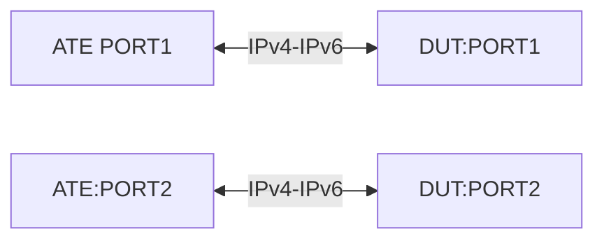

# TE-6.3: Route Leakage between Non Default VRF

## Summary

Validate that Route leakage from VRF-1 to VRF-2 is possible and is able to 
.

## Testbed type

* [`featureprofiles/topologies/atedut_2.testbed`](https://github.com/openconfig/featureprofiles/blob/main/topologies/atedut_2.testbed)

## Topology:



## Procedure

### Initial setup

*   Connect ATE port-1 to DUT port-1, and ATE port-2 to DUT port-2.
*   Configure 192.1.1.1/30 to DUT port-1 and 192.1.1.2/30 to ATE port-1 and 
    Configure 192.1.1.4/30 to DUT port-2 and 192.1.1.5/30 to ATE port-2
*   Create a non-default VRF (VRF-1) that includes DUT port-1 and create
    another non-default VRF (VRF-2) that includes DUT port-2.
*   Configure eBGP from ATE port-1 (AS 65001) to DUT port-1 (AS 65003) and also 
    from ATE port-2 (AS 65003) to DUT port-2 (AS 65002)
*   Advertise 50.1.1.0/24 route from ATE-port1 using the eBGP session. Advertise
    60.1.1.0/24 route from ATE-port2 using the eBGP session.
*   Configure a bi-directional traffic flow with following parameters
    Src: 50.1.1.0/24 & Dst: 60.1.1.0/24 and vice-versa
    Traffic: PPS of 10,000 packets per second, Frame size of 256 bytes

### TE-6.3.1

*   Start the protocols from ATE-port1 and ATE-port2 
*   Verify that 50.1.1.0/24 is installed in VRF-1 routing-instance and 
    60.1.1.0/24 is installed in VRF-2 routing-instance.
*   Start the traffic from ATE-port1 and ATE-port2
*   Validate that there is 100% traffic loss seen as the VRF-1 routes are 
    reachable by VRF-2 routes and vice-versa.

### TE-6.3.2
*   Leak the route 50.1.1.0/24 from VRF-1 routing-instance of ATE-port1 to
    VRF-2 routing-instance.
*   Leak the route 60.1.1.0/24 from VRF-2 routing-instance of ATE-port2 to
    VRF-1 routing-instance.
*   Start the protocols from ATE-port1 and ATE-port2 
*   Verify that 50.1.1.0/24 is installed in VRF-1 routing-instance and 
    60.1.1.0/24 is installed in VRF-2 routing-instance.
*   Start the traffic from ATE-port1 and ATE-port2
*   Validate that traffic is flowing in both directions with 0% traffic loss.

## Canonical OC Configuration
```json
/network-instances/network-instance[name=VRF-1]/protocols/protocol[identifier=BGP][name=BGP]/bgp:
  {
          "openconfig-network-instance:global": {
            "afi-safis": {
              "afi-safi": [
                {
                  "add-paths": {
                    "config": {
                      "receive": false,
                      "send": false
                    }
                  },
                  "afi-safi-name": "openconfig-bgp-types:IPV4_UNICAST",
                  "config": {
                    "afi-safi-name": "openconfig-bgp-types:IPV4_UNICAST",
                    "enabled": true
                  },
                },
              ]
            },
            "config": {
              "as": 65001,
              "router-id": "192.1.1.1"
            },
            "route-selection-options": {
              "config": {
                "always-compare-med": false,
                "external-compare-router-id": true,
                "ignore-as-path-length": false,
                "ignore-next-hop-igp-metric": false
              }
            },
          },
          "openconfig-network-instance:neighbors": {
            "neighbor": [
              {
                "afi-safis": {
                  "afi-safi": [
                      "add-paths": {
                        "config": {
                          "receive": true,
                          "send": true
                        }
                      },
                      "afi-safi-name": "openconfig-bgp-types:IPV6_UNICAST",
                      "config": {
                        "afi-safi-name": "openconfig-bgp-types:IPV6_UNICAST",
                        "enabled": true
                      },
                      "ipv6-unicast": {
                        "config": {
                          "send-default-route": false
                        },
                        "prefix-limit": {
                          "config": {
                            "prevent-teardown": false
                          }
                        }
                      },
                  ]
                },
                "apply-policy": {
                  "config": {
                    "default-export-policy": "REJECT_ROUTE",
                    "default-import-policy": "REJECT_ROUTE"
                  }
                },
                "config": {
                  "enabled": true,
                  "neighbor-address": "1000::50.1.1.2",
                  "peer-as": 64502,
                  "peer-group": "BGP-PEER-GROUP-V6",
                  "route-flap-damping": false,
                  "send-community": "NONE"
                },
              },
              {
                "afi-safis": {
                  "afi-safi": [
                      "add-paths": {
                        "config": {
                          "receive": false,
                          "send": false
                        }
                      },
                      "afi-safi-name": "openconfig-bgp-types:IPV6_UNICAST",
                      "config": {
                        "afi-safi-name": "openconfig-bgp-types:IPV6_UNICAST",
                        "enabled": true
                      },
                      "ipv4-unicast": {
                        "config": {
                          "send-default-route": false
                        },
                        "prefix-limit": {
                          "config": {
                            "prevent-teardown": false
                          }
                        }
                      },
                  ]
                },
                "apply-policy": {
                  "config": {
                    "default-export-policy": "REJECT_ROUTE",
                    "default-import-policy": "REJECT_ROUTE"
                  }
                },
                "config": {
                  "enabled": true,
                  "neighbor-address": "1000::50.1.1.2",
                  "peer-group": "BGP-PEER-GROUP-V6",
                  "route-flap-damping": false,
                  "send-community": "NONE"
                },
              },
            ]
          }
  }
/network-instances/network-instance[name=VRF-2]/protocols/protocol[identifier=BGP][name=BGP]/bgp:
  {
          "openconfig-network-instance:global": {
            "afi-safis": {
              "afi-safi": [
                {
                  "add-paths": {
                    "config": {
                      "receive": false,
                      "send": false
                    }
                  },
                  "afi-safi-name": "openconfig-bgp-types:IPV4_UNICAST",
                  "config": {
                    "afi-safi-name": "openconfig-bgp-types:IPV4_UNICAST",
                    "enabled": true
                  },
                },
              ]
            },
            "config": {
              "as": 65001,
              "router-id": "192.1.1.1"
            },
            "route-selection-options": {
              "config": {
                "always-compare-med": false,
                "external-compare-router-id": true,
                "ignore-as-path-length": false,
                "ignore-next-hop-igp-metric": false
              }
            },
          },
          "openconfig-network-instance:neighbors": {
            "neighbor": [
              {
                "afi-safis": {
                  "afi-safi": [
                      "add-paths": {
                        "config": {
                          "receive": true,
                          "send": true
                        }
                      },
                      "afi-safi-name": "openconfig-bgp-types:IPV6_UNICAST",
                      "config": {
                        "afi-safi-name": "openconfig-bgp-types:IPV6_UNICAST",
                        "enabled": true
                      },
                      "ipv6-unicast": {
                        "config": {
                          "send-default-route": false
                        },
                        "prefix-limit": {
                          "config": {
                            "prevent-teardown": false
                          }
                        }
                      },
                  ]
                },
                "apply-policy": {
                  "config": {
                    "default-export-policy": "REJECT_ROUTE",
                    "default-import-policy": "REJECT_ROUTE"
                  }
                },
                "config": {
                  "enabled": true,
                  "neighbor-address": "1000::50.1.1.2",
                  "peer-as": 64502,
                  "peer-group": "BGP-PEER-GROUP-V6",
                  "route-flap-damping": false,
                  "send-community": "NONE"
                },
              },
              {
                "afi-safis": {
                  "afi-safi": [
                      "add-paths": {
                        "config": {
                          "receive": false,
                          "send": false
                        }
                      },
                      "afi-safi-name": "openconfig-bgp-types:IPV6_UNICAST",
                      "config": {
                        "afi-safi-name": "openconfig-bgp-types:IPV6_UNICAST",
                        "enabled": true
                      },
                      "ipv4-unicast": {
                        "config": {
                          "send-default-route": false
                        },
                        "prefix-limit": {
                          "config": {
                            "prevent-teardown": false
                          }
                        }
                      },
                  ]
                },
                "apply-policy": {
                  "config": {
                    "default-export-policy": "REJECT_ROUTE",
                    "default-import-policy": "REJECT_ROUTE"
                  }
                },
                "config": {
                  "enabled": true,
                  "neighbor-address": "1000::50.1.1.2",
                  "peer-group": "BGP-PEER-GROUP-V6",
                  "route-flap-damping": false,
                  "send-community": "NONE"
                },
              },
            ]
          }
  }
```

## OpenConfig Path and RPC Coverage

```yaml
rpcs:
  gnmi:
    gNMI.Get:
    gNMI.Set:
    gNMI.Subscribe:

paths:
    /network-instances/network-instance/config/name:
    /network-instances/network-instance/config/description:
    
    /network-instances/network-instance/state/name:
    /network-instances/network-instance/state/description:
```

## Minimum DUT platform requirement

FFF

