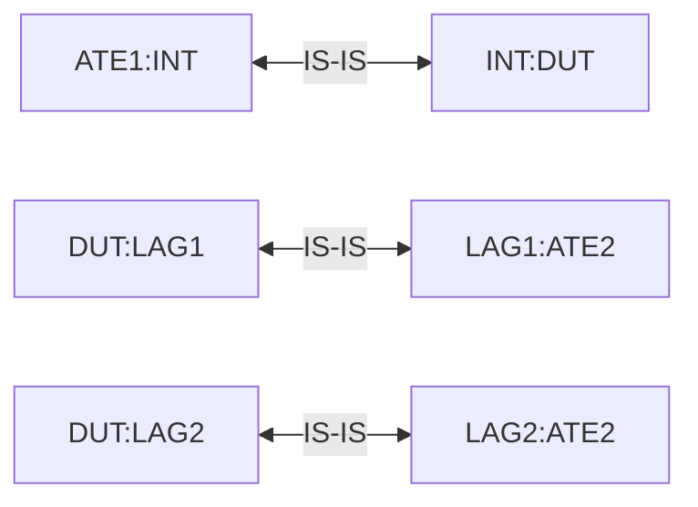

# RT-5.16: LAG Member Removal (NIS) and ECMP Hashing Stability

## Summary

Verify that removing a member port from an aggregate interface (LAG)—simulating the "Not In Service" (NIS) state—correctly updates the LAG bandwidth and Weighted ECMP (W-ECMP) routing weights. This test ensures that the traffic is redistributed according to the new topology without causing unexpected traffic imbalance between trunks or packet loss.

## Testbed type

[TESTBED_DUT_ATE_8LINKS](https://github.com/openconfig/featureprofiles/blob/main/topologies/atedut_8.testbed)

## Topology



*   `LAG1` is configured with 2 physical ports (e.g., `port1`, `port2`).
*   `LAG2` is configured with 2 physical ports (e.g., `port3`, `port4`).
*   `INT` is a single connection to ATE1.

## Procedure

### 1. Test Environment Setup

*   Configure a single interface between DUT and ATE1.
*   Configure two aggregate interfaces (LAG1 and LAG2) between DUT and ATE2, each initially containing 2 member ports.
*   Configure IS-IS routing between DUT and ATE2 over both LAGs.
*   Enable Weighted ECMP (W-ECMP) on the DUT for IS-IS:
    *   `/network-instances/network-instance/protocols/protocol/isis/global/config/weighted-ecmp` set to `true`.
    *   `/network-instances/network-instance/protocols/protocol/isis/interfaces/interface/weighted-ecmp/config/load-balancing-weight` set to `Auto`.
*   ATE2 advertises a set of destination prefixes (e.g., `100.0.1.0/24`) to the DUT.
*   ATE1 sends traffic destined to these prefixes.

### 2. Baseline Verification (Equal Bandwidth)

*   Start traffic from ATE1 towards the advertised prefixes at a constant rate.
*   Verify that traffic is equally distributed between LAG1 and LAG2:
    *   LAG1 should receive ~50% of the total traffic.
    *   LAG2 should receive ~50% of the total traffic.
    *   Verify that within each LAG, traffic is balanced across all member ports.
    *   Verify zero packet loss.

### 3. LAG Member Removal (Simulate NIS)

*   Remove one member port (e.g., `port1`) from `LAG1` on the DUT:
    *   Set `/interfaces/interface[name=port1]/ethernet/config/aggregate-id` to `nil` (or delete the leaf).
    *   Ensure `/interfaces/interface[name=port1]/config/forwarding-viable` is also set to `nil` (to comply with vendor constraints, e.g., Nokia).
*   Verify that `port1` transitions out of the LAG:
    *   Verify that traffic is no longer transmitted on `port1`.
*   Verify that W-ECMP weights and hashing are updated:
    *   `LAG1` now has 1 active port (half bandwidth).
    *   `LAG2` still has 2 active ports (full bandwidth).
    *   Verify that the traffic distribution adjusts to the 1:2 ratio:
        *   LAG1 should receive ~33.3% of the total traffic.
        *   LAG2 should receive ~66.7% of the total traffic.
    *   Assert that the actual traffic received on LAG1 and LAG2 matches the expected ratio (33.3% / 66.7%) within a strict tolerance of **+/- 1%** (to catch 2.5% or higher imbalances).
    *   Verify that the remaining member port of `LAG1` (`port2`) carries the redistributed traffic without drops.
    *   Verify that the transition does not cause sustained packet loss (transient loss during convergence should be < 0.01s).

### 4. Restore Member Port

*   Re-add `port1` to `LAG1` on the DUT:
    *   Set `/interfaces/interface[name=port1]/ethernet/config/aggregate-id` back to `LAG1`.
*   Verify that traffic distribution returns to the baseline:
    *   LAG1 should receive ~50% of the traffic.
    *   LAG2 should receive ~50% of the traffic.
    *   Verify zero packet loss.

## Canonical OC

```json
{
  "interfaces": {
    "interface": [
      {
        "name": "port1",
        "config": {
          "name": "port1",
          "type": "iana-if-type:ethernetCsmacd",
          "enabled": true
        },
        "ethernet": {
          "config": {
            "aggregate-id": "port-channel1"
          }
        }
      },
      {
        "name": "port-channel1",
        "config": {
          "name": "port-channel1",
          "type": "iana-if-type:ieee8023adLag",
          "enabled": true
        },
        "aggregation": {
          "config": {
            "lag-type": "STATIC"
          }
        }
      }
    ]
  },
  "network-instances": {
    "network-instance": [
      {
        "name": "default",
        "protocols": {
          "protocol": [
            {
              "identifier": "ISIS",
              "name": "isis1",
              "isis": {
                "global": {
                  "config": {
                    "weighted-ecmp": true
                  }
                },
                "interfaces": {
                  "interface": [
                    {
                      "interface-id": "port-channel1",
                      "weighted-ecmp": {
                        "config": {
                          "load-balancing-weight": "auto"
                        }
                      }
                    }
                  ]
                }
              }
            }
          ]
        }
      }
    ]
  }
}
```

## OpenConfig Path and RPC Coverage

```yaml
paths:
  ## Config Paths ##
  /network-instances/network-instance/protocols/protocol/isis/global/config/weighted-ecmp:
  /network-instances/network-instance/protocols/protocol/isis/interfaces/interface/weighted-ecmp/config/load-balancing-weight:
  /interfaces/interface/ethernet/config/aggregate-id:
  /interfaces/interface/config/forwarding-viable:

  ## State Paths ##
  /interfaces/interface/state/oper-status:
  /interfaces/interface/state/counters/out-octets:
  /interfaces/interface/state/counters/out-unicast-pkts:
  /network-instances/network-instance/protocols/protocol/isis/global/state/weighted-ecmp:
  /network-instances/network-instance/protocols/protocol/isis/interfaces/interface/weighted-ecmp/state/load-balancing-weight:

rpcs:
  gnmi:
    gNMI.Set:
    gNMI.Subscribe:
```

