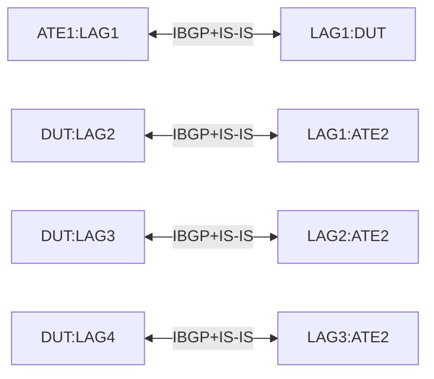

#RT-9: Weighted-ECMP with IS-IS

## Summary

This is to ensure that,
* implementations can be configured for weighted equal cost multipath (ECMP) routing for IS-IS neighbors that are one hop away. 
* When WECMP is enabled, a multipath set of next-hop interfaces for an IS-IS route will have their load-balancing-weight set to a non-zero value which is based on the bandwidth of the LAG interface.
* When WECMP is enabled, traffic destined to an IS-IS route represented by a multipath set of next-hop interfaces will be unequally distributed across the interfaces based on their bandwidth.

## Testbed type

[TESTBED_DUT_ATE_8LINKS](https://github.com/openconfig/featureprofiles/blob/main/topologies/atedut_8.testbed)

## Topolgy

Each LAG bundle below is made up of 2x10G ports.

## Procedure

In the topology above, 
* Configure IPv4 and IPv6 L2 adjacency between DUT and ATE LAG bundles. Therefore DUT will have 1xIS-IS adjacency with ATE1 i.e. DUT:LAG1<->ATE1:LAG1, and 3xIS-IS adjacencies with ATE2 i.e. DUT:LAG2<->ATE2:LAG1, DUT:LAG3<->ATE2:LAG2 and DUT:LAG4<->ATE2:LAG3
  * /network-instances/network-instance/protocols/protocol/isis/global/afi-safi
  * /network-instances/network-instance/protocols/protocol/isis/global/config/level-capability, set to LEVEL_2
  * /network-instances/network-instance/protocols/protocol/isis/levels/level/config/metric-style set to WIDE_METRIC
* Configure IPv4 and IPv6 IBGP peering between both ATEs and the DUT using their loopback addresses.
  * /network-instances/network-instance/protocols/protocol/bgp/peer-groups/peer-group/afi-safis/afi-safi/config
* Attach a network with an IPv4 and an IPv6 prefix to ATE2 and have it advertise these prefixes over its IBGP peering with the DUT. The DUT in turn should advertise these prefixes over its IBGP peering with ATE1
  * Please use `IPv4 prefix = 192.168.1.0/24` and `IPv6 prefix = 2024:db8:64:64::/64`
* Similarly, attach a different network to ATE1 with IPv4 and IPv6 prefixes and advertise the same over its IBGP peering with the DUT.
  * Please use `IPv4 prefix = 192.168.2.0/24` and `IPv6 prefix = 2024:db8:64:65::/64`
* On the DUT, enable WECMP loadbalancing for multipath IS-IS routes and set the load-balancing-weight to use LAG bandwidth.
  * /network-instances/network-instance/protocols/protocol/isis/global/config/weighted-ecmp set to Enabled
  * /network-instances/network-instance/protocols/protocol/isis/interfaces/interface/weighted-ecmp/config/load-balancing-weight set to Auto
  
 
## RT-9.1: Equal distribution of traffic
* Start 1024 flows from IPv4 addresses in 192.168.2.0/24 to 192.168.1.0/24
* Start 1024 flows from IPv6 addresses in 2024:db8:64:65::/64 to 2024:db8:64:64::/64
* Ensure that the total traffic of all flows combined is ~20Gbps
### Verfication
* Ensure that the DUT is learning 3 different paths to prefixes 192.168.1.0/24 and 2024:db8:64:64::/64 over IBGP the same are programmed to the FIB. Check following paths
  * /network-instances/network-instance/protocols/protocol/bgp/peer-groups/peer-group/use-multiple-paths/state/enabled, should be true
  * /network-instances/network-instance/protocols/protocol/bgp/peer-groups/peer-group/afi-safis/afi-safi/use-multiple-paths/ibgp/state/, should be 3
  * /network-instances/network-instance/afts/ipv4-unicast/ipv4-entry/state/prefix
  * /network-instances/network-instance/afts/ipv6-unicast/ipv6-entry/prefix
  * /network-instances/network-instance/afts/ipv4-unicast/ipv4-entry/state/next-hop-group
  * /network-instances/network-instance/afts/ipv6-unicast/ipv6-entry/state/next-hop-group
* It is expected that the IS-IS intance in DUT will equally distribute the traffic received from ATE1:LAG1 over the LAG bundles ATE2:LAG1, ATE3:LAG1 and ATE4:LAG1 when the 3 LAG bundles have the same bandwidth available.
  *  Traffic distribution between ATE2:LAG1, ATE3:LAG1 and ATE4:LAG1 is expected to be ~33% on each LAG Bundle.
  *  Check for the following paths
    *  /network-instances/network-instance/protocols/protocol/isis/global/state/weighted-ecmp, should be true
    *  /network-instances/network-instance/protocols/protocol/isis/interfaces/interface/weighted-ecmp/state/load-balancing-weight, should be auto
    *  /interfaces/interface/state/counters/out-pkts

## RT-9.2: Unequal distribution of traffic
* Stop traffic from RT-9.1 and introduce a failure by disabling one of the member interfaces in ATE2:LAG1.
* Restart 1024 flows from IPv4 addresses in 192.168.2.0/24 to 192.168.1.0/24 
* Restart 1024 flows from IPv6 addresses in 2024:db8:64:65::/64 to 2024:db8:64:64::/64
* Ensure that the total traffic of all flows combined is ~20Gbps
### Verfication
* Ensure that the DUT is learning 3 different paths to prefixes 192.168.1.0/24 and 2024:db8:64:64::/64 over IBGP the same are programmed to the FIB. Check following paths
  * /network-instances/network-instance/protocols/protocol/bgp/peer-groups/peer-group/use-multiple-paths/state/enabled, should be true
  * /network-instances/network-instance/protocols/protocol/bgp/peer-groups/peer-group/afi-safis/afi-safi/use-multiple-paths/ibgp/state/, should be 3
  * /network-instances/network-instance/afts/ipv4-unicast/ipv4-entry/state/prefix
  * /network-instances/network-instance/afts/ipv6-unicast/ipv6-entry/prefix
  * /network-instances/network-instance/afts/ipv4-unicast/ipv4-entry/state/next-hop-group
  * /network-instances/network-instance/afts/ipv6-unicast/ipv6-entry/state/next-hop-group
* It is expected that the IS-IS intance in DUT will unequally distribute the traffic received from ATE1:LAG1 over the LAG bundles ATE2:LAG1, ATE3:LAG1 and ATE4:LAG1. 
  *  Traffic distribution between ATE2:LAG1, ATE3:LAG1 and ATE4:LAG1 is expected to be ~33% on each LAG Bundle.
  *  Check for the following paths
    *  /network-instances/network-instance/protocols/protocol/isis/global/state/weighted-ecmp, should be true
    *  /network-instances/network-instance/protocols/protocol/isis/interfaces/interface/weighted-ecmp/state/load-balancing-weight, should be auto
    *  /interfaces/interface/state/counters/out-pkts
