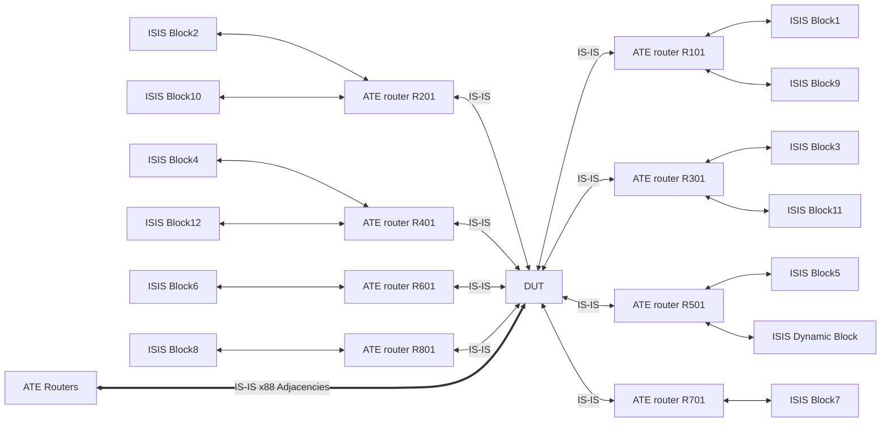

# RT-2.18: IS-IS Multi-adjacencies scale test

## Summary

This test suite should ensure that the router will be able to handle below IS-IS
scale:
    
*   3200 IS Node
*   3200 x /32 IPv4 prefix
*   6400 x /26 IPv4 prefix
*   6400 x /64 IPv6 prefix
*   66200 x ISIS link

Every test in this test suite should be able to test the router performance under
different circumstances e.g static (with no route flaps) dynamic state
(with route flaps).. etc.


## RT-2.18.1: IS-IS scale test with dynamic LSPs (no route churn but new LSPs with a higher sequence number)

### Testbed type

[TESTBED_DUT_ATE_8LINKS](https://github.com/openconfig/featureprofiles/blob/main/topologies/atedut_8.testbed)

### Topology


### DUT and OTG properties


Device  |  Port1 IPv4 | Port1 IPv6 | Port2 IPv4 | Port2 IPv6 | Port3 IPv4 | Port3 IPv6| ISIS AREA | ISIS ID
:------ | :-------------- | :------------- | :--------- | :-------- | :-------- | :--------:
DUT     | 192.168.0.13/30 | 2003:db8::1/126  | 192.168.0.17/30 | 2004:db8::1/126 |192.168.0.21/30 | 2005:db8::1/126 | 49001| 640000000002
ATE R1  | 192.168.0.6/30| 2001:db8::2/126 |N/A|N/A|N/A|N/A| 49001| 640000000003
ATE R2  | N/A|N/A| 192.168.0.10/30 | 2002:db8::2/126|N/A|N/A| 49001| 640000000004
ATE R3  | N/A|N/A| N/A|N/A|192.168.0.22/30 | 2005:db8::2/126| 49001| 640000000005

All Simulated ISIS blocks on OTG will have a grid topology with the below specs

Block Name | Dimension | Lo0 IPv4,IPv6 and ISIS sys ID first octet | Count of parallel links between 2 nodes | Link IPv4 range 
:------ | :-------- | :-------- | :-------- | :--------:
Block1 | 20x20 | 20 | 2 | 21.0.0.0/8
Block2 | 20x20 | 23 | 2 | 24.0.0.0/8
Block3 | 20x20 | 26 | 2 | 27.0.0.0/8
Block4 | 20x20 | 29 | 2 | 30.0.0.0/8
Block5 | 12x12 | 32 | 17 | 33.0.0.0/8
Block6 | 12x12 | 35 | 17 | 36.0.0.0/8
Block7 | 12x12 | 38 | 17 | 39.0.0.0/8
Block8 | 12x12 | 41 | 17 | 42.0.0.0/8
Block9 | 16x16 | 44 | 17 | 45.0.0.0/8
Block10 | 16x16 | 47 | 17 | 48.0.0.0/8
Block11 | 16x16 | 50 | 17 | 51.0.0.0/8
Block12 | 16x16 | 53 | 17 | 54.0.0.0/8
Dynamic1 | 12x12 | 56 | 4 | 57.0.0.0/8


### Procedure

#### Initial Setup:
*   Connect DUT ports 1,2,3,4,5,6,7,8 to OTG ports 1,2,3,4,5,6,7,8 respectively
*   Configure OTG :
    1.   Create an agg interface "Agg1" with LACP
    2.   Create emulated routers R101...R112 with an ethernet interfaces
    3.   Connect the ethernets to the created Agg interface
    4.   Create vlan 1101...1112 under Agg1 and configure IPv4 and IPv6 on R101...R112 for those vlans
    5.   Configure ISIS on R101...R112
            *   Set ISIS System ID 
            *   Set ISIS area ID
            *   Disable "Hello Padding"
            *   Enable wide metrics
            *   Enable ISIS on the ethernet interface with Level 2 only and circuit type of point to point
            *   Enable ISIS 3 way handshaking
    6. Repeat steps 1 to 5 for Agg2 to Agg8 the emulated routers connected to them.
    7. Create IP Flows from Agg1 to the below ranges
        *   24.0.0.0 - 24.0.0.100
        *   30.0.0.0 - 30.0.0.100
        *   36.0.0.0 - 36.0.0.100
        *   42.0.0.0 - 42.0.0.100
        *   48.0.0.0 - 48.0.0.100
        *   54.0.0.0 - 54.0.0.100
        *   57.0.0.0 - 58.0.0.100

    8. Create IP Flows from Agg2 to the below ranges
        *   21.0.0.0 - 24.0.0.100
        *   27.0.0.0 - 30.0.0.100
        *   33.0.0.0 - 36.0.0.100
        *   39.0.0.0 - 42.0.0.100
        *   45.0.0.0 - 48.0.0.100
        *   51.0.0.0 - 51.0.0.100
    9. Push configuration to OTG
*   Start protocols on OTG
*   Configure DUT:
    1.  Configure the default network instance and push path to DUT
    2.  Create an LAG interface set the interface IP address and LACP and push path to DUT
    3.  Create a physical interface and attach it to the LAG . 
    4.  Repeat steps 1 to 3 for the second LAG .
    5.  Configure ISIS for DUT :
            *   Create ISIS instance under the default routing instance
            *   Set ISIS net address (area ID + System ID)
            *   Set ISIS level capability to level 2 only
            *   Disable "Hello Padding"
            *   Set "LSP Refresh Timer" and "LSP Lifetime Timer" to 65218 and 65535 respectively.
            *   Set "SPF First Interval" and "SPF Hold Interval" to 200 and 2000 respectively.
            *   Set metric style to wide
            *   Enable IPv4-unicast and IPv6-unicast address families.
            *   Enable ISIS on the Loopback and the 2 LAG interfaces.
            *   Set Loopback to passive mode and the LAG interface circuit type to point to point.
            *   Push the configuration to the DUT.
*   Confirm that DUT has 8 aggregate ports are up.
*   Confirm that DUT has 96 ISIS adjacencies up.

#### Testing steps

*   Wait for 5 mins
*   Collect the below metrics form the DUT :
    1.  Count of LSPs
    2.  Count of ISIS IPv4 routes
    3.  Count of ISIS IPv6 routes
*   Start traffic flows
*   Wait for 30 seconds
*   Stop traffic flows
*   Collect the number of RX and TX traffic flows packets

#### Test pass fail criteria

*   If any of the below conditions are not met test should be declared as a "FAIL"
    1.  Count of ISIS adjacencies in the "UP" state is less than 96
    2.  Count of any of the below metrics was not equal to the below values :
        a.  ISIS LSPs >= 9300
        b.  ISIS IPv4 routes >= 68000
        c.  ISIS IPv6 routes >= 6680
    3.  Number of TX packets is not equal to RX packets

## Canonical OC

```json
  "openconfig-network-instance:network-instances": {
    "network-instance": [
      {
        "config": {
          "name": "DEFAULT"
        },
        "name": "DEFAULT",
        "protocols": {
          "protocol": [
            {
              "config": {
                "identifier": "openconfig-policy-types:ISIS",
                "name": "DEFAULT"
              },
              "identifier": "openconfig-policy-types:ISIS",
              "isis": {
                "global": {
                  "afi-safi": {
                    "af": [
                      {
                        "afi-name": "openconfig-isis-types:IPV4",
                        "config": {
                          "afi-name": "openconfig-isis-types:IPV4",
                          "enabled": true,
                          "metric": 10,
                          "safi-name": "openconfig-isis-types:UNICAST"
                        },
                        "safi-name": "openconfig-isis-types:UNICAST"
                      },
                      {
                        "afi-name": "openconfig-isis-types:IPV6",
                        "config": {
                          "afi-name": "openconfig-isis-types:IPV6",
                          "enabled": true,
                          "metric": 10,
                          "safi-name": "openconfig-isis-types:UNICAST"
                        },
                        "safi-name": "openconfig-isis-types:UNICAST"
                      }
                    ]
                  },
                  "config": {
                    "hello-padding": "DISABLE",
                    "level-capability": "LEVEL_2",
                    "net": [
                      "49.0001.1920.0000.2001.00"
                    ]
                  },
                  "mpls": {
                    "igp-ldp-sync": {
                      "config": {
                        "enabled": false
                      }
                    }
                  },
                  "timers": {
                    "config": {
                      "lsp-lifetime-interval": 65535,
                      "lsp-refresh-interval": 65218
                    },
                    "spf": {
                      "config": {
                        "spf-first-interval": 200,
                        "spf-hold-interval": 2000
                      }
                    }
                  }
                },
                "interfaces": {
                  "interface": [
                    {
                      "afi-safi": {
                        "af": [
                          {
                            "afi-name": "openconfig-isis-types:IPV4",
                            "config": {
                              "afi-name": "openconfig-isis-types:IPV4",
                              "enabled": true,
                              "safi-name": "openconfig-isis-types:UNICAST"
                            },
                            "safi-name": "openconfig-isis-types:UNICAST"
                          },
                          {
                            "afi-name": "openconfig-isis-types:IPV6",
                            "config": {
                              "afi-name": "openconfig-isis-types:IPV6",
                              "enabled": true,
                              "safi-name": "openconfig-isis-types:UNICAST"
                            },
                            "safi-name": "openconfig-isis-types:UNICAST"
                          }
                        ]
                      },
                      "config": {
                        "circuit-type": "POINT_TO_POINT",
                        "enabled": true,
                        "interface-id": "Bundle-Ether1"
                      },
                      "interface-id": "Bundle-Ether1",
                      "levels": {
                        "level": [
                          {
                            "config": {
                              "enabled": false,
                              "level-number": 1
                            },
                            "level-number": 1
                          },
                          {
                            "afi-safi": {
                              "af": [
                                {
                                  "afi-name": "openconfig-isis-types:IPV4",
                                  "config": {
                                    "afi-name": "openconfig-isis-types:IPV4",
                                    "metric": 10,
                                    "safi-name": "openconfig-isis-types:UNICAST"
                                  },
                                  "safi-name": "openconfig-isis-types:UNICAST"
                                },
                                {
                                  "afi-name": "openconfig-isis-types:IPV6",
                                  "config": {
                                    "afi-name": "openconfig-isis-types:IPV6",
                                    "metric": 10,
                                    "safi-name": "openconfig-isis-types:UNICAST"
                                  },
                                  "safi-name": "openconfig-isis-types:UNICAST"
                                }
                              ]
                            },
                            "config": {
                              "enabled": true,
                              "level-number": 2
                            },
                            "level-number": 2,
                            "timers": {
                              "config": {
                                "hello-multiplier": 6
                              }
                            }
                          }
                        ]
                      },
                      "mpls": {
                        "igp-ldp-sync": {
                          "config": {
                            "enabled": false
                          }
                        }
                      },
                      "timers": {
                        "config": {
                          "lsp-pacing-interval": 50
                        }
                      }
                    },
                    {
                      "afi-safi": {
                        "af": [
                          {
                            "afi-name": "openconfig-isis-types:IPV4",
                            "config": {
                              "afi-name": "openconfig-isis-types:IPV4",
                              "enabled": true,
                              "safi-name": "openconfig-isis-types:UNICAST"
                            },
                            "safi-name": "openconfig-isis-types:UNICAST"
                          },
                          {
                            "afi-name": "openconfig-isis-types:IPV6",
                            "config": {
                              "afi-name": "openconfig-isis-types:IPV6",
                              "enabled": true,
                              "safi-name": "openconfig-isis-types:UNICAST"
                            },
                            "safi-name": "openconfig-isis-types:UNICAST"
                          }
                        ]
                      },
                      "config": {
                        "circuit-type": "POINT_TO_POINT",
                        "enabled": true,
                        "interface-id": "Bundle-Ether2"
                      },
                      "interface-id": "Bundle-Ether2",
                      "levels": {
                        "level": [
                          {
                            "config": {
                              "enabled": false,
                              "level-number": 1
                            },
                            "level-number": 1
                          },
                          {
                            "afi-safi": {
                              "af": [
                                {
                                  "afi-name": "openconfig-isis-types:IPV4",
                                  "config": {
                                    "afi-name": "openconfig-isis-types:IPV4",
                                    "metric": 10,
                                    "safi-name": "openconfig-isis-types:UNICAST"
                                  },
                                  "safi-name": "openconfig-isis-types:UNICAST"
                                },
                                {
                                  "afi-name": "openconfig-isis-types:IPV6",
                                  "config": {
                                    "afi-name": "openconfig-isis-types:IPV6",
                                    "metric": 10,
                                    "safi-name": "openconfig-isis-types:UNICAST"
                                  },
                                  "safi-name": "openconfig-isis-types:UNICAST"
                                }
                              ]
                            },
                            "config": {
                              "enabled": true,
                              "level-number": 2
                            },
                            "level-number": 2,
                            "timers": {
                              "config": {
                                "hello-multiplier": 6
                              }
                            }
                          }
                        ]
                      },
                      "mpls": {
                        "igp-ldp-sync": {
                          "config": {
                            "enabled": false
                          }
                        }
                      },
                      "timers": {
                        "config": {
                          "lsp-pacing-interval": "50"
                        }
                      }
                    },
                    {
                      "afi-safi": {
                        "af": [
                          {
                            "afi-name": "openconfig-isis-types:IPV4",
                            "config": {
                              "afi-name": "openconfig-isis-types:IPV4",
                              "enabled": true,
                              "safi-name": "openconfig-isis-types:UNICAST"
                            },
                            "safi-name": "openconfig-isis-types:UNICAST"
                          },
                          {
                            "afi-name": "openconfig-isis-types:IPV6",
                            "config": {
                              "afi-name": "openconfig-isis-types:IPV6",
                              "enabled": true,
                              "safi-name": "openconfig-isis-types:UNICAST"
                            },
                            "safi-name": "openconfig-isis-types:UNICAST"
                          }
                        ]
                      },
                      "config": {
                        "circuit-type": "POINT_TO_POINT",
                        "enabled": true,
                        "interface-id": "Loopback0"
                      },
                      "interface-id": "Loopback0",
                      "levels": {
                        "level": [
                          {
                            "config": {
                              "enabled": false,
                              "level-number": 1
                            },
                            "level-number": 1
                          },
                          {
                            "afi-safi": {
                              "af": [
                                {
                                  "afi-name": "openconfig-isis-types:IPV4",
                                  "config": {
                                    "afi-name": "openconfig-isis-types:IPV4",
                                    "metric": 10,
                                    "safi-name": "openconfig-isis-types:UNICAST"
                                  },
                                  "safi-name": "openconfig-isis-types:UNICAST"
                                },
                                {
                                  "afi-name": "openconfig-isis-types:IPV6",
                                  "config": {
                                    "afi-name": "openconfig-isis-types:IPV6",
                                    "metric": 10,
                                    "safi-name": "openconfig-isis-types:UNICAST"
                                  },
                                  "safi-name": "openconfig-isis-types:UNICAST"
                                }
                              ]
                            },
                            "config": {
                              "enabled": true,
                              "level-number": 2
                            },
                            "level-number": 2,
                            "timers": {
                              "config": {
                                "hello-multiplier": 6
                              }
                            }
                          }
                        ]
                      },
                      "mpls": {
                        "igp-ldp-sync": {
                          "config": {
                            "enabled": false
                          }
                        }
                      },
                      "timers": {
                        "config": {
                          "lsp-pacing-interval": "50"
                        }
                      }
                    }
                  ]
                },
                "levels": {
                  "level": [
                    {
                      "config": {
                        "level-number": 2,
                        "metric-style": "WIDE_METRIC"
                      },
                      "level-number": 2
                    }
                  ]
                }
              },
              "name": "DEFAULT"
            }
          ]
        }
      }
    ]
  }
}
```

## OpenConfig Path and RPC Coverage
```yaml
paths:
  ## Config Parameter Coverage


/network-instances/network-instance/protocols/protocol/isis/global/config/net:
/network-instances/network-instance/protocols/protocol/isis/global/config/level-capability:
/network-instances/network-instance/protocols/protocol/isis/global/config/hello-padding:
/network-instances/network-instance/protocols/protocol/isis/global/afi-safi/af/config/enabled:
/network-instances/network-instance/protocols/protocol/isis/global/timers/spf/config/spf-hold-interval:
/network-instances/network-instance/protocols/protocol/isis/global/timers/spf/config/spf-first-interval:
/network-instances/network-instance/protocols/protocol/isis/global/timers/config/lsp-refresh-interval:
/network-instances/network-instance/protocols/protocol/isis/global/timers/config/lsp-lifetime-interval:
/network-instances/network-instance/protocols/protocol/isis/global/mpls/igp-ldp-sync/config/enabled:
/network-instances/network-instance/protocols/protocol/isis/levels/level/config/level-number:
/network-instances/network-instance/protocols/protocol/isis/levels/level/config/enabled:
/network-instances/network-instance/protocols/protocol/isis/levels/level/config/metric-style:
/network-instances/network-instance/protocols/protocol/isis/interfaces/interface/config/interface-id:
/network-instances/network-instance/protocols/protocol/isis/interfaces/interface/config/enabled:
/network-instances/network-instance/protocols/protocol/isis/interfaces/interface/config/circuit-type:
/network-instances/network-instance/protocols/protocol/isis/interfaces/interface/config/passive:
/network-instances/network-instance/protocols/protocol/isis/interfaces/interface/levels/level/config/level-number:
/network-instances/network-instance/protocols/protocol/isis/interfaces/interface/levels/level/config/passive:
/network-instances/network-instance/protocols/protocol/isis/interfaces/interface/levels/level/timers/config/hello-interval:
/network-instances/network-instance/protocols/protocol/isis/interfaces/interface/levels/level/timers/config/hello-multiplier:
/network-instances/network-instance/protocols/protocol/isis/interfaces/interface/afi-safi/af/config/afi-name:
/network-instances/network-instance/protocols/protocol/isis/interfaces/interface/afi-safi/af/config/safi-name:
/network-instances/network-instance/protocols/protocol/isis/interfaces/interface/afi-safi/af/config/enabled:
/network-instances/network-instance/protocols/protocol/isis/interfaces/interface/timers/config/lsp-pacing-interval:
/network-instances/network-instance/protocols/protocol/isis/interfaces/interface/mpls/igp-ldp-sync/config/enabled:
/network-instances/network-instance/protocols/protocol/isis/interfaces/interface/levels/level/afi-safi/af/config/metric:


## Telemetry Parameter Coverage

/interfaces/interface/state/admin-status:
/network-instances/network-instance/protocols/protocol/isis/interfaces/interface/levels/level/adjacencies/adjacency/state:
/network-instances/network-instance/protocols/protocol/isis/levels/level/link-state-database/lsp/state/lsp-id:
/network-instances/network-instance/afts/aft-summaries/ipv4-unicast/protocols/protocol/state/counters/aft-entries:
/network-instances/network-instance/afts/aft-summaries/ipv6-unicast/protocols/protocol/state/counters/aft-entries:
/instances/network-instance/protocols/protocol/isis/levels/level/link-state-database/lsp/tlvs/tlv:

rpcs:
  gnmi:
    gNMI.Subscribe:
    gNMI.Set:
```

