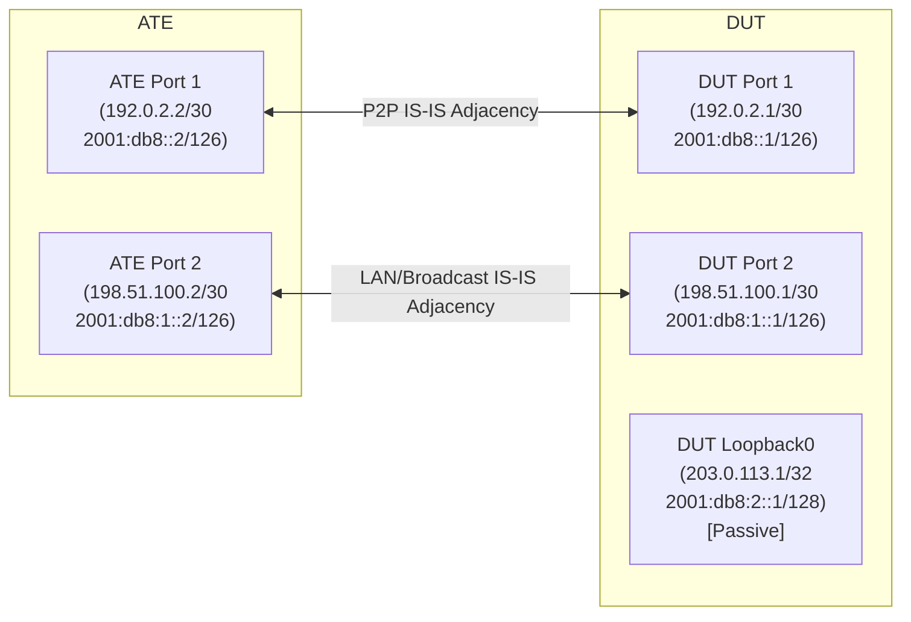

# RT-2.19: IS-IS Suppress Interface Reachability

## Summary

This test validates that the Device Under Test (DUT) can suppress the
advertisement of IP reachability (TLV 135 for IPv4 and TLV 236 for IPv6) within
IS-IS Link State Protocol Data Units (LSPs).

The test validates:

* Suppression mode at global address-family level (`NONE`, `ALL`, `NON_PASSIVE`, `NON_PASSIVE_POINT_TO_POINT`).
* Verification that suppression configuration and telemetry state match.
* Verification via Automated Test Equipment (ATE) that advertised LSPs
  correctly include or omit the expected prefix reachability TLVs.
* Ensuring IS-IS adjacencies remain fully established across all valid interfaces
  during suppression changes.

## Testbed type

* [`featureprofiles/topologies/atedut_2.testbed`](https://github.com/openconfig/featureprofiles/blob/main/topologies/atedut_2.testbed)

## Topology



### IP and Protocol Parameter Assignments

* **DUT:**
  * Network Entity Title (NET): `49.0001.1920.0000.2001.00`
  * Port 1: `192.0.2.1/30`, `2001:db8::1/126` (Point-to-Point, non-passive)
  * Port 2: `198.51.100.1/30`, `2001:db8:1::1/126` (Broadcast/LAN, non-passive)
  * Loopback0: `203.0.113.1/32`, `2001:db8:2::1/128` (Passive)
* **ATE:**
  * Port 1: `192.0.2.2/30`, `2001:db8::2/126`, NET `49.0001.1920.0000.2002.00`
  * Port 2: `198.51.100.2/30`, `2001:db8:1::1/126`,
    NET `49.0001.1920.0000.2003.00`
* **IS-IS Parameters:**
  * Level Capability: Level 2
  * Metric Style: Wide
  * Address Families: IPv4 Unicast (`IPV4`), IPv6 Unicast (`IPV6`)

## Procedure

### Test environment setup

1. Configure DUT interfaces:
   * Port 1: IPv4 `192.0.2.1/30`, IPv6 `2001:db8::1/126`, Point-to-Point.
   * Port 2: IPv4 `198.51.100.1/30`, IPv6 `2001:db8:1::1/126`, Broadcast.
   * Loopback0: IPv4 `203.0.113.1/32`, IPv6 `2001:db8:2::1/128`, `passive: true`.
2. Enable IS-IS Level 2 globally on the DUT with NET `49.0001.1920.0000.2001.00`, wide metric, and address families `IPV4` and `IPV6`.
3. Verify via telemetry that global NET is correctly configured and active in state (`/network-instances/network-instance/protocols/protocol/isis/global/state/net`).
4. Configure ATE interfaces:
   * Port 1: IPv4 `192.0.2.2/30`, IPv6 `2001:db8::2/126`, IS-IS Level 2 emulation (NET `49.0001.1920.0000.2002.00`, Point-to-Point).
   * Port 2: IPv4 `198.51.100.2/30`, IPv6 `2001:db8:1::2/126`, IS-IS Level 2 emulation (NET `49.0001.1920.0000.2003.00`, Broadcast).
5. Establish IS-IS Level 2 adjacencies on Port 1 and Port 2.
6. Verify via telemetry that adjacencies on Port 1 and Port 2 reach `UP` state.

### RT-2.19.1 - Default Reachability Advertisement (Mode NONE)

* **Goal**: Validate that in default mode (`NONE`), the DUT advertises IP reachability TLVs for all active and passive interfaces.
* **Procedure**:
  1. Configure global `suppress-interface-reachability` to `NONE` for IPv4 and IPv6 address families on the DUT.
  2. Verify via telemetry that global `suppress-interface-reachability` is `NONE` for IPv4 and IPv6.
  3. Inspect DUT's advertised LSPs on ATE:
     * Verify Extended IPv4 Reachability (TLV 135) and IPv6 Reachability (TLV 236) are present for Port 1, Port 2, and Loopback0.
  4. Verify IS-IS adjacencies on Port 1 and Port 2 remain in `UP` state.

### RT-2.19.2 - Suppress All Interfaces Reachability (Mode ALL)

* **Goal**: Validate that when suppression mode is set to `ALL`, the DUT omits prefix reachability TLVs for all interfaces while maintaining IS-IS adjacencies.
* **Procedure**:
  1. Configure global `suppress-interface-reachability` to `ALL` for IPv4 and IPv6 on the DUT.
  2. Verify via telemetry that global `suppress-interface-reachability` is `ALL` for IPv4 and IPv6.
  3. Inspect DUT's advertised LSPs received on ATE:
     * Verify TLV 135 (IPv4) and TLV 236 (IPv6) are omitted for Port 1, Port 2, and Loopback0.
     * Verify IS-IS neighbor TLVs (TLV 22 / TLV 222) continue to be advertised.
  4. Verify IS-IS adjacencies on Port 1 and Port 2 remain continuously `UP`.

### RT-2.19.3 - Suppress Non-Passive Interfaces Reachability (Mode NON_PASSIVE)

* **Goal**: Validate that setting suppression mode to `NON_PASSIVE` suppresses active transit interfaces while continuing to advertise passive interfaces.
* **Procedure**:
  1. Configure global `suppress-interface-reachability` to `NON_PASSIVE` for IPv4 and IPv6 on the DUT.
  2. Verify via telemetry that global `suppress-interface-reachability` is `NON_PASSIVE` for IPv4 and IPv6.
  3. Inspect DUT's advertised LSPs received on ATE:
     * Verify TLV 135 (IPv4) and TLV 236 (IPv6) are present only for passive interface Loopback0.
     * Verify TLV 135 and TLV 236 are omitted for non-passive Port 1 and Port 2.
  4. Verify IS-IS adjacencies on Port 1 and Port 2 remain in `UP` state.

### RT-2.19.4 - Suppress Non-Passive Point-to-Point Interfaces Reachability (Mode NON_PASSIVE_POINT_TO_POINT)

* **Goal**: Validate that setting suppression mode to `NON_PASSIVE_POINT_TO_POINT` suppresses only point-to-point active interfaces while preserving reachability for broadcast and passive interfaces.
* **Procedure**:
  1. Configure global `suppress-interface-reachability` to `NON_PASSIVE_POINT_TO_POINT` for IPv4 and IPv6 on the DUT.
  2. Verify via telemetry that global `suppress-interface-reachability` is `NON_PASSIVE_POINT_TO_POINT` for IPv4 and IPv6.
  3. Inspect DUT's advertised LSPs received on ATE:
     * Verify TLV 135 (IPv4) and TLV 236 (IPv6) are present for Loopback0 and Port 2 (Broadcast).
     * Verify TLV 135 and TLV 236 are omitted for Port 1 (Point-to-Point).
  4. Verify IS-IS adjacencies on Port 1 and Port 2 remain in `UP` state.
  5. Register a cleanup action (e.g., using `t.Cleanup()`) to restore the DUT configuration to default (`suppress-interface-reachability: NONE`) to leave the testbed in a clean state.

## Canonical OC

```json
{
  "openconfig-network-instance:network-instances": {
    "network-instance": [
      {
        "config": {
          "name": "DEFAULT"
        },
        "name": "DEFAULT",
        "protocols": {
          "protocol": [
            {
              "config": {
                "identifier": "openconfig-policy-types:ISIS",
                "name": "DEFAULT"
              },
              "identifier": "openconfig-policy-types:ISIS",
              "isis": {
                "global": {
                  "afi-safi": {
                    "af": [
                      {
                        "afi-name": "openconfig-isis-types:IPV4",
                        "config": {
                          "afi-name": "openconfig-isis-types:IPV4",
                          "enabled": true,
                          "safi-name": "openconfig-isis-types:UNICAST",
                          "suppress-interface-reachability": "NON_PASSIVE"
                        },
                        "safi-name": "openconfig-isis-types:UNICAST"
                      },
                      {
                        "afi-name": "openconfig-isis-types:IPV6",
                        "config": {
                          "afi-name": "openconfig-isis-types:IPV6",
                          "enabled": true,
                          "safi-name": "openconfig-isis-types:UNICAST",
                          "suppress-interface-reachability": "NON_PASSIVE"
                        },
                        "safi-name": "openconfig-isis-types:UNICAST"
                      }
                    ]
                  },
                  "config": {
                    "net": [
                      "49.0001.1920.0000.2001.00"
                    ]
                  }
                },
                "interfaces": {
                  "interface": [
                    {
                      "config": {
                        "circuit-type": "POINT_TO_POINT",
                        "enabled": true,
                        "interface-id": "Port1"
                      },
                      "interface-id": "Port1"
                    },
                    {
                      "config": {
                        "circuit-type": "BROADCAST",
                        "enabled": true,
                        "interface-id": "Port2"
                      },
                      "interface-id": "Port2"
                    },
                    {
                      "config": {
                        "enabled": true,
                        "interface-id": "Loopback0",
                        "passive": true
                      },
                      "interface-id": "Loopback0"
                    }
                  ]
                }
              },
              "name": "DEFAULT"
            }
          ]
        }
      }
    ]
  }
}
```

## OpenConfig Path and RPC Coverage

The below yaml defines the OC paths intended to be covered by this test.

```yaml
paths:
  ## Config paths
  /network-instances/network-instance/protocols/protocol/isis/global/config/net:
  /network-instances/network-instance/protocols/protocol/isis/global/afi-safi/af/config/afi-name:
  /network-instances/network-instance/protocols/protocol/isis/global/afi-safi/af/config/safi-name:
  /network-instances/network-instance/protocols/protocol/isis/global/afi-safi/af/config/enabled:
  /network-instances/network-instance/protocols/protocol/isis/global/afi-safi/af/config/suppress-interface-reachability:
  /network-instances/network-instance/protocols/protocol/isis/interfaces/interface/config/interface-id:
  /network-instances/network-instance/protocols/protocol/isis/interfaces/interface/config/enabled:
  /network-instances/network-instance/protocols/protocol/isis/interfaces/interface/config/passive:
  /network-instances/network-instance/protocols/protocol/isis/interfaces/interface/config/circuit-type:

  ## State paths
  /network-instances/network-instance/protocols/protocol/isis/global/state/net:
  /network-instances/network-instance/protocols/protocol/isis/global/afi-safi/af/state/afi-name:
  /network-instances/network-instance/protocols/protocol/isis/global/afi-safi/af/state/safi-name:
  /network-instances/network-instance/protocols/protocol/isis/global/afi-safi/af/state/enabled:
  /network-instances/network-instance/protocols/protocol/isis/global/afi-safi/af/state/suppress-interface-reachability:
  /network-instances/network-instance/protocols/protocol/isis/interfaces/interface/state/interface-id:
  /network-instances/network-instance/protocols/protocol/isis/interfaces/interface/state/enabled:
  /network-instances/network-instance/protocols/protocol/isis/interfaces/interface/state/passive:
  /network-instances/network-instance/protocols/protocol/isis/interfaces/interface/state/circuit-type:
  /network-instances/network-instance/protocols/protocol/isis/interfaces/interface/levels/level/adjacencies/adjacency/state/adjacency-state:

rpcs:
  gnmi:
    gNMI.Get:
    gNMI.Set:
    gNMI.Subscribe:
```

## Required DUT platform

* FFF