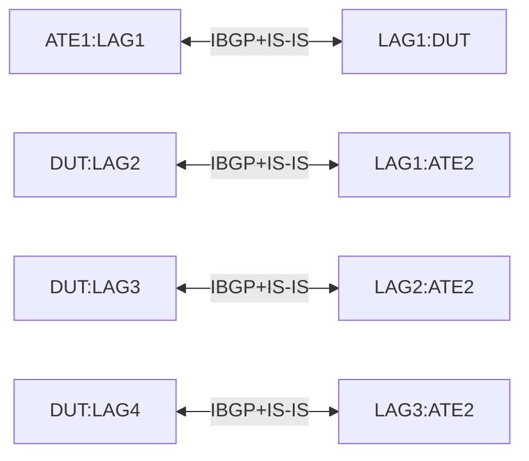

# RT-2.13: Weighted-ECMP for IS-IS

## Summary

This is to ensure that,

*   Implementations can be configured for weighted equal cost multipath (ECMP)
    routing for IS-IS neighbors that are one hop away.

*   When WECMP is enabled, traffic destined to an IS-IS route represented by a
    multipath set of next-hop interfaces will be unequally distributed across
    the interfaces based on their bandwidth.

## Testbed type

[TESTBED_DUT_ATE_8LINKS](https://github.com/openconfig/featureprofiles/blob/main/topologies/atedut_8.testbed)

## Topolgy

Each LAG bundle below is made up of 2x100G ports.



## Procedure

### Test environment setup

*   Configure 1 aggregate interface with 2 100GE ports between DUT and ATE1
*   Configure 3 aggregate interfaces, each with 2 100GE ports between DUT and ATE2.
*   Configure IPv4 and IPv6 L2 adjacencies between DUT and ATE aggregate interfaces.
    Therefore, DUT will have
    * 1xIS-IS adjacency with ATE1 DUT:LAG1<->ATE1:LAG1, 
    * 3xIS-IS adjacencies between DUT and ATE2
        * DUT:LAG2<->ATE2:LAG1
        * DUT:LAG3<->ATE2:LAG2
        * DUT:LAG4<->ATE2:LAG3

    * Set ISIS parameters as
        * /network-instances/network-instance/protocols/protocol/isis/global/
            * afi-safi/af/config/afi-name: IPV4, IPV6
            * afi-safi/af/config/safi-name: UNICAST
            * afi-safi/af/config/enabled: true
            * config/level-capability = LEVEL_2
        * /network-instances/network-instance/protocols/protocol/isis/levels/level/config/metric-style = WIDE_METRIC

*   Configure IPv4 and IPv6 IBGP peering between both ATEs and the DUT using
    their loopback addresses for both IPv4 and IPv6 address families.

    *   /network-instances/network-instance/protocols/protocol/bgp/peer-groups/peer-group/afi-safis/afi-safi/config

*   Attach a network with an IPv4 and an IPv6 prefix to ATE2 and have it
    advertise these prefixes over its IBGP peering with the DUT. The DUT in turn
    should advertise these prefixes over its IBGP peering with ATE1

    *   Please use `IPv4 prefix = 100.0.1.0/24` and `IPv6 prefix =
        2001:db8:64:64::/64`

*   Similarly, attach a different network to ATE1 with IPv4 and IPv6 prefixes
    and advertise the same over its IBGP peering with the DUT.

    *   Please use `IPv4 prefix = 100.0.2.0/24` and `IPv6 prefix =
        2001:db8:64:65::/64`

*   On the DUT, enable WECMP loadbalancing for multipath IS-IS routes and set
    the load-balancing-weight to use LAG bandwidth.

    *   /network-instances/network-instance/protocols/protocol/isis/global/config/weighted-ecmp
        set to Enabled

    *   /network-instances/network-instance/protocols/protocol/isis/interfaces/interface/weighted-ecmp/config/load-balancing-weight
        set to Auto

## RT-2.13.1: Equal distribution of traffic

*   Start 1024 flows from IPv4 addresses in 100.0.2.0/24 to 100.0.1.0/24

*   Start 1024 flows from IPv6 addresses in 2001:db8:64:65::/64 to
    2001:db8:64:64::/64


### Verification

*   Ensure that the DUT has learnt the routes for prefixes 100.0.1.0/24 and
    2001:db8:64:64::/64 over IBGP. Following paths

    *   /network-instances/network-instance/afts/next-hops/next-hop/state/ip-address

*   Ensure that the DUT has learnt routes to the IPv4 and IPv6 loopback
    addresses of ATE2. It is expected that these prefixes are reachable via 3
    different Next-Hop addresses corresponding to the LAG1, LAG2 and LAG3
    interfaces on ATE2.

*   It is expected that the IS-IS instance in DUT will equally distribute the
    traffic received on DUT:LAG1 over the LAG bundles corresponding to
    ATE2:LAG1, ATE2:LAG2 and ATE2:LAG3 when the 3 LAG bundles have the same
    bandwidth available.

    *   Traffic distribution between DUT:LAG2, DUT:LAG3 and DUT:LAG4 is expected
        to be ~33% each of the total traffic received on DUT:LAG1.

    *   Check for the following paths

        *   /network-instances/network-instance/protocols/protocol/isis/global/state/weighted-ecmp,
            should be true

        *   /network-instances/network-instance/protocols/protocol/isis/interfaces/interface/weighted-ecmp/state/load-balancing-weight,
            should be auto

        *   /interfaces/interface/state/counters/out-pkts

        *   /interfaces/interface/state/counters/in-pkts

## RT-2.13.2: Unequal distribution of traffic

*   Stop traffic from RT-9.1 and introduce a failure by disabling one of the
    member interfaces in ATE2:LAG1.

*   Restart 1024 flows from IPv4 addresses in 100.0.2.0/24 to 100.0.1.0/24

*   Restart 1024 flows from IPv6 addresses in 2001:db8:64:65::/64 to
    2001:db8:64:64::/64


### Verification

*   It is expected that the IS-IS instance in DUT will unequally distribute the
    traffic received from ATE1:LAG1 over the LAG bundles corresponding to
    ATE2:LAG1, ATE2:LAG2 and ATE3:LAG3.

    *   Traffic on DUT:LAG2 is expected to be ~20% while traffic on DUT:LAG3 and
        DUT:LAG4 is expected to be ~40% each of the total traffic received on
        DUT:LAG1. If the traffic is not unequally shared between the DUT LAG
        bundles towards ATE2 then this test is a failure.

    *   Check for the following paths

        *   /interfaces/interface/state/counters/out-pkts

        *   /interfaces/interface/state/counters/in-pkts

The below yaml defines the OC paths intended to be covered by this test.  OC paths used for test setup are not listed here.

```yaml
paths:
  ## Config Paths ##
  /network-instances/network-instance/protocols/protocol/bgp/peer-groups/peer-group/config/peer-group-name:
  /network-instances/network-instance/protocols/protocol/bgp/peer-groups/peer-group/config/peer-as:
  /network-instances/network-instance/protocols/protocol/bgp/peer-groups/peer-group/afi-safis/afi-safi/config/afi-safi-name:
  /network-instances/network-instance/protocols/protocol/bgp/peer-groups/peer-group/afi-safis/afi-safi/config/enabled:
  /network-instances/network-instance/protocols/protocol/isis/global/afi-safi/af/config/afi-name:
  /network-instances/network-instance/protocols/protocol/isis/global/afi-safi/af/config/safi-name:
  /network-instances/network-instance/protocols/protocol/isis/global/afi-safi/af/config/enabled:
  /network-instances/network-instance/protocols/protocol/isis/global/config/level-capability:
  /network-instances/network-instance/protocols/protocol/isis/levels/level/config/metric-style:
  /network-instances/network-instance/protocols/protocol/isis/global/config/weighted-ecmp:
  /network-instances/network-instance/protocols/protocol/isis/interfaces/interface/weighted-ecmp/config/load-balancing-weight:
  /routing-policy/defined-sets/prefix-sets/prefix-set/prefixes/prefix/config/ip-prefix:
  /routing-policy/defined-sets/prefix-sets/prefix-set/prefixes/prefix/config/masklength-range:
    value: exact
  /routing-policy/policy-definitions/policy-definition/config/name:
  /routing-policy/policy-definitions/policy-definition/statements/statement/config/name:
  /routing-policy/policy-definitions/policy-definition/statements/statement/conditions/match-prefix-set/config/prefix-set:
  /routing-policy/policy-definitions/policy-definition/statements/statement/conditions/match-prefix-set/config/match-set-options:
  /routing-policy/policy-definitions/policy-definition/statements/statement/actions/config/policy-result:
    value: ACCEPT_ROUTE
  /network-instances/network-instance/protocols/protocol/bgp/peer-groups/peer-group/afi-safis/afi-safi/apply-policy/config/import-policy:
  /network-instances/network-instance/protocols/protocol/bgp/peer-groups/peer-group/afi-safis/afi-safi/apply-policy/config/export-policy:

  ## State Paths ##
  /network-instances/network-instance/protocols/protocol/isis/global/state/weighted-ecmp:
  /network-instances/network-instance/protocols/protocol/isis/interfaces/interface/weighted-ecmp/state/load-balancing-weight:
  /interfaces/interface/state/counters/out-pkts:
  /interfaces/interface/state/counters/in-pkts:

rpcs:
  gnmi:
    gNMI.Subscribe:
    gNMI.Set:
```
