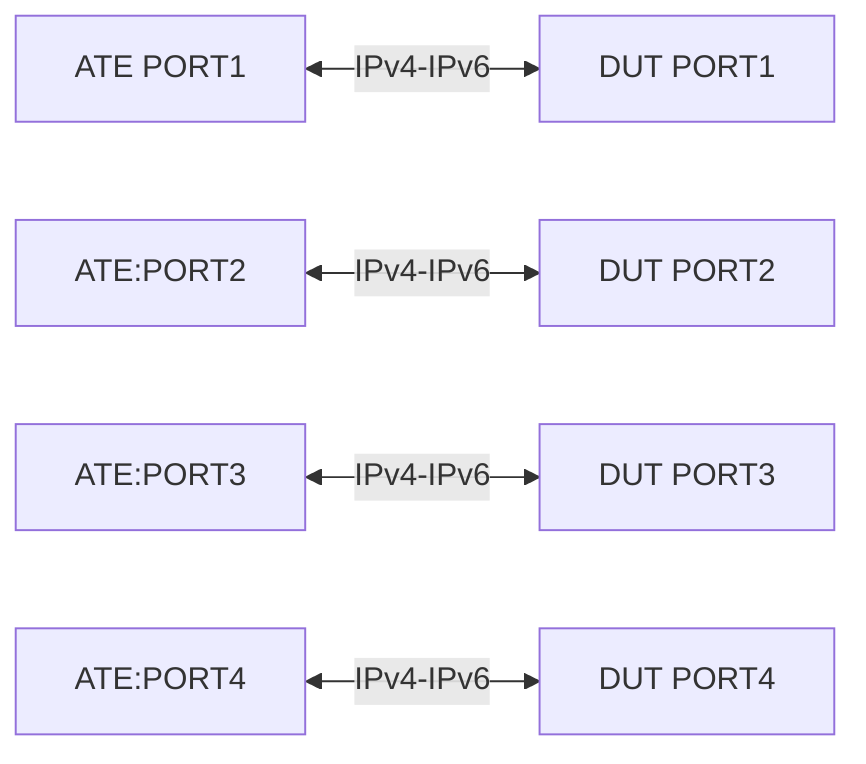

# SR-1.1: Transit forwarding to Node-SID via ISIS

## Summary

MPLS-SR transit forwarding to Node-SID distributed over ISIS

## Testbed type

*  [`featureprofiles/topologies/atedut_4.testbed`](https://github.com/openconfig/featureprofiles/blob/main/topologies/atedut_4.testbed)
* ATE port1 - used for Traffic source
* ATE port2-port4 - used for verification of per-interface sid or per-node sid

## Topology



## Procedure

### Test
On DUT1 configure:

*   ISIS adjacency between ATE & DUT for all the ports ATE1, ATE2, ATE3, ATE4; DUT1, DUT2, DUT3, DUT4.
*   Enable MPLS-SR for ISIS (`/network-instances/network-instance/protocols/protocol/isis/global/segment-routing/config/enabled`) for each 
    interface
*   reserved-label-block (lower-bound: 1000000 upper-bound: 1048576)
*   Segment Routing Global Block (srgb)  with lower-bound: 400000 upper-bound: 465001
*   Segment Routing Local Block (srlb) with lower-bound: 40000 upper-bound: 41000)
*   Send traffic from Source to destination and make sure the interface sid counters are populated

Generate traffic:
*   Send labeled traffic transiting through the DUT matching direct prefix (1). Verify that ATE2 receives traffic with node-SID label popped.
*   Send labeled traffic transiting through the DUT matching indirect prefix (2). Verify that ATE2 receives traffic with the node-SID label intact.
*   Verify that corresponding SID forwarding counters are incremented.
*   Traffic arrives without packet loss.
  
Verify:
*   Defined blocks are configured on DUT1.
*   DUT1 advertises its SRGB and SRLB to ATE1.
*   Verify the counters
*   Verify the Interface SID counters

## OpenConfig Path and RPC Coverage

```yaml
paths:
  # srgb definition
  /network-instances/network-instance/mpls/global/interface-attributes/interface/config/mpls-enabled:
  /network-instances/network-instance/mpls/global/reserved-label-blocks/reserved-label-block/config/local-id:
  /network-instances/network-instance/mpls/global/reserved-label-blocks/reserved-label-block/config/lower-bound:
  /network-instances/network-instance/mpls/global/reserved-label-blocks/reserved-label-block/config/upper-bound:

  # sr config
  /network-instances/network-instance/mpls/global/interface-attributes/interface/config/mpls-enabled:

  /network-instances/network-instance/segment-routing/srgbs/srgb/config/local-id:
  /network-instances/network-instance/segment-routing/srgbs/srgb/config/mpls-label-blocks:
  /network-instances/network-instance/segment-routing/srlbs/srlb/local-id:
  /network-instances/network-instance/segment-routing/srlbs/srlb/config/mpls-label-block:
  /network-instances/network-instance/protocols/protocol/isis/global/segment-routing/config/enabled:
  /network-instances/network-instance/protocols/protocol/isis/global/segment-routing/config/srgb:
  /network-instances/network-instance/protocols/protocol/isis/global/segment-routing/config/srlb:
  /network-instances/network-instance/mpls/signaling-protocols/segment-routing/interfaces/interface/config/interface-id:

  # telemetry
  /network-instances/network-instance/protocols/protocol/isis/global/segment-routing/state/enabled:
  /network-instances/network-instance/mpls/signaling-protocols/segment-routing/aggregate-sid-counters/aggregate-sid-counter/state/in-pkts:
  /network-instances/network-instance/mpls/signaling-protocols/segment-routing/aggregate-sid-counters/aggregate-sid-counter/state/out-pkts:
  /network-instances/network-instance/mpls/global/reserved-label-blocks/reserved-label-block/state/local-id:
  /network-instances/network-instance/mpls/global/reserved-label-blocks/reserved-label-block/state/lower-bound:
  /network-instances/network-instance/mpls/global/reserved-label-blocks/reserved-label-block/state/upper-bound:
  /network-instances/network-instance/mpls/signaling-protocols/segment-routing/interfaces/interface/state/interface-id:
  /network-instances/network-instance/mpls/signaling-protocols/segment-routing/interfaces/interface/sid-counters/sid-counter/state/in-pkts:
  /network-instances/network-instance/mpls/signaling-protocols/segment-routing/interfaces/interface/sid-counters/sid-counter/state/out-pkts:


rpcs:
  gnmi:
    gNMI.Set:
      union_replace: true
      replace: true
    gNMI.Subscribe:
      on_change: true
```

## Required DUT platform

* FFF

