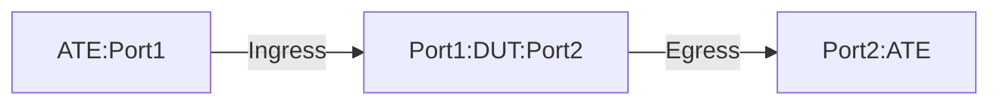

# SR-1.2: Egress Node Forwarding for MPLS traffic with Explicit Null label

## Summary

This is to test the forwarding functionality of MPLS traffic with the Explicit Null label on an Egress node 
in SRTE+MPLS enabled network.

The tests validate that the DUT performs the following actions -

 - DUT is an egress node in SRTE+MPLS network.
 - DUT will receive traffic with MPLS Explicit Null label 0 and label 2 for IPv4 and IPv6 destination respectively.
 - DUT will pop the MPLS label and perform IPv4 and IPv6 forwarding.


## Testbed type

* [`featureprofiles/topologies/atedut_2.testbed`](https://github.com/openconfig/featureprofiles/blob/main/topologies/atedut_2.testbed)

## Procedure

### Test environment setup

* Create the following connections:
* DUT has ingress and egress port connected to the ATE.
  


* ATE Port 1 hosted prefixes:
  
  * ATE-Port1 IPv4 address = ATE-P1-Address
  * Additional Source Address = IPV4-SRC1
  * Additional Source Address = IPV6-SRC1

* ATE Port 2 hosted prefixes:
  
  * ATE-Port2 IPv4 address = ATE-P2-Address
  * Additional destination address = IPV4-DST1
  * Additional destination address = IPV6-DST1

*  ATE Port 1 generates below flow types:
 
 * Flow type 1:  Ethernet+MPLS+IPv4+Payload
  * For the Ethernet Header:
     * Source MAC address: Unicast Ethernet MAC
     * Destination MAC address: DUT-Port1 mac address
  * For MPLS header:
     * MPLS label 0
     * EXP set to 0
     * S set to 1
     * TTL set to 64  
  * For the IP header:
     * Source IP and Destination IP will be IPV4-SRC1 and IPV4-DST1 respectively.
     * Protocol will be TCP and UDP and source port (> 1024) and destination port will be 443.

 * Flow type 2:  Ethernet+MPLS+IPv6+Payload
  * For the Ethernet Header:
     * Source MAC address: Unicast Ethernet MAC
     * Destination MAC address: DUT-Port1 mac address
  * For MPLS header:
     * MPLS label 2
     * EXP set to 0
     * S set to 1
     * TTL set to 64  
  * For the IPv6 header:
     * Source IP and Destination IP will be IPV6-SRC1 and IPV6-DST1 respectively.
     * Protocol will be TCP and UDP and source port (> 1024) and destination port will be 443.
       
## Procedure

### Configuration
                              
*   Configure Segment Routing Global Block (srgb) lower-bound: 400000 upper-bound: 465000)
*   Enable MPLS forwarding.
*   DUT will have a static IPv4 and IPv6 route for IPV4-DST1 / IPV6-DST1 towards ATE Port2.

### Test 

Verify that:

*  ATE Port1 will send IPv4 and IPv6 traffic.
*  DUT will POP MPLS label 0, decrement the TTL from 64 to 63, and perform IPv4 lookup for the destination and forward IPv4 traffic.
*  DUT will POP MPLS label 2, decrement the TTL from 64 to 63, and perform IPv6 lookup for the destination and forward IPv6 traffic.
*  Validate the ingress and egress counter and ensure that there is no drop in the traffic.
   
```
{
  "openconfig-network-instance:network-instances": {
    "network-instance": [
      {
        "config": {
          "name": "DEFAULT",
          "type": "openconfig-network-instance-types:DEFAULT_INSTANCE"
        },
        "mpls": {
          "global": {
            "reserved-label-blocks": {
              "reserved-label-block": [
                {
                  "config": {
                    "local-id": "srlb",
                    "lower-bound": 16
                  },
                  "local-id": "srlb"
                },
                {
                  "config": {
                    "local-id": "isis-sr",
                    "lower-bound": 400000,
                    "upper-bound": 465000
                  },
                  "local-id": "isis-sr"
                }
              ]
            }
          }
        },
        "name": "DEFAULT",
        "protocols": {
          "protocol": [
            {
              "identifier": "openconfig-policy-types:ISIS",
              "name": "isis",
              "config": {
                "identifier": "openconfig-policy-types:ISIS",
                "name": "isis"
              },
              "isis": {
                "global": {
                  "segment-routing": {
                    "config": {
                      "enabled": true,
                      "srgb": "isis-sr",
                      "srlb": "srlb"
                    }
                  }
                }
              }
            }
          ]
        },
        "segment-routing": {
          "srgbs": {
            "srgb": [
              {
                "config": {
                  "dataplane-type": "MPLS",
                  "local-id": "isis-sr",
                  "mpls-label-blocks": [
                    "isis-sr"
                  ]
                },
                "local-id": "isis-sr"
              }
            ]
          },
          "srlbs": {
            "srlb": [
              {
                "config": {
                  "dataplane-type": "MPLS",
                  "local-id": "srlb",
                  "mpls-label-block": "srlb"
                },
                "local-id": "srlb"
              }
            ]
          }
        }
      }
    ]
  }
}
```
## OpenConfig Path and RPC Coverage

```yaml
paths:
  # Config
  /network-instances/network-instance/mpls/global/reserved-label-blocks/reserved-label-block/state/upper-bound:
  /network-instances/network-instance/segment-routing/srgbs/srgb/local-id:
  /network-instances/network-instance/protocols/protocol/state/identifier:
  /network-instances/network-instance/protocols/protocol/isis/global/segment-routing/state/srgb:
  /network-instances/network-instance/segment-routing/srlbs/srlb/state/local-id:
  /network-instances/network-instance/segment-routing/srlbs/srlb/state/dataplane-type:
  /network-instances/network-instance/state/type:
  /network-instances/network-instance/protocols/protocol/identifier:
  /network-instances/network-instance/protocols/protocol/state/name:
  /network-instances/network-instance/segment-routing/srgbs/srgb/state/dataplane-type:
  /network-instances/network-instance/name:
  /network-instances/network-instance/protocols/protocol/isis/global/segment-routing/state/srlb:
  /network-instances/network-instance/mpls/global/reserved-label-blocks/reserved-label-block/state/lower-bound:
  /network-instances/network-instance/protocols/protocol/isis/global/segment-routing/state/enabled:
  /network-instances/network-instance/segment-routing/srgbs/srgb/state/mpls-label-blocks:
  /network-instances/network-instance/segment-routing/srlbs/srlb/local-id:
  /network-instances/network-instance/mpls/global/reserved-label-blocks/reserved-label-block/local-id:
  /network-instances/network-instance/state/name:
  /network-instances/network-instance/segment-routing/srgbs/srgb/state/local-id:
  /network-instances/network-instance/segment-routing/srlbs/srlb/state/mpls-label-block:
  /network-instances/network-instance/mpls/global/reserved-label-blocks/reserved-label-block/state/local-id:


  # Telemetry
  /network-instances/network-instance/mpls/signaling-protocols/segment-routing/aggregate-sid-counters/aggregate-sid-counter/state/in-pkts:
  /network-instances/network-instance/mpls/signaling-protocols/segment-routing/aggregate-sid-counters/aggregate-sid-counter/state/out-pkts:

rpcs:
  gnmi:
    gNMI.Set:
      union_replace: true
      replace: true
    gNMI.Subscribe:
      on_change: true
```
## Required DUT platform

* FFF
* MFF
