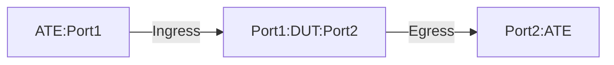

# PF-1.4: Interface based GUE Decapsulation to IPv4 tunnel

## Summary

This is to test the functionality of policy-based forwarding (PF) to decapsulate Generic UDP Encapsulation variant 1 ([GUE Variant 1](https://datatracker.ietf.org/doc/html/draft-ietf-intarea-gue-09#section-4)) traffic. These tests verify the use case of IPv4 and IPv6 encapsulated traffic in IPv4 GUE tuennel. The tests validate that the DUT performs the following action.

 - Decapsulate the outer ((UDPoIP)) headers of GUE packets destined to the locally configured decap IPv4 address/addresses and matching UDP port. 
    - The first two bits the UDP payload will be used to determine GUE varient and first three bits will determine the payload protocol IPv4/IPv6.
 - Decapsulate the packet only if it matches the locally configured decap IPv4 address/addresses and matching UDP port port/port-range.
    - If not specifically configured, then the following default DST UDP port will be used as a match criteria for the decapsulation.
      - For inner IPv4 - GUE UDP port 6080
      - For inner IPv6 - GUE UDP port 6615
 - Post decapsulation the DUT should copy outer TTL(and decrement) to inner header and maintain the inner DSCP vaule as is.
    - If explicit configration is present to not copy the TTL, then it will be honored.
 - Post decapsulation, the DUT will perform a lookup of the exposed inner (payload) L3 header and forward the packet as long as the TTL has not reached to ZERO.
    - If the TTL has reached to the ZERO, then the router will send TTL exceeded message to the source.
 - Traffic not subject to match criteria will be forwared using the traditional IP forwarding. 

## Testbed type

* [`featureprofiles/topologies/ateDUT_2.testbed`](https://github.com/openconfig/featureprofiles/blob/main/topologies/ateDUT_2.testbed)

## Procedure

### Test environment setup

* Create the following connections:
* DUT has ingress and egress port connected to the ATE.
  


*  ATE Port 1: Generates GUE-encapsulated traffic with various inner (original) destinations.
*  ATE Port 2: Receives decapsulated traffic whose inner destination matches the policy TEST-GUE.
  
### DUT Configuration

1.  Interfaces: Configure all DUT ports as singleton IP interfaces towards the ATE ports.
 
2. GUE Decapsulation related:
    *  Configure an IPv4 static route to GUE decapsulation destination (DECAP-DST) to Null0.
    *  Have policy `TEST-GUE` configured that match DECAP-DST and default/non-default GUE UDP port for the decapsulation.
       *  If udp port is not configured in the match criteria, then the default GUE UDP port will be used (UDP port 6080 for Inner IPv4 and UDP port 6615 for Inner IPv6 traffic).
    *  Apply the defined policy on the DUT.
    *  Configure static routes for encapsulated traffic destinations IPV4-DST1 and IPV6-DST1 towards ATE Port 2.
    *  Configure static routes for destination IPV4-DST2 and IPV6-DST2 towards ATE Port 2.

3.  Policy-Based Forwarding Related: 
    *  Rule 1: Match GUE traffic with destination DECAP-DST using destination-address-prefix-set and default/non-default GUE UDP port for decapsulation.
      * If udp port is not configured, then the default GUE UDP port will be used (UDP port 6080 for Inner IPv4 and UDP port 6615 for Inner IPv6 traffic).   
    *  Rule 2: Match all other traffic and forward (no decapsulation).
    *  Apply the defined policy on the DUT.
  
### PF-1.4.1: GUE Decapsulation of inner IPv4 traffic using default GUE UDP port 6080 without Explicit TTL configuration
-  Push DUT configuration.

Traffic: 
-  Generate IPv4 GUE-encapsulated traffic from ATE Port 1 with destinations matching DECAP-DST and default GUE UDP port 6080.
     -  Sent 1000000 packets at the 10%  of the line rate.
     -  Keep the frame size Internet Mix.
-  Inner IPv4 destination should match IPV4-DST1.
-  ToS value for GUE encapsulated packets:
   - GUE header ToS is 0x60.
   - Inner header ToS is 0x80.
-  TTL for all GUE encapsulated packets:
   - GUE header TTL is 10.
   - Inner header TTL is 12.
  
Verification: 
-  The DUT will decrement the TTL.
-  The outer header of the traffic will satisfy the match condition for the decapsulation specifcied in policy `TEST-GUE`.
-  The DUT will decapsulate the outer header and perform the lookup based on the inner ip address.
-  The new TTL (9) will be copied to the inner header.
-  Inner-packet ToS value 0x80 will be preserved.
-  The DUT will forward the traffic towards Port2:ATE.
-  The `Policy Forwarding's Match Counters` will reflect the decapsulated packets to 1000000.
-  No packet loss.
  
### PF-1.4.2: GUE Decapsulation of inner IPv4 traffic using non-default GUE UDP port without Explicit TTL configuration
-  Push DUT configuration.

Traffic: 
-  Generate IPv4 GUE-encapsulated traffic from ATE Port 1 with destinations matching DECAP-DST and configured non-default GUE UDP port - example 6000.
     -  Sent 1000000 packets at the 10%  of the line rate.
     -  Keep the frame size Internet Mix.
-  Inner IPv4 destination should match IPV4-DST1.
-  ToS value for GUE encapsulated packets:
   - GUE header ToS is 0x60.
   - Inner header ToS is 0x80.
-  TTL for all GUE encapsulated packets:
   - GUE header TTL is 10.
   - Inner header TTL is 12.

Verification: 
-  The DUT will decrement the TTL.
-  TThe outer header of the traffic will satisfy the match condition for the decapsulation specifcied in policy `TEST-GUE`.
-  The DUT will decapsulate the outer header and perform the lookup based on the inner ip address.
-  The new TTL (9) will be copied to the inner header.
-  Inner-packet ToS value 0x80 will be preserved.
-  The DUT will forward the traffic towards Port2:ATE.
-  The `Policy Forwarding's Match Counters` will reflect the decapsulated packets to 1000000.
-  No packet loss.

### PF-1.4.3: GUE Decapsulation of inner IPv6 traffic using default GUE UDP port 6615 without Explicit TTL configuration
-  Push DUT configuration.

Traffic: 
-  Generate IPv6 GUE-encapsulated traffic from ATE Port 1 with destinations matching DECAP-DST and default GUE UDP port 6615.
     -  Sent 1000000 packets at the 10%  of the line rate.
     -  Keep the frame size Internet Mix.
-  Inner IPv4 destination should match IPV4-DST1.
-  ToS value for GUE encapsulated packets:
   - GUE header ToS is 0x60.
   - Inner header ToS is 0x80.
-  TTL for all GUE encapsulated packets:
   - GUE header TTL is 10.
   - Inner header TTL is 12.

Verification:
-  The DUT will decrement the TTL.
-  TThe outer header of the traffic will satisfy the match condition for the decapsulation specifcied in policy `TEST-GUE`.
-  The DUT will decapsulate the outer header and perform the lookup based on the inner ip address.
-  The new TTL (9) will be copied to the inner header.
-  Inner-packet ToS value 0x80 will be preserved.
-  The DUT will forward the traffic towards Port2:ATE.
-  The `Policy Forwarding's Match Counters` will reflect the decapsulated packets to 1000000.

### PF-1.4.4: GUE Decapsulation of inner IPv6 traffic using non-default GUE UDP port without Explicit TTL configuration
-  Push DUT configuration.

Traffic: 
-  Generate IPv6 GUE-encapsulated traffic from ATE Port 1 with destinations matching DECAP-DST and configured non-default GUE UDP port - example 6000.
     -  Sent 1000000 packets at the 10%  of the line rate.
     -  Keep the frame size Internet Mix.
-  Inner IPv4 destination should match IPV4-DST1.
-  ToS value for GUE encapsulated packets:
   - GUE header ToS is 0x60.
   - Inner header ToS is 0x80.
-  TTL for all GUE encapsulated packets:
   - GUE header TTL is 10.
   - Inner header TTL is 12.

Verification:
-  The DUT will decrement the TTL.
-  TThe outer header of the traffic will satisfy the match condition for the decapsulation specifcied in policy `TEST-GUE`.
-  The DUT will decapsulate the outer header and perform the lookup based on the inner ip address.
-  The new TTL (9) will be copied to the inner header.
-  Inner-packet ToS value 0x80 will be preserved.
-  The DUT will forward the traffic towards Port2:ATE.
-  The `Policy Forwarding's Match Counters` will reflect the decapsulated packets to 1000000.

### PF-1.4.5: GUE Decapsulation of inner IPv4 traffic using default GUE UDP port 6080 and Explicit TTL configuration
-  Push DUT configuration with a knob to disable TTL propogation.

Traffic: 
-  Generate IPv4 GUE-encapsulated traffic from ATE Port 1 with destinations matching DECAP-DST and default GUE UDP port 6080.
     -  Sent 1000000 packets at the 10%  of the line rate.
     -  Keep the frame size Internet Mix.
-  Inner IPv4 destination should match IPV4-DST1.
-  ToS value for GUE encapsulated packets:
   - GUE header ToS is 0x60.
   - Inner header ToS is 0x80.
-  TTL for all GUE encapsulated packets:
   - GUE header TTL is 10.
   - Inner header TTL is 12.

Verification: 
-  The DUT will decrement the TTL.
-  TThe outer header of the traffic will satisfy the match condition for the decapsulation specifcied in policy `TEST-GUE`.
-  The DUT will decapsulate the outer header and perform the lookup based on the inner ip address.
-  The new TTL (9) will NOT be copied to the inner header.
    - The  inner TTL will remain as 12.
-  Inner-packet ToS value 0x80 will be preserved.
-  The DUT will forward the traffic towards Port2:ATE.
-  The `Policy Forwarding's Match Counters` will reflect the decapsulated packets to 1000000.

### PF-1.4.6: GUE Decapsulation of inner IPv4 traffic using non-default GUE UDP port and Explicit TTL configuration
-  Push DUT configuration with a knob to disable TTL propogation.

Traffic: 
-  Generate IPv4 GUE-encapsulated traffic from ATE Port 1 with destinations matching DECAP-DST and configured non-default GUE UDP port - example 6000.
     -  Sent 1000000 packets at the 10%  of the line rate.
     -  Keep the frame size Internet Mix.
-  Inner IPv4 destination should match IPV4-DST1.
-  ToS value for GUE encapsulated packets:
   - GUE header ToS is 0x60.
   - Inner header ToS is 0x80.
-  TTL for all GUE encapsulated packets:
   - GUE header TTL is 10.
   - Inner header TTL is 12.

Verification: 
-  The DUT will decrement the TTL.
-  TThe outer header of the traffic will satisfy the match condition for the decapsulation specifcied in policy `TEST-GUE`.
-  The DUT will decapsulate the outer header and perform the lookup based on the inner ip address.
-  The new TTL (9) will NOT be copied to the inner header.
    - The  inner TTL will remain as 12.
-  Inner-packet ToS value 0x80 will be preserved.
-  The DUT will forward the traffic towards Port2:ATE.
-  The `Policy Forwarding's Match Counters` will reflect the decapsulated packets to 1000000.

### PF-1.4.7: GUE Decapsulation of inner IPv6 traffic using default GUE UDP port 6615 and Explicit TTL configuration
-  Push DUT configuration with a knob to disable TTL propogation.

Traffic: 
-  Generate IPv6 GUE-encapsulated traffic from ATE Port 1 with destinations matching DECAP-DST and default GUE UDP port 6615.
     -  Sent 1000000 packets at the 10%  of the line rate.
     -  Keep the frame size Internet Mix.
-  Inner IPv4 destination should match IPV4-DST1.
-  ToS value for GUE encapsulated packets:
   - GUE header ToS is 0x60.
   - Inner header ToS is 0x80.
-  TTL for all GUE encapsulated packets:
   - GUE header TTL is 10.
   - Inner header TTL is 12.

Verification:
-  The DUT will decrement the TTL.
-  TThe outer header of the traffic will satisfy the match condition for the decapsulation specifcied in policy `TEST-GUE`.
-  The DUT will decapsulate the outer header and perform the lookup based on the inner ip address.
-  The new TTL (9) will NOT be copied to the inner header.
    - The  inner TTL will remain as 12.
-  Inner-packet ToS value 0x80 will be preserved.
-  The DUT will forward the traffic towards Port2:ATE.
-  The `Policy Forwarding's Match Counters` will reflect the decapsulated packets to 1000000.

### PF-1.4.8: GUE Decapsulation of inner IPv6 traffic using non-default GUE UDP port and Explicit TTL configuration
-  Push DUT configuration with a knob to disable TTL propogation.

Traffic: 
-  Generate IPv6 GUE-encapsulated traffic from ATE Port 1 with destinations matching DECAP-DST and configured non-default GUE UDP port - example 6000.
     -  Sent 1000000 packets at the 10%  of the line rate.
     -  Keep the frame size Internet Mix.
-  Inner IPv4 destination should match IPV4-DST1.
-  ToS value for GUE encapsulated packets:
   - GUE header ToS is 0x60.
   - Inner header ToS is 0x80.
-  TTL for all GUE encapsulated packets:
   - GUE header TTL is 10.
   - Inner header TTL is 12.

Verification:
-  The DUT will decrement the TTL.
-  TThe outer header of the traffic will satisfy the match condition for the decapsulation specifcied in policy `TEST-GUE`.
-  The DUT will decapsulate the outer header and perform the lookup based on the inner ip address.
-  The new TTL (9) will NOT be copied to the inner header.
    - The  inner TTL will remain as 12.
-  Inner-packet ToS value 0x80 will be preserved.
-  The DUT will forward the traffic towards Port2:ATE.
-  The `Policy Forwarding's Match Counters` will reflect the decapsulated packets to 1000000.
  
### PF-1.4.9: GUE Decapsulation of inner IPv6 traffic using default IPv4 GUE UDP port 6080 (Negative).
-  Push DUT configuration.

Traffic: 
-  Generate IPv6 GUE-encapsulated traffic from ATE Port 1 with destinations matching DECAP-DST and default GUE UDP port 6080 meant for inner IPv4.
     -  Sent traffic at the line rate for 5 minutes.
     -  Keep the frame size Internet Mix.
-  Inner IPv6 destination should match IPV6-DST1.
-  ToS value for GUE encapsulated packets:
   - GUE header ToS is 0x60.
   - Inner header ToS is 0x80.
-  TTL for all GUE encapsulated packets:
   - GUE header TTL is 10.
   - Inner header TTL is 12.
  
Verification: 
-  The DUT will decrement the TTL.
-  TThe outer header of the traffic will satisfy the match condition for the decapsulation specifcied in policy `TEST-GUE`.
-  The DUT will decapsulate the outer header and perform the lookup based on the inner ip address.
-  Since the inner traffic is not IPv4, the traffic will be dropped on the DUT.
-  No negative impact on the DUT due to the high traffic rate - example: high CPU, process crash, unexpected reload etc,
-  PF counters for dropped packets ( invalid inner protocol ) reflect ingress packet count.
-  The ATE will report 100% packet loss.

### PF-1.4.10: GUE Decapsulation of inner IPv6 traffic using non-default GUE UDP port meant for IPv4 inner traffic (Negative).
-  Push DUT configuration.

Traffic: 
-  Generate IPv6 GUE-encapsulated traffic from ATE Port 1 with destinations matching DECAP-DST and configured non-default GUE UDP port that is meant for inner IPv4 traffic - example 6000.
     -  Sent traffic at the line rate for 5 minutes.
     -  Keep the frame size Internet Mix.
-  Inner IPv6 destination should match IPV6-DST1.
-  ToS value for GUE encapsulated packets:
   - GUE header ToS is 0x60.
   - Inner header ToS is 0x80.
-  TTL for all GUE encapsulated packets:
   - GUE header TTL is 10.
   - Inner header TTL is 12.

Verification: 
-  The DUT will decrement the TTL.
-  TThe outer header of the traffic will satisfy the match condition for the decapsulation specifcied in policy `TEST-GUE`.
-  The DUT will decapsulate the outer header and perform the lookup based on the inner ip address.
-  Since the inner traffic is not IPv4, the traffic will be dropped on the DUT.
-  No negative impact on the DUT due to the high traffic rate - example: high CPU, process crash, unexpected reload etc,
-  PF counters for dropped packets ( invalid inner protocol ) reflect ingress packet count.
-  The ATE will report 100% packet loss.


### PF-1.4.11: GUE Decapsulation of inner IPv4 traffic using default IPv6 GUE UDP port 6615 (Negative).
-  Push DUT configuration.

Traffic: 
-  Generate IPv4 GUE-encapsulated traffic from ATE Port 1 with destinations matching DECAP-DST and default GUE UDP port 6615 meant for inner IPv6.
     -  Sent traffic at the line rate for 5 minutes.
     -  Keep the frame size Internet Mix.
-  Inner IPv4 destination should match IPV4-DST1.
-  ToS value for GUE encapsulated packets:
   - GUE header ToS is 0x60.
   - Inner header ToS is 0x80.
-  TTL for all GUE encapsulated packets:
   - GUE header TTL is 10.
   - Inner header TTL is 12.
  
Verification: 
-  The DUT will decrement the TTL.
-  TThe outer header of the traffic will satisfy the match condition for the decapsulation specifcied in policy `TEST-GUE`.
-  The DUT will decapsulate the outer header and perform the lookup based on the inner ip address.
-  Since the inner traffic is not IPv6, the traffic will be dropped on the DUT.
-  No negative impact on the DUT due to the high traffic rate - example: high CPU, process crash, unexpected reload etc,
-  PF counters for dropped packets ( invalid inner protocol ) reflect ingress packet count.
-  The ATE will report 100% packet loss.

### PF-1.4.12: GUE Decapsulation of inner IPv4 traffic using non-default GUE UDP port meant for IPv6 inner traffic (Negative).
-  Push DUT configuration.

Traffic: 
-  Generate IPv6 GUE-encapsulated traffic from ATE Port 1 with destinations matching DECAP-DST and configured non-default GUE UDP port that is meant for inner IPv6 traffic. 
     -  Sent traffic at the line rate for 5 minutes.
     -  Keep the frame size Internet Mix.
-  Inner IPv4 destination should match IPV4-DST1.
-  ToS value for GUE encapsulated packets:
   - GUE header ToS is 0x60.
   - Inner header ToS is 0x80.
-  TTL for all GUE encapsulated packets:
   - GUE header TTL is 10.
   - Inner header TTL is 12.
     
Verification: 
-  The DUT will decrement the TTL.
-  TThe outer header of the traffic will satisfy the match condition for the decapsulation specifcied in policy `TEST-GUE`.
-  The DUT will decapsulate the outer header and perform the lookup based on the inner ip address.
-  Since the inner traffic is not IPv6, the traffic will be dropped on the DUT.
-  No negative impact on the DUT due to the high traffic rate - example: high CPU, process crash, unexpected reload etc,
-  PF counters for dropped packets ( invalid inner protocol ) reflect ingress packet count.
-  The ATE will report 100% packet loss.

### PF-1.4.13: Inner IPV4 GUE Pass-through (Negative)
-  Push DUT configuration.

Traffic: 
-  Generate IPv4 GUE-encapsulated traffic from ATE Port 1 with destinations matching IPV4-DST2 and default GUE UDP port 6080.
     -  Sent 1000000 packets at the 10%  of the line rate.
     -  Keep the frame size Internet Mix.
-  Inner IPv4 destination should match IPV4-DST1.
-  ToS value for GUE encapsulated packets:
   - GUE header ToS is 0x60.
   - Inner header ToS is 0x80.
-  TTL for all GUE encapsulated packets:
   - GUE header TTL is 10.
   - Inner header TTL is 12.

Verification:
-  The DUT will decrement the TTL.
-  The outer header of the traffic will NOT satisfy the match condition for the decapsulation.
-  The DUT will NOT decapsulate the outer header and forward the traffic by checking the outer header towards Port2:ATE.
-  The `Policy Forwarding's Match Counters` will reflect the decapsulated packets to 0.
-  The ATE will report 0% packet loss.
-  ToS value for GUE encapsulated packets:
   - GUE header ToS will reamin to 0x60.
   - Inner header ToS will reamin to 0x80.
-  TTL for all GUE encapsulated packets:
   - GUE header TTL will be set to 9.
   - Inner header TTL will reamin to 12.


### PF-1.4.14: Inner IPV6 GUE Pass-through (Negative)
-  Push DUT configuration.

Traffic: 
-  Generate IPv4 GUE-encapsulated traffic from ATE Port 1 with destinations matching IPV6-DST2 and default GUE UDP port 66615.
     -  Sent 1000000 packets at the 10%  of the line rate.
     -  Keep the frame size Internet Mix.
-  Inner IPv6 destination should match IPV6-DST1.
-  ToS value for GUE encapsulated packets:
   - GUE header ToS is 0x60.
   - Inner header ToS is 0x80.
-  TTL for all GUE encapsulated packets:
   - GUE header TTL is 10.
   - Inner header TTL is 12.

Verification:
-  The DUT will decrement the TTL.
-  The outer header of the traffic will NOT satisfy the match condition for the decapsulation.
-  The DUT will NOT decapsulate the outer header and forward the traffic by checking the outer header towards Port2:ATE.
-  The `Policy Forwarding's Match Counters` will reflect the decapsulated packets to 0.
-  The ATE will report 0% packet loss.
-  ToS value for GUE encapsulated packets:
   - GUE header ToS will reamin to 0x60.
   - Inner header ToS will reamin to 0x80.
-  TTL for all GUE encapsulated packets:
   - GUE header TTL will be set to 9.
   - Inner header TTL will reamin to 12.
  
## OpenConfig Path and RPC Coverage

```yaml

paths:
    # TODO propose new OC paths for GUE decap based on the policy forwarding.

 # telemetry
    /network-instances/network-instance/policy-forwarding/policies/policy/rules/rule/state/matched-pkts:
    /network-instances/network-instance/policy-forwarding/policies/policy/rules/rule/state/matched-octets:

rpcs:
  gnmi:
    gNMI.Set:
      union_replace: true
      replace: true
    gNMI.Subscribe:
      on_change: true
```

## Required DUT platform

* Specify the minimum DUT-type:
  * MFF - A modular form factor device containing LINECARDs, FABRIC and redundant CONTROLLER_CARD components
  * FFF - fixed form factor
  * vRX - virtual router device
